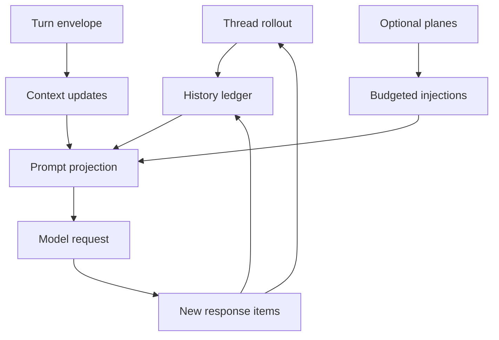

# Chapter 1: Context Is a Runtime Boundary

The larger Codex architecture book treats the session runtime as the place where
events, tools, policy, streaming, and durable state meet. This book starts one
layer deeper: before a model can decide anything, Codex must decide what counts
as context. Without that boundary, every later feature becomes a prompt
concatenation trick. Tools leak observations forever. Policy changes get buried
in old text. Compaction becomes lossy amnesia. Resume becomes guesswork.

Codex avoids that failure mode by making context a runtime-managed artifact. A
turn does not send "the conversation" to the model. It sends a prompt projection
of a thread ledger under a turn-specific envelope. The projection may include
history, initial context, settings diffs, skill guidance, plugin guidance, hook
context, memory summaries, tool outputs, images, and compaction summaries. Each
piece has ownership and timing.

By the end of this chapter, you should see the system's core move: context is
treated like a mutable database view with audit logs, not like a text area.

<div class="source-equivalence">
This chapter is grounded in the history manager, turn context, context fragments,
compaction entry points, and rollout reconstruction code:
<a href="https://github.com/openai/codex/blob/569ff6a1c400bd514ff79f5f1050a684dc3afde3/codex-rs/core/src/context_manager/history.rs#L32">ContextManager</a>,
<a href="https://github.com/openai/codex/blob/569ff6a1c400bd514ff79f5f1050a684dc3afde3/codex-rs/core/src/session/turn_context.rs#L53">TurnContext</a>,
<a href="https://github.com/openai/codex/blob/569ff6a1c400bd514ff79f5f1050a684dc3afde3/codex-rs/core/src/context/fragment.rs#L31">ContextualUserFragment</a>,
<a href="https://github.com/openai/codex/blob/569ff6a1c400bd514ff79f5f1050a684dc3afde3/codex-rs/core/src/compact.rs#L50">InitialContextInjection</a>, and
<a href="https://github.com/openai/codex/blob/569ff6a1c400bd514ff79f5f1050a684dc3afde3/codex-rs/core/src/session/rollout_reconstruction.rs#L86">rollout reconstruction</a>.
</div>

## The Boundary Codex Needs

An agent context system has to answer five questions every turn:

| Question | Codex answer |
| --- | --- |
| What is durable? | Response items recorded in the thread history and rollout evidence. |
| What is turn-local? | The `TurnContext` envelope: model, cwd, policies, features, tools, and current runtime facts. |
| What is injected? | Typed context fragments rendered into model-visible messages. |
| What is optional? | Skills, plugins, memory, tool outputs, images, and other material with budgets or filtering. |
| What is replaceable? | Compacted history installed as a checkpoint with explicit replacement history. |

That split matters because context changes at different speeds. The user prompt
changes every turn. Environment metadata changes occasionally. Permission policy
may change mid-thread. Skills may be explicitly mentioned for one turn. Tool
outputs may be too large. Compaction may rewrite the old transcript entirely.
One buffer cannot represent those lifetimes cleanly.



The important arrow is not the one into the model. It is the loop back into the
rollout and history ledger. Codex keeps enough evidence to later rebuild why a
prompt looked the way it did.

## The Prompt Is a Projection

The prompt projection is assembled from state that is deliberately not all in
the same object. `ContextManager` owns model-visible history. `TurnContext` owns
the active turn envelope. The context module owns typed fragments. Compaction
owns replacement history. Rollout reconstruction owns the logic for rebuilding
the effective ledger after resume or fork.

This separation is more expensive than appending strings. It buys three
properties Codex needs:

- **Reinterpretability.** History can be normalized differently for a model that
  does not accept images or for a provider with a different truncation policy.
- **Diffability.** Runtime facts can be compared with a reference baseline, so
  Codex can inject only meaningful settings changes.
- **Reconstructability.** Durable rollout items can rebuild history after
  compaction, rollback, and resume.

The following pseudocode is the pattern, not the implementation:

```text
// Pseudocode — illustrates the projection boundary.
turnEnvelope = resolveTurnEnvelope(config, runtimeState)
ledger = loadThreadHistory(threadId)
ledger.record(contextDiffs(previousEnvelope, turnEnvelope))
ledger.record(userInput)
promptInput = ledger.clone().normalizeFor(modelCapabilities)
sendToModel(baseInstructions, promptInput, toolSpecs)
```

The pattern matters because it makes prompt construction a repeatable runtime
operation. If context is a projection, Codex can change how it projects without
corrupting the underlying ledger.

## Context Has Multiple Lifetimes

Codex context is easier to reason about if you classify every piece by lifetime.

| Lifetime | Examples | Failure if mishandled |
| --- | --- | --- |
| Session lifetime | Base instructions, thread id, persisted rollout, memory mode. | Resume cannot recover the same operating frame. |
| Turn lifetime | model, provider, cwd, permissions, tools, realtime flag. | A model request runs with stale policy or stale capabilities. |
| Prompt lifetime | normalized history, selected skills, selected plugins, hook context. | Optional material crowds out core task state. |
| Checkpoint lifetime | compaction summary and replacement history. | A long thread forgets the wrong details. |
| Client lifetime | token usage, TUI display state, app-server replay. | UI reports a context state the runtime did not own. |

The road not taken is a single "conversation messages" list. That is tempting
because every model API eventually needs a list. Codex keeps the list as an
output format, not as the core abstraction.

## Source-Level Map

The source tree confirms the boundary:

- `context_manager/history.rs` stores and prepares response items.
- `session/turn_context.rs` gathers the turn envelope.
- `context/*` renders typed runtime facts as fragments.
- `session/turn.rs` decides when to record context, user input, skills, plugins,
  hooks, and pending input.
- `compact.rs` and `compact_remote.rs` rewrite history under a checkpoint
  protocol.
- `session/rollout_reconstruction.rs` reconstructs effective history from
  durable rollout facts.

This is why the system is worth a book. The knowledge is scattered across
modules because the responsibilities are real; the narrative has to put them
back together.

## Apply This

1. **Projection Boundary** -> use durable state as the input to prompt construction, adapt it by keeping raw events separate from model-ready messages, and watch for projection code that starts mutating the ledger.
2. **Lifetime Labels** -> classify every context source by how long it should survive, adapt it by naming session, turn, prompt, and checkpoint lifetimes, and watch for "temporary" data that accidentally becomes durable.
3. **Context Ownership** -> give each context plane one owner, adapt it by routing all updates through that owner, and watch for clients that bypass the runtime to inject model-visible state.
4. **Auditable Forgetting** -> make compaction and truncation explicit events, adapt it by storing replacement history or summaries as checkpoints, and watch for summaries that cannot explain what they replaced.
5. **Prompt as View** -> treat the final model input as a view, adapt it by rebuilding it on demand for each model capability set, and watch for code that assumes all providers accept the same prompt shape.
