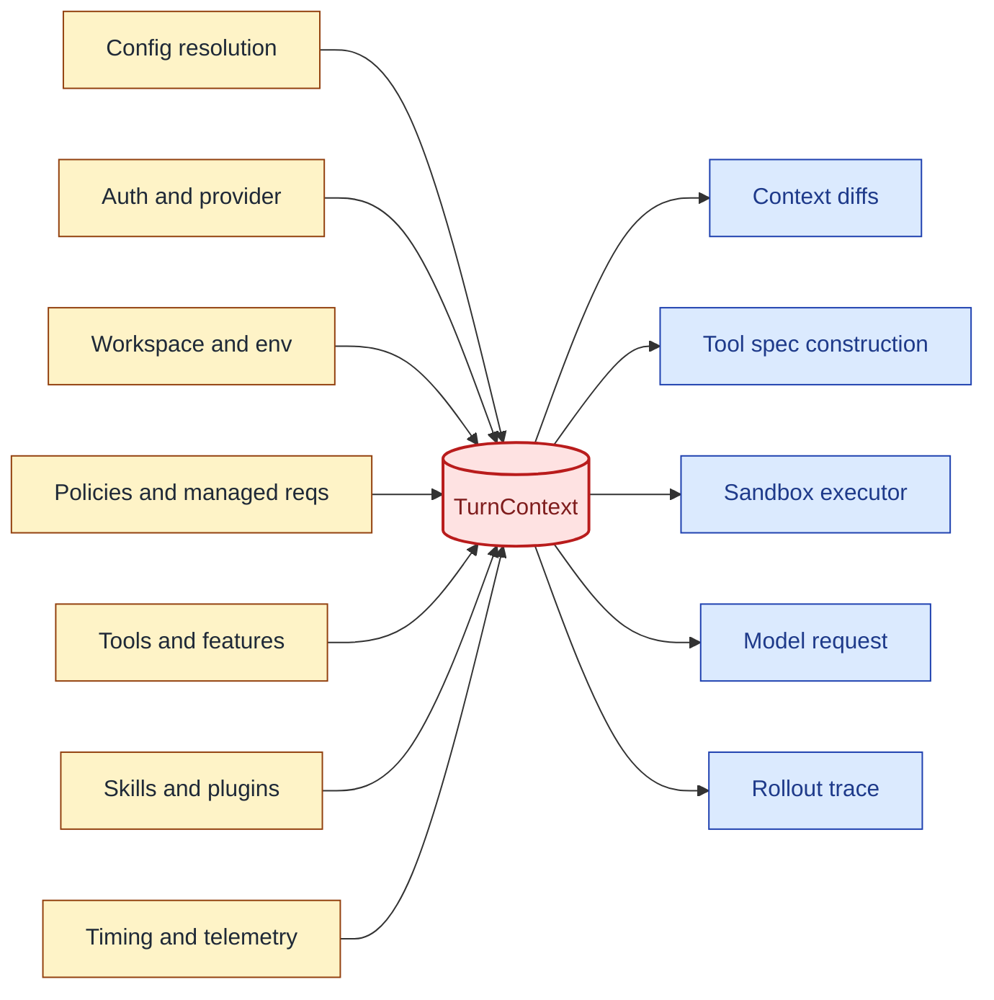
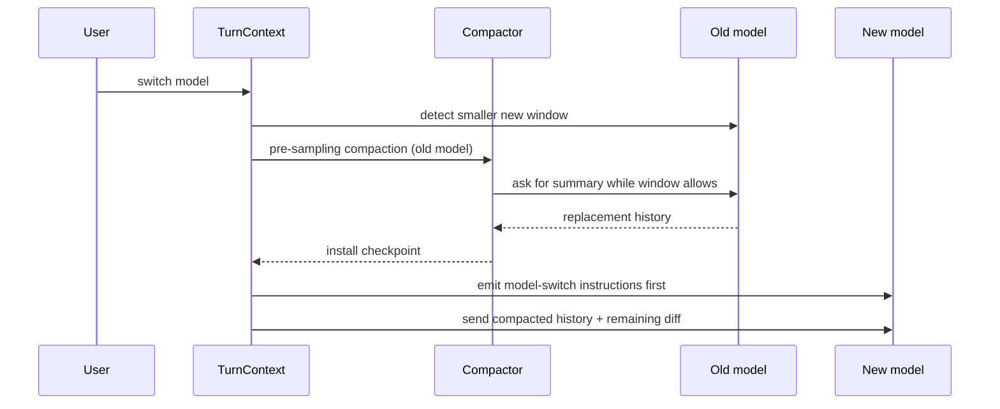

# Chapter 2: TurnContext: The Envelope Around a Turn

Chapter 1 argued that context is a runtime boundary. The first concrete object
behind that boundary is the turn envelope. A turn is not just "the next user
message." It is a sampling attempt under a particular model, provider, cwd,
permission profile, network policy, tools configuration, feature set, realtime
state, collaboration mode, hook state, skill load result, and telemetry context.

Codex names that envelope `TurnContext`. The name is precise. It is not the full
thread, and it is not only text for the model. It is the resolved runtime state
needed for one unit of agent work. If this object is wrong, the prompt may be
grammatically valid while semantically illegal: a tool appears when policy
forbids it, a model switch keeps the wrong reasoning setting, or a sandbox uses
the wrong working directory.

By the end of this chapter, you should understand why Codex centralizes turn
facts before it records prompt context.

<div class="source-equivalence">
This chapter maps to
<a href="https://github.com/openai/codex/blob/569ff6a1c400bd514ff79f5f1050a684dc3afde3/codex-rs/core/src/session/turn_context.rs#L53">the TurnContext struct</a>,
<a href="https://github.com/openai/codex/blob/569ff6a1c400bd514ff79f5f1050a684dc3afde3/codex-rs/core/src/session/turn_context.rs#L140">model context-window calculation</a>,
<a href="https://github.com/openai/codex/blob/569ff6a1c400bd514ff79f5f1050a684dc3afde3/codex-rs/core/src/session/turn_context.rs#L157">model switching</a>, and
<a href="https://github.com/openai/codex/blob/569ff6a1c400bd514ff79f5f1050a684dc3afde3/codex-rs/core/src/session/turn.rs#L139">the turn loop</a>.
</div>

## What the Envelope Contains

`TurnContext` is dense because the turn boundary is dense. It carries model
identity, provider handle, reasoning configuration, session source, thread
source, environment selection, cwd, current date, timezone, app-server client
metadata, developer and user instructions, compact prompt, collaboration mode,
personality, approval policy, permission profile, network proxy, sandbox level,
shell environment policy, tools configuration, feature gates, dynamic tools,
skill state, timing state, and readiness gates.

That list is not reference noise. It reveals a design position: context is not
only "what text should the model see?" Context is "under which runtime contract
is this model allowed to act?"

The fields cluster into seven semantic groups. Drawing them as a single struct
is the most compact way to see how dense one envelope really is:

```text
+----------------------------- TurnContext envelope -----------------------------+
|                                                                                |
|  identity        | model, provider, reasoning, session_source, thread_source   |
|  workspace       | cwd, current_date, timezone, env_overlay, app_metadata      |
|  instructions    | base_instructions, developer_instructions, compact_prompt   |
|  policy          | approval_policy, permission_profile, sandbox_level,         |
|                  | network_proxy, shell_env_policy                             |
|  capabilities    | tools, dynamic_tools, feature_gates, skill_state            |
|  modes           | collaboration_mode, personality, realtime_flag              |
|  telemetry       | turn_id, timing_state, readiness_gates                       |
|                                                                                |
+--------------------------------------------------------------------------------+
```

The field groups are not arbitrary. Each one feeds a different consumer.
Identity selects model behavior. Workspace defines the universe of files and
shells. Instructions become message text. Policy gates which capabilities are
allowed. Capabilities define what tools the model sees. Modes change interaction
contract. Telemetry feeds the trace and rollout.



The envelope is intentionally broader than the prompt. Some fields become text.
Some fields choose tools. Some fields choose sandbox behavior. Some fields only
affect telemetry. Keeping them together prevents a common agent bug: the model
sees one set of instructions while the executor enforces another.

## Resolution Order Matters

Building the envelope is not a one-shot read. Codex resolves the fields in a
particular order so that later sections can reference earlier ones safely. The
resolution sketch below uses generic names but mirrors how the source layers
its assignments.

```text
// Pseudocode -- resolution order for one turn.
identity     = chooseModelAndProvider(config, overrides)
workspace    = resolveWorkspace(config, identity)
instructions = composeInstructions(identity, workspace, savedRules)
policy       = resolvePolicy(config, managedRequirements, identity)
capabilities = buildToolset(identity, policy, plugins, dynamicTools)
modes        = decideModes(realtime, collaboration, personality)
telemetry    = startTrace(identity, modes, turnId)

envelope = TurnContext {
  identity, workspace, instructions, policy,
  capabilities, modes, telemetry,
}
```

The order is not cosmetic. Tools cannot be built before policy is known
(forbidden tools must be omitted). Modes cannot be decided before identity is
resolved (a model switch may force a mode change). Telemetry cannot start before
the identity it labels exists.

## The Effective Context Window

The envelope also resolves the model's usable window. Codex does not blindly use
the raw model context size. The effective window can be a percentage of the
resolved model window. That matters because context management needs an
operational threshold, not a marketing number.

The same resolved window feeds multiple decisions: token usage display,
pre-sampling compaction, mid-turn compaction, skill metadata budgets, memory
write truncation, and source-equivalent auditing. A smaller effective window is
not just a smaller prompt; it changes when the system forgets and how much
optional material it admits.

```text
// Pseudocode -- simplified for clarity.
window           = model.resolvedWindow()
effectiveWindow  = window * model.effectivePercent / 100
skillBudget      = effectiveWindow * skillsPercent
autoCompactLimit = effectiveWindow * autoCompactPercent
if currentUsage >= autoCompactLimit:
    compactBeforeNextSampling()
```

Three derived budgets appear from one effective number. Notice the dependency
direction: `effectiveWindow` is the parent; `skillBudget` and `autoCompactLimit`
are children. If a future change replaces the percentage with a flat token
count, every child budget remains correctly derived.

## Model Switching Is Context Switching

Codex treats model switching as a context event, not just a config assignment.
When a turn switches models, the turn envelope recomputes model info, supported
reasoning levels, default reasoning behavior, tools capability, image generation
capability, web search capability, and collaboration-mode guidance. Later,
settings update logic can inject model-switch instructions first so the model
receives model-specific guidance before other diffs.

This matters in a long thread. The previous history may have been produced under
a larger window or different model behavior. Codex has a pre-sampling path that
can compact against the previous model before continuing under a smaller window.
That is a subtle but important choice: compact while the old model can still
read the old context, then continue with the new model.



The sequence shows why "switch the field and continue" is incomplete. A naive
switch would discard whatever guidance the previous model carried in its
history. Codex preserves continuity by compacting *before* the new model takes
over, not after.

## Runtime Contract, Not Parameter Bag

The tempting implementation would pass separate parameters through the turn loop:
model here, cwd there, permissions in a tool router, features in a config
object, telemetry somewhere else. Codex uses an envelope because context must be
consistent across several consumers:

| Consumer | What it needs from the envelope |
| --- | --- |
| Context updater | previous-vs-current settings diff, environment, permissions, realtime, model. |
| Tool builder | model capabilities, feature gates, permissions, dynamic tools, app enablement. |
| Sandbox executor | cwd, permission profile, filesystem and network policy. |
| Compactor | compact prompt, context window, model info, provider, hooks. |
| Telemetry and trace | model, provider, turn id, token usage, compaction reason. |

The envelope is a coordination structure. Its value is not just field access; it
lets different modules agree on the same turn.

A useful smell test: if any consumer needs to read state from outside the
envelope to make a turn-shaping decision, that state belongs in the envelope.
The envelope grows when responsibilities grow, rather than being bypassed by
ad-hoc globals.

## Apply This

1. **Turn Envelope** -> gather all facts that define one model action, adapt it by passing a single immutable envelope to prompt, tools, policy, and telemetry, and watch for hidden globals that drift from the envelope.
2. **Effective Limits** -> compute usable capacity from runtime model metadata, adapt it by exposing one effective window to all budget consumers, and watch for subsystems that compare against different limits.
3. **Model Switch as Context Event** -> treat model changes as prompt-visible state changes, adapt it by diffing model-specific guidance, and watch for stale instructions surviving a switch.
4. **Policy-Text Alignment** -> derive model-visible policy and executor policy from the same resolved state, adapt it by centralizing permission projection, and watch for tools that enforce a different contract than the prompt describes.
5. **Envelope Consumers Table** -> document which subsystem consumes which fields, adapt it as an ownership map, and watch for fields added without an explicit consumer.
