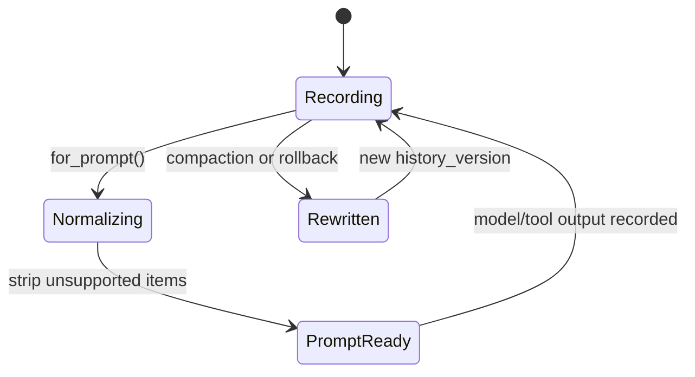
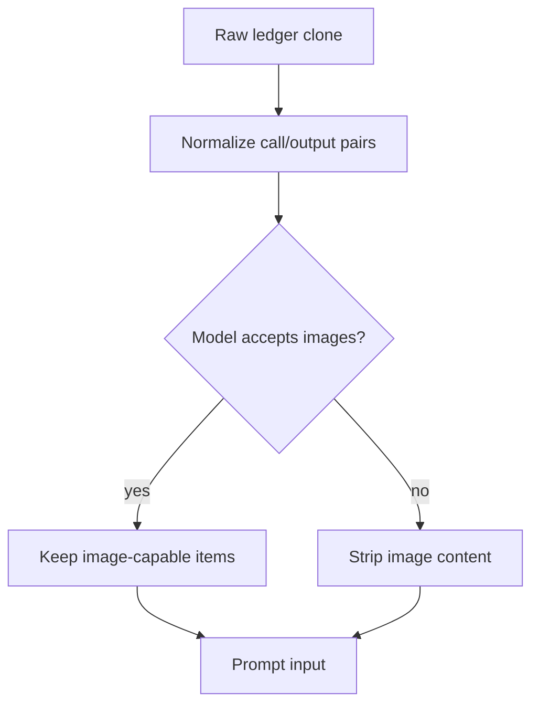

# Chapter 3: ContextManager: History as Prompt-Ready State

Chapter 2 described the turn envelope. The next problem is the durable side:
what happens to all the model-visible items accumulated over a thread? Codex
does not keep history as an opaque transcript. It uses `ContextManager` as a
ledger of response items ordered oldest to newest, with token information,
history versioning, and a reference context baseline for future settings diffs.

The job of the history ledger is deceptively hard. It must record only the items
that belong in API history, apply truncation policy to large outputs, preserve
function-call invariants, strip unsupported modalities before sampling, estimate
token usage, and survive replacement during compaction or rollback.

By the end of this chapter, you should understand the ledger as the bridge
between durable thread evidence and prompt-ready model input.

<div class="source-equivalence">
This chapter is grounded in
<a href="https://github.com/openai/codex/blob/569ff6a1c400bd514ff79f5f1050a684dc3afde3/codex-rs/core/src/context_manager/history.rs#L32">ContextManager fields</a>,
<a href="https://github.com/openai/codex/blob/569ff6a1c400bd514ff79f5f1050a684dc3afde3/codex-rs/core/src/context_manager/history.rs#L98">record_items</a>,
<a href="https://github.com/openai/codex/blob/569ff6a1c400bd514ff79f5f1050a684dc3afde3/codex-rs/core/src/context_manager/history.rs#L115">for_prompt</a>,
<a href="https://github.com/openai/codex/blob/569ff6a1c400bd514ff79f5f1050a684dc3afde3/codex-rs/core/src/context_manager/history.rs#L160">paired removal</a>, and
<a href="https://github.com/openai/codex/blob/569ff6a1c400bd514ff79f5f1050a684dc3afde3/codex-rs/core/src/context_manager/history.rs#L221">rollback-aware turn dropping</a>.
</div>

## Ledger Shape

The core shape is small:

| Field | Purpose |
| --- | --- |
| `items` | Oldest-first response items that are candidates for model-visible history. |
| `history_version` | A monotonic marker bumped when history is rewritten. |
| `token_info` | Latest token usage facts or estimates. |
| `reference_context_item` | Baseline turn context used when injecting settings diffs. |

The surprising field is the reference context item. It means history is not only
past conversation; it is also the baseline for deciding which runtime facts must
be reintroduced on the next turn. When compaction or rollback invalidates that
baseline, Codex clears it and falls back to full reinjection.



The state machine is conceptual. The code mostly uses cloning and mutation, but
the lifecycle is real: record raw-enough items, normalize for the target model,
then record new evidence.

## Recording Is Filtered

`record_items` accepts ordered items and records only API-message items. That
filter is essential. The rollout can contain events, UI facts, token counts, and
context checkpoints. Not all of those belong in the next model request. The
ledger stores the subset that should participate in prompt history.

Before pushing an item, the manager processes it under the active truncation
policy. Tool outputs are the classic danger: they can be huge, binary-ish, or
image-bearing. Codex lets truncation helpers turn them into bounded history
instead of allowing one command to consume the whole context window.

The pattern looks like this:

```text
// Pseudocode — illustrates filtered ledger recording.
for item in incomingItems:
    if not modelHistoryItem(item):
        continue
    bounded = applyOutputPolicy(item, activeTruncation)
    ledger.append(bounded)
```

This is the right abstraction because it records policy-shaped evidence, not raw
side effects. The raw side effect may still exist in the rollout or UI, but the
model-visible ledger stays bounded.

## Normalization Protects Invariants

Function calls and function outputs are paired. Removing one without the other
can create a prompt shape the model API rejects or misinterprets. The history
manager delegates paired removal to normalization helpers when dropping oldest or
newest items. That is why `remove_first_item` removes a corresponding counterpart
when needed.

The same idea appears before sampling. `for_prompt` clones the manager, applies
normalization, and strips items unsuitable for the active model modalities. If a
model does not accept images, image content is removed from messages and tool
outputs. The original ledger remains able to hold richer history, while the
prompt projection respects the model contract.



The trade-off is visible: Codex chooses safe prompt shape over maximal fidelity
for every provider. If an item cannot be represented safely for the model, the
projection changes rather than corrupting the ledger.

## Token Estimates Are Coarse by Design

The manager estimates tokens from base instructions and item estimates using
byte-based heuristics. The source explicitly treats this as a coarse lower
bound, not tokenizer-perfect accounting. That is a pragmatic choice. Exact
tokenization across providers and modalities would be expensive and brittle.
Codex needs a signal good enough for compaction thresholds, UI feedback, and
budgeting.

The exact token count arrives when the model response reports usage. Until then,
the estimate prevents the runtime from flying blind.

## Rollback and the Reference Baseline

Rollback is where the ledger proves it is more than a vector. Dropping the last
N user turns must preserve pre-user material, handle no-op cases, respect
assistant inter-agent boundaries, and clear the reference context baseline when
the surviving history no longer contains the initial context bundle that
established it.

That last behavior is subtle. If Codex kept diffing against a baseline whose
source text was removed, future turns could omit important context. Clearing the
baseline makes the next regular turn reinject full context instead of trusting a
stale diff.

## Apply This

1. **Prompt Ledger** -> store model-visible history as structured items, adapt it by filtering non-prompt events at insertion time, and watch for UI events leaking into model history.
2. **Normalize on Projection** -> repair provider-facing invariants when building the prompt view, adapt it by cloning before normalization, and watch for normalization that destroys durable evidence.
3. **Paired Deletion** -> delete tool calls and outputs as a unit, adapt it to any request/response protocol, and watch for truncation that leaves orphaned protocol frames.
4. **Baseline Clearing** -> invalidate diff baselines when rollback or compaction removes their source, adapt it by storing explicit baseline metadata, and watch for stale context diffs after history rewrites.
5. **Coarse Budget Signal** -> use cheap estimates for live decisions and exact counts when available, adapt it with conservative thresholds, and watch for treating estimates as billing-grade truth.
