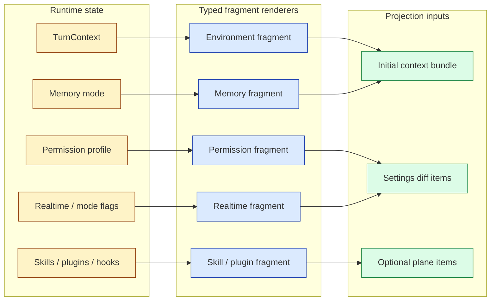
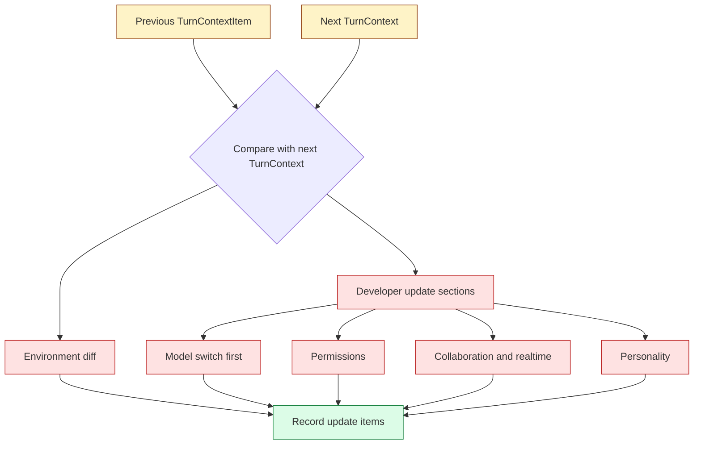

import FragmentComposer from "../../src/components/visual/FragmentComposer.tsx";

# Chapter 4: Typed Fragments and Settings Diffs

<FragmentComposer lang="en" client:visible />

Chapter 3 showed how Codex keeps prompt-ready history. The next problem is how
runtime facts enter that history. A naive system repeats a giant preamble every
turn: current directory, permissions, mode, realtime state, model guidance,
skills, and user instructions. Codex instead uses typed context fragments and
settings diffs. Stable context is injected once; later turns inject only changes
when a reference baseline exists.

This design is not just token optimization. It is semantic hygiene. The model
should see that permissions changed because that fact matters now, not because a
wall of boilerplate was pasted again.

By the end of this chapter, you should understand context fragments as the
typed rendering layer between runtime state and model-visible messages.

<div class="source-equivalence">
This chapter maps to
<a href="https://github.com/openai/codex/blob/569ff6a1c400bd514ff79f5f1050a684dc3afde3/codex-rs/core/src/context/fragment.rs#L31">ContextualUserFragment</a>,
<a href="https://github.com/openai/codex/blob/569ff6a1c400bd514ff79f5f1050a684dc3afde3/codex-rs/core/src/context/mod.rs#L1">the context fragment module list</a>,
<a href="https://github.com/openai/codex/blob/569ff6a1c400bd514ff79f5f1050a684dc3afde3/codex-rs/core/src/context_manager/updates.rs#L21">environment diffs</a>, and
<a href="https://github.com/openai/codex/blob/569ff6a1c400bd514ff79f5f1050a684dc3afde3/codex-rs/core/src/context_manager/updates.rs#L204">settings update assembly</a>.
</div>

## Fragment as a Typed Rendering Contract

The fragment trait gives each injected payload three responsibilities: choose a
message role, render a body, and optionally define start/end markers that allow
later code to recognize the fragment. That is stronger than "return a string."
It creates a typed registry of model-visible runtime facts.

```text
// Pseudocode -- illustrates typed fragment rendering.
fragment.role    = "user" or "developer"
fragment.markers = optionalRecognitionTags()
fragment.body    = renderRuntimeFact()
message = makeResponseItem(
  fragment.role,
  fragment.markers + fragment.body,
)
```

Markers are especially important. They let filtering and replay logic recognize
injected context without reconstructing every concrete payload. Unmarked
fragments can still render text, but they opt out of recognition. That is a
clean trade-off: recognition requires explicit syntax.

A typical marker pair looks like inline tags wrapping the body:

```text
<environment_context cwd="/repo" shell="bash">
  current directory: /repo
  permissions: read+write inside /repo, no network
  date: 2025-...
</environment_context>
```

The tag is human-readable on the model side and machine-recognizable on the
runtime side. Codex pays a small token cost to keep replay code uncomplicated.

## Where the Fragment Stack Sits

The fragment layer is one of three rendering disciplines that meet at the
prompt projection. The diagram shows their distinct responsibilities:



The three lanes prevent a common bug: runtime state being rendered through
inconsistent code paths. Once a fragment exists, every subsystem that wants to
inject the same fact uses the same renderer.

## The Fragment Catalog

The context module exports fragments for environment context, permissions,
collaboration mode, model switch instructions, realtime start/end, personality,
skills, plugins, apps, hooks, user instructions, saved network rules, approved
command prefixes, subagent notifications, and turn-aborted messages.

That catalog tells you what Codex considers context, not just what it considers
conversation:

| Fragment family | Why it belongs in context |
| --- | --- |
| Environment | The model must know cwd, shell, date, timezone, and related workspace facts. |
| Permissions | The model must understand what actions require approval or are forbidden. |
| Realtime | The model needs a different interaction contract while realtime is active. |
| Skills and plugins | Optional capabilities need discoverable model guidance. |
| Hooks | External policy can add model-visible context or force continuation. |
| User instructions | Persistent user preferences need a controlled injection path. |

The key is not that all of these become text. The key is that they become text
through one rendering discipline.

## Settings Diffs

`build_settings_update_items` compares a previous context item with the next
turn context. It can emit a contextual user message for environment changes and
a developer message for model instructions, permissions, collaboration mode,
realtime state, and personality. Model-switch instructions are placed first so
model-specific guidance frames the rest of the diff.



The result is precise context churn. Codex avoids repeating everything when
nothing changed, but it can still fully reinject after compaction or rollback by
clearing the reference baseline.

The diff order is deliberately not alphabetic. Reading from top to bottom of
the developer update sections, each section assumes the previous ones have
already taken effect:

```text
1. model switch       - frames every later section in this turn
2. permissions        - establishes what tools the model may attempt
3. collaboration/mode - changes interaction contract under those permissions
4. personality        - tunes voice without changing capabilities
```

If you reverse this order, the model can read mode guidance under the wrong
permissions, or personality guidance referring to tools that the new model does
not have.

## Initial Context Versus Update Context

Initial context establishes the baseline. Update context describes changes from
that baseline. Confusing the two creates subtle bugs. If you treat updates as
complete state, you omit material after resume. If you treat complete state as
updates, you waste tokens and bury signal.

Codex keeps the distinction by storing a `TurnContextItem` baseline and by
letting compaction choose whether replacement history should include initial
context. Chapter 6 covers that placement in detail.

A short table makes the distinction unambiguous:

| | Initial context | Update context |
| --- | --- | --- |
| Frequency | Once per "session start" or after baseline cleared. | Per turn when a baseline already exists. |
| Shape | Full bundle of environment, permissions, mode, hooks, skills. | Diff fragments, possibly empty. |
| Trigger | Compaction without baseline, rollback that cleared baseline, fresh thread. | Any turn whose envelope differs from baseline. |
| Failure if confused | Resume sees an updates-only prompt with missing facts. | Token waste and a noisy model context. |

The distinction is also visible in code as two different rendering paths.
"Build the bundle" and "build the diff" never share the same function: they
share the same fragment renderers.

## A Design Tension

The settings update code contains a candid limitation: not every model-visible
item emitted by initial context has a diff path yet. That comment matters
architecturally. It shows the design is moving toward deterministic replay of
all context planes, but the implementation still has areas where full
reinjection is safer than clever diffing.

That is the correct bias. In context systems, omissions are worse than
redundancy. Codex optimizes for diffs where it can prove the baseline; otherwise
it falls back to reinjection.

## Apply This

1. **Typed Fragment Renderer** -> render context through typed objects, adapt it by giving each fragment a role and recognition markers, and watch for unstructured strings that cannot be identified later.
2. **Settings Diff** -> compare previous and next runtime state before injecting updates, adapt it by storing a baseline snapshot, and watch for diffs computed against missing history.
3. **Priority Sections** -> order context updates by semantic dependency, adapt it by placing model-specific guidance before policy or mode details, and watch for instruction order that changes meaning.
4. **Fallback Reinjection** -> prefer full context when a baseline is uncertain, adapt it by clearing baselines after destructive rewrites, and watch for token-saving logic that omits required state.
5. **Fragment Catalog Review** -> maintain a visible list of context families, adapt it as an architecture inventory, and watch for new feature context entering through one-off prompt code.
