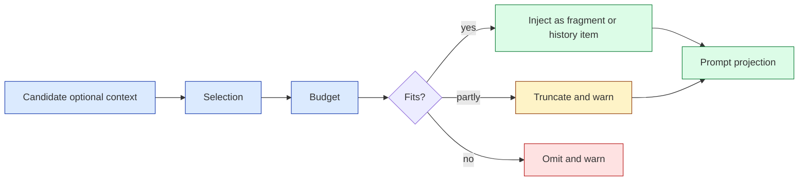
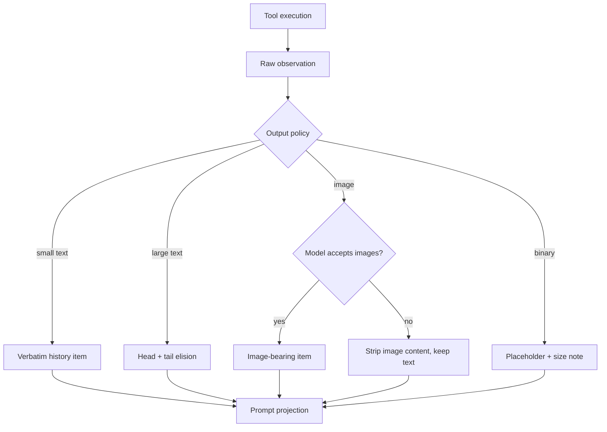

import BudgetSimulator from "../../src/components/visual/BudgetSimulator.tsx";

# Chapter 5: Budgeting Optional Context

<BudgetSimulator lang="en" client:visible />

Chapter 4 explained how required runtime facts become typed fragments and diffs.
This chapter turns to optional context: skills, plugins, apps, memory summaries,
tool outputs, images, and hook additions. Optional does not mean unimportant. It
means the system should be able to drop, shorten, select, or defer it without
breaking the core turn contract.

Codex's context management is strongest when it treats optional material as a
budgeted plane. A skill description can help the model, but every token spent on
skills is a token not spent on the user's code, previous tool outputs, or the
current task. The design question is not "can we include it?" The question is
"what budget and ownership make inclusion safe?"

By the end of this chapter, you should be able to recognize the optional-context
pattern across several subsystems.

<div class="source-equivalence">
This chapter is grounded in
<a href="https://github.com/openai/codex/blob/569ff6a1c400bd514ff79f5f1050a684dc3afde3/codex-rs/core/src/session/turn.rs#L170">turn-time skill/plugin resolution</a>,
<a href="https://github.com/openai/codex/blob/569ff6a1c400bd514ff79f5f1050a684dc3afde3/codex-rs/core-skills/src/render.rs#L143">skill metadata budget calculation</a>,
<a href="https://github.com/openai/codex/blob/569ff6a1c400bd514ff79f5f1050a684dc3afde3/codex-rs/core/src/session/turn.rs#L305">hook-provided context</a>,
<a href="https://github.com/openai/codex/blob/569ff6a1c400bd514ff79f5f1050a684dc3afde3/codex-rs/memories/read/src/prompts.rs#L24">memory read injection</a>, and
<a href="https://github.com/openai/codex/blob/569ff6a1c400bd514ff79f5f1050a684dc3afde3/codex-rs/memories/write/src/prompts.rs#L98">memory write truncation</a>.
</div>

## Optional Planes

Codex has several optional context planes:

| Plane | Selection mechanism | Budget behavior |
| --- | --- | --- |
| Skills | Explicit mentions and implicit availability. | Metadata budget tied to context window, with truncation and omission warnings. |
| Plugins and apps | Enabled plugin config, app access, and explicit mentions. | Injected per turn when mentioned or enabled; routed through capability summaries. |
| Memory read path | Existing memory summary file. | Summary is truncated before becoming developer instructions. |
| Memory write path | Rollout content passed to memory generation. | Large rollout payload is truncated to a percentage of the effective input window. |
| Tool outputs | Tool runtime observations. | Output truncation policy shapes what enters history. |
| Images | User or tool-provided images. | Stripped from prompt projections when model modalities do not support images. |

The common pattern is "select, budget, then inject." Optional context never gets
to assume the whole window is available.



Warnings are part of the design. If Codex shortens skill descriptions or omits
some skill metadata, the user-visible runtime can explain that the model saw a
reduced capability list. Silent omission would be cheaper but harder to debug.

## How the Window Is Sliced

The effective context window is shared between several consumers. A rough
allocation diagram makes the relationships visible. Numbers are illustrative
and shift with model and configuration:

```text
+------------------- Effective context window -------------------+
|                                                                |
|  base instructions          [#####]                            |
|  initial context bundle     [######]                           |
|  per-turn diffs             [###]                              |
|  history (recent turns)     [####################]             |
|  optional - skills          [###]   <- budgeted                |
|  optional - plugins/apps    [##]    <- budgeted                |
|  optional - memory summary  [##]    <- budgeted, truncated     |
|  optional - tool outputs    [#####] <- truncation policy       |
|  reserved for response                          [#######]      |
|                                                                |
+----------------------------------------------------------------+
```

The reserved tail on the right is what makes optional planes really optional.
If the model has no room left to answer, every clever skill description was
wasted. Budgeting respects that asymmetry: the answer always wins.

## Skills: Budgeted Discovery

The skill renderer defaults to a fixed character budget when no context window
is known, otherwise it budgets a small percentage of the effective context
window. It first tries absolute-path skill lines; if that is too expensive, it
can prefer aliased paths because shorter paths preserve more semantic
description text. If needed, it truncates descriptions before omitting whole
skills.

That sequence is opinionated. It preserves breadth before depth: Codex would
rather show every skill with shorter descriptions than hide capabilities early.
Only after descriptions are exhausted does it omit skills.

```text
// Pseudocode -- illustrates optional skill budgeting.
budget = contextWindow ? percent(contextWindow) : defaultChars
rendered = renderWithFullPaths(skills, budget)
if rendered.omitsOrTruncates:
    rendered = betterOf(
      rendered,
      renderWithAliases(skills, budget),
    )
emitWarnings(rendered.report)
```

The transferable idea is not the exact percentage. It is that optional
capability discovery has a budget owner and emits diagnostics.

A small ASCII illustration of the breadth-before-depth strategy:

```text
budget tight, naive depth-first:        budget tight, breadth-first:

  [skill A: full description]             [skill A: short description]
  [skill B: full description]             [skill B: short description]
  ... (D, E, F omitted) ...               [skill C: short description]
                                          [skill D: short description]
                                          [skill E: short description]
                                          [skill F: short description]

The naive variant hides capabilities the model could mention.
The breadth variant keeps the catalog visible at the cost of depth.
```

## Hooks and Memory Are Side Channels

Hooks can add context during prompt submission or stop-hook continuation. Memory
can add summarized user-level state through developer instructions. These are
side channels because they are not the user's immediate message and not ordinary
tool observations. Codex makes them explicit: hook outcomes produce additional
contexts that are recorded, and memory summaries pass through template rendering
and truncation.

The danger with side channels is authority confusion. A hook-added note may be
important policy context; a memory summary may be helpful personalization. Both
must enter the same governed context pipeline instead of silently modifying the
base prompt.

The four side channels and how they are bounded:

| Side channel | Where it enters | Where it is bounded |
| --- | --- | --- |
| Hook pre-prompt | Before model sampling each turn. | Hook return shape; hook can reject. |
| Hook stop continuation | After a stop event. | Hook can refuse to continue. |
| Memory read | Once per turn, as developer instructions. | Truncation in template rendering. |
| Memory write | Asynchronously, generating new memory file. | Rollout payload truncated to a percentage of the input window. |

The point is not that side channels are bad; it is that they must be enumerated
and bounded. Codex treats every additional injection path as a first-class
plane with the same selection / budget / inject discipline.

## Tool Outputs and Images

Tool output is optional in a different sense: the observation may be necessary
for the current task, but its raw form is not necessarily suitable for the
model. Codex applies truncation policy when recording items, and it can sanitize
or replace invalid image content if the model rejects an image request. The
history ledger remains structured enough to remove or replace the problematic
turn output and retry.

That is a better failure mode than treating tool output as raw transcript text.
The output has a protocol identity, so Codex can reason about it.



The diagram is dense on purpose. The simplest-looking arrow, "tool output -->
history," is actually four different cases under the hood. Naming them is half
the design.

## Apply This

1. **Optional Context Plane** -> separate helpful context from required context, adapt it by giving every plane a selection and budget rule, and watch for optional material that can crowd out core task evidence.
2. **Breadth Before Depth** -> preserve capability coverage before long descriptions, adapt it by shortening metadata before omitting entries, and watch for hidden capabilities caused by early omission.
3. **Budget Diagnostics** -> warn when context is shortened or omitted, adapt it by emitting user-visible or telemetry-visible reports, and watch for silent budget cuts that make behavior mysterious.
4. **Side-Channel Routing** -> route hooks and memory through the same context ledger, adapt it by recording their additions as explicit items, and watch for prompt mutation outside the runtime.
5. **Modality Projection** -> keep rich evidence durable but project only what the model supports, adapt it by stripping unsupported modalities at prompt time, and watch for provider assumptions leaking into stored history.
