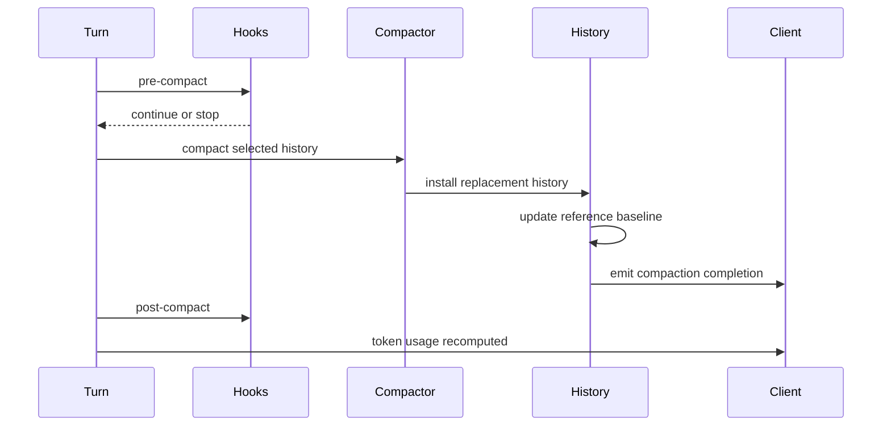
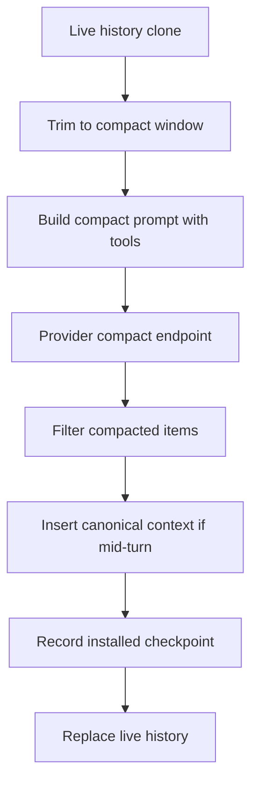

# Chapter 6: Compaction as a Checkpoint Protocol

Chapter 5 covered optional context budgets. Budgets delay the inevitable; they
do not eliminate it. Long threads eventually exceed the useful context window.
Codex's answer is compaction, but the important design choice is that compaction
is a checkpoint protocol. It does not merely ask a model to summarize old text.
It installs replacement history, updates the reference context baseline, emits
events, runs hooks, resets provider session state when needed, and recomputes
token usage.

This is where Codex most clearly treats forgetting as a governed operation.

By the end of this chapter, you should understand local and remote compaction as
two implementations of the same semantic boundary: replace the live history with
a smaller history that can still support future turns.

<div class="source-equivalence">
This chapter maps to
<a href="https://github.com/openai/codex/blob/569ff6a1c400bd514ff79f5f1050a684dc3afde3/codex-rs/core/src/compact.rs#L50">InitialContextInjection</a>,
<a href="https://github.com/openai/codex/blob/569ff6a1c400bd514ff79f5f1050a684dc3afde3/codex-rs/core/src/compact.rs#L121">local compaction flow</a>,
<a href="https://github.com/openai/codex/blob/569ff6a1c400bd514ff79f5f1050a684dc3afde3/codex-rs/core/src/compact.rs#L260">replacement-history construction</a>,
<a href="https://github.com/openai/codex/blob/569ff6a1c400bd514ff79f5f1050a684dc3afde3/codex-rs/core/src/compact_remote.rs#L84">remote compaction flow</a>, and
<a href="https://github.com/openai/codex/blob/569ff6a1c400bd514ff79f5f1050a684dc3afde3/codex-rs/core/src/session/turn.rs#L721">pre-sampling compaction</a>.
</div>

## Two Triggers, One Boundary

Compaction can happen manually, before sampling, or mid-turn after a sampling
request reaches the auto-compact limit and the model still needs follow-up. The
timing changes context placement:

| Timing | Initial context placement | Reason |
| --- | --- | --- |
| Manual or pre-turn | Do not inject into replacement history; clear reference baseline. | The next regular turn can fully reinject canonical context. |
| Mid-turn | Inject before the last real user message or summary. | The model expects the compaction item to remain last while continuation still has current context. |

This distinction is the heart of the protocol. Compaction is not only "smaller
history." It is smaller history placed in a model-compatible order.



Hooks wrap compaction because compaction is a side effect on the thread's
semantic state. External policy may need to block or observe it.

## Local Compaction

Local compaction appends a synthesized compaction request to a clone of history,
then samples the model until completion. If the context window is exceeded while
compacting, it removes the oldest history item and retries, preserving recent
messages and prefix cache as much as possible. After completion, it extracts the
latest assistant summary, collects user messages, builds a new compacted history,
optionally inserts initial context, installs a `CompactedItem` with replacement
history, resets websocket session state, and recomputes token usage.

```text
// Pseudocode — illustrates local checkpoint installation.
history = cloneLiveHistory()
history.record(compactionRequest)
summary = askModelForSummary(history.forPrompt(model))
replacement = buildHistory(recentUserMessages(history), summary)
if midTurn:
    replacement.insertBeforeLastUser(currentInitialContext)
installReplacementHistory(replacement, referenceContextForPlacement)
```

The important detail is replacement history. A later resume does not have to
infer what compaction meant from a free-form summary alone; it can start from
the installed replacement.

## Remote Compaction

Remote compaction uses a provider compact endpoint when available. It trims
function-call history to fit the compact endpoint, builds a prompt with current
tools, calls the compact endpoint, filters the returned compacted history,
optionally inserts initial context, records an installed checkpoint in rollout
trace, replaces live history, and recomputes token usage.

Remote compaction is not just an optimization. It gives the provider a first-
class conversation-history compaction path while Codex still owns the semantic
install boundary. The endpoint may produce compacted history, but Codex decides
which items survive and where canonical context goes.



## Why Summary Alone Is Not Enough

A summary is prose. Replacement history is protocol state. The difference is
huge. Replacement history can preserve user-message boundaries, compaction item
placement, and current context insertion. It gives rollout reconstruction a
concrete base. Summary text alone would force resume code to reinterpret old
events every time.

Codex still carries summary text, but the checkpoint is the real abstraction.

## Apply This

1. **Compaction Checkpoint** -> install compacted output as replacement history, adapt it by storing the post-compaction prompt base, and watch for summary-only designs that cannot reconstruct state.
2. **Placement Mode** -> make context placement explicit for pre-turn and mid-turn compaction, adapt it by naming placement strategies, and watch for one-size-fits-all summary insertion.
3. **Hooked Forgetting** -> run policy hooks around semantic history rewrites, adapt it by treating compaction like a state-changing operation, and watch for invisible background forgetting.
4. **Provider-Owned Work, Runtime-Owned Install** -> let a provider produce compacted history but keep filtering and installation local, adapt it to external summarizers, and watch for trusting remote output as already safe.
5. **Token Recompute** -> recompute usage after replacement, adapt it by invalidating stale counters, and watch for UI or compaction thresholds based on pre-compaction totals.
