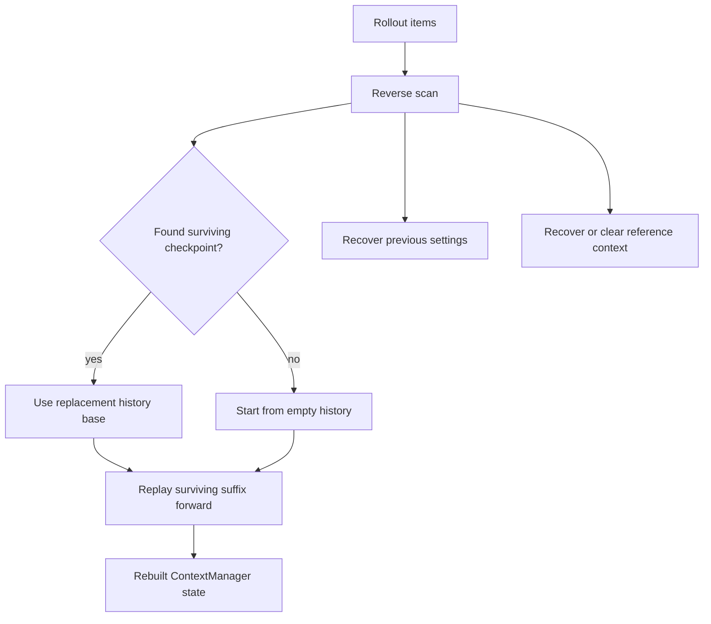

# Chapter 7: Resume, Rollback, Fork, and Replay

Chapter 6 explained compaction as a checkpoint protocol. That protocol only
pays off if the system can later reconstruct effective context. Codex has to
resume old threads, roll back recent user turns, fork work for child agents, and
replay enough history for clients. The runtime cannot trust an in-memory vector
after process exit or branching. It must rebuild from rollout evidence.

The reconstruction code is one of the clearest examples of Codex's context
discipline. It scans rollout items from newest to oldest to find the latest
surviving replacement-history checkpoint and resume metadata, then replays the
surviving suffix forward. Rollback markers are applied while scanning, so the
rebuilt history reflects effective state rather than raw event order.

By the end of this chapter, you should understand why durable context is not the
same as durable transcript.

<div class="source-equivalence">
This chapter maps to
<a href="https://github.com/openai/codex/blob/569ff6a1c400bd514ff79f5f1050a684dc3afde3/codex-rs/core/src/session/rollout_reconstruction.rs#L4">RolloutReconstruction</a>,
<a href="https://github.com/openai/codex/blob/569ff6a1c400bd514ff79f5f1050a684dc3afde3/codex-rs/core/src/session/rollout_reconstruction.rs#L86">reverse reconstruction</a>,
<a href="https://github.com/openai/codex/blob/569ff6a1c400bd514ff79f5f1050a684dc3afde3/codex-rs/core/src/session/rollout_reconstruction.rs#L250">legacy compaction handling</a>,
<a href="https://github.com/openai/codex/blob/569ff6a1c400bd514ff79f5f1050a684dc3afde3/codex-rs/core/src/thread_rollout_truncation.rs#L26">user-turn rollout positions</a>, and
<a href="https://github.com/openai/codex/blob/569ff6a1c400bd514ff79f5f1050a684dc3afde3/codex-rs/core/src/thread_rollout_truncation.rs#L57">fork-turn positions</a>.
</div>

## Reconstruction Has Three Outputs

Reconstruction returns three things:

| Output | Why it matters |
| --- | --- |
| Rebuilt history | The model-visible ledger for future turns. |
| Previous turn settings | The metadata needed to decide model/realtime diffs on resume. |
| Reference context item | The baseline for settings diffs, or an explicit cleared state. |

The last two outputs are easy to miss. Resume is not just "load messages." It
must also recover the context baseline used by the diff system from Chapter 4.
If compaction cleared that baseline, resume must preserve the clearing.



The reverse scan is efficient because old rollout items become irrelevant once a
newer surviving replacement-history checkpoint and needed metadata are known.

## Rollback Changes the Meaning of the Past

Rollback markers do not delete raw rollout records. They change which user-turn
segments count in effective history. While scanning in reverse, Codex interprets
"drop the newest N user turns" as "skip the next N finalized user-turn segments."
That lets reconstruction keep raw evidence while rebuilding the state the user
asked for.

The same logic appears in rollout truncation helpers. User-message positions are
tracked while applying rollback markers. Fork-turn positions include real user
messages and assistant inter-agent envelopes that trigger turns; rollback removes
stale suffixes based on instruction-turn boundaries.

This is a serious design choice. It means rollback is an event in the ledger,
not a destructive edit to the log.

## Fork Boundaries Are Not Only Human Messages

Multi-agent work complicates context boundaries. A child agent may start from an
assistant inter-agent envelope rather than a normal user message. Codex's fork
turn logic treats certain assistant envelopes as boundaries when they trigger a
turn. That preserves the semantic unit of delegated work.

```text
// Pseudocode — illustrates effective fork truncation.
for item in rollout:
    if item.isRollbackMarker():
        removeRolledBackInstructionTurns()
    if item.isRealUserMessage() or item.isTriggeringAgentEnvelope():
        rememberForkBoundary(item.position)
return suffixStartingAtNthBoundaryFromEnd()
```

The pattern matters outside multi-agent systems too. If your runtime has more
than one way to start work, your context truncation must understand all of them.

## Legacy Compaction

The reconstruction code still handles legacy compaction records without
replacement history. It rebuilds compacted history from user messages and the
stored compaction message, clears the reference baseline, and accepts a less
ideal prompt shape. That backward-compatibility path is instructive: the newer
checkpoint protocol exists because summary-only compaction is not enough.

This is also why the source distinguishes durable rollout evidence from live
history. The live history can improve over time, while rollout replay preserves
compatibility with older records.

## Apply This

1. **Replay From Evidence** -> rebuild context from append-only rollout facts, adapt it by treating live memory as a cache, and watch for resume paths that trust stale in-memory state.
2. **Reverse Checkpoint Search** -> scan backward to find the newest surviving base, adapt it for event-sourced systems, and watch for replaying the entire log when a checkpoint can bound work.
3. **Rollback Marker** -> record rollback as an event, adapt it by applying markers during reconstruction, and watch for destructive log edits that erase auditability.
4. **Semantic Boundaries** -> define user, agent, and fork turn boundaries explicitly, adapt it to every source of work, and watch for truncation that only understands human messages.
5. **Legacy Bridge** -> keep compatibility paths but clear unsafe baselines, adapt it by preferring correctness over perfect prompt shape, and watch for old records being treated like new checkpoints.
