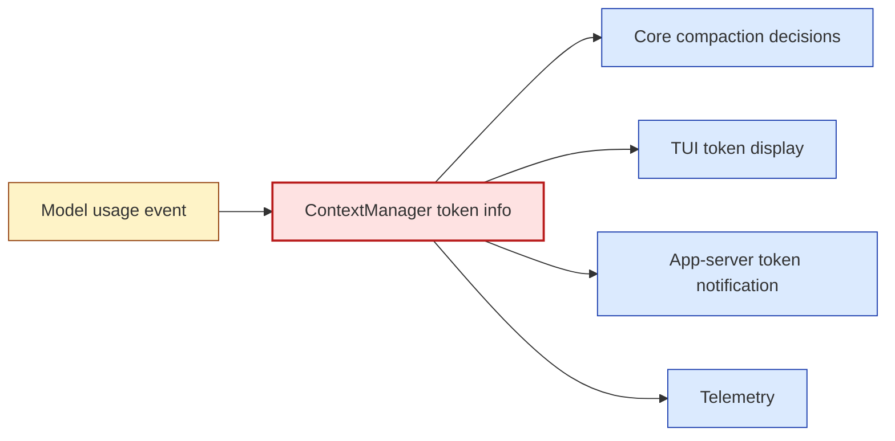
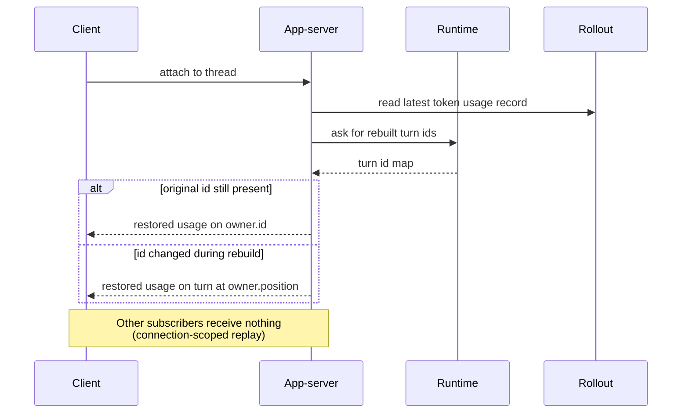

import ClientFanoutMap from "../../src/components/visual/ClientFanoutMap.tsx";

# Chapter 8: Client-Facing Context

<ClientFanoutMap lang="en" client:visible />

Chapter 7 showed that the runtime can reconstruct effective context from rollout evidence. The final layer is exposure. Users and clients need to see context state: token usage, compaction warnings, realtime mode, thread history, and replayed usage when attaching to an existing thread. Codex exposes those facts through the TUI, app-server notifications, realtime context modules, rollout trace, and telemetry. The key rule remains the same: clients render context; the runtime owns it.

This separation prevents a UI from becoming an alternate context manager. The TUI can show remaining context. The app-server can replay token usage. A trace can explain compaction. But the live history ledger and turn envelope stay in core.

By the end of this chapter, you should understand the client surfaces as projections of runtime-owned context state.

<div class="source-equivalence"> This chapter maps to <a href="https://github.com/openai/codex/blob/569ff6a1c400bd514ff79f5f1050a684dc3afde3/codex-rs/tui/src/token_usage.rs#L1">TUI token usage formatting</a>, <a href="https://github.com/openai/codex/blob/569ff6a1c400bd514ff79f5f1050a684dc3afde3/codex-rs/app-server/src/request_processors/token_usage_replay.rs#L1">app-server token usage replay</a>, <a href="https://github.com/openai/codex/blob/569ff6a1c400bd514ff79f5f1050a684dc3afde3/codex-rs/core/src/compact_remote.rs#L239">remote compaction trace installation</a>, <a href="https://github.com/openai/codex/blob/569ff6a1c400bd514ff79f5f1050a684dc3afde3/codex-rs/core/src/context_manager/updates.rs#L89">realtime context updates</a>, and <a href="https://github.com/openai/codex/blob/569ff6a1c400bd514ff79f5f1050a684dc3afde3/codex-rs/core/src/session/turn.rs#L474">post-sampling token checks</a>. </div>

## Surfaces and Their Owners

Codex exposes context through several surfaces. The table is short but worth internalising:

| Surface | What it shows | Runtime owner | Failure mode if owner is wrong |
| --- | --- | --- | --- |
| TUI token bar | Input/cached/output tokens, remaining ratio. | `ContextManager.token_info` + display baseline. | UI invents its own budget number. |
| App-server token notification | Live token usage events for connected clients. | Token usage events from sampling. | Clients infer state from text rendering. |
| App-server replay | Restored token usage update on reattach. | Rollout evidence + reattach scope. | Replay duplicates events to other subscribers. |
| Realtime fragment | Realtime mode start/end as model context. | `TurnContext.modes` + settings update. | Mode appears in transport but not in prompt. |
| Rollout trace | Installed checkpoint, compaction reason. | Compaction install events. | Trace blends compact-input and post-compact prompt. |

The right column is the part that matters. Each surface has a precise way it fails when the runtime is not the source of truth.

## Token Usage Is a Context Surface

The TUI token usage model separates input, cached input, output, reasoning output, and total tokens. It also computes a remaining percentage against a baseline-adjusted context window. That baseline is a display choice, not the runtime's only budget rule. The core runtime still uses model info and token usage to trigger compaction.



The same source fact feeds multiple surfaces. That is what keeps the UI honest. The pattern is "fan-out from one fact" rather than "let each consumer compute its own number." If the TUI bar disagrees with compaction's threshold, that is a bug, not just a display preference.

## App-Server Replay

When a client attaches to an existing thread, the app-server can send a restored token usage update to that connection. The code treats this as lifecycle replay, not a fresh model event. It avoids duplicating persisted usage records and avoids surprising other subscribers with historical updates.

Attribution is careful. If the latest persisted token count has an explicit turn id that still exists in the rebuilt thread, Codex uses it. If turn ids changed during reconstruction, it falls back to the active turn position recorded when the token count appeared.

```text
// Pseudocode -- illustrates replay attribution.
owner = findTurnActiveWhenLatestTokenCountWasPersisted(rollout)
if rebuiltThread.hasTurn(owner.id):
    notify(connection, owner.id, usage)
else:
    notify(connection, rebuiltThread.turnAt(owner.position), usage)
```

The pattern is subtle: client replay is connection-scoped because it explains history to a new observer; it is not a new runtime event.



The diagram shows why the replay event is delivered only to the attaching client. Other subscribers already saw the original event when it was live; sending it again would look like a new model action and confuse their state.

## Realtime Is Context, Not Just Transport

Realtime state appears in settings update logic. Starting or ending realtime can emit model-visible guidance. That is correct because realtime changes how the model should interact, not merely how bytes move. If a voice or realtime client changes the interaction contract, the model needs context about that mode.

This reinforces Chapter 2's envelope idea: client metadata and realtime flags belong in the turn context because they alter the runtime contract.

A small comparison clarifies the move:

| Treatment | Result |
| --- | --- |
| Realtime as transport flag only. | Model keeps sending long-form text while audio client expects turn-by-turn replies. |
| Realtime as context fragment. | Model receives explicit guidance: shorter turns, expect interruption, leave silence. |

The correct treatment crosses a layer boundary. A piece of client metadata becomes prompt-visible state because it changes meaning at the model level, not just at the wire level.

## Trace Gives Compaction Evidence

Remote compaction records an installed checkpoint payload containing input history and replacement history. That trace boundary is different from the later inference request. The distinction lets reducers and debuggers represent exactly what happened: the provider compacted one history, Codex installed another live history, and future sampling used the updated prompt projection.

Good observability does not just count tokens. It preserves semantic boundaries.

```text
trace stream around a compaction:

  ... usage(turn N-1)
    -> compaction_pre_hook(turn N)
    -> compact_input(payload = old history clone)        [phase 1]
    -> compact_output(payload = compacted items)         [phase 1]
    -> compaction_install(payload = replacement history) [phase 2]
    -> usage(post-compact recompute)                     [phase 2]
    -> compaction_post_hook(turn N)
    -> sample_request(payload = new prompt projection)   [phase 3]
  ... usage(turn N) ...
```

Three phases live in the same trace stream: compact, install, sample. A naive trace would collapse them into one "compaction event" and lose the ability to audit each phase separately.

## Apply This

1. **Runtime-Owned Display** -> let clients render context facts but not own them, adapt it by deriving UI state from runtime events, and watch for UI-only context that the model never sees.
2. **Connection-Scoped Replay** -> replay historical context facts only to the attaching observer, adapt it for resumed clients, and watch for replay events that look like new live events.
3. **Attribution Fallback** -> attribute restored usage by id first and position second, adapt it to rebuilt timelines, and watch for regenerated ids breaking UI state.
4. **Mode as Context** -> treat interaction modes as model-visible context when they change behavior, adapt it by diffing mode state, and watch for transport flags hidden from the prompt.
5. **Semantic Trace Boundary** -> trace context rewrites as install events, adapt it by separating compaction input from later sampling input, and watch for observability that collapses distinct phases into one blob.
