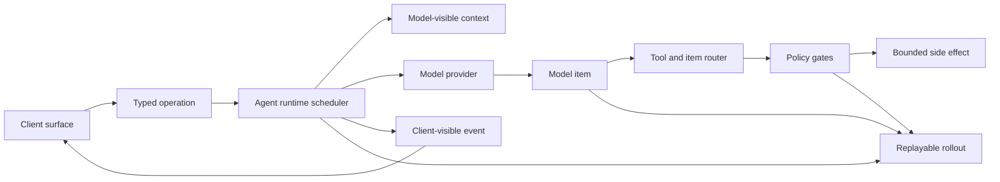
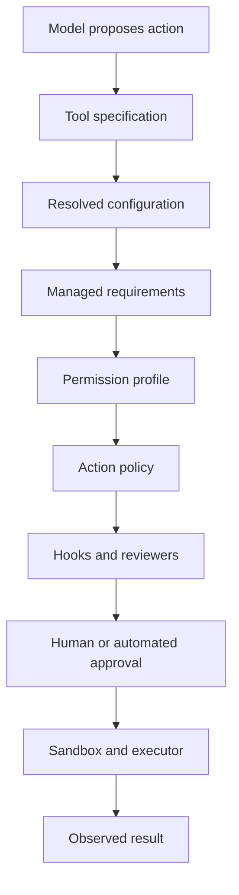

# Chapter 1: The Architectural Bet: Agent as a Bounded Operating System

The preface argued that Codex is interesting because it turns a language model
product into a system: a local agent that can receive intent, preserve state,
call tools, enforce policy, and report evidence. This chapter names the
architectural bet behind that system. Codex treats the agent as a bounded
operating system: not an operating system for a machine, but a runtime that
schedules work, mediates authority, records facts, and exposes stable contracts
to several clients.

The word bounded matters. A general operating system assumes it must host
arbitrary processes, devices, users, filesystems, and networks. Codex narrows
the universe. It hosts one kind of workload: an AI-assisted software
engineering conversation. It still needs OS-like responsibilities, but each
responsibility is constrained by product vocabulary:

| OS-like responsibility | Codex responsibility |
| --- | --- |
| Process scheduling | Manage turns, tools, cancellations, and background tasks. |
| System calls | Accept typed operations rather than arbitrary method calls. |
| Device drivers | Route model requests, shell commands, file edits, MCP tools, and hooks. |
| Permissions | Compile approval policy, sandbox policy, permission profiles, and managed requirements. |
| Logs | Append rollout records and emit client-visible events. |
| User sessions | Create, resume, fork, and reconstruct threads. |

This framing is more useful than describing Codex as a chat wrapper. A wrapper
mostly forwards messages. A bounded operating system defines what may enter,
what may happen, what must be recorded, and who may observe it.

## The Bet

The core thesis can be stated as a contract:

> Codex is an event-sourced agent runtime whose dangerous capabilities are
> exposed only through typed contracts, policy gates, and replayable
> boundaries.

Every phrase is doing work.

Event-sourced means the system treats structured facts as the durable record of
what happened. A user message, a turn start, a model item, a tool call, a patch
approval, a shell result, and a turn completion are not merely screen text. They
are facts that can be replayed, reduced, mapped into app-server items, and used
to resume a thread.

Agent runtime means the model is not the center of the architecture by itself.
The model is a powerful component inside a scheduler. The runtime decides when
to construct context, when to call a provider, when to dispatch tools, when to
ask for approval, when to cancel, and when to finish.

Typed contracts mean clients and subsystems exchange named shapes rather than
private implementation objects. The command-line interface, terminal UI,
headless execution path, app-server, SDKs, and tests all rely on this discipline.

Policy-gated side effects means model intent is not execution authority. A tool
call can request a command or file change, but the runtime still has to evaluate
configuration, requirements, hooks, sandboxing, approvals, and execution
location.

Replayable boundaries means the system keeps enough structured evidence to
explain or reconstruct the work. Codex can be interactive, but it is not
ephemeral.



The diagram deliberately has no direct arrow from the model to the filesystem
or shell. The architecture's most important negative space is the path that
does not exist.

## The Vocabulary

Part I establishes the language used by the rest of the book. The terms below
are not cosmetic; they are the load-bearing nouns of the system.

| Term | Meaning |
| --- | --- |
| Thread | A durable conversation and work context. A thread has identity, configuration, history, and resumable state. |
| Turn | One unit of user-driven work inside a thread. A turn may stream model output, call tools, request approval, and complete, fail, or be interrupted. |
| Item | A structured piece of conversation or work: user input, assistant output, reasoning summary, tool call, command output, patch update, or status fact. |
| Operation | A typed request submitted to the runtime, such as starting a turn, interrupting work, approving an action, or refreshing tool state. |
| Event | A typed fact emitted by the runtime for clients, persistence, and projections. Events describe what happened; they are not UI commands. |
| Tool | A capability exposed to the model through a specification and executed through a runtime handler. The specification is not the same as authority. |
| Rollout | The append-only record used to replay and reconstruct thread history. |
| Permission profile | The resolved policy envelope that describes what the agent may read, write, execute, or access. |
| Client surface | A way to use the runtime: terminal UI, `exec`, app-server, SDK, desktop integration, or test harness. |

The distinction between operation and event is the first major boundary.
Operations are requests. Events are facts. A request can be denied, delayed,
transformed, or routed. A fact should be durable enough that later code can
interpret it without asking the original caller what it meant.

## Why Contracts Come First

Many systems are taught from the outside in: install the tool, run a command,
look at the screen, then inspect implementation details. That approach is
useful for adoption, but it hides the architecture. Codex has several product
surfaces, and no single surface is the system.

The terminal UI is a client of the runtime. Headless `exec` is a client of the
runtime. App-server is a client-facing boundary around the runtime. SDKs are
protocol clients. Cloud task flows, plugin flows, MCP flows, and review flows
all reuse the same deeper vocabulary. If the book began with one UI, the reader
would confuse product experience with architectural contract.

A contract-first reading also prevents a common error in agent systems:
treating the model response as the source of truth. In Codex, the model response
is input to the runtime. The durable truth is the sequence of accepted
operations, emitted events, tool decisions, and rollout records.

## A Turn as a System Call

The OS analogy becomes concrete when a user submits work. A user turn is like a
high-level system call: it enters through a controlled boundary and returns
through events rather than through direct mutation.

```text
// Pseudocode - illustrative pattern.
function handle_user_turn(thread, user_input, turn_overrides):
    operation = make_operation("start_turn", user_input, turn_overrides)
    enqueue(thread.submissions, operation)

    while thread.has_active_work():
        event = await_next_runtime_event(thread)
        persist_to_rollout(thread, event)
        publish_to_clients(thread, event)

        if event.requests_side_effect:
            decision = evaluate_policy(event.requested_effect)
            if decision.requires_human:
                publish_to_clients(thread, make_approval_request(decision))
                decision = await_approval_response(thread)
            if decision.allowed:
                execute_bounded_effect(event.requested_effect)
            else:
                record_denial(thread, decision)
```

This pseudocode is intentionally generic. It is not a transcription of source.
The point is the shape:

1. Intent enters as a typed operation.
2. Runtime progress leaves as events.
3. Persistence records facts as work proceeds.
4. Side effects require a separate decision.
5. Clients observe and sometimes answer requests, but they do not own the
   runtime.

The shape will recur in later chapters. Configuration resolves before work
starts. Protocol defines what the operation can contain. The session loop
schedules the turn. Tool execution evaluates side effects. App-server maps core
events into client notifications. The terminal UI renders those notifications.

## The Three Histories

Codex has to keep several histories separate because they answer different
questions.

| History | Question it answers |
| --- | --- |
| Model-visible context | What should the model see when producing the next item? |
| Rollout record | What happened in this thread, in replayable order? |
| Queryable projection | What should clients list, filter, resume, or summarize quickly? |

A beginner might expect one transcript to serve every purpose. That is
tempting but brittle. The model needs selected context, not every internal
event. Replay needs structured fidelity, not just a pretty transcript. Clients
need quick projections, not full replay for every list view. Separating these
histories is one of the reasons Codex behaves like a runtime rather than a
script around an API call.

## Authority Is Layered

The model can propose actions, but Codex layers authority before anything
dangerous happens. The layers are deliberately not collapsed into one boolean.

Configuration expresses user and environment preferences. Managed requirements
can restrict those preferences. Permission profiles describe the resulting
capability envelope. Policies evaluate concrete actions. Hooks can add
organization-specific checks or context. Human approval can be requested when a
decision cannot be made silently. Sandboxes and execution backends enforce a
second line of defense at the place where work happens.



This layered design creates friction, but it creates useful friction. It lets a
workspace run with strict rules without changing the model prompt. It lets a
headless client reject interactive approvals without rewriting tool execution.
It lets compatibility bridges keep old rollouts readable while newer permission
profiles evolve.

## Client Surfaces Are Replaceable

The architecture assumes that product surfaces will multiply. A terminal UI
needs streaming updates and approval modals. A headless command needs machine
readable output and deterministic exit behavior. App-server needs JSON-RPC,
request serialization, and rejoin semantics. SDKs need generated models and
stable schemas. All of them benefit when the runtime owns threads, turns,
items, operations, and events.

This is why the book starts with the contract. If the terminal UI were the
architecture, every new client would either copy it or bypass it. If the
runtime contract is the architecture, clients can differ without forking the
agent.

## Apply This

1. **Name the runtime nouns first.** Before designing an agent feature, define
   the durable nouns that will cross subsystem boundaries.
2. **Separate intent from authority.** Let models request effects, but make a
   different layer decide whether the effects may happen.
3. **Record facts, not screens.** Persist structured events that can be
   replayed and projected instead of saving only rendered text.
4. **Keep clients downstream of contracts.** Build UI, CLI, SDK, and service
   surfaces as consumers of the same operation and event vocabulary.
5. **Use constraints as architecture.** Treat policy, requirements, and
   sandboxing as core runtime design, not as safety patches added after tool
   execution exists.

## Closing

The bounded-operating-system model explains why Codex is organized around
contracts before interfaces. Chapter 2 follows the first concrete boundary:
how an installed command reaches the Rust command router without letting
distribution glue become product architecture.

<div class="source-equivalence">

## Source Map

| Concept | Source anchor |
| --- | --- |
| Runtime vocabulary | [`codex-rs/protocol/src/protocol.rs`](https://github.com/openai/codex/blob/569ff6a1c400bd514ff79f5f1050a684dc3afde3/codex-rs/protocol/src/protocol.rs#L125) |
| Operation enum | [`codex-rs/protocol/src/protocol.rs`](https://github.com/openai/codex/blob/569ff6a1c400bd514ff79f5f1050a684dc3afde3/codex-rs/protocol/src/protocol.rs#L403) |
| Event stream | [`codex-rs/protocol/src/protocol.rs`](https://github.com/openai/codex/blob/569ff6a1c400bd514ff79f5f1050a684dc3afde3/codex-rs/protocol/src/protocol.rs#L1249) |
| Session facade | [`codex-rs/core/src/session/mod.rs`](https://github.com/openai/codex/blob/569ff6a1c400bd514ff79f5f1050a684dc3afde3/codex-rs/core/src/session/mod.rs#L366) |

</div>
