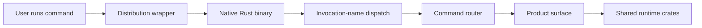
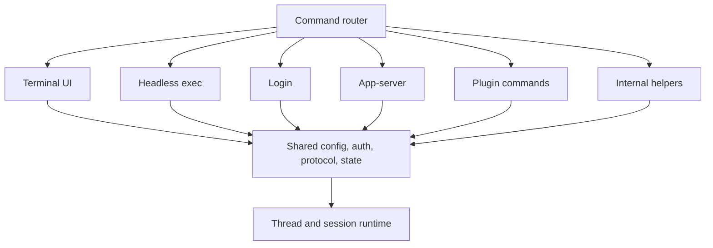

import StartupBootstrapTimeline from "../../src/components/visual/StartupBootstrapTimeline.tsx";

# Chapter 2: From Distribution Wrapper to Rust Router

<StartupBootstrapTimeline lang="en" client:visible />

Chapter 1 described Codex as a bounded operating system whose runtime accepts typed operations, emits events, and gates side effects. This chapter moves to the first boundary a user touches: the installed command. The design is deliberately asymmetric. JavaScript owns distribution mechanics; Rust owns product routing and runtime integration.

That split is easy to underestimate. Many command-line products begin as a script that grows behavior over time. Codex resists that shape. The npm-facing entry point chooses the correct native artifact, adjusts the process environment, forwards signals, and then gets out of the way. The Rust binary parses commands, resolves shared startup state, and dispatches into product surfaces.

The result is not merely a faster executable. It is an architectural boundary: delivery is allowed to know how the binary is found, but not how the agent works.

## The Startup Chain

The startup path has four conceptual stages:



The distribution wrapper exists because users install Codex through package channels that need platform-specific artifacts. It detects the host platform, finds the matching native package or vendored binary, adds bundled helper paths when needed, marks the install context, spawns the native executable, and mirrors process termination. None of those tasks require knowledge of threads, turns, approvals, models, or tools.

The Rust binary then performs the work that belongs to the product. It can start the terminal UI, run headless execution, manage login, expose MCP commands, run app-server, inspect feature flags, apply a produced diff, resume or fork a thread, launch sandbox helpers, or invoke hidden internal tools. The router is broad, but the breadth is explicit.

| Layer | Owns | Must not own |
| --- | --- | --- |
| Package wrapper | Platform selection, binary location, signal forwarding, install marker. | Runtime behavior, config semantics, auth flow, tool execution. |
| Invocation-name dispatch | Helper aliases and single-binary multiplexing. | Product policy or user-facing decisions. |
| Rust command router | Root flags, subcommands, hidden internal commands, dispatch. | Long-lived session behavior that belongs in shared crates. |
| Product surface | TUI, exec, app-server, login, review, cloud, plugin, MCP. | Duplicate implementations of config, auth, or runtime loops. |
| Shared runtime crates | Config, auth, protocol, sessions, tools, state, sandboxing. | Distribution-channel assumptions. |

## JavaScript as Delivery Glue

The wrapper's job is mechanical but important. It translates "the user ran the installed command" into "the correct native executable is running with the right environment." This includes platform selection, optional dependency lookup, fallback to vendored artifacts, additional helper paths, package manager markers, and signal handling.

In architectural terms, the wrapper is a bootloader. A bootloader is not less important because it is small; it is important because it is constrained. If the wrapper began interpreting feature flags, reading project configuration, or deciding approval behavior, the product would acquire a second control plane. The Rust runtime would no longer be the single place where command behavior is defined.

```text
// Pseudocode - illustrative pattern.
function wrapper_main(argv, environment):
    target = detect_platform_target(environment)
    binary = locate_native_binary(target)
    helper_paths = discover_packaged_helper_paths(target)
    child_environment = environment.with_path_prefix(helper_paths)
    child_environment.set("install_origin", detected_package_manager())
    result = spawn_and_forward_signals(binary, argv, child_environment)
    exit_like_child(result)
```

The pseudocode captures the boundary. The wrapper does not parse "start a thread" or "approve a patch." It forwards arguments and preserves process behavior.

## Invocation Name as a Router

After the native binary starts, Codex performs a second form of dispatch based on how the executable was invoked. On Unix-like systems, one binary can behave like several helper tools when reached through different names or controlled arguments. Codex uses this pattern for helper paths such as sandbox launch, patch application, filesystem helper execution, and shell escalation support.

This is a pragmatic delivery decision. Shipping many executables increases packaging complexity, version skew, and path discovery problems. Shipping one binary with controlled helper aliases keeps release artifacts simpler while still giving internal subsystems stable executable names.

The pattern has a cost: startup must inspect invocation metadata before ordinary command parsing. That inspection must be narrow and deterministic. If it grows into product-level command handling, it competes with the command router. Used carefully, it lets the runtime pass stable helper paths to later subsystems without hard-coding installation layouts.

## The Rust Router

The command router is the first place where the product becomes visible. Its root command accepts global configuration overrides, feature toggles, remote options, and the default interactive prompt. Its subcommands represent the supported product surfaces:

| Surface | Architectural role |
| --- | --- |
| Interactive UI | Inline terminal client over the shared runtime. |
| Headless execution | Non-interactive client for prompts, review, and machine output. |
| Login and logout | Credential lifecycle and status inspection. |
| MCP commands | Configuration and server entry points for tool protocol integration. |
| App-server | JSON-RPC boundary for richer clients and SDKs. |
| Plugin and marketplace commands | Extension packaging and discovery flows. |
| Sandbox and exec-server helpers | Execution-location and isolation support. |
| Resume and fork | Thread lifecycle operations over durable state. |
| Debug and feature commands | Inspection surfaces for generated catalogs, traces, and flags. |

The router does not make all of those flows simple. It makes them explicit. A reader can inspect the command tree and see which product surfaces exist before reading a single session-loop detail.

## Hidden Commands Are Still Contracts

Some commands are hidden from ordinary help output because they support internal or experimental flows. Hidden does not mean informal. A hidden command still has parsed arguments, tests, and a place in the startup model. That is safer than burying the same behavior behind ad hoc environment variables or unstructured shell snippets.

This matters for helper processes. Sandboxes, app-server proxies, schema generation, trace reduction, and internal relays often need command-line entry points. Treating them as first-class parsed commands gives the release system, tests, and other crates a stable way to invoke them.

## Thin Product Surfaces

The router's main design discipline is that product surfaces should be thin over shared runtime crates. Interactive mode should not own a separate config resolver. Headless execution should not own a separate auth model. App-server should not invent a second thread store. Review should not become an unrelated agent loop.

This discipline is what lets later chapters explain Codex as one system. Each surface has special behavior, but the common behavior sits behind shared contracts:



The foundation is not a convenience library. It is the architecture's defense against product-surface drift.

## Install Context as Metadata

Codex also preserves install context. A binary launched from npm, Bun, Homebrew, a standalone archive, a desktop app, or an unknown source may need different update hints, bundled helper discovery, or diagnostics. The key is that install context is metadata, not behavior authority. It should explain how the process arrived and where packaged resources live; it should not decide whether a model may edit a file.

This separation keeps delivery concerns from leaking into policy. A managed account requirement should constrain runtime settings regardless of how the binary was installed. A sandbox helper should be discoverable regardless of which product surface is running. Startup carries install facts forward so later layers can use them without re-detecting the world.

## Why the Router Matters Later

The next chapters rely on this startup split. Configuration and authentication can be taught once because every major command path reaches the same foundation. Protocol can be taught as a product boundary because app-server, TUI, and exec are surfaces over shared runtime concepts. Tool execution can be taught as a runtime capability because the wrapper never bypasses it.

The router therefore plays two roles: it dispatches commands, and it protects the shape of the system.

## Apply This

1. **Keep distribution glue behavior-poor.** Let wrappers find and launch the
   product binary, but keep product semantics in the main implementation.
2. **Use one router for product intent.** A broad command tree is easier to
   reason about than scattered startup paths with hidden behavior.
3. **Make helper entry points explicit.** Internal tools should still have typed
   arguments and deterministic dispatch.
4. **Carry install facts as facts.** Preserve package origin and helper paths as
   metadata, not as a second policy system.
5. **Push shared behavior below surfaces.** TUI, headless execution, app-server,
   and plugins should reuse the same config, auth, protocol, and runtime
   foundations.

## Closing

The command reaches Rust with distribution concerns stripped down to metadata and helper paths. Chapter 3 follows what the router must resolve before any surface can safely start work: configuration, authentication, feature state, and managed requirements.

<div class="source-equivalence">

## Source Map

| Concept | Source anchor |
| --- | --- |
| npm launch wrapper | [`codex-cli/bin/codex.js`](https://github.com/openai/codex/blob/569ff6a1c400bd514ff79f5f1050a684dc3afde3/codex-cli/bin/codex.js#L1) |
| Rust command router | [`codex-rs/cli/src/main.rs`](https://github.com/openai/codex/blob/569ff6a1c400bd514ff79f5f1050a684dc3afde3/codex-rs/cli/src/main.rs#L106) |
| App command boundary | [`codex-rs/cli/src/app_cmd.rs`](https://github.com/openai/codex/blob/569ff6a1c400bd514ff79f5f1050a684dc3afde3/codex-rs/cli/src/app_cmd.rs#L5) |
| App-server daemon commands | [`codex-rs/cli/src/main.rs`](https://github.com/openai/codex/blob/569ff6a1c400bd514ff79f5f1050a684dc3afde3/codex-rs/cli/src/main.rs#L417) |

</div>
