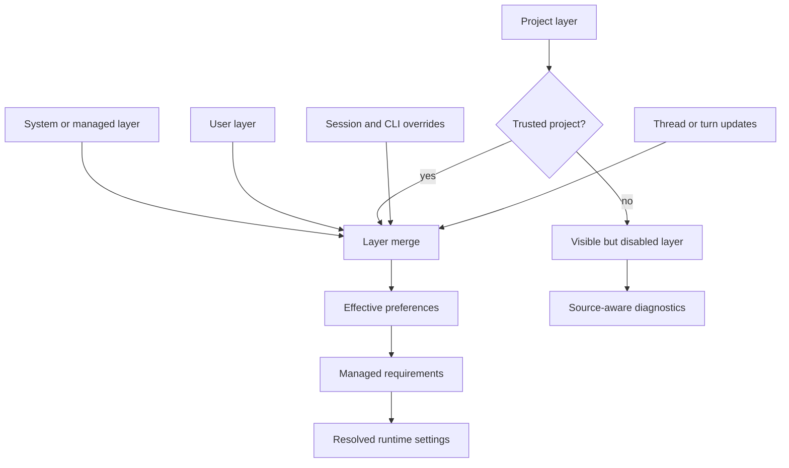
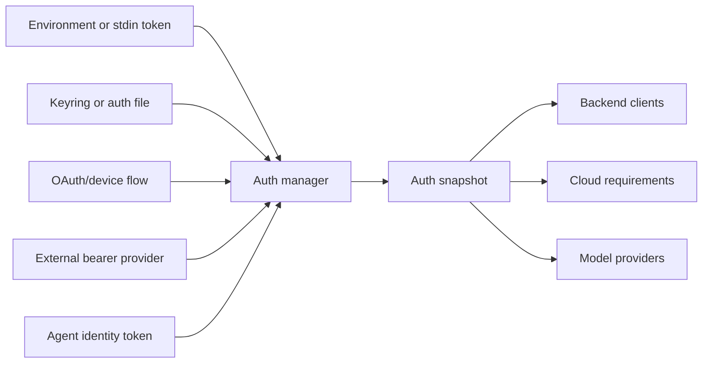

import ConstraintEnvelopeBuilder from "../../src/components/visual/ConstraintEnvelopeBuilder.tsx";

# Chapter 3: Configuration, Authentication, and Managed Requirements

<ConstraintEnvelopeBuilder lang="en" client:visible />

Chapter 2 followed startup from a distribution wrapper into the Rust command router. Once the router knows which surface is being launched, it still cannot start the agent safely. It must first resolve the operating envelope: effective configuration, authenticated identity, feature state, and managed requirements.

This chapter is about that envelope. Codex does not let every subsystem read whatever configuration file or environment variable it prefers. The system builds a resolved, source-aware view and hands later layers constrained runtime settings. That invariant is essential: the session loop, model provider, tools, app-server, hooks, and sandboxing code should consume the same answer to "what is allowed here?"

## Configuration Is a Stack, Not a File

Codex configuration is layered. Some layers come from system or managed settings. Some come from the user's home configuration. Some come from a project. Some come from command-line overrides, session state, or thread-level choices. The important point is not only precedence; it is provenance.



The disabled layer in the diagram is important. Project-local configuration may be visible even when trust prevents it from affecting runtime behavior. This is better than pretending the layer does not exist. A client can explain why a value was ignored, and a user can decide whether to trust the project.

Layering also makes diagnostics possible. If a requested setting fails, Codex can distinguish "unknown field," "overridden by a higher-precedence layer," "disabled because the project is untrusted," and "rejected by requirements." Those are different problems with different remedies.

## Preferences Versus Requirements

A common configuration mistake is to treat all settings as preferences. Codex does not. A preference says what a user or surface would like. A requirement says what the environment permits. Requirements are restrictive overlays.

For example, a user preference may request a permissive sandbox mode. A managed requirement may allow only a more restrictive permission profile. The correct result is not to merge the two as peers. The requirement constrains the preference and should produce a source-aware failure if the preference cannot be made legal.

| Concept | Role |
| --- | --- |
| Config layer | Expresses desired defaults or overrides. |
| Feature flag | Controls staged behavior, aliases, warnings, and dependencies. |
| Requirement | Restricts the set of legal resolved values. |
| Constrained value | Carries both allowed choices and the source of the constraint. |
| Resolution error | Explains which source made the requested value invalid. |

This is where Codex starts to look like an enterprise-ready local runtime. A managed account or host policy can constrain network behavior, filesystem access, approval style, hooks, plugins, MCP servers, web search, residency, and permission profiles without changing every product surface.

## Trust-Gated Project Configuration

Project configuration is useful because different repositories need different defaults. It is also dangerous because a repository can be supplied by someone else. A local agent that blindly honors project config would let the workspace configure the tool that is about to inspect and modify that same workspace.

Codex therefore treats project config as trust-gated. The loader can discover the project layer, preserve its source, and show that it exists, but unsafe project-local values require trust before they become effective. This is a design pattern rather than a special case. The system does not have to know which UI will display the trust state; it only has to preserve enough information for any client to explain the outcome.

```text
// Pseudocode - illustrative pattern.
function load_effective_settings(inputs):
    layers = []
    layers.add(load_system_layer())
    layers.add(load_user_layer())

    project_layer = discover_project_layer(inputs.cwd)
    if project_layer.exists and project_is_trusted(project_layer):
        layers.add(project_layer)
    else:
        layers.add_disabled(project_layer, reason = "project_not_trusted")

    layers.add(make_cli_override_layer(inputs.flags))
    preferences = merge_by_precedence(layers.enabled_only())

    requirements = load_requirements(inputs.auth, inputs.host)
    return constrain(preferences, requirements)
```

The pseudocode avoids source details, but it shows the key ordering: ordinary preferences merge first; requirements constrain after.

## Feature Flags as Lifecycle Management

Feature flags in Codex are not scattered string checks. They have names, defaults, stages, aliases, warnings, dependencies, and sometimes structured configuration. That centralization lets the product evolve without turning every subsystem into a compatibility table.

A feature may be experimental, staged, renamed, deprecated, or requirements only. A user-facing command may need to warn about an alias. App-server schema generation may need to filter experimental fields. Runtime code may need to test a normalized feature state rather than a raw string.

This is another example of bounded-OS thinking. A general program can check an environment variable wherever it wants. A runtime with multiple clients and generated contracts needs one normalized feature vocabulary.

## Authentication as a Snapshot

Configuration says what the process wants to do. Authentication says who is doing it and which backend capabilities can be used. Codex supports several auth shapes: API-key auth, ChatGPT OAuth, externally supplied bearer tokens, and agent identity flows used by task-oriented integrations.

The architecture hides those storage and refresh differences behind an auth manager. The goal is not only convenience. It prevents one subsystem from using an old credential while another subsystem has refreshed or invalidated it. A long-running process needs a stable way to ask, "what is the current auth state, and can it recover from unauthorized responses?"



The snapshot can represent different auth modes, but later layers should not care where a token was stored or how a refresh command was executed. They care whether an authenticated client can be constructed, whether account metadata is available, and whether policy requirements must be fetched.

## Managed Requirements and Fail-Closed Behavior

Managed requirements turn account or host policy into local constraints. They may be loaded from local managed configuration, platform management systems, or cloud-backed account policy. For eligible managed accounts, failure to load requirements can be a fail-closed condition. That choice is inconvenient by design. If the account requires centralized policy, silently proceeding without that policy would make the local runtime less trustworthy precisely when policy matters most.

The requirements layer also preserves source information. A value constrained by cloud policy should be reported differently from a value constrained by a local requirements file. Source-aware errors make the system explainable to users, administrators, and client surfaces.

## The Resolved Runtime Envelope

By the time a command surface starts real work, it should receive a resolved runtime envelope:

| Envelope field | Why it must be resolved early |
| --- | --- |
| Working directory and roots | Tool execution and project trust depend on them. |
| Model and provider settings | Turn construction and auth may depend on provider choice. |
| Approval behavior | Tool routing needs to know when interaction is possible. |
| Permission profile and sandbox | Side-effect policy depends on a consistent capability model. |
| Feature state | Protocol, UI, runtime, and schema filtering must agree. |
| Auth state | Backend calls, cloud requirements, and model calls need a coherent identity. |
| Managed requirements | Later subsystems should not reinterpret policy. |

This envelope is not static forever. A thread or turn may update selected settings. But updates pass through the same idea: preserve origin, validate constraints, and make later execution consume resolved values.

## Apply This

1. **Preserve provenance with values.** Configuration without source metadata
   cannot explain why a runtime behaved the way it did.
2. **Separate preferences from constraints.** Merge desired settings first, then
   apply requirements as restrictive policy.
3. **Gate untrusted local configuration.** Discover project config without
   automatically letting the project control the agent.
4. **Normalize auth behind one manager.** Storage, refresh, OAuth, and external
   token commands should produce a coherent process-level auth snapshot.
5. **Fail early on illegal envelopes.** Do not let tools, models, or clients
   discover policy conflicts after side-effect execution has begun.

## Closing

The router from Chapter 2 can now launch a surface with a resolved operating envelope. Chapter 4 turns to the boundary that lets those surfaces and the runtime speak the same durable language: operations, events, model items, app-server messages, and generated protocol schemas.

<div class="source-equivalence">

## Source Map

| Concept | Source anchor |
| --- | --- |
| Resolved permissions | [`codex-rs/core/src/config/mod.rs`](https://github.com/openai/codex/blob/569ff6a1c400bd514ff79f5f1050a684dc3afde3/codex-rs/core/src/config/mod.rs#L236) |
| Permission compilation | [`codex-rs/core/src/config/permissions.rs`](https://github.com/openai/codex/blob/569ff6a1c400bd514ff79f5f1050a684dc3afde3/codex-rs/core/src/config/permissions.rs#L300) |
| Managed feature gates | [`codex-rs/core/src/config/managed_features.rs`](https://github.com/openai/codex/blob/569ff6a1c400bd514ff79f5f1050a684dc3afde3/codex-rs/core/src/config/managed_features.rs#L25) |
| Public permission profile | [`codex-rs/app-server-protocol/src/protocol/v2/permissions.rs`](https://github.com/openai/codex/blob/569ff6a1c400bd514ff79f5f1050a684dc3afde3/codex-rs/app-server-protocol/src/protocol/v2/permissions.rs#L375) |

</div>
