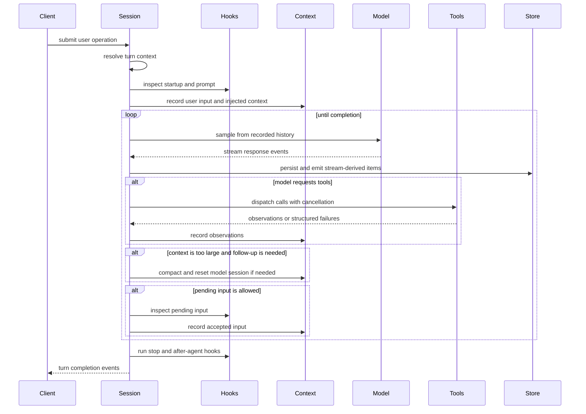
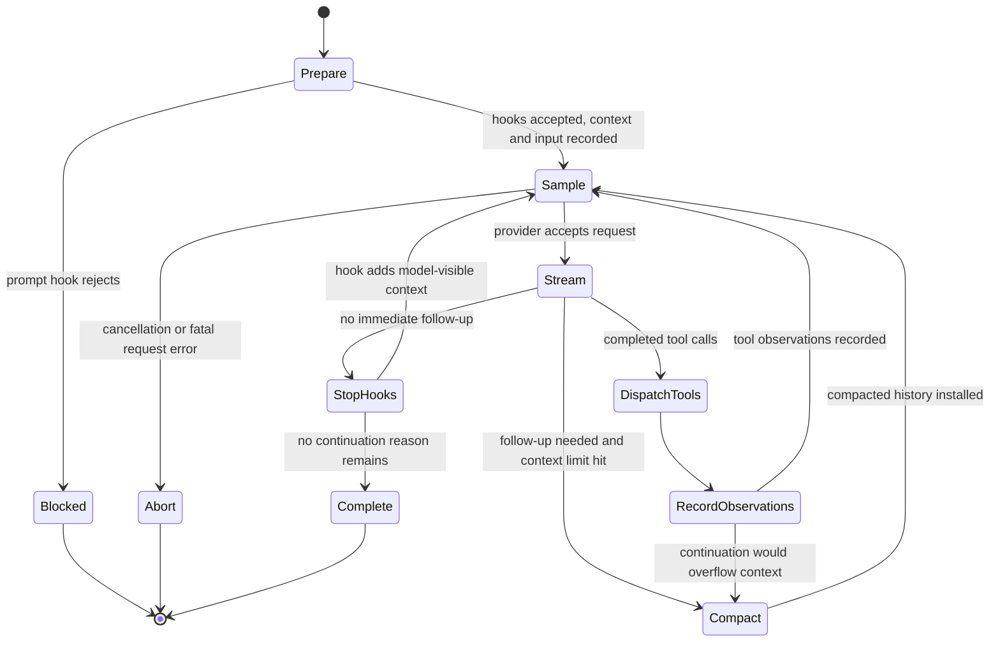

# Chapter 6: The Turn Loop: Where the Agent Becomes an Agent

Chapter 5 separated durable threads from live sessions and showed how client
operations enter the runtime. This chapter follows one of those operations
through the turn loop, the place where scheduling, context, streaming, tools,
hooks, compaction, and cancellation become agent behavior.

<div class="chapter-lede">
  <p><strong>Problem:</strong> a user turn cannot be implemented as one model request, because the model may ask for tools, hooks may add work, users may interrupt, and context may need repair.</p>
  <p><strong>Thesis:</strong> a turn is a controlled state machine whose output is both a user-visible answer and a durable sequence of runtime facts.</p>
  <p><strong>Mental model:</strong> the loop alternates between deciding what the model may see and deciding what the runtime may do.</p>
</div>


<div class="source-equivalence">

## Source Map

| Concept | Source anchor |
| --- | --- |
| Turn loop implementation | [`codex-rs/core/src/session/turn.rs`](https://github.com/openai/codex/blob/569ff6a1c400bd514ff79f5f1050a684dc3afde3/codex-rs/core/src/session/turn.rs#L139) |
| Prompt hook ordering | [`codex-rs/core/src/session/turn.rs`](https://github.com/openai/codex/blob/569ff6a1c400bd514ff79f5f1050a684dc3afde3/codex-rs/core/src/session/turn.rs#L313) |
| Accepted prompt recording | [`codex-rs/core/src/session/turn.rs`](https://github.com/openai/codex/blob/569ff6a1c400bd514ff79f5f1050a684dc3afde3/codex-rs/core/src/session/turn.rs#L328) |
| Model client session | [`codex-rs/core/src/client.rs`](https://github.com/openai/codex/blob/569ff6a1c400bd514ff79f5f1050a684dc3afde3/codex-rs/core/src/client.rs#L232) |
| Context manager | [`codex-rs/core/src/context_manager/history.rs`](https://github.com/openai/codex/blob/569ff6a1c400bd514ff79f5f1050a684dc3afde3/codex-rs/core/src/context_manager/history.rs#L34) |

</div>

## The Shape of a Turn

A turn begins when the submission loop decides that user input should become
scheduled work. The session resolves a `TurnContext`, installs an active turn,
and runs the loop under a cancellation token. From that point on, every
interesting subsystem is nearby: hooks inspect input, skills and plugins
inject context, the model client streams events, the tool router dispatches
side effects, persistence records items, and telemetry observes progress.



This diagram is intentionally circular. Codex becomes an agent because model
output can change the next model input through tools, observations, compaction,
and pending user input.

## Preparation Before Sampling

The loop does significant work before the first model request. It checks that
there is meaningful input or pending work. It prepares a model client session,
possibly reusing prewarmed transport state. It evaluates pre-sampling
compaction when the existing context is already under token pressure. It
collects turn context candidates so accepted replay can later record which
settings surrounded this turn.

It then resolves turn-scoped extension context. Explicit skill mentions can
become injected instructions. Plugin and app mentions can require an inventory
of tools or connectors. Dependency prompts may ask the client for missing
environment values or capability setup. User-prompt hooks may accept, enrich,
or block the turn before the model sees it.

| Preparation concern | Why it happens before sampling |
| --- | --- |
| Turn context | The model request must reflect resolved runtime settings, not stale defaults. |
| Initial compaction | The loop should not start a request that is already impossible to fit. |
| Context injection | Skills, plugins, and additional context must be durable and visible. |
| Hook inspection | Policy and extension points need a chance to stop or modify work early. |
| Accepted prompt recording | After hooks accept the turn, the prompt and context become replayable. |

The preparation phase is why the turn loop is not "call the model with the
latest text." It constructs a reproducible model request from recorded runtime
state.

## The Turn State Machine

The turn loop is best read as a state machine. The source has many helper
paths, but the durable states are compact: prepare a reproducible prompt,
sample the model, stream and persist facts, dispatch tools when requested,
record observations, repair context when needed, inspect stop hooks, and then
either continue or settle.



The loop has one governing rule: continue only for a concrete reason. The
reason may be tool follow-up, accepted pending input, compaction, or a stop
hook that adds new model-visible work. Without a reason, the turn settles.

The preparation path is short in concept but strict in ordering:

```text
// Pseudocode - preparation gate.
session = prepare_model_transport()
maybe_compact_before_first_sample(session)
context = resolve_turn_context_candidates()
reject_if_prompt_hooks_block(input, context)
record_accepted_inputs_and_context(input, context)
```

The order matters. A prompt-submission hook can stop the turn before the user
prompt becomes accepted runtime history. When that happens, the durable record
should explain the hook decision, not pretend the blocked prompt entered the
model-visible conversation.

Sampling is the only phase that talks to the provider, but it immediately
turns provider events back into runtime facts:

```text
// Pseudocode - sampling continuation.
events = sample_model(recorded_history(context), tool_specs(context))
persist_stream_items(events.items)
observations = dispatch_completed_tool_calls(events.tool_calls)
record_observations(observations)
```

Stopping is not a passive return. It is another gate that may add work:

```text
// Pseudocode - stop hook continuation.
decision = run_stop_hooks(last_assistant_message)
if decision.added_context:
    record_hook_context(decision.added_context)
    continue_sampling()
complete_turn()
```

## Streaming Is Runtime Input

Streaming is often described as a user-interface feature, but in Codex it is
runtime input. The stream carries assistant text, reasoning summaries, response
items, tool-call deltas, completion signals, rate-limit information, and
transport errors. The turn loop cannot wait for a single final string and then
decide what happened.

As stream events arrive, Codex maps them into runtime events and model-visible
items. It starts client-visible message items when needed, accumulates partial
tool arguments, dispatches completed tool calls, records completed response
items, updates usage accounting, and emits warnings or errors when the stream
path changes.

This is also where persistence and telemetry meet. A streamed response can
produce user-visible output, durable rollout items, tool runtime records,
analytics facts, OTEL spans or metrics, and trace payload references. The turn
loop is the only place with enough context to correlate those surfaces.

## Tools Are Follow-Up, Not a Detour

When the model requests a tool, the turn does not leave the loop. It dispatches
the tool through the router, records the result as an observation, and samples
again if the model needs that observation to proceed.

The distinction is important. Tool execution is not an external callback that
later returns to a forgotten conversation. It is part of the same scheduled
turn, governed by the same cancellation tree, approval policy, turn context,
diff tracker, telemetry context, and rollout recorder.

| Tool outcome | Loop consequence |
| --- | --- |
| Successful observation | Record output and usually continue sampling. |
| Recoverable tool failure | Record structured failure so the model can react. |
| Approval denial | Record denial as a runtime fact and model-visible result when appropriate. |
| Cancellation | Return an aborted observation or stop the turn depending on where cancellation occurred. |
| Fatal runtime error | Emit an error and settle the active task safely. |

Chapter 9 will study tool dispatch in depth. At this point, the architectural
lesson is that tool calls are one continuation reason among several.

## Pending Input and Interruption

Users and clients can send input while the model is already working. Codex
does not blindly append it to the prompt. Pending input is queued, inspected by
hooks, and either accepted into the current continuation path, requeued for a
later boundary, or blocked with additional context.

Interruptions use the same discipline. The active turn holds cancellation
state, and long-running work observes child cancellation tokens. Model streams,
tool calls, dynamic client tools, approval requests, and terminal operations
all have to converge on a coherent end state. A useful interrupt is not merely
"drop the future." It must leave a durable record that future turns can
understand.

## Compaction Is Part of Control Flow

Context compaction is not a background summary feature. It is a control-flow
decision inside the turn. Codex can compact before sampling if the thread is
already too large, or mid-turn if follow-up work is required but the accumulated
context has reached the model's limit.

Compaction can replace model-visible history, reset transport state, change
which baseline context must be reinjected, and write durable records used by
resume and rollback. The loop only compacts when continuation still matters.
If the model is done, there is no need to mutate history merely because usage
is high.

## Stopping Can Add Work

Stopping is itself a lifecycle stage. Stop hooks run when the model appears
done. They can allow completion, stop the turn, fail, or provide additional
context that should be sent back through the model. After-agent hooks run near
completion and can report cleanup or policy failures.

Goal-driven continuation follows the same idea. A turn completion can schedule
additional work when the runtime has a goal state that is not satisfied. The
agent is therefore not a loop around "assistant text." It is a scheduler around
explicit reasons to continue.

<div class="apply-this">

## Apply This

1. Model a turn as a state machine with explicit continuation reasons, not as one request and one response.
2. Derive model prompts from recorded context so streaming, tools, and replay share the same source of truth.
3. Inspect hooks, extension context, and pending input before letting them affect model-visible history.
4. Treat tool results, compaction, and stop-hook context as normal loop inputs rather than special exits.
5. Put cancellation under the turn owner, so streams, tools, approvals, and background work settle coherently.

</div>

## Closing

Chapter 6 shows where the agent becomes active: a turn repeatedly converts
recorded context into model requests, model events into runtime work, and
runtime observations back into context. Chapter 7 moves one layer down to the
model side of that loop: providers, transports, streaming event normalization,
model metadata, realtime paths, and backend task APIs.
