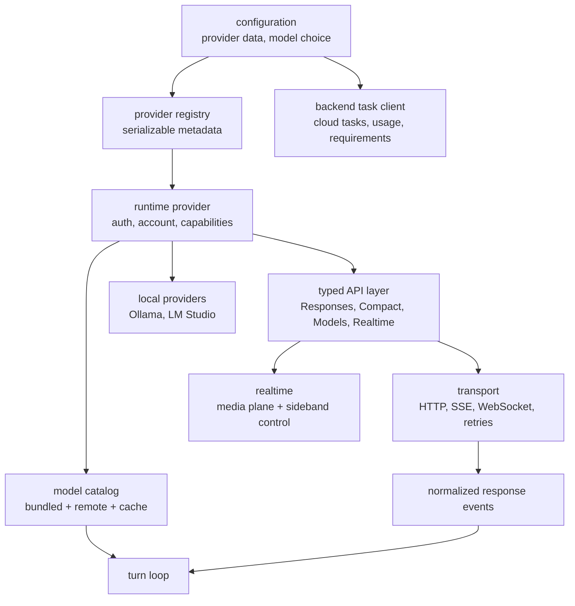
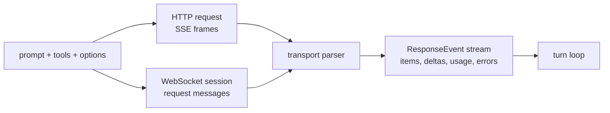
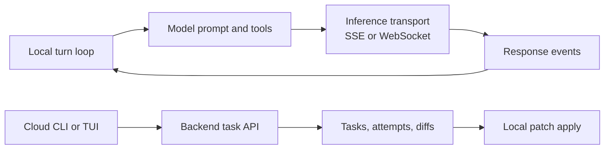

# Chapter 7: Model Providers, Streaming, and Backend Tasks

Chapter 6 followed a turn until it needed to sample the model. This chapter
opens that sampling boundary and explains how Codex separates provider
configuration, runtime provider behavior, typed API calls, streaming
transports, model catalogs, realtime sessions, and backend task workflows.

<div class="chapter-lede">
  <p><strong>Problem:</strong> the turn loop wants one stream of response events, but providers differ in URLs, auth, catalogs, transports, capabilities, and backend task APIs.</p>
  <p><strong>Thesis:</strong> Codex keeps inference as a layered client system and makes transport differences converge before events return to the turn loop.</p>
  <p><strong>Mental model:</strong> providers decide how to talk; the runtime decides what streamed events mean.</p>
</div>

## Five Layers

The provider path is easiest to understand as five layers plus specialized
integrations.



The transport layer owns HTTP details: request bodies, headers, compression,
retry policy, idle timeouts, custom certificates, stream framing, and telemetry
hooks. The typed API layer owns endpoint shapes: Responses, compaction, model
listing, file upload, memory summarization, realtime setup, and WebSocket
sessions. The provider runtime owns account state, auth resolution,
capabilities, model-manager selection, and provider-specific behavior. The
model catalog owns what models are available and which defaults are suitable.

The turn loop should not know how to sign an AWS request, parse SSE bytes, or
merge a remote model overlay. It should receive a typed stream of response
events and enough metadata to make runtime decisions.

This layering is clean, but the source is not frictionless. The typed API has
to tolerate backend-generated models and provider-specific response quirks.
The HTTP layer carries custom certificate, cookie, proxy, and retry behavior
because model calls run in real developer networks. The WebSocket path can
reduce setup overhead, but it does not automatically work for every auth
scheme; body-aware signing is the obvious constraint. The model cache is also
an operational compromise: it improves startup and offline behavior, but model
identity still depends on provider, auth, visibility, and refresh policy.

## Provider Data Is Not Provider Behavior

Codex stores provider definitions as data: display name, base URL, wire API,
auth fields, optional headers, query parameters, retry settings, stream
settings, WebSocket support, and provider-specific auth metadata. That data is
serializable and can come from built-ins or user configuration.

Runtime provider behavior is a separate layer. It resolves the current auth
value, exposes account state, declares capabilities, chooses the model manager,
builds the API provider, and adapts special providers such as body-signing
providers.

This split is a governance choice. A configuration file can describe a provider,
but it should not become executable policy. The runtime provider converts data
into safe behavior at request time.

## One Event Vocabulary, Multiple Transports

The Responses path can travel over HTTP streaming or over a Responses
WebSocket. Those transports have different mechanics, but they converge on the
same runtime event vocabulary before returning to the turn loop.



The WebSocket path can reuse session state and reduce per-turn setup cost. The
HTTP path remains necessary for providers that do not support WebSockets, for
fallback after connection failures, and for auth modes that cannot sign a
WebSocket upgrade. The runtime can retry transient stream failures, refresh
auth where appropriate, and fall back from WebSocket to HTTP-style streaming
without changing the rest of the turn loop.

```text
// Pseudocode - illustrative pattern.
function sample_with_provider(prompt, context):
    provider = resolve_runtime_provider(context.provider_id)
    api = provider.make_typed_api_client()
    transport = choose_transport(provider.capabilities, context.session_state)

    repeat until retry_budget_exhausted:
        request = build_responses_request(prompt, context.model_options)
        signed_request = provider.auth.attach_credentials(request)
        stream = transport.open(signed_request)

        for event in normalize_stream(stream):
            yield event

        if stream.completed:
            return

        if transport.can_fallback_after_failure:
            transport = fallback_transport()
            continue

        backoff_and_retry()

    raise stream_failure
```

The pseudocode shows the boundary: provider and transport differences are
resolved before the turn loop receives events.

## Streaming Events Carry Runtime Decisions

A normalized stream event is more than text. It can contain item creation,
message deltas, reasoning summaries, function-call argument deltas, tool-call
completion, usage snapshots, rate-limit metadata, error classifications, and
response completion. The turn loop uses those events to decide whether to
render progress, dispatch tools, update rate limits, record model-visible
items, compact history, or retry.

The model client therefore acts like a typed event adapter. It does not own the
agent policy. It gives the turn loop structured facts with enough fidelity to
make policy decisions elsewhere.

## Model Metadata Is Runtime Infrastructure

Model metadata is not just a picker list. It shapes context limits,
auto-compaction thresholds, reasoning controls, supported input modalities,
default choices, collaboration modes, visibility, and provider compatibility.

Codex treats model metadata as cache plus overlay. A bundled catalog gives the
runtime a baseline. Eligible providers can refresh remote model lists and
merge overlays into the cache. The model manager can operate online, offline,
or online only when uncached, and it filters model presets based on the current
auth mode and visibility rules.

```text
// Pseudocode - illustrative pattern.
function resolve_model_info(model_name, refresh_strategy):
    bundled = load_bundled_catalog()
    cached = read_model_cache_if_fresh()

    if refresh_strategy.allows_network and cache_is_stale(cached):
        remote, etag = provider_endpoint.list_models()
        cache.write(remote, etag)
    else:
        remote = cached.models

    catalog = merge_catalogs(bundled, remote)
    visible = filter_by_auth_and_visibility(catalog)
    return choose_model_info(visible, model_name)
```

The turn loop consumes the result as runtime fact. It should not care whether
that fact came from bundled data, cache, or a fresh remote overlay.

## Body-Aware Auth Belongs at the Request Boundary

Some providers can use simple bearer-token headers. Others need command-backed
tokens, provider-specific account state, or body-aware request signing. Amazon
Bedrock-style signing is the useful example: the auth layer must see the
prepared request body and canonicalized headers before it can attach valid
credentials.

That requirement explains why Codex keeps auth close to the typed API request
boundary. If signing logic leaked into the turn loop, every sampling path would
inherit provider-specific rules. Instead, the provider's auth implementation
mutates a prepared request, and the transport sends the result.

It also explains a transport constraint: body-aware signing can make WebSocket
support unavailable until the upgrade path has equivalent signing semantics.
The provider can declare that limitation without changing the agent loop.

## Local Providers and Realtime Paths

Local providers such as Ollama or LM Studio fit the same provider model but
have different operational concerns. They may need local availability checks,
model pull progress, compatibility checks, or static catalogs. The runtime
should still see them as providers that produce typed response events.

Realtime is related but not identical to normal inference. It has a media
plane for audio or WebRTC setup and a sideband/control path for session
configuration, text handoff, response creation, and lifecycle events. Codex
keeps realtime state beside the session and maps realtime events back into the
thread event stream, but it should not be confused with the standard turn
sampling path.

## Backend Tasks Are Not Inference

The backend client speaks task, usage, requirements, rate-limit, and cloud
workflow APIs. It can list tasks, fetch task details, create task attempts,
read backend-managed requirements, and retrieve diffs or sibling turns. Those
APIs may share auth and base URL concerns with model providers, but they are
not the Responses stream.



Keeping backend tasks separate prevents a common architecture error: treating
cloud workflow state as another model transport. A cloud task has lifecycle,
environment, attempts, diffs, and apply semantics. A model stream has response
events. They may meet in product flows, but they should not share the same
runtime abstraction.

<div class="apply-this">

## Apply This

1. Keep transport mechanics below a typed event vocabulary so the agent loop consumes one stream shape.
2. Store provider definitions as data, but put account state, auth, and capabilities in runtime provider objects.
3. Treat model metadata as cache-plus-overlay infrastructure, not as a static picker constant.
4. Localize special auth such as body-aware signing at the prepared-request boundary.
5. Keep backend task APIs separate from inference transports, even when they share credentials or hosts.

</div>

## Closing

Chapter 7 shows how the turn loop receives model events without inheriting
every provider detail. Chapter 8 turns from execution to evidence: rollout
persistence, diagnostic trace bundles, reducers, analytics, OTEL, response
debug context, and the principle that Codex observes first and interprets
later.

<div class="source-equivalence">

## Source Map

| Concept | Source anchor |
| --- | --- |
| Model client | [`codex-rs/core/src/client.rs`](https://github.com/openai/codex/blob/569ff6a1c400bd514ff79f5f1050a684dc3afde3/codex-rs/core/src/client.rs#L215) |
| Provider prompt shape | [`codex-rs/core/src/client_common.rs`](https://github.com/openai/codex/blob/569ff6a1c400bd514ff79f5f1050a684dc3afde3/codex-rs/core/src/client_common.rs#L28) |
| Model client session | [`codex-rs/core/src/client.rs`](https://github.com/openai/codex/blob/569ff6a1c400bd514ff79f5f1050a684dc3afde3/codex-rs/core/src/client.rs#L232) |
| WebSocket behavior tests | [`codex-rs/core/tests/suite/agent_websocket.rs`](https://github.com/openai/codex/blob/569ff6a1c400bd514ff79f5f1050a684dc3afde3/codex-rs/core/tests/suite/agent_websocket.rs#L1) |
| Backend task API contrast | [`codex-rs/cloud-tasks-client/src/api.rs`](https://github.com/openai/codex/blob/569ff6a1c400bd514ff79f5f1050a684dc3afde3/codex-rs/cloud-tasks-client/src/api.rs#L9) |

</div>
