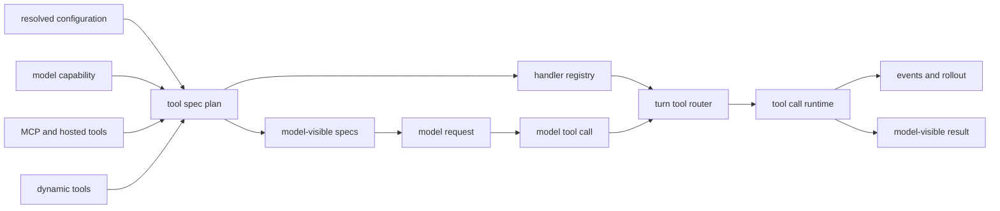

import ToolDispatchMap from "../../src/components/visual/ToolDispatchMap.tsx";

# Chapter 9: Tool Specifications, Routing, and Dispatch

<ToolDispatchMap lang="en" client:visible />

Chapter 8 established that Codex records runtime facts before trying to
interpret them. This chapter moves from observation to action: once the model
asks for a tool, Codex must decide whether that request names a real
capability, which runtime owns it, how much parallelism it can tolerate, and
what result should return to the model and to the durable event stream.

The tool system is easiest to understand as a capability system. A tool
specification advertises a shape the model may call. A handler is the runtime
authority that can perform the work. A router connects the two for a specific
turn. These three ideas must stay separate. If the model-visible schema and the
execution authority collapse into one object, every new tool becomes a
security exception, a UI exception, and a replay exception at the same time.

<div class="chapter-lede">
  <p><strong>You are here:</strong> Part II gave us recorded turns and observable runtime facts.</p>
  <p><strong>Problem:</strong> a model can name a tool, but naming is not authority to execute it.</p>
  <p><strong>Mental model:</strong> safe side effects require five separate steps: exposure, routing, validation, supervision, and observation.</p>
</div>

## The Two Planes

Codex keeps tool metadata and execution behavior on different planes.

| Plane | Question | Examples of data |
| --- | --- | --- |
| Specification | What may the model see? | function schemas, namespace tools, freeform patch tools, hosted tools |
| Registration | Which runtime can handle the call? | shell handler, patch handler, MCP handler, dynamic-tool handler |
| Routing | Which call belongs to which handler now? | tool name, namespace, call id, payload kind |
| Dispatch | How is work supervised? | cancellation, hooks, approval, sandboxing, event emission |
| Output shaping | What goes back into the turn? | function output, custom tool output, failed-call response, events |

The separation is visible in the lifecycle. A session builds a tool registry
from configuration, feature flags, model capability, MCP startup state,
discoverable tools, dynamic tools, and hosted tool availability. The registry
then produces two products: configured specs for internal lookup, and
model-visible specs for the request sent to the model.



This diagram is the core of the chapter: the model receives specifications,
not handlers. The runtime keeps handlers, not just schemas. The router is the
turn-local bridge between them.

## Specification Is Not Authority

A `ToolSpec` is a contract for model syntax. It can describe ordinary
function tools, namespace tools, hosted tools such as search or image
generation, local shell-like tools, and freeform tools such as patch
application. It can also carry compatibility details that help different model
surfaces understand the same capability.

None of that means execution is allowed. The spec says, "this is a call shape
the model may produce." The handler says, "this runtime knows how to execute
that call." Policy says, "this execution is allowed, denied, or must ask."
Those are different claims.

Consider a concrete turn. The model sees a shell-like spec with a schema for
`command`, `cwd`, and optional metadata. That spec only tells the model how to
format a request. When a response item arrives, Codex still has to verify that
the item is really a shell call, that the payload is the shell payload shape
rather than an MCP payload using the same public name, that the call id is
tracked, and that the current turn registered a shell handler. If any of those
checks fails, the correct result is a structured failed tool output, not a
best-effort execution.

```text
// Pseudocode - spec exposure is not execution authority.
spec = expose_to_model("run_command", shell_schema)
handler = registry.register("run_command", ShellHandler)

call = normalize_response_item(model_item)
if call.name != spec.name or call.payload_kind != handler.expected_payload:
    return failed_tool_result(call.id, "unsupported tool payload")

return handler.run_under_policy(call)
```

The same rule protects MCP. A sanitized public MCP name maps back to a server
and raw tool through provenance recorded during discovery. The model never gets
to decide which server receives the call merely by embedding a namespace-looking
string in the response item.

This distinction matters most for tools that are discovered at runtime:

| Tool family | Why it cannot be hardwired |
| --- | --- |
| MCP tools | They arrive from configured or hosted servers and need sanitized names, provenance, and approval metadata. |
| Dynamic tools | They are supplied by clients and may be directly exposed or deferred until the model searches for them. |
| Unavailable tools | The model may refer to a previously known tool; the runtime should return a useful unsupported result. |
| Hosted tools | The provider may execute part of the tool, while Codex still owns the session contract around exposure and events. |
| Code-mode tools | The visible surface may be nested or augmented without changing the underlying handler boundary. |

Codex therefore builds a plan rather than a fixed list. The plan can expose a
tool directly, hide it behind tool search, coalesce namespace tools, augment
descriptions for a mode, or register a handler without showing the handler's
spec as the primary model surface.

## Routing a Tool Call

The model returns response items. Some items are messages. Some are tool
calls. A tool call must be parsed into a normalized runtime form before
dispatch. That normalized form carries a tool name, a call id, and a payload.
The payload kind matters because a plain function call, an MCP call, a
freeform custom call, and a search-tool call are not interchangeable even when
their names look similar.

The router performs four jobs:

1. It resolves the tool name, including namespace identity.
2. It rejects incompatible payload kinds before execution.
3. It answers whether the tool can run in parallel with other calls.
4. It creates optional streamed-argument consumers for tools that can report
   progress before the final call body is complete.

The runtime then wraps dispatch with cancellation and output shaping. If the
user interrupts a turn, the tool result must still become a meaningful
model-visible interruption rather than a vanished task. If a handler fails in
a recoverable way, the model receives a failed tool result. If a handler fails
fatally, the turn can stop with a runtime error.

```text
// Pseudocode - dispatch path.
  plan = build_tool_plan(configuration, model_capabilities, extensions)
  specs = plan.visible_specs_for_model()
  registry = plan.runtime_handlers()

  for each response_item from model:
      if response_item is not a tool call:
          continue

      call = normalize_tool_call(response_item)
      handler = registry.find(call.name)

      if handler is missing or payload_kind_mismatches(call, handler):
          return failed_tool_result(call)

      run_with_cancellation:
          emit_pre_tool_hooks_when_applicable(call)
          result = handler.handle(call)
          emit_post_tool_hooks_when_applicable(call, result)
          persist_events_and_output(call, result)
```

This pseudocode is deliberately generic. The important architecture is not a
particular function body. It is the sequence: normalize, validate, supervise,
execute, shape output, and persist.

## Parallelism Is a Capability

Parallel tool calls are not safe merely because the model can produce them.
Some tools are naturally read-only. Some mutate the workspace. Some depend on a
single process session. Some MCP servers declare their own tolerance. Codex
therefore treats parallelism as part of the configured tool capability.

For ordinary tools, the configured spec can say whether parallel calls are
supported. For MCP, the decision can be per server, because two tools with
similar names may belong to different servers with different concurrency
contracts. For tools without explicit support, the runtime serializes dispatch.

This is not only about correctness. It is about making side effects
attributable. If two mutating calls interleave without a clear concurrency
contract, the rollout can still record events, but the user may not be able to
understand which call caused which change.

## Output Belongs to Two Audiences

Every tool result has two audiences:

| Audience | Needs |
| --- | --- |
| Model | a compact response item that can guide the next reasoning step |
| Runtime clients | structured events, lifecycle status, progress updates, and durable replay facts |

A shell command may stream output to the UI and later return a summary to the
model. A patch may emit progress while arguments stream, ask for approval, and
then return the final application result. An MCP tool may require approval or
elicitation before it can produce the provider's result. These flows are
different, but the runtime normalizes them into one dispatch contract.

That is why tool execution is not a switch statement over tool names. A switch
statement can call functions. It cannot express model exposure, runtime
authority, streamed argument progress, approval hooks, cancellation, parallel
contracts, telemetry, and replay in one coherent boundary.

## Apply This

1. **Separate advertising from authority.** Let schemas tell the model what to call, and let handlers prove what can run.
2. **Build a plan, not a list.** Merge config, model capability, dynamic tools, hosted tools, and MCP state before exposing tools.
3. **Normalize before dispatch.** Convert provider response items into one internal call shape before policy or execution.
4. **Treat parallelism as explicit capability.** Serialize by default unless a handler or server declares safe concurrency.
5. **Shape output for both audiences.** Return compact model results while emitting structured events for users and replay.

Chapter 10 follows the most consequential handler family: shell and filesystem
execution. It shows how command parsing, exec policy, `exec-server`, and
environment selection turn a tool call into a supervised process.

<div class="source-equivalence">

## Source Map

| Concept | Source anchor |
| --- | --- |
| Tool spec planner | [`codex-rs/core/src/tools/spec_plan.rs`](https://github.com/openai/codex/blob/569ff6a1c400bd514ff79f5f1050a684dc3afde3/codex-rs/core/src/tools/spec_plan.rs#L69) |
| Tool router | [`codex-rs/core/src/tools/router.rs`](https://github.com/openai/codex/blob/569ff6a1c400bd514ff79f5f1050a684dc3afde3/codex-rs/core/src/tools/router.rs#L38) |
| Tool registry | [`codex-rs/core/src/tools/registry.rs`](https://github.com/openai/codex/blob/569ff6a1c400bd514ff79f5f1050a684dc3afde3/codex-rs/core/src/tools/registry.rs#L220) |
| Tool orchestrator | [`codex-rs/core/src/tools/orchestrator.rs`](https://github.com/openai/codex/blob/569ff6a1c400bd514ff79f5f1050a684dc3afde3/codex-rs/core/src/tools/orchestrator.rs#L50) |
| Parallel dispatch rules | [`codex-rs/core/src/tools/parallel.rs`](https://github.com/openai/codex/blob/569ff6a1c400bd514ff79f5f1050a684dc3afde3/codex-rs/core/src/tools/parallel.rs#L1) |

</div>
