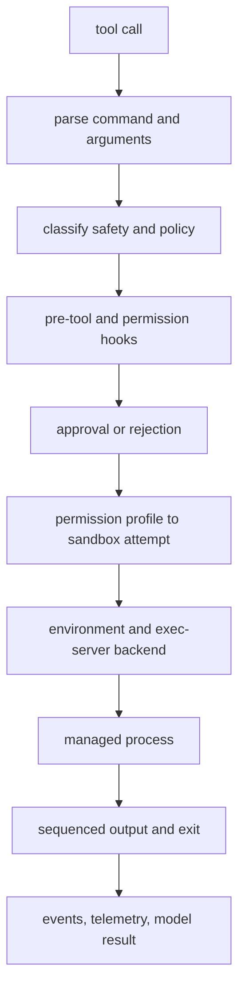

# Chapter 10: Shell, Exec Server, and Filesystem Tools

Chapter 9 separated tool exposure from tool authority. This chapter follows
the handler family that makes the distinction most concrete: shell-like tools.
A shell tool looks simple from the model's point of view, but the runtime must
parse the command, classify risk, apply policy, run hooks, ask for approval
when required, choose an environment, enforce sandbox rules, stream output, and
leave a replayable record.

The key design point is that Codex does not treat "run this command" as a
single primitive. It treats command execution as a pipeline whose final process
may run locally, inside a platform sandbox, or through an `exec-server`
abstraction that can represent a remote executor and its filesystem.


<div class="source-equivalence">

## Source Map

| Concept | Source anchor |
| --- | --- |
| Shell handler | [`codex-rs/core/src/tools/handlers/shell/shell_handler.rs`](https://github.com/openai/codex/blob/569ff6a1c400bd514ff79f5f1050a684dc3afde3/codex-rs/core/src/tools/handlers/shell/shell_handler.rs#L31) |
| Unified exec handler | [`codex-rs/core/src/tools/handlers/unified_exec/exec_command.rs`](https://github.com/openai/codex/blob/569ff6a1c400bd514ff79f5f1050a684dc3afde3/codex-rs/core/src/tools/handlers/unified_exec/exec_command.rs#L48) |
| Exec policy manager | [`codex-rs/core/src/exec_policy.rs`](https://github.com/openai/codex/blob/569ff6a1c400bd514ff79f5f1050a684dc3afde3/codex-rs/core/src/exec_policy.rs#L251) |
| Exec-server RPC client | [`codex-rs/exec-server/src/rpc.rs`](https://github.com/openai/codex/blob/569ff6a1c400bd514ff79f5f1050a684dc3afde3/codex-rs/exec-server/src/rpc.rs#L234) |
| Executor filesystem handler | [`codex-rs/exec-server/src/server/file_system_handler.rs`](https://github.com/openai/codex/blob/569ff6a1c400bd514ff79f5f1050a684dc3afde3/codex-rs/exec-server/src/server/file_system_handler.rs#L38) |

</div>

## Shell Tools Are Front Doors

Codex has several shell-adjacent front doors because clients and model
surfaces do not all want the same interaction shape.

| Front door | Architectural role |
| --- | --- |
| `shell` | classic function-style command execution with workdir, timeout, approval hints, and output capture |
| `local_shell` | host-local command shape used by older or specialized surfaces |
| `shell_command` | shell-aware command surface with backend choices such as direct or shell-escalation paths |
| `exec_command` | unified exec surface that can select an environment and keep process identity for later reads/writes |
| `write_stdin` | continuation tool for a managed process that already exists |

These tools converge on the same responsibility: turn a model request into an
execution request that can be governed. The convergence is important because
command policy, sandboxing, and approval should not depend on which client
surface happened to expose the command.



This is the shell execution chain in one picture. No single box is enough to
make command execution safe or explainable; the safety comes from the order and
the fact that each decision has a structured representation.

## Parsing Before Policy

Shell command text is not a reliable policy boundary. The runtime first tries
to extract the shell and script, lower common shell forms into command tokens,
and identify known-safe read-only patterns. The goal is not to understand every
possible shell program. The goal is to build enough structure to apply policy
without pretending that a raw string is already a decision.

After parsing, Codex consults exec policy. The current policy engine uses
prefix rules, optional host-executable metadata, and explicit decisions such as
allow, prompt, or forbid. It can also represent network-related amendments.
The older policy engine remains for compatibility, but the important
architecture is the same: explicit rules run before fallback heuristics.

| Decision source | What it contributes |
| --- | --- |
| Prefix rules | stable organization policy for known command families |
| Host executable metadata | safer basename matching when an absolute program path is used |
| Known-safe heuristics | conservative defaults for ordinary read-only commands |
| Approval policy | when to ask, retry, or deny |
| Runtime sandbox mode | what the first attempt is allowed to touch |

An allow decision does not always mean "run freely." It may mean "run without
prompt under the current sandbox." A policy can also intentionally bypass the
sandbox, but that is a stronger claim and must be represented explicitly.

## `exec-server` Defines Where Work Happens

`exec-server` is the boundary that keeps execution placement from leaking into
the tool handler. It provides a small JSON-RPC process and filesystem service:
initialize a connection, start a managed process, read output by sequence,
write stdin when supported, terminate a process, and perform filesystem
operations through an executor filesystem interface.

Local execution and remote execution share this shape. A local executor can
spawn processes on the user's machine. A remote executor can register with a
service and reconnect through a rendezvous channel. The tool runtime should
not need to rewrite approval, sandboxing, or output logic merely because the
process lives in a different execution environment.

```text
// Pseudocode - simplified for clarity.
  request = parse_shell_tool_arguments(tool_call)
  command = normalize_shell_command(request.command)
  policy_result = evaluate_exec_policy(command, request.cwd)

  if policy_result is forbidden:
      return rejected_result(policy_result.reason)

  approval_requirement = derive_approval(policy_result, approval_policy)
  sandbox_attempt = choose_initial_sandbox(permission_profile, request)

  if approval_requirement needs a decision:
      decision = ask_hooks_guardian_or_user(request)
      stop_unless_approved(decision)

  environment = select_execution_environment(request.environment_id)
  process = environment.exec_server.start(command, sandbox_attempt)
  stream_output_until_exit(process)
  return shaped_exec_result(process.output, process.exit_status)
```

The pseudocode hides many platform details, but it preserves the governing
shape: parse, policy, approval, sandbox, environment, process, output.

## Filesystem Access Goes Through the Executor

Filesystem mutation is not only a shell concern. Patch application, file reads,
remote workspace operations, and command execution all need a consistent way
to reach the workspace that owns the files. Codex uses executor filesystem
traits so a caller can read, write, create directories, remove paths, or check
metadata without assuming that the files are local.

That abstraction pays off in two ways. First, remote execution can apply a
patch to the remote workspace rather than accidentally editing the client
machine. Second, sandbox context can travel with filesystem operations. The
filesystem API can therefore reject an operation that violates the effective
permission profile instead of leaving every caller to reimplement path checks.

## Output Is Sequenced State

Terminal output is not just a blob. A long-running process may emit chunks,
accept stdin, update terminal state, exit, and later be read again by a client.
The runtime therefore tracks output with sequence cursors. A caller can ask
for chunks after a known sequence number, wait for more output, or learn that
the process has exited.

This matters for replay and UI correctness. A terminal UI, a headless exec
client, and an app-server client can all observe progress without each
inventing a terminal transcript format. The model still receives a compact
tool result, but clients get enough structure to render progress, truncation,
exit status, and failure.

## Environment Is Part of the Contract

Shell execution also depends on environment management: current working
directory, selected environment, explicit environment variables, shell
snapshots, proxy variables, timeouts, TTY mode, and process identity. Codex
keeps these facts in the turn context or selected environment so they are not
guessed at the handler boundary.

The architecture implication is simple: `exec-server` is not merely a helper
binary. It is the runtime abstraction for where work happens, which filesystem
is authoritative, and how process output is sequenced.

## Apply This

1. **Parse before deciding.** Do not apply policy to raw shell text when structured command facts are available.
2. **Run explicit rules before heuristics.** Make organization policy override fallback safety guesses.
3. **Abstract placement.** Put local and remote execution behind the same process and filesystem contract.
4. **Sequence output.** Treat terminal output as ordered state, not a single final string.
5. **Carry environment facts explicitly.** Make cwd, env, timeout, TTY, and selected executor part of the request.

Chapter 11 takes one mutation path out of the shell stream and gives it its
own protocol: patches. That separation is why Codex can review and apply file
edits without reducing them to opaque command text.
