# Chapter 11: Patches as a First-Class Editing Protocol

Chapter 10 showed how shell execution becomes a supervised process. This
chapter separates one common editing path from the shell: patch application.
Codex treats `apply_patch` as a mutation protocol, not as text piped to a
command. The difference is architectural. A protocol can be parsed, verified,
assessed, approved, applied through the right filesystem, and recorded as a
turn diff before the model sees the final result.

Direct file writes are attractive because they are simple. They are also poor
evidence. A direct write says, "make this file contain this content." A patch
says, "perform these additions, deletions, updates, and moves at these paths."
That structure gives the runtime something to inspect before the side effect
happens.

## The Patch Lifecycle

Patch execution has a longer lifecycle than it first appears to have.

```mermaid
flowchart LR
    Input[freeform patch or shell-like invocation] --> Detect[detect apply-patch intent]
    Detect --> Parse[parse patch hunks]
    Parse --> Verify[verify paths and current file content]
    Verify --> Assess[assess safety and required permissions]
    Assess --> Approve[approval and hooks]
    Approve --> Apply[filesystem-backed apply]
    Apply --> Delta[committed delta]
    Delta --> Events[patch events and turn diff]
    Events --> Result[model-visible result]
```



The parse step understands the patch grammar. The verify step consults the
workspace filesystem to compute the concrete changes that would occur. The
assess step decides whether the patch is auto-approved, needs approval, or
requires additional permissions. The apply step writes through the selected
executor filesystem, not through an assumed local path.

## Grammar Is Only the First Gate

The patch grammar describes a small edit language: begin the patch, declare one
or more file hunks, add/delete/update/move content, then end the patch. Codex's
parser can be more forgiving than the human-facing form because model output is
not always perfectly wrapped. That lenience does not mean the runtime applies
ambiguous edits. It means the runtime tries to recover the intended protocol
and then verifies it against the filesystem.

Verification is the real boundary. For an update, the runtime must know the old
content that the hunk expects to replace. For a delete, it must read the file
that will be removed. For a move, it must reason about both source and
destination paths. If those checks fail, the result is a model-visible
verification failure rather than a best-effort write.

## Intercepting Shell-Like Patches

Models often learn to express patches through shell heredocs. Codex can detect
certain top-level forms such as "run the patch tool with this patch body" or
"change to this relative workdir and then run the patch tool." When that
pattern is recognized, the runtime intercepts it and routes it through the
patch protocol.

This is a compatibility bridge, not an endorsement of editing through shell
text. The runtime can warn the model to use the patch tool directly, but it
still governs the mutation as a patch: parse, verify, compute paths, run
approval, apply through the executor filesystem, emit events, and update the
turn diff.

```text
// Pseudocode - simplified for clarity.
  if tool_call is the patch tool:
      patch_body = tool_call.freeform_input
  else if command_invocation is a recognized patch heredoc:
      patch_body, effective_cwd = extract_patch_body(command_invocation)
  else:
      continue with ordinary shell execution

  action = parse_and_verify_patch(patch_body, effective_cwd, executor_filesystem)
  permissions = compute_required_file_permissions(action.paths)
  decision = assess_patch_safety(action, permissions)

  if decision requires approval:
      approval = request_patch_approval(action.summary)
      stop_unless_approved(approval)

  delta = apply_patch_to_executor_filesystem(action, permissions)
  record_patch_events(action, delta)
  update_turn_diff_tracker(delta)
  return patch_result_for_model(delta)
```

This pseudocode avoids implementation details, but it captures the important
distinction: recognized shell syntax is transformed into a patch action before
mutation.

## Filesystem-Backed Application

Patch application uses an executor filesystem. That detail prevents a subtle
class of bugs. In a local turn, the executor filesystem may be the local
workspace. In a remote turn, it may be the remote environment's filesystem. In
both cases, the patch code receives the same kind of filesystem object and an
optional sandbox context. The edit goes to the workspace that owns the turn.

The application layer also tracks the delta that was actually committed. A
successful add, delete, update, or move becomes a structured delta. If a write
fails after a partial mutation, the runtime preserves the committed prefix and
marks exactness appropriately. That is more honest than pretending that the
operation was either entirely clean or entirely absent.

## Diff Tracking Is Evidence, Not Decoration

The turn diff tracker keeps a net textual diff for committed patch mutations.
It records baselines, current content, rename origins, and invalidation state.
When the tracker can prove the delta, it can render a unified diff without
rereading the workspace. When exactness is lost, it invalidates the diff rather
than presenting a misleading one.

That behavior is a pattern worth copying. A system that cannot prove its
evidence should degrade explicitly. It should not display a confident diff just
because a diff-shaped UI is expected.

## Git Patch Support Is a Separate Path

Codex also has helpers for applying ordinary unified diffs through Git. That
path writes a temporary patch, can preflight with a dry run, invokes Git with
appropriate flags, and parses output into applied, skipped, or conflicted
paths. It is related, but it is not the same as the first-class `apply_patch`
protocol. The important shared idea is preflight: learn what would change
before allowing the mutation to become durable.

## Apply This

1. **Prefer structured edits over opaque writes.** Make paths, operations, and context visible before mutation.
2. **Verify against the filesystem.** Parse success is not enough; confirm the intended old state exists.
3. **Intercept compatibility forms into the protocol.** When shell text clearly means patch, govern it as patch.
4. **Track committed deltas honestly.** Preserve exact evidence and invalidate when exactness is lost.
5. **Apply through the owning filesystem.** Local and remote workspaces must share the same mutation semantics.

Chapter 12 explains the human and automated gates around these mutations:
hooks, approval requests, Guardian review, and the client surfaces that may
interrupt execution while a decision is pending.

<div class="source-equivalence">

## Source Map

| Concept | Source anchor |
| --- | --- |
| Patch tool handler | [`codex-rs/core/src/tools/handlers/apply_patch.rs`](https://github.com/openai/codex/blob/569ff6a1c400bd514ff79f5f1050a684dc3afde3/codex-rs/core/src/tools/handlers/apply_patch.rs#L55) |
| Patch runtime | [`codex-rs/core/src/tools/runtimes/apply_patch.rs`](https://github.com/openai/codex/blob/569ff6a1c400bd514ff79f5f1050a684dc3afde3/codex-rs/core/src/tools/runtimes/apply_patch.rs#L50) |
| Patch grammar parser | [`codex-rs/apply-patch/src/parser.rs`](https://github.com/openai/codex/blob/569ff6a1c400bd514ff79f5f1050a684dc3afde3/codex-rs/apply-patch/src/parser.rs#L126) |
| Patch safety assessment | [`codex-rs/core/src/safety.rs`](https://github.com/openai/codex/blob/569ff6a1c400bd514ff79f5f1050a684dc3afde3/codex-rs/core/src/safety.rs#L33) |
| Turn diff tracker | [`codex-rs/core/src/turn_diff_tracker.rs`](https://github.com/openai/codex/blob/569ff6a1c400bd514ff79f5f1050a684dc3afde3/codex-rs/core/src/turn_diff_tracker.rs#L18) |

</div>
