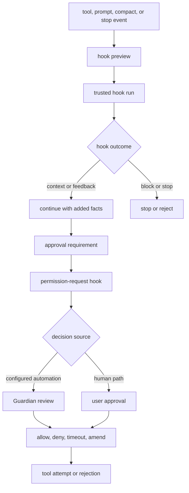
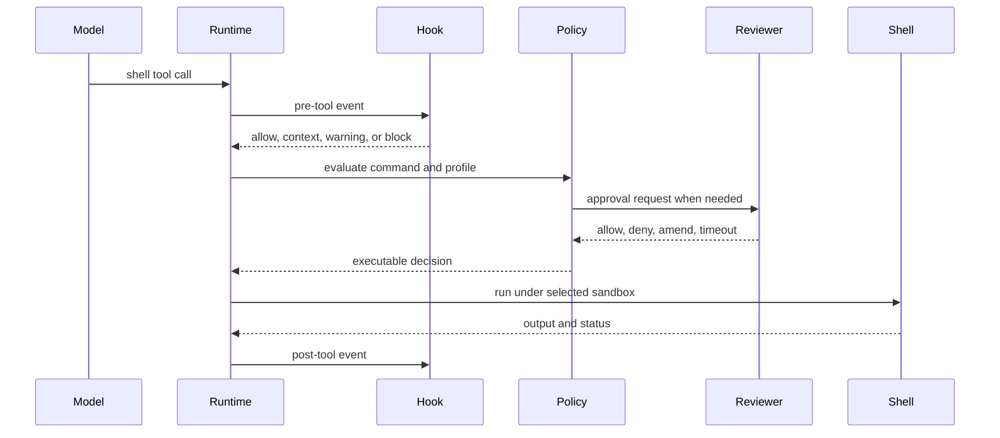

# Chapter 12: Hooks and Human Approval

Chapter 11 showed that filesystem mutation can be parsed and verified before
it is applied. This chapter studies the gates that can still stop, amend, or
explain an action after the runtime understands it: hooks, approval policy,
Guardian review, and user approval. They are related, but they are not the
same layer.

Hooks are configured programs that observe or influence runtime events.
Approval is the control-plane decision that allows or rejects a side effect.
Guardian is an automated reviewer that may answer certain approval requests.
The user interface is the human decision surface. Codex keeps these layers
separate so each can fail in a precise way.


<div class="source-equivalence">

## Source Map

| Concept | Source anchor |
| --- | --- |
| Hook event vocabulary | [`codex-rs/hooks/src/types.rs`](https://github.com/openai/codex/blob/569ff6a1c400bd514ff79f5f1050a684dc3afde3/codex-rs/hooks/src/types.rs#L92) |
| Hook registry | [`codex-rs/hooks/src/registry.rs`](https://github.com/openai/codex/blob/569ff6a1c400bd514ff79f5f1050a684dc3afde3/codex-rs/hooks/src/registry.rs#L47) |
| Prompt hook runtime | [`codex-rs/core/src/hook_runtime.rs`](https://github.com/openai/codex/blob/569ff6a1c400bd514ff79f5f1050a684dc3afde3/codex-rs/core/src/hook_runtime.rs#L321) |
| Guardian review path | [`codex-rs/core/src/guardian/review.rs`](https://github.com/openai/codex/blob/569ff6a1c400bd514ff79f5f1050a684dc3afde3/codex-rs/core/src/guardian/review.rs#L103) |
| Tool orchestrator gates | [`codex-rs/core/src/tools/orchestrator.rs`](https://github.com/openai/codex/blob/569ff6a1c400bd514ff79f5f1050a684dc3afde3/codex-rs/core/src/tools/orchestrator.rs#L50) |

</div>

## The Gate Stack



The stack is ordered, not ornamental. Hooks can add context or block specific
events. Permission-request hooks can answer an approval before the normal
review path. Guardian or the user can decide unresolved approvals. The tool
attempt happens only after the gates produce an allowed decision.

## One Command Through the Gates

The easiest way to see the separation is to follow one shell command. The model
requests a command. Codex first runs matching pre-tool hooks; those hooks can
add context, warn, or block before policy evaluates the side effect. If hooks
do not block, approval policy decides whether this command can run under the
current permission profile. If the policy requires a decision, a
permission-request hook may answer automatically. If it does not, Guardian or
the user-facing client receives a request. Only after an allow decision does
the shell handler reach sandbox selection and process execution. After the
result is available, post-tool hooks can observe output and feed structured
feedback back into the turn.



The point is not the command itself. The point is that each gate owns a
different question: what automation observes, what policy permits, what the
reviewer authorizes, what the sandbox contains, and what result becomes
durable.

## Hook Discovery and Trust

Codex can load hooks from multiple sources: system or managed configuration,
user configuration, project configuration, session flags, plugins, cloud
requirements, and legacy managed files. Each hook has event identity, matcher
state, command text, timeout, source metadata, display order, and trust status.

Trust is not inferred from existence. Managed hooks are trusted by policy.
User or project hooks are trusted only when their normalized identity hash
matches the stored trusted hash. If a hook changes, its status becomes
modified rather than silently continuing as trusted. Disabled hooks remain
visible in listings but do not run.

This design protects two different workflows. Operators can centrally manage
hooks that users should not have to approve one by one. Individual users can
still add hooks, but a changed hook must regain trust before it participates in
the runtime.

## Hook Events and Results

The hook event vocabulary covers more than command execution. It includes
session start, user prompt submit, pre-tool use, permission request, post-tool
use, pre/post compact, and stop. These are architectural checkpoints: before a
tool mutates, after a tool reports output, before context is compressed, when a
turn might stop, and when a prompt enters the runtime.

Hook handlers receive JSON on stdin and return structured JSON on stdout, with
stderr used for feedback in some failure modes. Outcomes are not just success
or failure. A hook can provide additional model context, warn, block, stop,
return feedback, or fail while allowing the operation to continue depending on
the event contract.

```text
// Pseudocode - simplified for clarity.
  handlers = discover_hooks(config_layers, plugins, managed_sources)
  trusted_handlers = filter_enabled_and_trusted(handlers)

  preview = build_hook_run_summaries(trusted_handlers, event)
  emit_hook_started(preview)

  results = run_matching_hooks_with_json_io(trusted_handlers, event)
  emit_hook_completed(results)

  if any result blocks or stops:
      return rejected_or_stopped_result(results.feedback)

  add_context_for_model(results.context)
  continue_to_policy_or_tool_execution()
```

The preview/run split lets clients show that hook work is pending before the
command actually finishes. That matters in terminal UI, app-server, and
headless contexts because a hook can be slow or can block the action.

## Approval Is a Different Gate

Approval begins when policy says a tool needs a decision or when a sandboxed
attempt fails and an unsandboxed retry is possible. The approval payload is
tool-specific: shell approval includes command and cwd, patch approval includes
file changes, MCP approval includes server and tool metadata, and permission
requests include the additional filesystem or network access being requested.

The runtime can cache session approvals by key. Shell-like commands usually
have one approval key. A patch may have one key per affected path so approving
a multi-file patch for the session can also approve later subsets safely.

Approval decisions are richer than yes/no. They may approve once, approve for
session, deny, abort, time out, approve an exec-policy amendment, or approve a
network-policy amendment. The difference matters because an amendment changes
future policy; a one-time approval only authorizes the current action.

## Guardian, Headless Mode, and UI Interruption

Guardian is an automated review path for approval-like requests. When approval
routing selects automated review, the runtime creates a review id separate from
the tool call id and waits for a decision. Denial, timeout, and abort are
distinct outcomes so the user-facing message can say what happened rather than
flattening everything into "failed."

Headless execution cannot rely on an interactive modal. If a request requires
human approval and no human approval channel exists, the safe behavior is to
reject rather than to wait forever. The TUI, by contrast, can interrupt the
normal flow with a modal decision surface and then resume the turn after the
decision arrives.

MCP and dynamic tools add another approval dimension. Their tool metadata may
be hosted, connector-backed, or client supplied. The approval surface must show
the provenance and parameters that matter without leaking raw internal names as
the user-facing trust boundary.

## Apply This

1. **Keep hooks and approvals separate.** Hooks observe or influence events; approval authorizes side effects.
2. **Trust configured code explicitly.** Hash user/project hooks and treat modified hooks as untrusted until accepted.
3. **Preview long-running gates.** Emit pending hook or approval state before clients appear frozen.
4. **Model approval decisions precisely.** Distinguish deny, abort, timeout, one-time approval, session approval, and policy amendment.
5. **Fail closed without an approval channel.** Headless execution should reject interactive approvals it cannot present.

Chapter 13 follows an approved action into the isolation layer. It explains how
permission profiles become filesystem and network policy, then platform
sandboxes, managed networking, and execution metadata.
