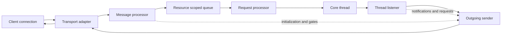
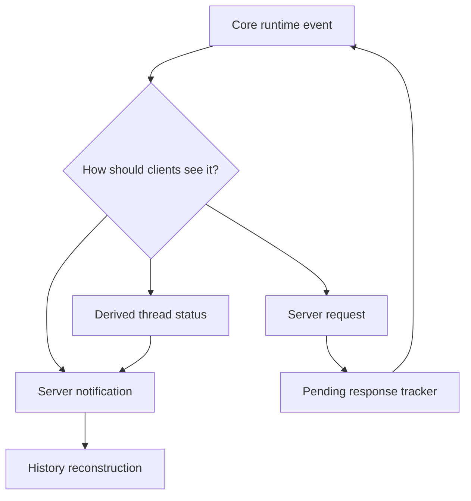

import JsonRpcContractMap from "../../src/components/visual/JsonRpcContractMap.tsx";

# Chapter 14: The App-Server Contract

<JsonRpcContractMap lang="en" client:visible />

Chapter 13 ended at the runtime boundary where permissions, sandbox
selection, and managed networking decide what a tool attempt may touch. This
chapter moves one layer outward. Once the runtime can enforce those decisions,
it needs a contract that lets terminal clients, SDK clients, daemon-managed
clients, and remote clients share the same threads without sharing an
implementation.

The app-server is that contract. It is easy to mistake it for a local web API:
requests come in, responses go out, and state lives somewhere behind the
server. The source architecture is more interesting. The app-server is a small
distributed system running on one machine or across a remote-control bridge. It
normalizes transports, serializes work by resource, converts runtime events
into client-visible items, remembers enough history to let clients rejoin, and
uses server-to-client requests when the runtime needs a human or client
decision.

The most useful mental model is not "HTTP wrapper around core." It is
"protocol boundary around thread ownership." A client does not own the agent
loop. A client owns a connection, capabilities, UI state, and responses to
server requests. The server owns thread lifecycle, turn submission, replay,
status derivation, and the mapping between core events and the public contract.

## Contract Surface

The app-server protocol has five visible shapes.

| Shape | Direction | Role |
| --- | --- | --- |
| Client request | client to server | Ask to initialize, start or resume a thread, begin or interrupt a turn, list capability, read state, or perform a side operation. |
| Client response | server to client | Complete a particular request id with success or failure. |
| Client notification | client to server | Send one-way client facts such as cancellation-adjacent or transport-visible notices that do not expect a response. |
| Server notification | server to client | Broadcast observable thread, turn, item, status, or lifecycle changes. |
| Server request | server to client, then back | Ask the client or user to approve, supply input, refresh auth, run a client-owned tool, or answer an elicitation. |

Those shapes matter because they prevent a common architectural collapse. If a
client only received terminal text, it would have to infer what happened. If a
client only sent commands, the runtime could not ask it for decisions. The
contract is bidirectional because an agent runtime is bidirectional: it
produces observations and sometimes needs fresh authority before continuing.



The diagram hides many concrete request families, but it shows the governing
idea. Incoming bytes are not allowed to reach core directly. They pass through
transport normalization, initialization checks, feature gates, resource
serialization, and request processors. Outgoing data is also not a raw core
event stream. It passes through lifecycle handlers, history builders, pending
request tracking, compatibility filtering, and per-connection send queues.

## Transport Normalization

The app-server can be reached through several transport shapes: standard I/O,
a local socket, a WebSocket-like channel, an in-process client, or a
remote-control stream. The protocol layer should not care which one carried
the message. It wants an incoming message, an outgoing sender, connection
metadata, and a way to detect cancellation or disconnect.

Transport normalization is therefore not cosmetic. It gives the rest of the
server one vocabulary for framing, backpressure, close events, and outbound
queueing. A line on standard I/O and a frame over a socket become the same
kind of incoming event. A response, notification, or server request becomes the
same kind of outbound event. The transport adapter owns mechanics; the message
processor owns meaning.

This separation also explains why local app-server work resembles
distributed-systems work even when all processes are on the same machine. A
client may disconnect. A response may be delayed. A notification may need to be
replayed to a rejoining client. A connection may support experimental methods
that another connection must not see. A slow receiver can create backpressure.
The contract has to make those cases explicit instead of relying on ordinary
function-call assumptions.

## Initialization and Capability Gates

Before a connection can use the runtime, it must establish what kind of client
it is. Initialization records client identity, supported protocol concepts,
and feature capability. After that, request handling can apply two classes of
checks.

The first class is correctness gating: has the connection initialized, is the
method known, is the payload valid, is the referenced thread available, and is
the request legal in the current state. The second class is compatibility
gating: is this method experimental, does this client understand the response
shape, and should a notification be filtered or transformed for this
connection.

The important design point is that capability is connection-scoped while
threads may be shared. A thread can outlive the client that created it. Another
client can resume or observe it later. That means the app-server cannot store
"what the client can understand" only on the thread. It must also remember the
connection's contract and apply it at the boundary.

## Request Serialization

Not every request can run at the same time. A global settings write, a thread
resume, a process operation, and a filesystem watch update can interfere with
different resources. The app-server uses resource-scoped serialization so it
does not have to choose between unsafe concurrency and a single global lock.

| Serialization scope | Why it exists |
| --- | --- |
| Global state | Prevent conflicting updates to shared configuration or account state. |
| Thread | Keep turn starts, resumes, interrupts, and history changes ordered for one thread. |
| Path | Avoid racing filesystem operations that observe or mutate the same location. |
| Process | Keep process lifecycle messages from overtaking each other. |
| OAuth or connector state | Prevent duplicate refreshes or inconsistent external auth transitions. |

This is one of the places where "app-server as API" is too weak a model. An
ordinary API handler often starts work immediately. The app-server first asks:
which resource would this request serialize with? Only then does it call the
processor that performs the operation.

```text
pseudocode: message handling

when a transport message arrives:
    parse the protocol envelope
    find the connection state

    if the connection is not initialized:
        allow only initialization-compatible methods

    verify the method, payload, and capability gates
    compute the serialization key for the request

    enqueue the request behind other work for that key

    when the request reaches the front of its queue:
        call the matching request processor
        send the response when the processor completes
```

The pseudocode is deliberately plain. The architectural fact is the queue
between validation and execution. That queue is where the server turns a set
of concurrent clients into ordered operations over shared runtime state.

## Threads, Turns, and Items

The app-server exposes the runtime through a user-visible model: threads
contain turns; turns produce items; items can be replayed, updated, or
completed. Core may use more detailed internal events, but clients should not
have to understand every internal runtime message. They need a stable contract
for what a conversation is and how it changes.

Thread start is the clearest example. The server loads effective configuration,
validates dynamic tools and permissions, creates or attaches to a core thread,
registers a listener, sends the request response, and broadcasts that the
thread now exists. Turn start is similar but narrower: validate input and
overrides, submit an operation to the core thread, connect the request id to
the resulting turn id, respond with in-progress state, and then let live
notifications carry the rest.

The separation between response and notification is essential. A request
response says the server accepted and started the operation. Notifications say
what the operation is doing over time. This keeps long-running turns from
blocking the whole request processor while still giving clients structured
progress.

Request ids are therefore not bookkeeping trivia. They separate "your request
was accepted" from "the turn has produced another item" and from "the server is
now asking this connection for a decision." Pending server requests carry their
own ids so a later approval, elicitation response, or dynamic-tool result can be
matched back to the blocked runtime work.

## Event Mapping

The core runtime emits events in its own vocabulary. The app-server maps those
events into client-facing notifications and server requests. Some mappings are
direct: a turn starts, an item appears, output grows, a command finishes, a
turn completes. Other mappings are lifecycle decisions: a thread becomes idle,
active, input-pending, or in a system-error state. Still others are
bidirectional: a file change or command approval cannot continue until the
client answers.



This mapping layer is also where the app-server protects clients from internal
churn. The core can add a more detailed event or change its internal rollout
representation without forcing every client to change at the same time. The
public contract should evolve deliberately: new item kinds, new notification
fields, and new server requests must be versioned or gated so clients can
survive the transition.

## Replay and Rejoin

Threads are durable enough that clients can leave and come back. Rejoin is not
just "open the current transcript." The server has to reconstruct the client
view from stored rollout data and then join the live stream without losing or
duplicating events.

The ordering problem is subtle. Suppose a client resumes a thread while a turn
is still streaming. The server must replay committed history, attach the
listener, and then deliver live notifications in an order the client can
render. If replay and live subscription race, the UI might show duplicated
items, miss a pending approval, or report idle while the thread is still
active.

The app-server solves this with listener state and command queues around the
thread. A resume operation can ask the loaded thread for ordered replay and
subscription behavior instead of rebuilding a second model beside it. The
result is event-sourced from runtime facts: loaded state, active turns, pending
approvals, pending user input, system errors, and listener history.

## Server-To-Client Requests

Server requests are the part of the contract that most clearly separates an
agent runtime from a conventional service. The server can ask the client to do
something before the runtime continues.

Common request families include:

| Request family | Client responsibility |
| --- | --- |
| Command or file approval | Present the risk and return an allow, deny, or modified decision. |
| User input | Ask the user for more information when the runtime is waiting. |
| MCP elicitation | Surface a tool server's request for user-provided data. |
| Dynamic tool execution | Run a client-owned tool and return a structured result. |
| Auth refresh or attestation | Complete a client-visible trust or identity step. |

The server tracks these pending requests because they are part of turn state.
A client disconnect cannot be treated as a harmless UI event if the runtime is
waiting for that client to answer. Depending on the request type and policy,
the server may cancel, time out, reassign, replay, or report that the turn is
input-pending.

## Backpressure and Overload

The contract must also say what happens when clients or transports cannot keep
up. Without backpressure, a fast runtime can build unbounded outbound queues,
or a noisy client can flood the processor with work. The app-server treats
overload as a protocol concern, not only as a logging concern.

Ingress backpressure protects request processing. Outbound backpressure
protects each connection. Resource queues protect shared state. Pending server
requests protect bidirectional work from being forgotten. These are mundane
mechanisms, but they define the reliability envelope of the product. A
well-typed notification is not useful if it can be silently dropped during the
state transition it was meant to describe.

## Derived Status

Clients want simple status: loaded, idle, active, waiting for input, waiting
for approval, or failed. The runtime does not store that status as a single
truth field. It is derived from facts: whether the thread is loaded, whether a
turn is active, whether pending server requests exist, whether the listener has
seen an unrecovered system error, and whether the current operation is waiting
for user input.

Derived status is safer than duplicating state. If the server stored an
independent "threadStatus" field and updated it manually, every edge case would
be a chance for drift. Derivation lets the server rebuild status from the same
events and pending-work records that drive replay.

## Trace Ledger

| Question | Chapter 14 answer |
| --- | --- |
| Where is the user request now? | It has crossed a client connection and is represented as a protocol request against shared thread state. |
| What carries it? | Transport events, protocol envelopes, connection capability, resource queues, request processors, thread listeners, and outgoing senders. |
| Who decides next? | The message processor, the resource serializer, the relevant request processor, the core thread, or the client answering a server request. |
| What can fail here? | Initialization mismatch, unsupported capability, malformed payload, resource contention, overload, disconnect, replay race, or unanswered server request. |

## Apply This

1. **Contract before convenience.** Define the stable client-visible shapes before optimizing any one client path.
2. **Serialize by resource.** Use scoped ordering for shared state instead of a single global bottleneck or unsafe parallelism.
3. **Separate acceptance from progress.** Return request acceptance promptly and stream long-running work as notifications.
4. **Make bidirectionality explicit.** Model approval, elicitation, and dynamic tool execution as server requests, not hidden callbacks.
5. **Derive status from facts.** Reconstruct client status from events and pending work instead of maintaining a second transcript model.

## Closing

The app-server contract turns the runtime into a shared platform. It gives
clients a language for creating threads, observing turns, replaying history,
and answering requests without importing the core runtime. Chapter 15 follows
the clients that use this contract: generated SDK models, language-specific
facades, the local daemon, and remote-control streams.

<div class="source-equivalence">

## Source Map

| Concept | Source anchor |
| --- | --- |
| Protocol envelopes and schemas | [`codex-rs/app-server-protocol/src`](https://github.com/openai/codex/tree/569ff6a1c400bd514ff79f5f1050a684dc3afde3/codex-rs/app-server-protocol/src) |
| Transport normalization | [`codex-rs/app-server-transport/src/transport/mod.rs`](https://github.com/openai/codex/blob/569ff6a1c400bd514ff79f5f1050a684dc3afde3/codex-rs/app-server-transport/src/transport/mod.rs#L57) |
| Message processor | [`codex-rs/app-server/src/message_processor.rs`](https://github.com/openai/codex/blob/569ff6a1c400bd514ff79f5f1050a684dc3afde3/codex-rs/app-server/src/message_processor.rs#L272) |
| Request serialization | [`codex-rs/app-server/src/request_serialization.rs`](https://github.com/openai/codex/blob/569ff6a1c400bd514ff79f5f1050a684dc3afde3/codex-rs/app-server/src/request_serialization.rs#L19) |
| Thread state and pending requests | [`codex-rs/app-server/src/thread_state.rs`](https://github.com/openai/codex/blob/569ff6a1c400bd514ff79f5f1050a684dc3afde3/codex-rs/app-server/src/thread_state.rs#L70) |

</div>
