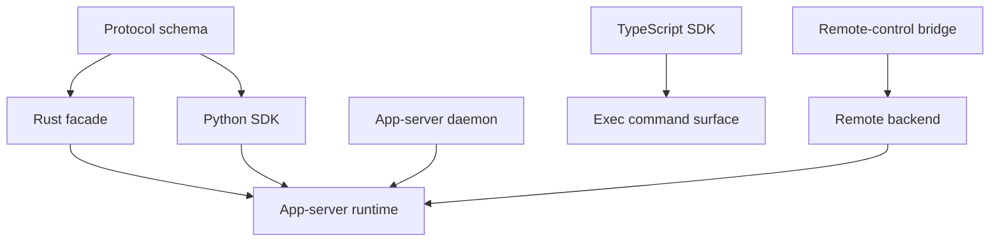
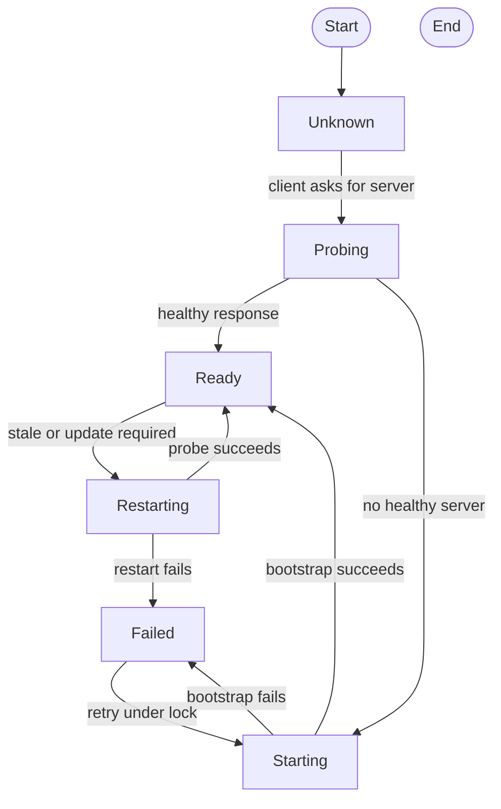
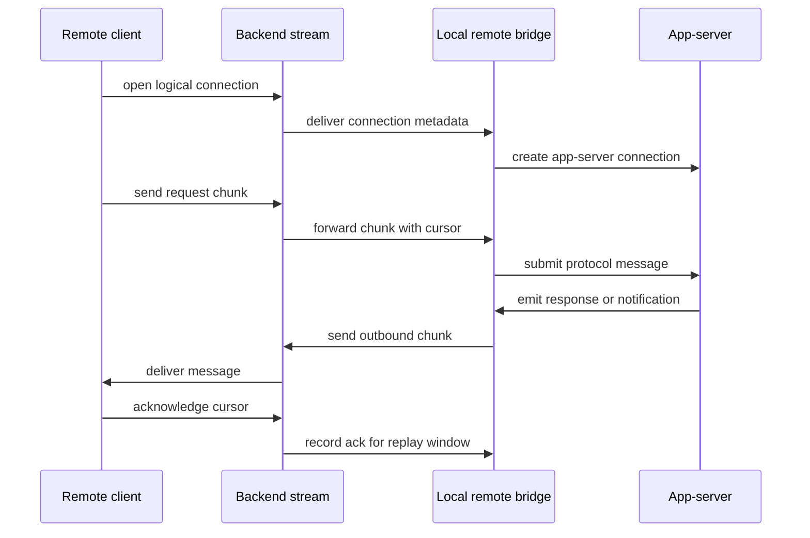

import ClientReachabilityBoard from "../../src/components/visual/ClientReachabilityBoard.tsx";

# Chapter 15: SDKs, Daemons, and Remote Control

<ClientReachabilityBoard lang="en" client:visible />

Chapter 14 described the app-server as the contract around shared thread
ownership. This chapter follows that contract into the clients and supervisors
that make it usable: SDKs that hide protocol mechanics, a daemon that manages
local server lifecycle, transports that preserve message semantics, and
remote-control streams that carry the same runtime model beyond the local
process boundary.

The key distinction is between the protocol and the developer experience built
on top of it. A protocol schema says which messages exist. An SDK says how a
programmer should start a session, route responses, consume turn events, and
answer server requests without becoming a protocol engineer. A daemon says how
the local app-server process is found, started, probed, restarted, and updated.
Remote control says how a backend-mediated client can behave like another
connection without pretending the network is reliable.

## Client Taxonomy

The system has several client shapes, and they are intentionally not the same.

| Client shape | Primary boundary | What it optimizes for |
| --- | --- | --- |
| Rust app-server client | App-server protocol | Internal callers that want a typed facade while preserving protocol semantics. |
| Python SDK | App-server v2 over standard I/O | Programmatic thread and turn control with generated model types and stream routing. |
| TypeScript SDK | `codex exec` JSON event stream | Simple process-driven execution rather than full app-server protocol control. |
| Daemon-managed client | Local app-server process | Stable local lifecycle, probing, pid files, locks, restart, and update behavior. |
| Remote-control client | Backend-mediated stream | Remote access to app-server sessions with reconnect, cursor, and replay behavior. |

This taxonomy prevents a misleading sentence such as "the SDK calls the
app-server." Some SDKs do. Some intentionally wrap a different command surface.
Some clients run in-process. Some reach the server through a daemon-managed
socket. The architecture is coherent because each client still respects a
clear boundary.



The diagram is deliberately asymmetric. The Python SDK and Rust facade are
protocol clients. The TypeScript SDK is a process/event-stream client. The
daemon is not a user-facing language SDK at all; it is a lifecycle manager.
Remote control is a transport bridge with protocol consequences.

## Schema as Source of Contract

The app-server protocol types generate schema artifacts so clients can agree
on message shapes without copying handwritten definitions. This matters most
when the contract evolves. A field added to a notification, a new server
request variant, or an experimental method should be reflected in generated
contracts and compatibility filters rather than discovered by a client at
runtime.

Schemas do not eliminate judgment. The server still has to decide which
features are stable, which are experimental, which are connection-gated, and
which older clients need special handling. But generated contracts reduce the
surface area where drift can hide. They make the question concrete: is the
client out of date, or is the server sending a shape outside the declared
contract?

## The Rust Facade

The Rust app-server client is closest to the protocol. Its job is not to
invent a new abstraction over threads and turns. Its job is to make protocol
use reliable from Rust code: send requests, await responses, consume
notifications, and preserve the semantics of server requests.

That is a useful design restraint. Internal clients can be tempted to bypass
the protocol because they live in the same repository or even the same
process. The facade keeps the boundary honest. If a Rust caller observes a
thread, starts a turn, or answers an approval, it should do so through the
same conceptual contract external clients rely on.

## The Python SDK

The Python SDK is a fuller app-server client. It launches or connects to an
app-server process over standard I/O, uses generated model types, and exposes
developer-facing methods for session control. Its most important internal
problem is stream routing.

Standard I/O gives the SDK one incoming stream. Responses to requests,
notifications about active turns, and server requests all arrive through that
stream. If two parts of the SDK tried to read from it directly, they would
race. The SDK therefore uses one reader and routes messages to queues owned by
the waiting request, the turn stream, or the server-request handler.

```text
pseudocode: SDK stream router

start one reader for the process output stream

for each incoming protocol message:
    if it completes a request id:
        deliver it to the waiter for that id
    else if it is a turn notification:
        append it to the stream for the active thread or turn
    else if it asks the client for a decision:
        send it to the server-request handler
    else:
        report an unknown or unsupported message
```

This design is not a Python detail. It is the client-side mirror of the
app-server contract. The server promises typed messages; the SDK must preserve
their ordering and destination without letting concurrent user code steal from
the same stream.

One compatibility caveat deserves explicit mention. Default server-request
handling can be convenient during automation, but approvals are policy-bearing
events. A serious client should choose explicit handlers for command
approval, file-change approval, dynamic tool calls, and elicitation rather
than accidentally accepting behavior that belongs in the application.

## The TypeScript SDK

The TypeScript SDK has a different architectural role. It wraps the execution
command and consumes an experimental JSON event stream. That makes it useful
for scriptable execution flows, but it is not the same thing as a full
app-server protocol client.

This difference is not a flaw. It is a product choice. A process-oriented SDK
can be easier to install, easier to reason about in short-lived jobs, and
less coupled to app-server lifecycle. The cost is that it does not expose the
complete thread-sharing, server-request, replay, and daemon-managed contract
described in Chapter 14. Code that needs those semantics should use a protocol
client. Code that needs "run this task and read structured events" may be
better served by the command wrapper.

## Daemon Lifecycle

The daemon turns app-server startup into an operating concern. It manages pid
files, operation locks, probing, bootstrap, restart, remote-control enrollment,
and update loops. Those words sound mundane until a client tries to connect
while the server is starting, restarting, stale, or already owned by another
process.

The daemon's job is to make the local server discoverable and stable without
letting two supervisors corrupt the same state. Operation locks prevent
overlapping lifecycle actions. Probing distinguishes "server is healthy" from
"pid file exists." Restart behavior gives clients a path out of stale state.
Update behavior lets the product improve the server without making every SDK
invent a process manager.



A daemon is not just a convenience wrapper. It is the component that makes a
long-lived local contract practical for short-lived tools and SDK processes.

## Transport Choices

Different transports exist because different clients need different process
and deployment shapes.

| Transport | Useful when | Architectural concern |
| --- | --- | --- |
| Standard I/O | A client launches the server as a child process. | One reader must route all inbound messages. |
| Local socket with WebSocket-style framing | A daemon or local client connects to an existing server. | Framing and disconnect behavior must match protocol expectations. |
| Local WebSocket | Browser-like or network-capable local clients need framed messages. | Origin, lifecycle, and backpressure become visible. |
| In-process transport | Tests or internal callers need the same contract without a process hop. | It must not bypass protocol semantics. |
| Remote-control stream | A backend connects a remote client to the local app-server. | Reconnect, cursor ack, buffering, and identity are part of correctness. |

The transport layer should make these options boring above the boundary. A
request should not become semantically different because it arrived over a
socket instead of standard I/O. What can differ is latency, lifecycle,
authentication, framing, and failure behavior.

## Remote Control

Remote control extends the app-server contract through a backend-mediated
stream. The local side enrolls with backend identity and installation
metadata. Remote streams are mapped to app-server connection ids. Messages are
chunked, cursors are acknowledged, outbound messages are buffered where
appropriate, and reconnect can replay data the remote client has not yet
acknowledged.



The network makes the hidden assumptions visible. A local socket can often get
away with "if it disconnects, it disconnects." Remote control cannot. It needs
explicit cursor and replay behavior because a remote client may cross network
failures while the local runtime keeps producing notifications.

## Compatibility Costs

The app-server protocol has versioned concepts, but evolution still has
costs. Some v2 behavior remains anchored to v1 initialization ideas. Some
experimental support is checked at runtime and filtered in generated
contracts. Some older clients need response or notification workarounds. Some
threads are shared by connections with different capability levels.

These costs are normal for a living protocol. The lesson is not "avoid
compatibility"; it is "put compatibility at the boundary." A client-version
workaround inside a request processor is easier to remove later than a
workaround spread into core runtime state. A feature gate on a connection is
easier to reason about than a silent failure in an SDK method. A schema drift
check is cheaper than a bug report from a remote client that received an
unknown server request.

## Failure Modes

SDKs and daemons create their own failure surface.

| Failure | Typical symptom | Boundary response |
| --- | --- | --- |
| Process launch failure | SDK cannot start a server. | Report startup failure before any request is assumed accepted. |
| Multiple stdout readers | Responses disappear or reach the wrong waiter. | Use a single reader and route internally. |
| Stale pid file | Client believes a server exists but cannot connect. | Probe health instead of trusting pid state. |
| Experimental mismatch | Client calls a method it does not support. | Gate by capability and return a protocol error. |
| Remote reconnect gap | Client misses notifications after network loss. | Use cursor ack and replay buffered outbound messages. |

The goal is not to hide every failure. The goal is to keep failures located at
the right boundary so the caller can decide whether to retry, restart, ask the
user, or abort.

## Trace Ledger

| Question | Chapter 15 answer |
| --- | --- |
| Where is the user request now? | It may be inside an SDK call, a daemon-managed server connection, an execution wrapper, or a remote-control stream. |
| What carries it? | Generated schema models, SDK queues, process streams, daemon probes, socket frames, remote chunks, cursors, and app-server connection ids. |
| Who decides next? | The SDK router, daemon lifecycle manager, transport adapter, remote bridge, or app-server connection gate. |
| What can fail here? | Launch failure, stale daemon state, stream routing race, unsupported client capability, transport backpressure, lost remote cursor, or replay mismatch. |

## Apply This

1. **Separate protocol from ergonomics.** Let schemas define the contract and SDKs define pleasant, safe usage.
2. **Use one reader per stream.** Route messages internally instead of letting concurrent code compete for protocol bytes.
3. **Supervise lifecycle explicitly.** Treat pid files, probes, locks, restarts, and updates as part of client reliability.
4. **Preserve semantics across transports.** Let transports differ in mechanics, not in the meaning of protocol messages.
5. **Put compatibility at the edge.** Gate experimental and version-sensitive behavior at connection and SDK boundaries.

## Closing

SDKs, daemons, and remote control make the app-server contract reachable from
real programs. They also show that a protocol is not finished when message
types exist. It becomes usable when lifecycle, routing, transport, and
compatibility are engineered as deliberately as the runtime itself. Chapter 16
turns to the most visible client of that contract: the terminal UI.

<div class="source-equivalence">

## Source Map

| Concept | Source anchor |
| --- | --- |
| App-server daemon lifecycle | [`codex-rs/app-server-daemon/src/lib.rs`](https://github.com/openai/codex/blob/569ff6a1c400bd514ff79f5f1050a684dc3afde3/codex-rs/app-server-daemon/src/lib.rs#L34) |
| Remote control mode | [`codex-rs/app-server-daemon/src/lib.rs`](https://github.com/openai/codex/blob/569ff6a1c400bd514ff79f5f1050a684dc3afde3/codex-rs/app-server-daemon/src/lib.rs#L92) |
| Transport modes | [`codex-rs/app-server-transport/src/transport/mod.rs`](https://github.com/openai/codex/blob/569ff6a1c400bd514ff79f5f1050a684dc3afde3/codex-rs/app-server-transport/src/transport/mod.rs#L57) |
| stdio transport | [`codex-rs/app-server-transport/src/transport/stdio.rs`](https://github.com/openai/codex/blob/569ff6a1c400bd514ff79f5f1050a684dc3afde3/codex-rs/app-server-transport/src/transport/stdio.rs#L24) |
| WebSocket transport | [`codex-rs/app-server-transport/src/transport/websocket.rs`](https://github.com/openai/codex/blob/569ff6a1c400bd514ff79f5f1050a684dc3afde3/codex-rs/app-server-transport/src/transport/websocket.rs#L82) |
| Python public API | [`sdk/python/src/codex_app_server/api.py`](https://github.com/openai/codex/blob/569ff6a1c400bd514ff79f5f1050a684dc3afde3/sdk/python/src/codex_app_server/api.py#L72) |
| TypeScript public API | [`sdk/typescript/src/codex.ts`](https://github.com/openai/codex/blob/569ff6a1c400bd514ff79f5f1050a684dc3afde3/sdk/typescript/src/codex.ts#L11) |

</div>
