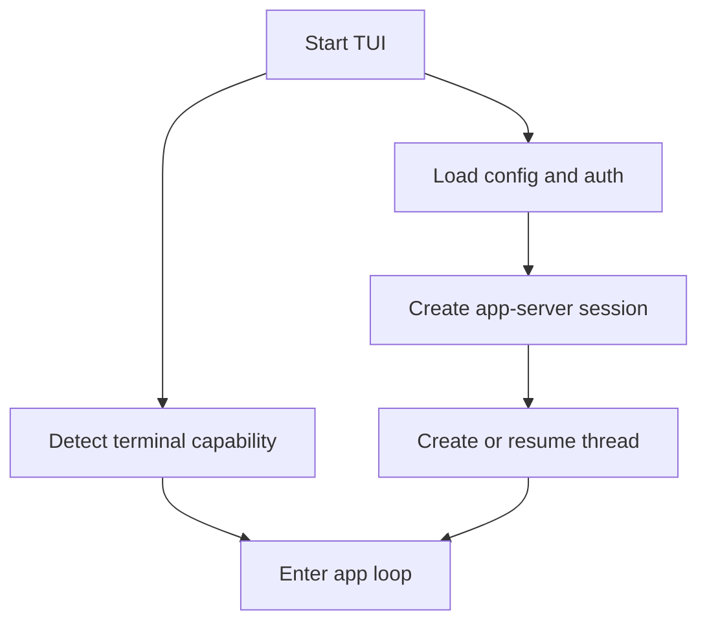
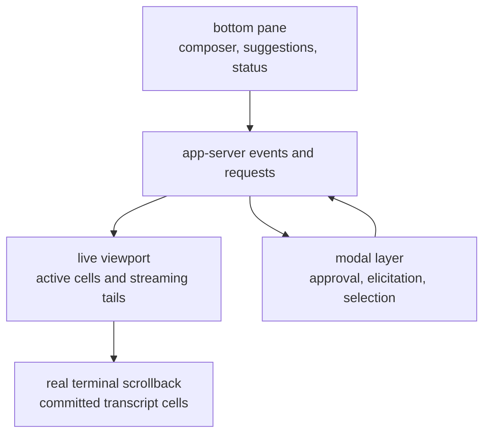
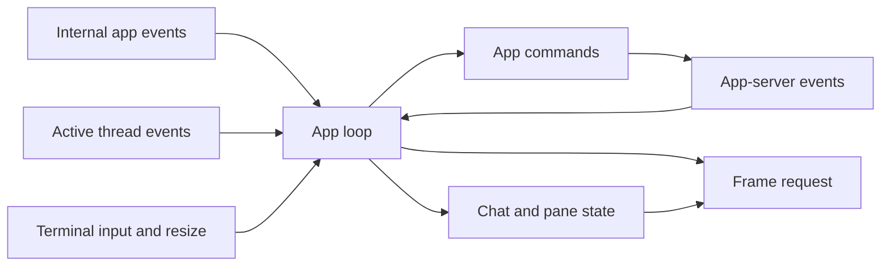
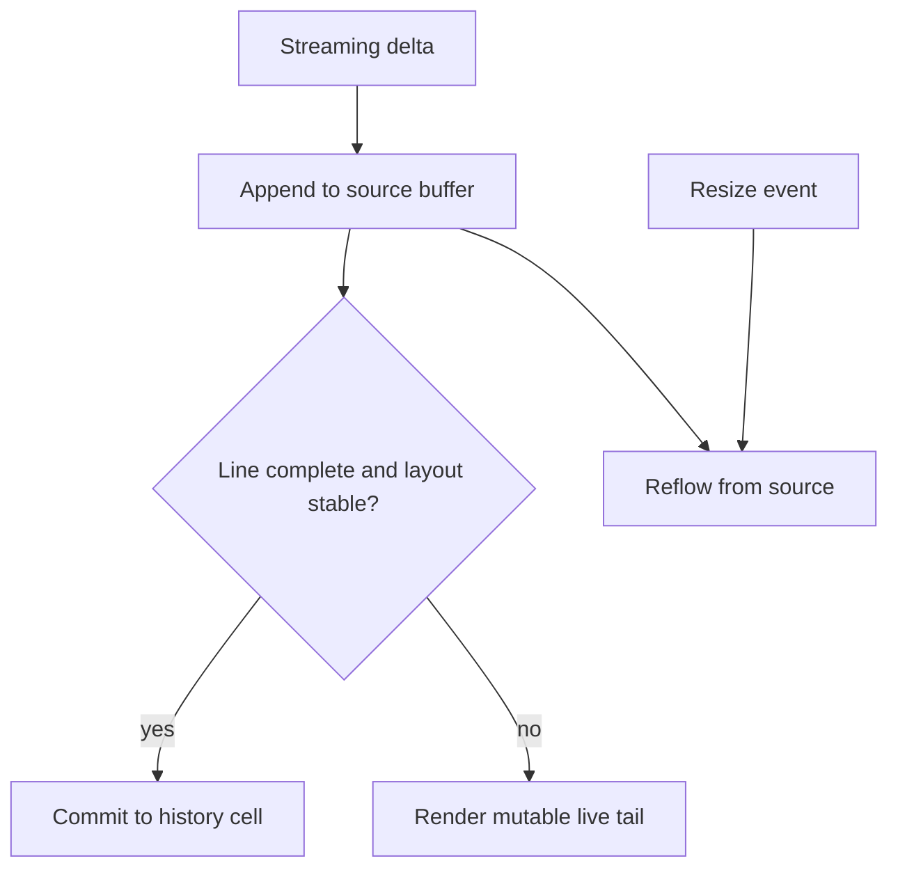

import EventRendererLab from "../../src/components/visual/EventRendererLab.tsx";

# Chapter 16: The TUI as an Event Renderer

<EventRendererLab lang="en" client:visible />

Chapter 15 showed that Codex has more than one client shape: SDKs, daemon connections, execution wrappers, and remote-control streams all reach the runtime through disciplined boundaries. This chapter studies the client most users feel first. The terminal UI is not the runtime. It is an event renderer, input coordinator, and approval surface built on top of the app-server-backed thread model.

That distinction changes how to read the architecture. A conventional terminal application often owns the whole loop: read a key, update state, draw a frame. Codex has that loop, but the state it draws is largely produced elsewhere. The TUI routes user input into app commands, sends those commands to an app-server session, receives protocol notifications and requests, updates chat state, and renders the result inside a live terminal viewport while preserving real scrollback.

## Inline, Not Fullscreen

The TUI is inline by default. It does not behave like a classic fullscreen alternate-screen application that owns every row until exit. It treats terminal scrollback as part of the product. Completed transcript cells can be committed to real scrollback, while active cells, the composer, status, and modal surfaces occupy a live viewport.

This choice has consequences. Rendering cannot assume it can repaint the entire historical screen forever. It must decide what is committed, what is still mutable, and what needs to be redrawn. Resize handling must reflow source-backed content. Streaming markdown must avoid committing text whose layout may change. External-editor flows must release and reacquire terminal event ownership cleanly.

The inline model is harder than a simple fullscreen UI, but it matches the way developers use terminals: they want the conversation to remain in scrollback, copyable, searchable, and interleaved with the rest of their shell work.

## Startup Path

Startup joins three worlds: configuration/auth state, terminal capability, and app-server session state. The TUI loads configuration, determines account and model context, initializes terminal behavior, creates or resumes a thread, and then enters an event loop that multiplexes UI events with runtime events.



Terminal capability is not decorative. Keyboard enhancement, focus behavior, tmux handling, color palette support, desktop notifications, inline viewport behavior, image paste, and clipboard paths can all change what the UI should attempt. The app-server gives the TUI a runtime contract. Terminal detection gives it a physical display contract.

## The Spatial Model

Before reading the event loop, picture the screen as four layers. Real scrollback is already committed and belongs to the terminal. The live viewport contains mutable cells for in-flight work. The bottom pane owns composition and focused transient views. Modal layers interrupt the composer only when a protocol request or UI task needs a decision.



The diagram explains the inline choice. The UI is not repainting a private world. It is deciding which runtime facts are stable enough to commit to the terminal's world and which still need to remain mutable.

## Four Event Sources

Once running, the app loop is a multiplexer. It listens to internal app events, active-thread protocol events, terminal input events, and app-server session events. It then turns them into one of three outcomes: send an app command, mutate transcript or UI state, or schedule a frame.



This event shape is why the TUI is better understood as actor-like than as a single mutable widget tree. The app object owns orchestration. The chat widget owns conversation state. The bottom pane owns input and transient views. Terminal control owns raw mode, resize, buffer diffing, and viewport behavior. Each component is stateful, but they communicate through typed events and commands rather than by reaching through every layer.

## App Commands

The TUI converts user intent into app commands. A submitted prompt, an interrupt, an approval response, a model switch, a file mention, a slash command, or an external-editor completion should not directly mutate runtime state. It becomes a typed command that the app can route.

This keeps UI gestures separate from runtime authority. Pressing a key may move the cursor, open a modal, accept a completion, or submit structured input. Only the last category crosses into app-server state. The command boundary is where the TUI decides whether it is handling presentation or asking the runtime to do work.

```text
pseudocode: TUI event step

for each event selected by the app loop:
    if it is terminal input:
        let the focused component handle the key
        collect any app command it emits

    if it is a protocol notification:
        update chat history, active cells, or status

    if it is a server request:
        enqueue an approval, elicitation, or input prompt
        show the appropriate modal surface

    if an app command is ready:
        send it through the app-server session

    request a frame when visible state changed
```

The pseudocode again avoids implementation detail. The durable idea is that runtime mutations leave the UI through commands, while runtime observations enter the UI through protocol events.

## Chat Widget

The chat widget is the conversation controller. It owns committed history cells, active cells for in-flight work, stream controllers, status surfaces, pending queues, and protocol handling for the active thread. It is not merely a renderer. It decides how events become display units.

The distinction between committed and active cells is central. A committed cell represents transcript content whose source is stable enough to live in history. An active cell represents content still changing: streaming assistant text, command output still growing, an approval waiting for response, or a turn whose status is not final. Keeping those apart lets the UI be both responsive and correct. It can redraw mutable content without rewriting the past.

## Bottom Pane

The bottom pane is where persistent composition and transient interruption meet. The composer holds ordinary user input. Modal views handle approval, elicitation, feedback, selection, file or skill mentions, slash-command completion, and other focused tasks. These modes interrupt the composer without destroying it.

Approval handling shows why this matters. A command approval is not just a line of text in the transcript. It is a pending server request tied to runtime progress. The TUI must present enough context, accept a decision, send the response through the app-server session, and then return the user to the conversation. If the modal were only a visual overlay with no connection to pending protocol state, the runtime could remain blocked after the UI seemed to move on.

## Streaming Markdown

Streaming output is the hardest rendering path. The model may emit partial markdown, and later tokens can change how earlier visible text should wrap or parse. Tables are the clearest example: a later row can change column widths for earlier rows. The TUI therefore separates stable committed source from a mutable live tail.



The rule is conservative: commit only what can be treated as stable source, and leave incomplete or layout-sensitive content in the live viewport. That lets scrollback remain readable while still showing fresh output quickly.

## Rich and Raw Rendering

The TUI needs two render personalities. Rich rendering makes the terminal experience readable: markdown structure, status labels, command cells, diffs, approval prompts, and active progress surfaces. Raw or copy-friendly rendering keeps transcript content usable outside the UI: text should be selectable, logs should remain comprehensible, and committed scrollback should not depend on hidden widget state.

This is another reason source-backed rendering matters. If history cells keep their original source where possible, resize reflow and copy behavior can be derived from content rather than from a stale screen buffer. A terminal UI that stores only painted rows will eventually lose to resize, wrapping, selection, and transcript reconstruction.

## Terminal Control

The terminal layer owns mechanics that application logic should not know in detail: raw mode, keyboard enhancement, event streams, resize notifications, inline viewport size, buffer diffing, and terminal restoration. Codex also has support crates for ANSI conversion, terminal detection, feedback capture, debugging, cancellation helpers, and code-mode execution. These are not side quests. They keep external-interface complexity out of the chat controller.

One concrete example is external editor use. While an editor owns the terminal, the TUI cannot keep assuming it owns standard input events. The event stream may need to be dropped and recreated around the editor flow. That kind of terminal ownership problem belongs in the terminal substrate, not in the logic that maps a turn notification into a history cell.

## Code Mode and Nested Work

Code mode adds another event-rendering challenge. A JavaScript runtime can execute code, preserve host-managed session state, wait on long-running work, and route nested tool calls through host callbacks. From the TUI's point of view, these are still events, commands, statuses, and renderable cells. The UI should not become the owner of the execution engine. It should show the state, send the user's decisions, and keep the transcript coherent.

That is the recurring architecture of this chapter: specialized subsystems may be complex, but their interaction with the TUI is mediated through events, commands, cells, and modal state.

## Trace Ledger

| Question | Chapter 16 answer |
| --- | --- |
| Where is the user request now? | It is either being composed in the bottom pane, represented as an app command, or reflected back as protocol events in the chat surface. |
| What carries it? | App events, app commands, app-server session messages, chat cells, stream controllers, modal queues, and terminal frame requests. |
| Who decides next? | The focused UI component, chat widget, app orchestrator, app-server session, or user responding to an approval or elicitation modal. |
| What can fail here? | Lost terminal ownership, resize mismatch, duplicated replay, blocked approval, malformed streaming markdown, stale active cell, or scrollback/render drift. |

## Apply This

1. **Treat UI as a client.** Keep runtime authority behind protocol commands and events.
2. **Separate active from committed.** Redraw mutable work in the live viewport and commit only stable transcript content.
3. **Render from source.** Preserve content source so resize, copy, and replay can rebuild display instead of trusting painted rows.
4. **Model interruptions explicitly.** Represent approvals, elicitations, and feedback as modal state tied to pending protocol work.
5. **Isolate terminal mechanics.** Keep raw mode, keyboard behavior, viewport control, and buffer diffing below application state.

## Closing

The TUI completes Part IV's argument. The runtime becomes a platform because its clients share a thread model without sharing a UI. The app-server defines the contract, SDKs and daemons make that contract reachable, and the terminal UI proves that a rich interactive surface can still be an event renderer rather than a second runtime. Part V turns from clients to extension points: the protocols and packages that add new capability to the system.

<div class="source-equivalence">

## Source Map

| Concept | Source anchor |
| --- | --- |
| TUI chat widget | [`codex-rs/tui/src/chatwidget.rs`](https://github.com/openai/codex/blob/569ff6a1c400bd514ff79f5f1050a684dc3afde3/codex-rs/tui/src/chatwidget.rs#L658) |
| Bottom pane state | [`codex-rs/tui/src/bottom_pane/mod.rs`](https://github.com/openai/codex/blob/569ff6a1c400bd514ff79f5f1050a684dc3afde3/codex-rs/tui/src/bottom_pane/mod.rs#L199) |
| TUI app-server session | [`codex-rs/tui/src/app_server_session.rs`](https://github.com/openai/codex/blob/569ff6a1c400bd514ff79f5f1050a684dc3afde3/codex-rs/tui/src/app_server_session.rs#L148) |
| App events | [`codex-rs/tui/src/app_event.rs`](https://github.com/openai/codex/blob/569ff6a1c400bd514ff79f5f1050a684dc3afde3/codex-rs/tui/src/app_event.rs#L72) |
| Rendering tests | [`codex-rs/tui/src/chatwidget/tests/exec_flow.rs`](https://github.com/openai/codex/blob/569ff6a1c400bd514ff79f5f1050a684dc3afde3/codex-rs/tui/src/chatwidget/tests/exec_flow.rs#L34) |

</div>
