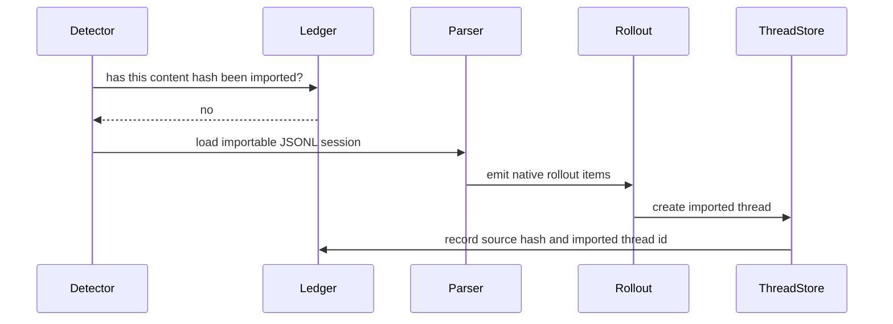

import CompatibilityLaneBoard from "../../src/components/visual/CompatibilityLaneBoard.tsx";

# Chapter 19: External Migration and Backward Compatibility

<CompatibilityLaneBoard lang="en" client:visible />

Chapter 18 separated extension planes into skills, plugins, connectors, and
typed extensions. This chapter asks what happens when users arrive with
existing agent configurations and histories that were not born inside those
planes. Migration is the bridge, and compatibility is the discipline that
keeps the bridge from becoming a pile of special cases.

<div class="chapter-lede">
  <p><strong>You are here:</strong> Codex can load native extension surfaces with explicit trust boundaries.</p>
  <p><strong>Problem:</strong> users bring external configs, commands, hooks, subagents, MCP servers, and JSONL sessions whose semantics do not perfectly match Codex.</p>
  <p><strong>Mental model:</strong> migration is conservative translation into native artifacts plus metadata, not emulation of another agent runtime.</p>
</div>

Backward compatibility in an agent system is not only about accepting old API
fields. It is also about accepting user history, workflow habits, and local
automation without allowing ambiguous behavior to become hidden authority.
Codex treats migration as a controlled import path: read a source artifact,
recognize supported constructs, translate them into Codex-native shapes, skip
unsafe or dynamic cases, and record enough metadata to avoid duplicate work.


The final node matters. A migrated hook should run as a Codex hook. A migrated
command should behave as a Codex skill or workflow unit. An imported session
should become rollout history. The migration layer should not remain in the
turn loop.

## Configuration Migration

External configuration migration handles several artifact families:

| Source artifact | Native destination | Conservative rule |
| --- | --- | --- |
| MCP server entries | Codex MCP configuration | import supported transports and skip disabled or unsupported entries |
| hooks | Codex hook configuration | convert only handlers that match the structured hook model |
| commands | skills or workflow units | require stable metadata and skip dynamic runtime expansion |
| subagents | agent definitions or skill-like instructions | keep only fields Codex can represent safely |

The conservative rule is the architecture. Migration should never guess a
permission boundary. If an external command relies on provider-specific
runtime expansion, the safe behavior is to skip it and report why. If a hook
handler cannot be represented in the Codex hook schema, the safe behavior is
not to smuggle it through as arbitrary shell text. If a target file already
exists, the importer should preserve it rather than overwrite a user's native
configuration.

```text
// Pseudocode - illustrative pattern.
for each source_entry in external_config:
    kind = classify(source_entry)

    if not supported(kind, source_entry):
        report_skip(source_entry, reason)
        continue

    target = compute_native_target(source_entry)
    if target.exists:
        report_preserved(target)
        continue

    native_artifact = convert_to_codex_shape(source_entry)
    write_native_artifact(target, native_artifact)
```

This is compatibility through translation, not compatibility through
unbounded interpretation.

## Session Import

Session import is different from config migration because history is not a
future capability. It is evidence of past conversation. External JSONL
sessions can contain user messages, assistant messages, tool calls, tool
outputs, titles, working directories, token usage, and source-specific records.
Codex has to translate enough of that history into rollout items that its own
thread and history reconstruction can understand.

The import path therefore detects candidate sessions, validates that the
working context still exists, loads only importable records, builds visible
turns, adds import metadata, and records a content-hash ledger. The ledger is
what prevents duplicate imports while still allowing re-detection if the
source content changes.



The design preserves two facts at once: the imported conversation is usable as
Codex history, and it still has provenance as imported history.

## Compatibility Without Semantic Drift

The most dangerous migration bug is not a parse failure. It is a successful
import that changes meaning. Agent systems differ in prompt rules, tool call
formats, hook timing, permission models, command expansion, subagent behavior,
and history schemas. A converter that tries to be too clever can create a
native artifact that looks valid but behaves differently enough to surprise
the user.

Codex avoids that by using three compatibility rules.

First, preserve native user work. Existing target files win over imported
material. Second, skip constructs that require dynamic behavior the native
runtime cannot represent. Third, attach import metadata so later code and
users can distinguish native history from migrated history.

These rules are not glamorous, but they keep migration from becoming a hidden
compatibility mode inside every later subsystem.

## Backward Compatibility Bridges

Migration is one bridge. Protocol compatibility is another. Earlier chapters
introduced generated schemas, legacy aliases, v1/v2 coexistence, experimental
gates, and client-version workarounds. Chapter 19 is where those ideas become
a general policy:

| Compatibility bridge | What it protects | What it should not do |
| --- | --- | --- |
| schema aliases | older clients and stored events | hide incompatible semantics |
| experimental gates | unstable capabilities | make unstable fields look permanent |
| migration converters | user workflows from other tools | emulate another runtime forever |
| import ledgers | idempotent session import | suppress changed source content |
| provenance markers | auditability of imported history | pollute model context with private implementation detail |

The common theme is explicitness. Compatibility code should say what it is
bridging, what it is skipping, and when the bridge ends.

## Designing the Import Report

An import operation should produce a report, even when it succeeds. Users need
to know which MCP servers were imported, which hooks were skipped, which
commands became skills, which existing files were preserved, and which
sessions became threads. Silent migration is attractive in demos and dangerous
in production.

```text
// Pseudocode - illustrative pattern.
report = {
    imported: [],
    preserved: [],
    skipped: [],
    warnings: []
}

for each artifact:
    outcome = migrate(artifact)
    report.add(outcome.category, outcome.summary)

return report
```

The report is also a test oracle. Migration tests should cover edge behavior:
disabled servers, unsupported transports, duplicate command names, missing
metadata, existing targets, invalid ledgers, changed source content, and
unsupported session records.

<div class="trace-ledger">

## Trace Ledger

| Question | Chapter 19 answer |
| --- | --- |
| Where is the user request now? | It can be supported by imported native artifacts and imported rollout history. |
| What carries it? | migration summaries, converted config artifacts, rollout items, import metadata, and content-hash ledgers. |
| Who decides next? | converters, validators, skip rules, target preservation checks, and native runtime loaders after import. |
| What can fail here? | unsupported source semantics, unsafe dynamic expansion, duplicate names, existing target conflicts, invalid JSONL, missing working context, or stale import ledger data. |

</div>

<div class="apply-this">

## Apply This

1. **Lossy import ledger.** Solves migration overpromising -> record skipped, converted, and unsupported fields -> Pitfall: pretending incompatible semantics were preserved.
2. **Native target shapes.** Solves brittle compatibility layers -> translate into Codex-native config, hook, skill, and session shapes -> Pitfall: carrying foreign runtime assumptions forever.
3. **Trust reset.** Solves unsafe imported automation -> require imported hooks and commands to pass Codex trust gates -> Pitfall: inheriting trust from a source system with different rules.
4. **History provenance.** Solves confusing imported transcripts -> mark migrated items as imported history -> Pitfall: blending imported records with locally produced rollout facts.
5. **Compatibility boundary.** Solves old-client breakage -> keep legacy aliases at protocol boundaries -> Pitfall: spreading compatibility branches through core logic.

</div>

## What Comes Next

Part V ends with a runtime that can accept external tools, load extension
packages, and migrate outside history into native contracts. Part VI turns to
coordination beyond one turn: multi-agent threads, cloud tasks, identity, and
memory.

<div class="source-equivalence">

## Source Map

| Concept | Source anchor |
| --- | --- |
| External config model | [`codex-rs/app-server/src/config/external_agent_config.rs`](https://github.com/openai/codex/blob/569ff6a1c400bd514ff79f5f1050a684dc3afde3/codex-rs/app-server/src/config/external_agent_config.rs#L1) |
| Migration request processor | [`codex-rs/app-server/src/request_processors/external_agent_config_processor.rs`](https://github.com/openai/codex/blob/569ff6a1c400bd514ff79f5f1050a684dc3afde3/codex-rs/app-server/src/request_processors/external_agent_config_processor.rs#L1) |
| TUI migration startup | [`codex-rs/tui/src/external_agent_config_migration_startup.rs`](https://github.com/openai/codex/blob/569ff6a1c400bd514ff79f5f1050a684dc3afde3/codex-rs/tui/src/external_agent_config_migration_startup.rs#L1) |
| Protocol compatibility surface | [`codex-rs/app-server-protocol/src/protocol/mod.rs`](https://github.com/openai/codex/blob/569ff6a1c400bd514ff79f5f1050a684dc3afde3/codex-rs/app-server-protocol/src/protocol/mod.rs#L1) |
| Thread store | [`codex-rs/thread-store/src`](https://github.com/openai/codex/tree/569ff6a1c400bd514ff79f5f1050a684dc3afde3/codex-rs/thread-store/src) |

</div>
