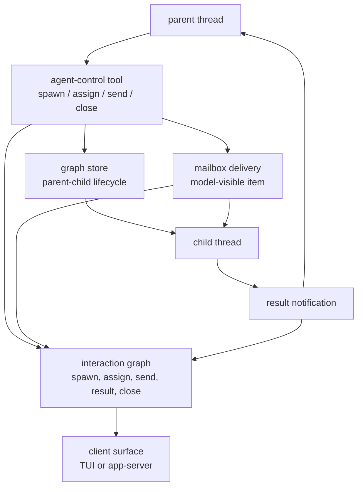
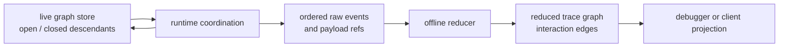

import AgentGraphBoard from "../../src/components/visual/AgentGraphBoard.tsx";

# Chapter 20: Multi-Agent Coordination

<AgentGraphBoard lang="en" client:visible />

Chapter 19 closed Part V by showing how Codex imports outside agent configurations and sessions without pretending that every foreign concept maps cleanly into its own runtime. This chapter turns that compatibility lesson forward: once Codex has a native thread model, coordination between multiple agents is represented as explicit relationships between threads, tools, messages, and results.

The important shift is that "multi-agent" is not a bag of background prompts. It is a graph problem. A parent thread can spawn a child, assign or send work, wait for completion, receive a result, and close the relationship. Each action has a live runtime effect, a client-visible event shape, and a durable trace shape. Codex keeps those concerns separate so a collaboration can be resumed, debugged, and rendered without relying on terminal text or a hidden global scheduler.

## The Coordination Unit Is Still a Thread

A single Codex turn already has enough moving parts: model input, streamed output, tool calls, approvals, hooks, persistence, cancellation, and replay. Multi-agent coordination does not create a second runtime. It creates more threads and records how information moves between them.

That design keeps the system compositional:

- a root interactive session is an agent thread;
- a spawned worker is also an agent thread;
- a delegated task is delivered as model-visible input to a target thread;
- a result travels back as an observable interaction, not as shared mutable
  memory;
- a close operation updates the relationship lifecycle without deleting the
  historical trace.

The parent-child topology is persisted by a narrow graph store. It knows that a child has at most one parent edge, that an edge is open or closed, and that callers may list direct children or descendants. It does not know how a model phrased the task, how a TUI presents the child, or how a trace viewer draws the edge. That narrowness is what lets live runtime code and offline trace code reuse the same idea without sharing accidental UI policy.



This diagram intentionally separates graph persistence from trace reduction. The graph store answers operational questions such as "which descendants are still open?" The trace graph answers explanatory questions such as "which tool call delivered the task that produced this result?"

## Agent-Control Tools Are Coordination Edges

An agent-control tool is not just another function call. It names another thread as a participant in the conversation. That is why Codex treats the main multi-agent actions as relationship-producing events:

| Action | Runtime meaning | Graph meaning |
| --- | --- | --- |
| spawn | create a child thread and deliver initial work | parent has an open child edge |
| assign | send a new task to an existing child | tool edge targets a delivered message |
| send | deliver a communication message | tool edge targets a delivered message |
| wait | observe one or more child statuses | runtime synchronization, not a new child |
| result | report child completion to the parent | child output is linked to parent notice |
| close | end the parent-child relationship | child edge becomes closed |

The "mailbox" term is useful as a mental model. The sender performs a tool call. The receiver eventually sees a message in its own model-visible conversation. Those two observations can happen in either order in the raw event stream. A robust architecture therefore cannot assume that the sender's tool end event and the receiver's input item are adjacent.

Codex handles that by reducing events into interaction edges. An interaction edge has a source anchor, a target anchor, a kind, timing, carried item ids, and raw evidence references. The source may be a tool call. The target may be a conversation item or, in failure cases, a thread. The edge records information flow without claiming that the two endpoints were created at the same time.

## Live Graph Versus Trace Graph

There are two useful graphs, and confusing them creates design mistakes.

The live graph is a compact operational index. It stores directional spawn edges and lifecycle status. It is optimized for questions the runtime needs while work is ongoing: list children, list descendants, filter to open descendants, mark a child closed, and merge persisted topology with live in-memory state in a stable order.

The trace graph is a semantic reconstruction. It is built from raw protocol, runtime, tool, and model-facing events after capture. It is optimized for explanation: which inference produced a tool call, which runtime payload started or ended it, which mailbox item received the message, and which parent notification represented the child result.



The live graph should remain small because it participates in the running system. The trace graph can be richer because it is a replay artifact. This is the same "observe first, interpret later" pattern from Chapter 8, applied to multi-agent coordination.

## Pending Queues Make Races Explicit

The hardest part of the reducer is not recognizing a spawn or send action. The hard part is ordering. The parent may finish a tool call before the child has a model-visible task item. A child may fail before its final assistant message is available. A close operation may name a target that never produced a reduced thread. A result notification may arrive as runtime status rather than normal conversation content.

The reducer handles these cases with a pending queue. It records the intended edge as soon as enough sender-side evidence exists. Later, when a matching recipient-side item is reduced, it materializes the edge with the exact target item. If the target item never appears but the child thread exists, a spawn can fall back to a thread target. If the named target never participated in the trace, the raw payload remains attached to the tool call rather than inventing a false endpoint.

```text
// Pseudocode - illustrative pattern.
procedure reduce_agent_event(event):
    if event starts_agent_tool:
        remember_tool_runtime_payload(event)

    if event ends_spawn_tool and event.created_child_thread:
        pending = edge_from_tool_to_child_message(event)
        queue_or_resolve(pending)

    if event ends_message_tool:
        pending = edge_from_tool_to_mailbox_message(event)
        queue_or_resolve(pending)

    if event observes_child_result:
        pending = edge_from_child_output_to_parent_notice(event)
        queue_or_resolve(pending)

    if event reduces_conversation_item:
        for pending_edge matching item.thread and item.content:
            materialize_edge(pending_edge, target=item)

procedure finish_replay():
    for pending_spawn with existing_child_thread:
        materialize_edge(pending_spawn, target=child_thread)
```

The graph-store and rollout-trace reducers named in the source map implement the concrete version of this queue. The reducer does not force all events into an immediate edge. It waits until the best target is known, then falls back only where the runtime evidence still proves a real relationship.

## Descendant Traversal Is a Policy Choice

Listing descendants sounds mechanical, but it encodes a policy. When a caller asks for open descendants, Codex walks only through open edges. That means a grandchild below a closed child is not returned even if the grandchild's own incoming edge is open. The filter prunes traversal, not merely the final row set.

That behavior matters because "open collaboration tree" is an operational question. If a parent-child edge is closed, the parent should not accidentally recover work below that closed branch as if it were still active. A full audit or trace viewer can still inspect the historical graph with no status filter. Runtime coordination needs the stricter interpretation.

Another subtle choice is that updating the status of a missing child can be a successful no-op. That makes close handling idempotent across races and partial state. A close event can be replayed or received after cleanup without turning the graph store into a source of avoidable errors.

## Collaboration Events Are Product Events

Multi-agent coordination must be visible to clients. Otherwise users cannot understand why a child exists, why a task is still running, or why a result appeared in the parent thread. Codex therefore emits collaboration events in addition to mutating thread state. Those events let clients render child status, mailbox deliveries, result notifications, and close operations without reverse-engineering tool output.

The architectural boundary is:

- runtime tools create or observe coordination effects;
- protocol events describe those effects to clients;
- the graph store preserves current topology;
- rollout trace preserves evidence and reconstructs semantic edges;
- client projections render status and history from structured data.

This prevents the common failure mode where the parent transcript becomes the only record of collaboration. A transcript may be compacted, summarized, or formatted for humans. Coordination needs stronger identity and lifecycle semantics than prose can provide.

## Failure Modes

A multi-agent system fails confusingly when it loses identity. The thread id, agent path, tool call id, model-visible call id, and conversation item id serve different purposes. A child thread's nickname is useful presentation metadata, not identity. A tool call proves that the parent requested an action, but the receiver-side conversation item proves where the message entered the child. A result notification proves delivery to the parent, but not necessarily that the child produced a normal assistant message.

The trace reducer is strict where ambiguity would corrupt the graph. It rejects conflicting pending edges, duplicate model-visible tool relationships, unknown turns where a turn is required, and inconsistent tool-call pairings. It is lenient where the runtime can legitimately race: pending queues, spawn fallback targets, missing close targets, and result edges anchored to a child thread when a final assistant item is unavailable.

That mix is the design lesson. Robust coordination is neither "accept everything" nor "fail on every missing detail." It preserves evidence, creates semantic edges only when justified, and keeps unresolved facts attached to the nearest truthful object.

## Apply This

1. **Thread-as-participant.** Solves subagent invisibility -> model each agent as a thread with identity and lifecycle -> Pitfall: treating subagents as anonymous background tasks.
2. **Graph edges.** Solves coordination replay -> persist spawn, message, wait, close, and resume relationships -> Pitfall: deriving collaboration state only from terminal output.
3. **Bounded delegation.** Solves runaway parallelism -> enforce depth, ownership, and status limits -> Pitfall: making delegation cheaper than thinking about task boundaries.
4. **Result envelopes.** Solves inconsistent child outcomes -> return structured success, failure, and interruption summaries -> Pitfall: flattening child failures into prose.
5. **Parent-visible progress.** Solves hidden work -> surface child events as collaboration events in the parent thread -> Pitfall: flooding the parent with every child implementation detail.

## Closing

Multi-agent Codex is still Codex: threads, turns, tools, events, and replayable state. The new ingredient is the interaction graph that records information flow across thread boundaries. Chapter 21 moves the same principle beyond local threads into cloud tasks, where work may run remotely but must still return as typed task state, signed identity, and locally verified patches.

<div class="source-equivalence">

## Source Map

| Concept | Source anchor |
| --- | --- |
| Graph edge status | [`codex-rs/agent-graph-store/src/types.rs`](https://github.com/openai/codex/blob/569ff6a1c400bd514ff79f5f1050a684dc3afde3/codex-rs/agent-graph-store/src/types.rs#L7) |
| Local graph store | [`codex-rs/agent-graph-store/src/local.rs`](https://github.com/openai/codex/blob/569ff6a1c400bd514ff79f5f1050a684dc3afde3/codex-rs/agent-graph-store/src/local.rs#L13) |
| Agent trace reducer | [`codex-rs/rollout-trace/src/reducer/tool/agents.rs`](https://github.com/openai/codex/blob/569ff6a1c400bd514ff79f5f1050a684dc3afde3/codex-rs/rollout-trace/src/reducer/tool/agents.rs#L1) |
| Session multi-agent integration | [`codex-rs/core/src/session/multi_agents.rs`](https://github.com/openai/codex/blob/569ff6a1c400bd514ff79f5f1050a684dc3afde3/codex-rs/core/src/session/multi_agents.rs#L1) |
| Multi-agent tool handlers | [`codex-rs/core/src/tools/handlers/multi_agents.rs`](https://github.com/openai/codex/blob/569ff6a1c400bd514ff79f5f1050a684dc3afde3/codex-rs/core/src/tools/handlers/multi_agents.rs#L1) |

</div>
