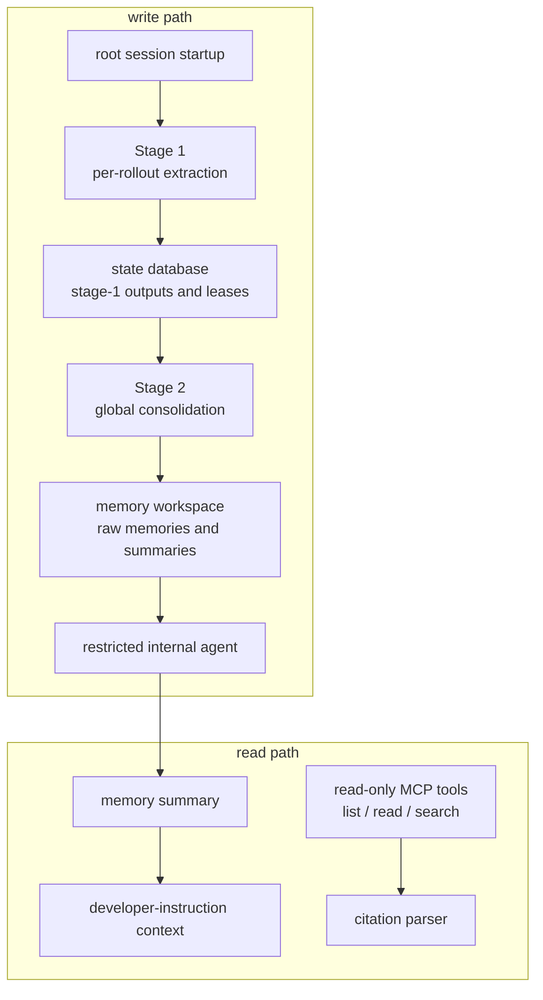
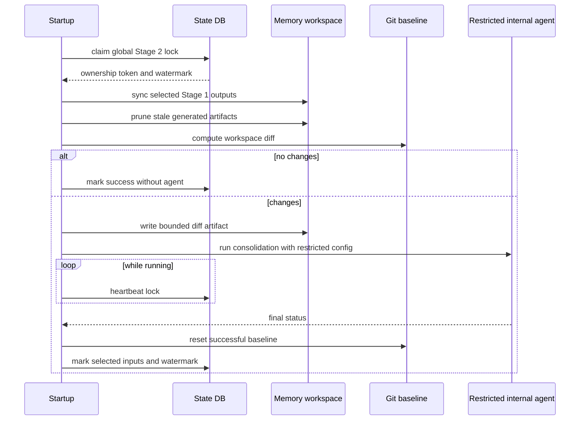

# Chapter 22: Memories and User-Level State

Chapter 21 separated cloud tasks from local turn execution: remote work has its
own task contract, identity layer, and local apply boundary. Memories use the
same architectural discipline. Long-term context is not hidden chat history.
It is a controlled side channel with a read path, a write path, storage rules,
locks, redaction, and a restricted internal agent for consolidation.

This chapter is about why that extra machinery exists. A memory system can make
an agent feel continuous across sessions, but it can also leak stale facts,
overfit to old conversations, or smuggle sensitive content into future prompts.
Codex treats memory as an explicit subsystem so the runtime can benefit from
long-term context without surrendering control of what is read, written, and
cited.

## Memory Has Separate Read and Write Paths

The read path helps the active session use existing memory. It builds
developer-instruction context from a summary file when one exists, parses memory
citations, classifies read usage, and exposes a read-only MCP filesystem
service for listing, reading, and searching memory artifacts.

The write path runs in the background at root-session startup. It scans eligible
past rollouts, extracts structured memory records, stores those records in the
state database, synchronizes selected records into a memory workspace, computes
a workspace diff, and asks a restricted internal agent to consolidate the
artifacts.



The separation prevents a common mistake: letting the active model write its
own future instructions directly. Codex can use models to extract and
consolidate memory, but those models run inside a bounded pipeline rather than
inside the user's ordinary turn.

## Read Path: Useful but Read-Only

The read path has two jobs. First, it can inject a bounded summary into the
active session's developer instructions. That gives the model a compact view of
known long-term context without forcing it to scan a directory. Second, the
MCP memory service lets the model list, read, and search memory files when it
needs more evidence.

The MCP service is deliberately read-only and path-scoped. It rejects parent
directory traversal, absolute paths, hidden components, symlinked files, and
symlinked ancestors. It paginates list and search results, truncates large reads
by token budget, and returns relative paths. These are ordinary filesystem
hardening decisions, but in a memory system they have a second purpose: they
keep "remembering" from turning into arbitrary local file access.

Search is also structured. A request can match any query, require all queries
on the same line, or require all queries within a line window. The response
contains matching content, line numbers, matched queries, pagination, and a
truncation flag. That is a tool contract, not terminal grep output.

## Citations Connect Memory Back to Evidence

Memory needs provenance. Codex parses citation blocks into structured entries
and rollout or thread ids. A citation can point to memory artifact locations and
also to the rollouts that produced the memory. This lets clients and later
runtime logic distinguish "the model used a memory" from "the model mentioned a
fact that happened to be remembered."

The citation system is intentionally narrow. It does not attempt to prove every
sentence. It gives the architecture a hook for connecting memory usage back to
source rollouts and memory files. That is enough to build user-facing evidence,
usage metrics, and future pruning decisions without turning memory into an
unbounded provenance database.


A citation can be thought of as a compact receipt: "this memory artifact came
from these rollout or thread sources and was used in this read path." The
receipt is not model authority. It is runtime accounting. Later selection logic
can prefer memories that are cited and recently useful, and pruning can remove
artifacts that are neither fresh nor used.

## Stage 1 Extracts Per-Rollout Memory

Stage 1 is parallel and bounded. At startup, Codex claims eligible rollout jobs
from the state database. Eligibility depends on session source, age, idle time,
scan limits, claim limits, and lease ownership. That prevents memory extraction
from racing active sessions or duplicating work across concurrent startups.

Each claimed rollout is filtered down to memory-relevant response items. A
model is asked for structured output with a detailed raw memory, a compact
summary, and an optional slug. Codex validates the output shape, redacts
secrets from generated fields, and writes successful outputs back to the state
database. Empty but valid outputs are marked separately from failures. Failures
receive retry backoff instead of hot-looping.

```text
// Pseudocode - illustrative pattern.
procedure stage_one_startup():
    claims = reserve_pending_summaries(
        allowed_sources,
        age_window,
        idle_window,
        scan_limit,
        claim_limit,
        lease_seconds
    )

    run_in_parallel(claims, concurrency_limit):
        items = load_rollout_items(claim.rollout)
        filtered = keep_memory_relevant_items(items)
        output = model_extract_structured_memory(filtered)

        if output is invalid:
            mark_failed_with_retry(claim)
        else if output has no useful memory:
            mark_succeeded_no_output(claim)
        else:
            safe_output = redact_secrets(output)
            store_stage_one_output(claim, safe_output)
```

The model is useful here because memory extraction is semantic. The deterministic
rails around it are equally important: claim leases, schema shape, redaction,
bounded concurrency, retry accounting, and database persistence.

## Stage 2 Consolidates Global Memory

Stage 2 is serialized. It claims a single global lock before touching the
memory workspace. Then it prepares a git-baseline workspace, builds a locked
down configuration for the internal agent, loads selected Stage 1 outputs,
synchronizes raw memory artifacts and rollout summaries, prunes stale generated
resources, and asks git whether the workspace changed.

If there is no diff, Stage 2 can mark success without running a model. If there
is a diff, it writes a bounded workspace-diff artifact, spawns an internal
consolidation agent, heartbeats the global lease while that agent runs, and
resets the workspace baseline only after successful completion.



The git baseline is not for collaboration. It is a deterministic diff engine
for the memory workspace. Stage 2 uses the diff to decide whether consolidation
is needed and to give the internal agent a bounded view of changed artifacts.

## The Internal Agent Is Deliberately Restricted

Stage 2 uses a model-guided agent because consolidation is editorial work:
merge related memories, update summaries, and maintain higher-level memory
artifacts. But that agent is not a normal user-facing session.

Its configuration is constrained:

- it runs in the memory workspace;
- it is ephemeral, so it does not feed itself back into memory generation;
- memory use and memory generation are disabled for that agent;
- apps, plugins, MCP servers, and recursive collaboration features are
  disabled;
- approvals are set so the internal job cannot stop for a user decision;
- filesystem write access is scoped to the memory root;
- network access is disabled.

This is the core safety pattern of the memory system. Codex allows a model to
perform the semantic part, but it removes ambient authority. The internal agent
can edit memory artifacts; it cannot browse the network, call arbitrary tools,
delegate to more agents, or create another memory loop.

## Memory Selection Is Usage-Aware

Stage 2 does not simply consolidate every Stage 1 output forever. It selects a
bounded set. Outputs can age out based on unused time. Items with recorded usage
are ranked by usage count and recency; items without usage can fall back to
generation time so fresh memories are not ignored just because they have not
yet been cited.

Selection affects the workspace. Raw memories are rendered in stable order to
avoid churn. Rollout summary files mirror the selected set. Stale summaries and
old extension resources are pruned so deletions appear in the workspace diff.
Successful consolidation marks the exact Stage 1 snapshots that were consumed.

This design treats memory as state with lifecycle, not as append-only lore. A
memory that is never used can disappear from the active set. A memory that is
used can remain eligible. The system keeps enough accounting to make that
decision outside the model.

## Failure Modes

Memory failures are dangerous when they are silent. Codex therefore chooses
fail-soft behavior for startup integration but explicit accounting inside the
pipeline. If the session is ephemeral, memory is disabled, the session is a
sub-agent, or the state database is unavailable, startup generation is skipped.
If backend rate limits are too low, generation is skipped rather than consuming
scarce tokens. If Stage 1 extraction fails, the job is marked failed with retry
backoff. If Stage 2 cannot hold the global lock, it does not mutate the
workspace.

The read path also fails closed. Invalid paths, hidden paths, symlinks, invalid
cursors, invalid line offsets, empty queries, and non-file reads become tool
errors. The model may receive less memory context, but it should not receive
uncontrolled filesystem access.

The most important failure boundary is feedback. A memory system that
summarizes its own consolidation sessions can amplify mistakes. Codex avoids
that by skipping sub-agent sessions, marking the consolidation agent ephemeral,
and disabling memory features inside that agent.

## Apply This

1. **Memory as side channel.** Solves hidden long-term context -> make memory explicit, inspectable, and separately disabled -> Pitfall: smuggling permanent instructions through chat history.
2. **Read/write split.** Solves self-modifying context -> let active sessions read memory but write through a separate pipeline -> Pitfall: allowing a turn to rewrite its own future prompt directly.
3. **Model-guided extraction rails.** Solves noisy summarization -> wrap extraction in claims, schemas, redaction, leases, and retries -> Pitfall: trusting model output because it is well written.
4. **Serialized consolidation.** Solves racing memory writers -> use a global lock and workspace diff for durable updates -> Pitfall: merging concurrent memory edits optimistically.
5. **Minimum-authority internal agents.** Solves recursive memory amplification -> run consolidation agents with memory disabled and narrow authority -> Pitfall: letting the summarizer learn from its own summaries.

## Closing

Memories complete Part VI's theme. Multi-agent work needed interaction edges;
cloud work needed task contracts and signed identity; long-term context needs
controlled read and write channels. In each case, Codex resists the temptation
to hide state inside prose. Durable architecture comes from naming the state,
recording its boundaries, and making the model operate inside those boundaries.

<div class="source-equivalence">

## Source Map

| Concept | Source anchor |
| --- | --- |
| Memory usage kinds | [`codex-rs/memories/read/src/usage.rs`](https://github.com/openai/codex/blob/569ff6a1c400bd514ff79f5f1050a684dc3afde3/codex-rs/memories/read/src/usage.rs#L8) |
| Citation parser | [`codex-rs/memories/read/src/citations.rs`](https://github.com/openai/codex/blob/569ff6a1c400bd514ff79f5f1050a684dc3afde3/codex-rs/memories/read/src/citations.rs#L1) |
| Read-only MCP memory service | [`codex-rs/memories/mcp/src`](https://github.com/openai/codex/tree/569ff6a1c400bd514ff79f5f1050a684dc3afde3/codex-rs/memories/mcp/src) |
| Stage 1 extraction | [`codex-rs/memories/write/src/phase1.rs`](https://github.com/openai/codex/blob/569ff6a1c400bd514ff79f5f1050a684dc3afde3/codex-rs/memories/write/src/phase1.rs#L1) |
| Stage 2 consolidation | [`codex-rs/memories/write/src/phase2.rs`](https://github.com/openai/codex/blob/569ff6a1c400bd514ff79f5f1050a684dc3afde3/codex-rs/memories/write/src/phase2.rs#L1) |

</div>
