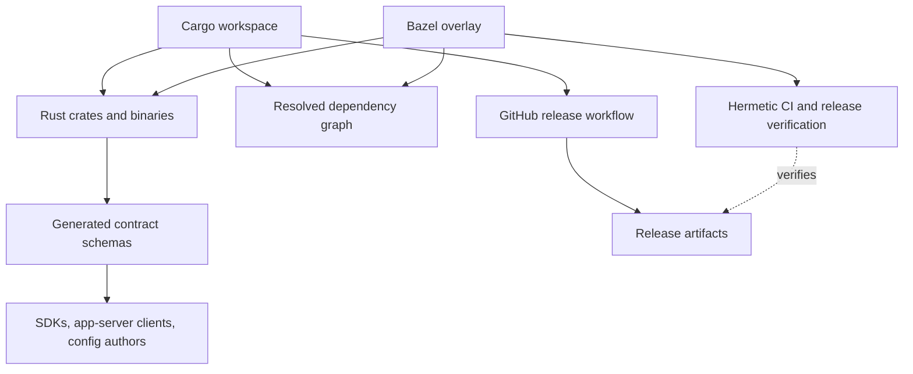
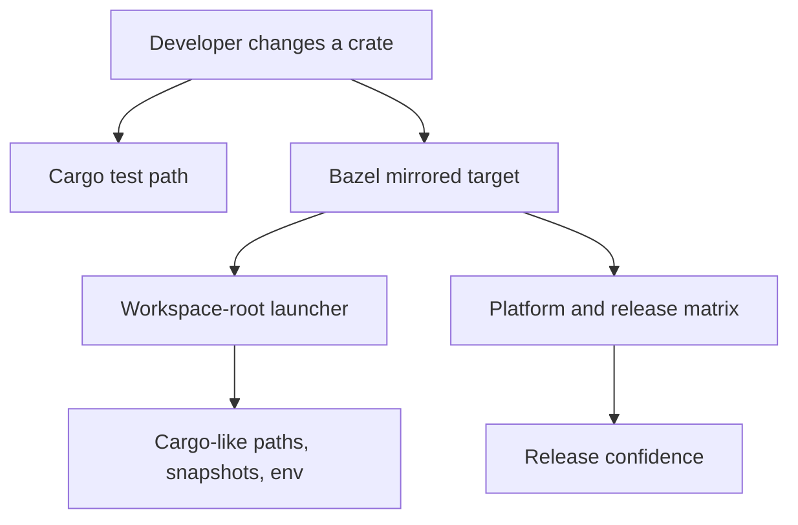
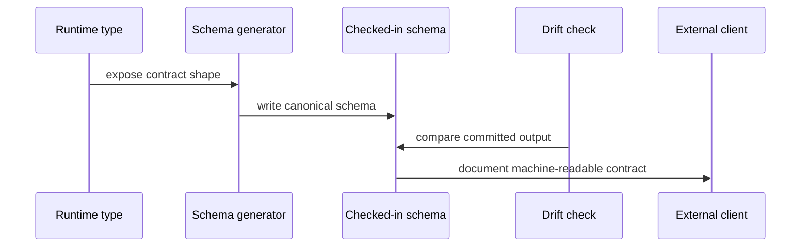

import GeneratedContractDriftViewer from "../../src/components/visual/GeneratedContractDriftViewer.tsx";

# Chapter 23: Build Systems and Generated Contracts

<GeneratedContractDriftViewer lang="en" client:visible />

Chapter 22 ended inside the runtime, where long-term memory is allowed to
change only through read paths, write paths, locks, citations, and restricted
internal agents. Part VII moves that same discipline out to the repository
itself. If the runtime is governed by durable contracts, the source tree needs
machinery that keeps those contracts true after every dependency change,
schema edit, platform port, and release build.

This chapter explains why Codex carries two build views of the same Rust
system, why generated schemas are treated as product contracts, and why test
launchers exist just to make hermetic CI feel like ordinary developer tooling.
By the end, you should see the build as a second protocol layer: Cargo speaks
for local development and the shipping release workflow, Bazel supplies a
hermetic verification overlay, and schema generation speaks for every client
that integrates with Codex without linking the runtime.

## The Problem This Layer Solves

An agent runtime is unusually sensitive to build drift. A normal CLI can often
tolerate a little mismatch between local tests, release packaging, and runtime
configuration. Codex cannot. A schema mismatch can strand an SDK. A platform
build difference can change sandbox behavior. A helper binary that is present
in one build but absent in another can turn a policy guarantee into a product
bug.

The repository therefore makes a deliberate split:

| Layer | Primary audience | Main promise |
| --- | --- | --- |
| Cargo workspace | Product engineers | Fast, idiomatic Rust development using familiar crate boundaries. |
| Bazel overlay | CI and release verification | Hermetic, platform-aware builds over the same crate graph. |
| Generated schemas | External clients | Stable machine-readable contracts for configuration, hooks, and app-server messages. |
| Test launchers | Developers and CI | Cargo-like assumptions even when the test is executed by Bazel. |

The clever part is not "use Bazel." The clever part is that Bazel is not
allowed to become a second product architecture or a fictional release path.
Cargo remains the developer and shipping-build source of truth; Bazel mirrors
and constrains it when the system must prove that packaging, platforms, and
generated contracts still agree.



This diagram is the shape to keep in mind. One source graph feeds two build
interfaces. One runtime graph emits several public contracts. If those outputs
diverge, the architecture has already failed before a user runs a command.

## Cargo as the Developer Source of Truth

Cargo owns the ordinary development loop. It defines the Rust workspace, crate
dependencies, binary targets, features, tests, lint expectations, and lockfile
resolution that a contributor sees during day-to-day work. That is a pragmatic
choice: Rust engineers understand Cargo, IDEs understand Cargo, and most
library-level reasoning happens at the crate boundary.

Codex's crate layout maps closely to the architecture in this book. Protocol,
core runtime, model clients, tool execution, sandboxing, app-server, TUI, SDK
support, cloud tasks, and governance helpers each have a recognizable home.
Cargo lets those crates remain visible as engineering boundaries rather than
hiding them behind one release pipeline.

The trade-off is that Cargo alone is not enough for this product. It does not
fully express the release matrix, remote execution expectations, helper
binary packaging, generated artifact checks, or platform-specific native
dependency story. If Cargo were the only build system, release correctness
would depend on scripts and convention around it. Codex instead keeps Cargo as
the ergonomic front door and puts reproducibility into an overlay.

The concrete source surfaces are deliberately split. Root package files and
the `justfile` coordinate developer commands. `codex-rs/Cargo.toml` owns the
Rust workspace. Root `MODULE.bazel` imports toolchains, Rust crate metadata,
third-party archives, and platform repositories. `codex-rs/BUILD.bazel` and
shared Bazel macros mirror the crate graph, generate tests, and define
release-build verification targets. The public release workflow builds the
shipping artifacts with Cargo, then stages and uploads them. Generated
app-server, config, and hook schemas sit in checked-in schema directories
because external clients depend on them.

## Bazel as a CI and Release-Verification Overlay

Bazel's job is to make architecture harder to accidentally violate. It imports
the Rust dependency graph, defines platform targets, and runs tests in a
controlled environment. The pinned source's public release workflow builds the
shipped CLI artifacts with Cargo, then stages and uploads those artifacts.
Bazel still matters because it verifies release-build assumptions and keeps
platform/native-dependency structure executable in CI. It also encodes the
awkward details that product crates should not need to know: runfile layout,
sharding, snapshot paths, platform toolchains, downloaded native archives, and
hermetic verification targets.

That separation matters. If every product crate had to understand release
platforms, the core runtime would gradually absorb delivery concerns. The code
that decides how a turn executes should not also decide how a Windows helper is
linked or how a Linux release artifact finds a native archive. Bazel keeps that
complexity near the build boundary.

Here is the pattern in simplified form:

```text
// Pseudocode - illustrates the build overlay pattern.
workspace = read_cargo_workspace()
for crate in workspace.product_crates:
    bazel.add_library(crate.name, crate.sources, crate.features)
    bazel.add_tests(crate.name, crate.unit_tests, cargo_like_launcher)

for target in release_platforms:
    bazel.add_release_build_check(target, workspace.cli_binary, native_helpers)
```

The important decision is that the overlay derives from product structure
instead of replacing it. Engineers still reason in crates. CI and release
verification reason in hermetic targets. Shipping release jobs still use Cargo
as the artifact build path, then package and publish the staged outputs.



The launcher box is easy to underestimate. Tests often assume a working
directory, snapshot path, fixture layout, or environment variable. Bazel breaks
those assumptions by design. Codex restores only the assumptions the tests are
supposed to have, so the same test can serve both local development and
hermetic CI without teaching every test about Bazel internals.

## Generated Schemas Are Product APIs

Generated schemas are not build byproducts. They are commitments. Codex uses
typed runtime contracts for configuration, hooks, app-server messages, and
other client-visible surfaces. When those types are generated into checked-in
schemas, the repository turns internal type changes into reviewable product
changes.

This is the build-time version of the protocol discipline from Chapter 4. The
runtime can evolve internally, but client contracts need stable vocabulary.
Generated artifacts make drift visible:



A stale schema is not merely "docs out of date." It is evidence that the code
and contract no longer describe the same product. Codex's build pipeline treats
that as a correctness problem because app-server clients, SDKs, hook authors,
and config generators may all depend on those schemas.

## Deep Dive: Contract Generation Without Source Leakage

A generated schema has to reveal enough for integration without leaking runtime
implementation. That means the generator should speak in product concepts:
fields, discriminants, optionality, stable names, and compatibility markers. It
should not expose private helper structure or force clients to mirror internal
module layout.

```text
// Pseudocode - simplified for clarity.
contract_types = collect_public_contracts(runtime_crates)
schema = []

for contract in contract_types:
    schema.append({
        "name": stable_external_name(contract),
        "shape": exported_fields(contract),
        "compat": compatibility_notes(contract),
    })

write_if_changed("generated-contracts", schema)
```

The point is not the mechanics of serialization. The point is editorial
control over what becomes public. A generated contract can still be curated:
stable names are chosen, experimental fields are gated, and old aliases remain
where compatibility requires them.

## Why the Build Belongs in the Architecture Book

It is tempting to treat build files as peripheral. In Codex, they are where
architecture becomes enforceable. The boundary between TUI and core can be
checked. Schema drift can fail CI. Native dependencies can be quarantined.
Large binary blobs can be rejected. Cargo and Bazel lockfiles can be kept in
sync. Release targets can prove that the runtime still builds under the
platform assumptions the product claims to support.

This makes the build system a governance surface. It is not only answering
"can we compile?" It is answering "did we preserve the contracts that make the
agent safe to embed, extend, ship, and debug?"

## Apply This

1. **Dual-interface build** -> Solves the tension between developer speed and
   release reproducibility -> Keep the ergonomic tool as source of truth and
   derive hermetic targets from it -> Pitfall: letting the overlay become a
   second architecture.
2. **Generated contract files** -> Solves silent API drift -> Commit generated
   schemas when external clients depend on them -> Pitfall: exposing internal
   helper shapes as public vocabulary.
3. **Cargo-like test launchers** -> Solves test portability across build
   systems -> Restore only the path and environment assumptions tests should
   have -> Pitfall: teaching tests to depend on build-system internals.
4. **Delivery quarantine** -> Solves platform complexity bleeding into product
   code -> Keep native dependency and packaging logic at the build boundary ->
   Pitfall: adding platform branches inside core runtime crates.
5. **Build as governance** -> Solves architectural rules that reviews miss ->
   Encode boundary, schema, size, and dependency checks as executable policy ->
   Pitfall: adding noisy checks that developers learn to ignore.

## What Comes Next

The next chapter follows the artifacts that this build system produces. Once
Cargo, Bazel, and generated schemas agree on the product, the release pipeline
still has to turn Cargo-built artifacts and verified assumptions into npm
packages, standalone installers, signed archives, bundled helpers, and
platform-specific native dependencies.

<div class="source-equivalence">

## Source Map

| Concept | Source anchor |
| --- | --- |
| Cargo workspace | [`codex-rs/Cargo.toml`](https://github.com/openai/codex/blob/569ff6a1c400bd514ff79f5f1050a684dc3afde3/codex-rs/Cargo.toml#L1) |
| Bazel module | [`MODULE.bazel`](https://github.com/openai/codex/blob/569ff6a1c400bd514ff79f5f1050a684dc3afde3/MODULE.bazel#L1) |
| Bazel crate macros | [`defs.bzl`](https://github.com/openai/codex/blob/569ff6a1c400bd514ff79f5f1050a684dc3afde3/defs.bzl#L66) |
| Bazel release-build verification | [`.github/workflows/bazel.yml`](https://github.com/openai/codex/blob/569ff6a1c400bd514ff79f5f1050a684dc3afde3/.github/workflows/bazel.yml#L314) |
| App-server schema export | [`codex-rs/app-server-protocol/src/bin/export.rs`](https://github.com/openai/codex/blob/569ff6a1c400bd514ff79f5f1050a684dc3afde3/codex-rs/app-server-protocol/src/bin/export.rs#L1) |

</div>
