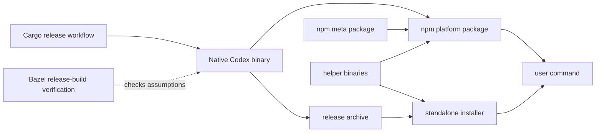
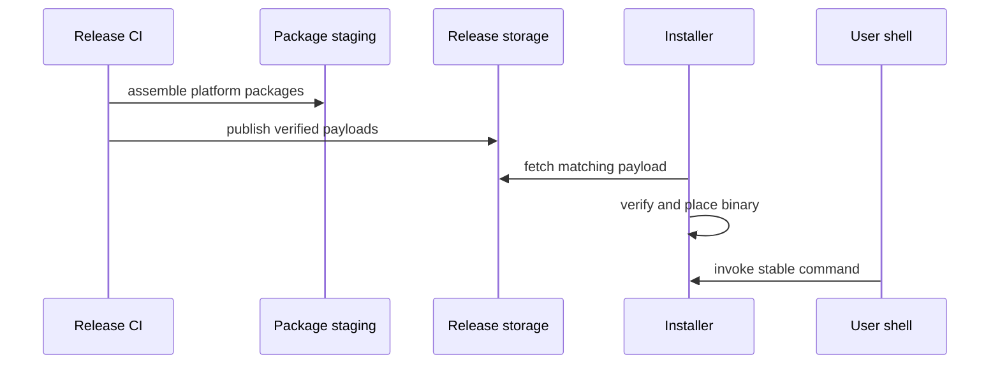
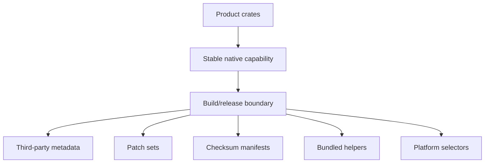

import ReleaseArtifactConveyor from "../../src/components/visual/ReleaseArtifactConveyor.tsx";

# Chapter 24: Packaging, Release, and Native Dependencies

<ReleaseArtifactConveyor lang="en" client:visible />

Chapter 23 treated the build as a contract engine: Cargo preserves the developer and shipping-build model, Bazel proves release-build assumptions, and generated schemas keep external clients synchronized. Packaging is the next pressure point. A build artifact is not yet a product. It still has to survive npm installation, standalone installers, platform-specific helper binaries, signing, checksums, and native dependencies that behave differently across operating systems.

This chapter follows the delivery path from Rust binary to user command. The design lesson is that packaging should absorb platform sprawl without letting that sprawl reshape the runtime. Codex can support many install paths because the product architecture is narrow: a native command, a thin distribution wrapper, optional platform packages, and helper artifacts whose complexity is kept near release infrastructure.

## Delivery Is an Architectural Boundary

The first architectural fact about packaging is that the installed command is not where the agent lives. The JavaScript-facing package is distribution glue. The Rust binary owns the CLI router and runtime. That split appeared in Chapter 2; release infrastructure is where the split pays off.

If npm packaging owned real behavior, every platform package would risk becoming a product fork. If installers owned behavior, standalone distribution would drift from npm distribution. If native helper binaries leaked into core logic, platform differences would infect the turn loop. Codex instead keeps a single runtime center and lets packaging solve acquisition, selection, and verification.



The meta package and installer are different doors into the same house. The user should not be able to infer which door they used by observing runtime semantics.

## NPM Packages as Native Binary Selection

The npm-facing layer has a modest job: expose a familiar installation surface while selecting the correct native payload. It is deliberately thin because the Rust command is the authoritative product. The meta package can depend on platform-specific optional packages, and the installed wrapper can locate the native executable, but neither layer should implement the agent loop.

This pattern is useful because it lets a product participate in JavaScript distribution without rewriting itself as a JavaScript product. It also creates a compatibility responsibility. Platform package names, binary locations, optional dependency behavior, and fallback errors become part of the user experience.

```text
// Pseudocode - illustrates platform package selection.
platform = detect_host_platform()
candidate = optional_package_for(platform)

if candidate.exists():
    run(candidate.binary, user_args)
else:
    explain_missing_native_payload(platform)
```

The wrapper is small, but its failure mode matters. A packaging error should be diagnostic, not mysterious. Users do not care whether failure came from npm optional dependency resolution, a missing archive, or a permission issue. The distribution layer has to translate those problems into actionable product errors.

This is also where DotSlash and helper packages matter. The public package family is not only one binary: it includes platform-specific optional dependencies, selected helper binaries, and release-built tooling used by governance checks. Native packages should make those pieces discoverable without teaching the user which archive, helper, or platform suffix was chosen.

## Standalone Installers Consume Release Artifacts

Standalone installers solve a different problem: users may want Codex without depending on a JavaScript package manager at runtime. That does not mean the installer should invent a second artifact model. A stronger pattern is to let the installer consume the same release payloads that packaging produces, then expose a stable command shim.



This keeps delivery paths coupled at the artifact level rather than forked at the behavior level. The installer owns installation mechanics. It should not own runtime semantics. When that rule holds, npm install and standalone install become operational variants of the same product.

## Native Dependencies Belong in Quarantine

Native dependencies are where release systems often become unmaintainable. Codex has to handle helper binaries, sandbox support, platform-specific linking, and selected vendored or patched dependencies. Some dependencies are ordinary Rust crates. Others need archives, checksums, build scripts, platform conditionals, or compatibility modes.

V8 and Bubblewrap are the useful examples. V8 brings archive selection, checksums, source-built versus release-compatible modes, and platform ABI differences. Bubblewrap is part of the Linux sandbox delivery story and may be provided by the host or by helper packaging. Neither concern belongs in the turn loop; both must be visible to release engineering.

The reusable pattern is quarantine. Native complexity belongs in `third_party`, patch directories, Bazel repository rules, release scripts, and helper package assembly. Product crates should consume a stable capability, not a maze of platform build details.



The design is not free. Quarantine creates a maintenance surface: checksums must be updated, patches must be justified, release assets must be present, and platform selectors must be tested. The benefit is that the maintenance surface is visible and centralized instead of being smeared across runtime code.

## Signing and Checksums as Trust Transfer

Build reproducibility is not enough if users cannot trust the artifact they downloaded. Release packaging therefore adds a trust transfer layer: checksums, signatures, platform signing, and published metadata. These mechanisms do not make the runtime safer by themselves. They preserve the chain between reviewed source, built artifact, distributed package, and installed command.

In an agentic tool, this chain matters more than usual. The installed binary can read files, run commands, request approvals, and interact with remote services. Users need confidence that the binary they received is the one the project intended to ship.

```text
// Pseudocode - simplified release verification.
artifact = build_release_target(platform)
digest = compute_digest(artifact)
signature = sign_digest(digest, release_identity)

publish({
    "artifact": artifact,
    "checksum": digest,
    "signature": signature,
})
```

The exact signing provider is less important than the invariant: every published artifact should be verifiable against a release identity and a reviewed build process.

## Delivery Architecture Protects Product Architecture

The release system has one product obligation: preserve the runtime's contract while adapting it to messy platforms. It should make install paths boring. It should make helper binaries available without forcing users to learn the helper graph. It should make native dependencies reproducible without forcing core engineers to debug archive selection in the turn loop.

That is why packaging deserves its own chapter. It is not just about "how to ship." It is about preventing shipping concerns from changing what was shipped.

## Apply This

1. **Thin distribution wrapper** -> Solves ecosystem-specific installation
   without duplicating runtime behavior -> Keep the native binary authoritative
   and make wrappers select and launch it -> Pitfall: putting product logic in
   the wrapper.
2. **Artifact-level path sharing** -> Solves drift between npm and standalone
   installs -> Let installers consume verified release payloads -> Pitfall:
   building a second installer-only artifact model.
3. **Native dependency quarantine** -> Solves platform complexity leaking into
   core modules -> Centralize patches, checksums, helpers, and selectors ->
   Pitfall: hiding quarantine so well that nobody owns its maintenance.
4. **Diagnostic install failure** -> Solves opaque optional dependency errors
   -> Translate package-resolution failures into platform-aware messages ->
   Pitfall: assuming package managers fail in user-friendly ways.
5. **Trust transfer metadata** -> Solves artifact provenance risk -> Publish
   checksums, signatures, and release metadata with every payload -> Pitfall:
   treating signing as ceremony instead of part of the user trust chain.

## What Comes Next

Build and packaging can create a correct artifact, but they cannot by themselves preserve an architecture over time. The final chapter studies the policy and CI checks that make architectural rules executable: boundary tests, schema drift checks, dependency governance, release lanes, and review-time automation.

<div class="source-equivalence">

## Source Map

| Concept | Source anchor |
| --- | --- |
| npm wrapper package | [`codex-cli/package.json`](https://github.com/openai/codex/blob/569ff6a1c400bd514ff79f5f1050a684dc3afde3/codex-cli/package.json#L1) |
| npm package builder | [`codex-cli/scripts/build_npm_package.py`](https://github.com/openai/codex/blob/569ff6a1c400bd514ff79f5f1050a684dc3afde3/codex-cli/scripts/build_npm_package.py#L1) |
| Native dependency installer | [`codex-cli/scripts/install_native_deps.py`](https://github.com/openai/codex/blob/569ff6a1c400bd514ff79f5f1050a684dc3afde3/codex-cli/scripts/install_native_deps.py#L1) |
| Cargo release build workflow | [`.github/workflows/rust-release.yml`](https://github.com/openai/codex/blob/569ff6a1c400bd514ff79f5f1050a684dc3afde3/.github/workflows/rust-release.yml#L281) |
| Release artifact staging | [`.github/workflows/rust-release.yml`](https://github.com/openai/codex/blob/569ff6a1c400bd514ff79f5f1050a684dc3afde3/.github/workflows/rust-release.yml#L373) |
| npm package staging | [`.github/workflows/rust-release.yml`](https://github.com/openai/codex/blob/569ff6a1c400bd514ff79f5f1050a684dc3afde3/.github/workflows/rust-release.yml#L570) |
| V8 dependency release surface | [`third_party/v8/README.md`](https://github.com/openai/codex/blob/569ff6a1c400bd514ff79f5f1050a684dc3afde3/third_party/v8/README.md#L1) |

</div>
