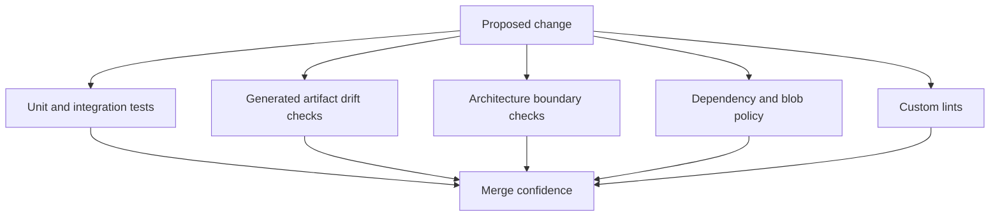
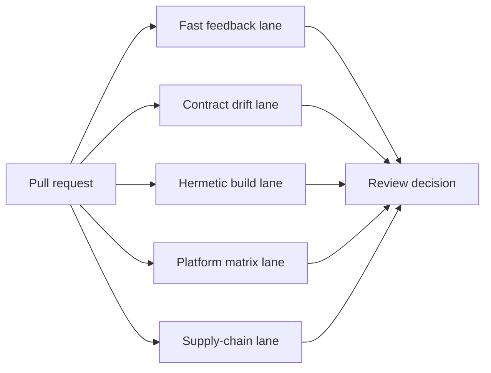
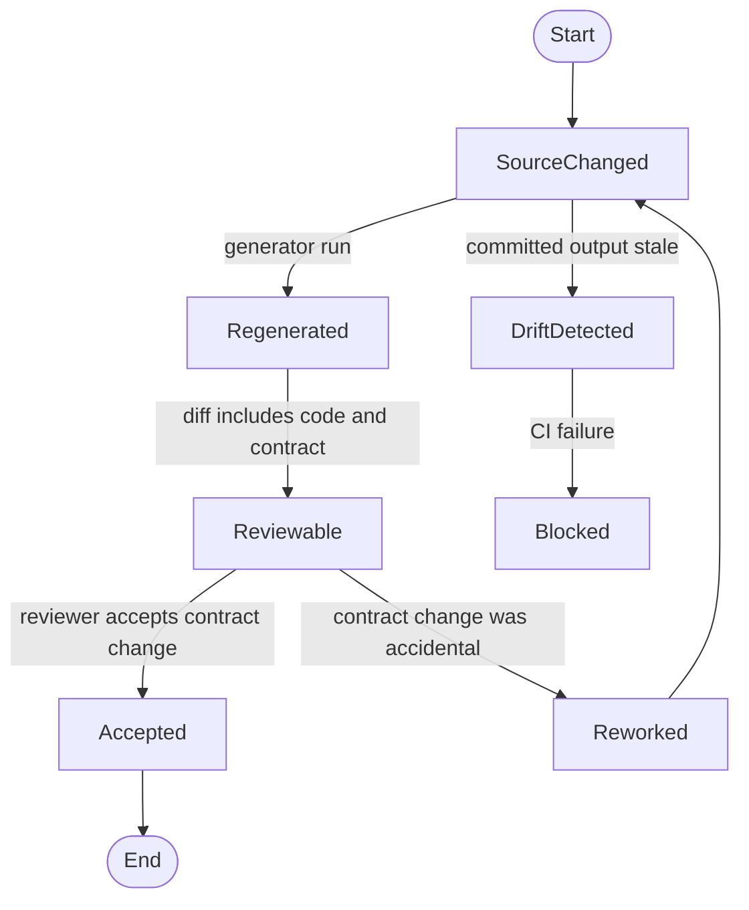

import PolicyLaneDashboard from "../../src/components/visual/PolicyLaneDashboard.tsx";

# Chapter 25: CI, Policy, and Architectural Governance

<PolicyLaneDashboard lang="en" client:visible />

Chapter 24 showed how release packaging keeps platform sprawl from reshaping the runtime. The final system pressure is time. A codebase does not lose its architecture all at once. It loses it through small exceptions: one dependency that should not be reachable from core, one generated schema that was not updated, one binary artifact checked in because it was convenient, one UI crate that reaches around a protocol boundary.

Codex answers many of those pressures with executable governance. CI is not only a test runner. It is a set of architectural assertions written as scripts, linters, generated checks, workflow lanes, and release gates. This chapter explains why those checks belong in the design and how to steal the pattern without turning CI into a slow wall of noise.

## Policy Is Architecture with a Failing Exit Code

Every chapter in this book described a boundary: protocol before clients, policy before tools, app-server before UI surfaces, extension loading before model-visible capability, generated schemas before external clients. A boundary that cannot fail a change is weaker than it looks.

Executable policy turns "please do not violate this boundary" into "this pull request cannot merge until the boundary still holds." That is not bureaucracy. For an agent runtime, it is risk management. The system can run commands, mutate files, call external services, and coordinate remote work. Governance keeps those powers constrained as the repository changes.



The merge confidence node is not a claim that CI proves everything. It proves the rules the project chose to make executable. The art is choosing rules that guard real architecture rather than encoding personal style preferences.

## CI Lanes Match Risk, Not Just Language

Codex's CI surface is split by purpose. There are fast checks for ordinary changes, broader matrices for platform confidence, Bazel paths for hermetic release assumptions, schema and generated-file checks for client contracts, SDK checks for external surfaces, and release workflows for artifact assembly.

This is a risk map. A change to a protocol type has different blast radius from a change to a TUI rendering helper. A change to packaging has different risk from a unit test helper. The CI design should make those differences visible.



The anti-pattern is one undifferentiated "run everything" button. That hides which architectural promise failed and makes engineers treat failures as CI weather. Lanes should explain the kind of trust they provide.

## Boundary Checks Beat Memory

Humans are bad at remembering every architectural rule while reviewing a large change. That is why Codex uses checks for boundaries that would otherwise be easy to erode: generated schema synchronization, dependency policy, large binary blobs, lint synchronization, source formatting, and separation between runtime layers.

Concrete examples make the point sharper. The argument-comment lint protects call-site readability for anonymous literals. The blob-size checker prevents large accidental artifacts unless they are explicitly allowlisted. The TUI/core boundary script prevents the terminal UI from importing the core crate directly and bypassing app-server/client boundaries. Cargo workspace manifest verification keeps lint and dependency expectations aligned across crates. Schema generation checks make client contract drift reviewable instead of silent.

The exact checks matter less than the pattern:

```text
// Pseudocode - illustrates executable architecture policy.
policies = [
    generated_files_are_current,
    client_contracts_are_stable,
    forbidden_dependencies_are_absent,
    binary_blobs_are_justified,
    custom_lints_are_in_sync,
]

for policy in policies:
    result = policy.run(change_set)
    if result.failed:
        report(policy.name, result.explanation)
        stop_merge()
```

The report is part of the design. A policy that only says "failed" trains developers to hunt through logs. A good governance check explains the boundary, the violating file, and the expected repair.

## Deep Dive: Generated Drift as a State Machine

Generated artifacts need especially strict handling because drift can be ambiguous. Did the developer forget to regenerate? Did the generator change? Did the source contract change intentionally? Did an experimental field leak into the stable schema?



The state machine is small, but it changes behavior. A contract change becomes reviewable as a contract change. The repository no longer asks reviewers to infer client impact from internal type diffs.

## Governance Has to Stay Proportional

Executable policy can go wrong. If every preference becomes a hard gate, the project becomes slower without becoming safer. Codex's useful checks are tied to product risk: client compatibility, release reproducibility, runtime boundaries, artifact trust, dependency safety, and generated contract drift.

The standard should be: would this rule protect an architectural promise that a reviewer can plausibly miss? If yes, make it executable. If not, leave it to review norms, local tooling, or documentation.

This proportionality is why governance closes the book. Codex's architecture is not a set of diagrams; it is a collection of rules that survive contact with daily development. The best systems make the important rules cheap to follow and hard to violate accidentally.

## Apply This

1. **Executable architecture policy** -> Solves boundary erosion over time ->
   Turn critical architectural promises into CI checks -> Pitfall: enforcing
   taste instead of risk.
2. **Risk-shaped CI lanes** -> Solves opaque, slow feedback -> Group checks by
   the trust they provide: fast, contract, hermetic, platform, supply chain ->
   Pitfall: one giant lane that nobody understands.
3. **Drift as review artifact** -> Solves hidden client contract changes ->
   Require regenerated schemas and snapshots in the same change -> Pitfall:
   treating generated diffs as noise.
4. **Diagnostic failures** -> Solves policy fatigue -> Make every failure name
   the boundary and the repair path -> Pitfall: forcing developers to reverse
   engineer governance scripts.
5. **Proportional enforcement** -> Solves governance bloat -> Gate rules that
   protect compatibility, safety, or release correctness -> Pitfall: hard
   failing low-value preferences.

## What Comes Next

The book now has all of its machinery: contracts, runtime, tools, clients, extensions, coordination, memory, build, packaging, and governance. The epilogue steps back from Codex and names the transferable architectural lessons that matter even if your system is not an AI coding agent.

<div class="source-equivalence">

## Source Map

| Concept | Source anchor |
| --- | --- |
| Main CI workflow | [`.github/workflows/rust-ci.yml`](https://github.com/openai/codex/blob/569ff6a1c400bd514ff79f5f1050a684dc3afde3/.github/workflows/rust-ci.yml#L46) |
| Full CI matrix | [`.github/workflows/rust-ci-full.yml`](https://github.com/openai/codex/blob/569ff6a1c400bd514ff79f5f1050a684dc3afde3/.github/workflows/rust-ci-full.yml#L152) |
| Bazel verification workflow | [`.github/workflows/bazel.yml`](https://github.com/openai/codex/blob/569ff6a1c400bd514ff79f5f1050a684dc3afde3/.github/workflows/bazel.yml#L314) |
| Blob-size policy | [`scripts/check_blob_size.py`](https://github.com/openai/codex/blob/569ff6a1c400bd514ff79f5f1050a684dc3afde3/scripts/check_blob_size.py#L1) |
| TUI/core boundary check | [`.github/scripts/verify_tui_core_boundary.py`](https://github.com/openai/codex/blob/569ff6a1c400bd514ff79f5f1050a684dc3afde3/.github/scripts/verify_tui_core_boundary.py#L1) |
| Cargo workspace governance | [`.github/scripts/verify_cargo_workspace_manifests.py`](https://github.com/openai/codex/blob/569ff6a1c400bd514ff79f5f1050a684dc3afde3/.github/scripts/verify_cargo_workspace_manifests.py#L1) |

</div>
