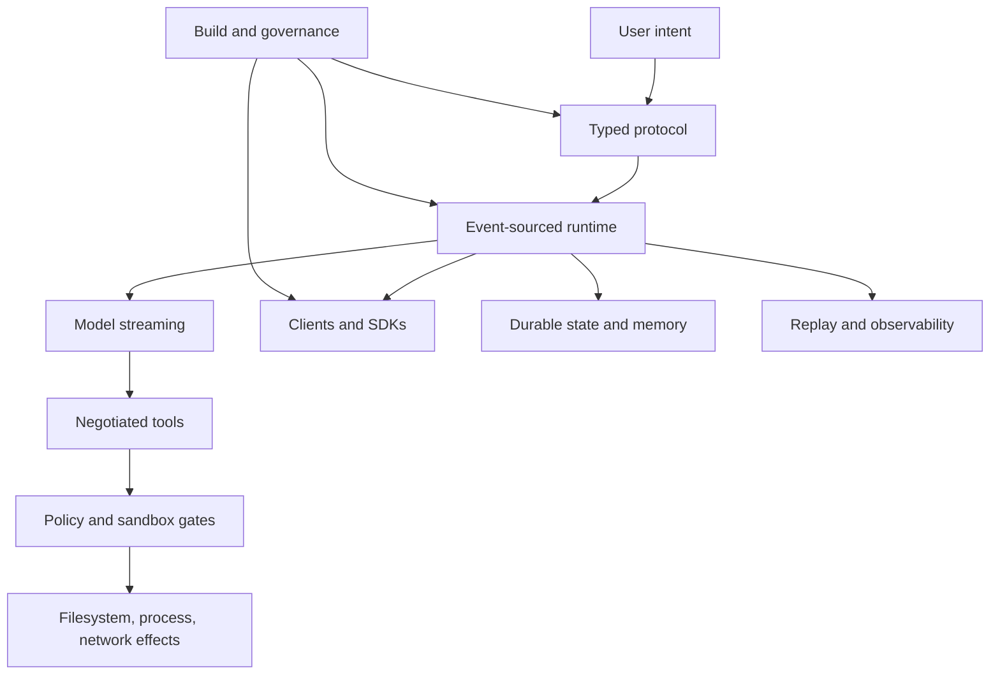

# Epilogue: What to Steal

Chapter 25 closed the implementation story with governance because that is
where architecture either survives or turns into nostalgia. The epilogue is
shorter and more opinionated. Codex is interesting not because every subsystem
is the perfect subsystem, but because the system makes one coherent bet and
pays the cost of that bet repeatedly.

The bet is this:

> Treat an AI coding agent as an event-sourced runtime whose dangerous
> capabilities pass through typed contracts, explicit policy, and replayable
> boundaries.

That sentence explains the protocol, the turn loop, tool routing, approvals,
sandboxing, app-server, TUI, extensions, memories, cloud tasks, generated
schemas, and CI governance. When a design decision looked verbose, it usually
existed to preserve that bet under pressure.

## Source Map

The epilogue synthesizes the full book rather than introducing a new subsystem.
The canonical source anchors are the ones used throughout the chapters:
[`protocol`](https://github.com/openai/codex/tree/569ff6a1c400bd514ff79f5f1050a684dc3afde3/codex-rs/protocol/src),
[`core session runtime`](https://github.com/openai/codex/tree/569ff6a1c400bd514ff79f5f1050a684dc3afde3/codex-rs/core/src/session),
[`app-server`](https://github.com/openai/codex/tree/569ff6a1c400bd514ff79f5f1050a684dc3afde3/codex-rs/app-server/src),
[`tool execution`](https://github.com/openai/codex/tree/569ff6a1c400bd514ff79f5f1050a684dc3afde3/codex-rs/core/src/tools),
[`rollout trace`](https://github.com/openai/codex/tree/569ff6a1c400bd514ff79f5f1050a684dc3afde3/codex-rs/rollout-trace/src),
and [repository governance](https://github.com/openai/codex/tree/569ff6a1c400bd514ff79f5f1050a684dc3afde3/.github).

## The Five Lessons That Transfer

### 1. Put the Product Vocabulary in Types

Codex is easier to reason about because important events have names. A user
turn, a model item, a tool call, an approval request, a session event, and an
app-server notification are not loose JSON blobs at the center of the system.
They are product concepts with type-level boundaries.

Steal this even outside AI. If a workflow matters, give its states and messages
first-class vocabulary. Then make clients, logs, tests, and replays speak that
vocabulary.

### 2. Treat Side Effects as Negotiated Capability

The model can propose. The runtime decides. That separation is the heart of
Codex's safety architecture. Tools are specified, routed, inspected, approved,
sandboxed, executed, normalized, persisted, and rendered. None of those verbs is
accidental.

Steal the negotiation pattern. Any system that lets an untrusted planner cause
side effects should insert policy and observation between suggestion and
execution.

### 3. Build One Runtime, Many Surfaces

Codex is not "the TUI plus some APIs." The terminal UI, app-server, SDKs,
headless exec, cloud flows, and remote clients are surfaces over shared runtime
contracts. That costs more upfront because the runtime has to be explicit. It
pays back when new clients appear without rewriting the agent.

Steal the surface/runtime split. A product with multiple clients should make
the clients boring and the runtime contract precise.

### 4. Observe First, Interpret Later

Rollouts, traces, graph edges, projections, app-server histories, and generated
schemas all express the same preference: record the facts before inventing the
view. That gives Codex room to replay, debug, reduce, migrate, and audit.

Steal the raw-fact layer. If you only store the current projection, every new
question becomes a production migration. If you store the facts, projections
can evolve.

### 5. Make Architecture Executable

The final lesson is the least glamorous. Boundaries survive when checks enforce
them. Generated schemas, dependency policy, build overlays, release lanes, and
custom lints are part of the architecture because they keep the design honest
after the original authors stop thinking about it every day.

Steal executable governance. Write down the rule, then make the repository
fail when the important version of that rule is broken.

## Where Codex Is Still Expensive

The design is not free. Typed contracts create compatibility burden. Durable
rollouts create migration responsibility. Multi-client runtime design demands
more discipline than a single UI. Policy gates can make tool execution harder
to extend. Build and release overlays require dedicated maintenance. Extension
surfaces multiply trust decisions.

Those costs are acceptable only because the product needs them. If you are
building a small internal tool, do not cargo-cult the entire architecture. Take
the pressure-tested ideas: typed events, negotiated side effects, explicit
runtime contracts, raw-fact persistence, and executable policy.

## The Book's Final Mental Model

If you remember one diagram, make it this one:

The system is not a model call. It is a bounded operating environment for a
model-driven worker. The more capable that worker becomes, the more valuable
the boundaries become.

That is the architectural lesson worth stealing.
