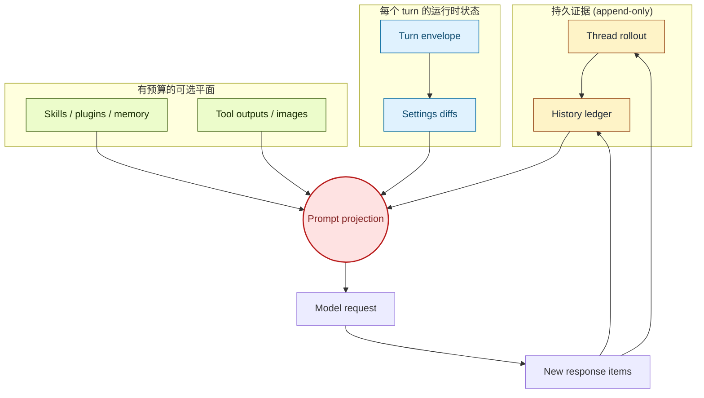

# 第 1 章：上下文是运行时边界

《Codex 源码剖析》把 session runtime 解释为事件、工具、策略、流式输出和持久状态汇合的地方。本书从更深一层开始：模型能做出任何决定之前，Codex 必须先决定什么算上下文。如果没有这个边界，后面的功能都会退化成 prompt 拼接技巧。工具观察会永久泄漏，策略变化会埋在旧文本里，压缩会变成失忆，resume 会变成猜测。

Codex 避开这个失败模式的方式，是把上下文做成 runtime 管理的 artifact。一次 turn 不是把"整段对话"发给模型，而是在特定 turn envelope 下，把 thread ledger 投影成 prompt。这个投影可能包含历史、initial context、settings diff、skill 指导、plugin 指导、hook context、memory 摘要、工具输出、图片和压缩摘要。每一类内容都有归属和时机。

读完本章，你应该能看到系统的核心动作：上下文像一个带审计日志的可变数据库视图，而不是一个文本框。

<div class="source-equivalence">
本章对应的源码包括：
<a href="https://github.com/openai/codex/blob/569ff6a1c400bd514ff79f5f1050a684dc3afde3/codex-rs/core/src/context_manager/history.rs#L32">ContextManager</a>,
<a href="https://github.com/openai/codex/blob/569ff6a1c400bd514ff79f5f1050a684dc3afde3/codex-rs/core/src/session/turn_context.rs#L53">TurnContext</a>,
<a href="https://github.com/openai/codex/blob/569ff6a1c400bd514ff79f5f1050a684dc3afde3/codex-rs/core/src/context/fragment.rs#L31">ContextualUserFragment</a>,
<a href="https://github.com/openai/codex/blob/569ff6a1c400bd514ff79f5f1050a684dc3afde3/codex-rs/core/src/compact.rs#L50">InitialContextInjection</a>，以及
<a href="https://github.com/openai/codex/blob/569ff6a1c400bd514ff79f5f1050a684dc3afde3/codex-rs/core/src/session/rollout_reconstruction.rs#L86">rollout reconstruction</a>。
</div>

## Codex 需要回答的问题

每一次 turn，上下文系统都要回答五个问题：

| 问题 | Codex 的答案 |
| --- | --- |
| 什么是持久的？ | thread history 和 rollout 证据里的 response items。 |
| 什么是 turn-local 的？ | `TurnContext`：模型、cwd、策略、features、tools 和当前运行时事实。 |
| 什么是注入的？ | 渲染成模型可见 message 的 typed fragments。 |
| 什么是可选的？ | Skills、plugins、memory、tool outputs、images，以及带过滤或预算的材料。 |
| 什么是可替换的？ | 作为 checkpoint 安装的 compacted replacement history。 |

这些内容变化速度不同。用户 prompt 每个 turn 都变；环境元信息偶尔变；权限策略可能在线程中间变；skill 可能只被某个 turn 显式提到；工具输出可能过大；compaction 可能重写旧 transcript。一个字符串缓冲区无法干净表达这些生命周期。



最重要的箭头不是进入模型的箭头，而是回到 rollout 和 history ledger 的箭头。Codex 保留足够证据，使得将来可以重建一个 prompt 为什么长成那样。

## 朴素 prompt 拼接 vs 运行时治理上下文

最朴素的 agent 设计把 prompt 当成可变字符串：每个 turn 把上一次 transcript 和新的用户消息拼起来，再发给模型。这种设计有几种几乎必然的失败：

| 失败模式 | 朴素拼接为何会发生 | Codex 的对策 |
| --- | --- | --- |
| 权限漂移 | 旧策略文字一直留在 transcript 里。 | 每次 turn 从 envelope 计算出策略，并以 diff fragment 发出。 |
| 工具洪水 | 巨大 tool output 占满窗口。 | 写入 ledger 时按 truncation policy 修剪，rollout 仍保留完整 payload。 |
| 模态崩溃 | 把含图片的消息发给纯文本模型。 | 采样前根据当前模型 normalize history。 |
| 压缩失忆 | 摘要破坏 call/output 协议配对。 | Compaction 安装的 replacement history 保留协议配对。 |
| Resume 猜谜 | 重载消息 JSON 时缺少塑造原因。 | Rollout reconstruction 同时重建 ledger 和 baseline。 |

每一行对应后续章节里的一个 Codex 子系统。重点不是这些行本身，而是底层动作：朴素 prompt 的每一种失败，在 Codex 里都变成有命名 owner 的 runtime 关注点。

## Prompt 是 Projection

Prompt projection 来自多个有意分离的状态所有者。`ContextManager` 拥有模型可见历史，`TurnContext` 拥有当前 turn envelope，`context/*` 拥有 typed fragments，compaction 拥有 replacement history，rollout reconstruction 拥有 resume 或 fork 后的有效历史重建逻辑。

这种拆分比拼字符串贵，但换来三件事：

- **可重新解释。** 不支持图片的模型可以拿到去图片后的 prompt projection。
- **可 diff。** 运行时事实可以和 reference baseline 比较，只注入有意义的变化。
- **可重建。** 持久 rollout items 可以在 compaction、rollback 和 resume 后重建历史。

```text
// 伪代码：说明 projection 边界。
turnEnvelope = resolveTurnEnvelope(config, runtimeState)
ledger = loadThreadHistory(threadId)
ledger.record(contextDiffs(previousEnvelope, turnEnvelope))
ledger.record(userInput)
promptInput = ledger.clone().normalizeFor(modelCapabilities)
sendToModel(baseInstructions, promptInput, toolSpecs)
```

这个模式让 prompt 构造成为可重复的运行时操作。底层 ledger 不被 prompt 形状污染。

## Owner 全景图

可以把五个 owner 画成一座分层的栈。每个 owner 只负责一件事；最上面的 projection 步骤从所有 owner 读取。

```text
                    +---------------------------------------+
                    |          Prompt Projection            |
                    |   (clone, normalize, render fragments) |
                    +-------+----------+----------+---------+
                            |          |          |
            +---------------+      +---+----+ +---+--------------+
            |                      |        | |                  |
    +-------v-------+   +---------v-+   +---v---------+   +------v-------+
    | ContextManager|   | TurnContext|   |  context/*  |   |  Compaction  |
    | history ledger|   |  envelope  |   |  fragments  |   |  checkpoint  |
    +-------+-------+   +-----+------+   +------+------+   +------+-------+
            |                 |                 |                 |
            +-----------------+--------+--------+-----------------+
                                       |
                              +--------v---------+
                              | Rollout evidence |
                              |  (append-only)   |
                              +------------------+
```

构造 prompt 时从上往下读，replay 时从下往上读。两个方向都经过同样的五个 owner，区别在于 ledger 是被读还是被重建。

## 上下文有多个生命周期

| 生命周期 | 例子 | 处理错误时的后果 |
| --- | --- | --- |
| Session | base instructions、thread id、persisted rollout、memory mode。 | resume 无法恢复同一个操作框架。 |
| Turn | model、provider、cwd、permissions、tools、realtime flag。 | 模型请求使用过期策略或过期能力。 |
| Prompt | normalized history、selected skills、selected plugins、hook context。 | 可选材料挤掉核心任务证据。 |
| Checkpoint | compaction summary 和 replacement history。 | 长线程忘掉错误内容。 |
| Client | token usage、TUI 展示、app-server replay。 | UI 报告 runtime 没有拥有的上下文状态。 |

没有选择的道路是单一 conversation message list。Codex 把 message list 当输出格式，而不是核心抽象。

把这些生命周期画在时间轴上，可以看清每个值什么时候被生成、修改、丢弃：

```text
session  |==============================================|  thread close
turn         |---|     |---|     |---|     |---|
prompt        ^^         ^^        ^^        ^^         每个 turn 重建
checkpoint                |================|             compaction 窗口
client            |--reads--|        |--reads--|         观察者
                  start          turn N          end
```

横向条长短不一：一个 session 通常包含很多 turn；每个 turn 产生一个 prompt projection；checkpoint 跨越一段 turn；客户端会在不同时间重新接入。这种排版让人一眼看出，单一可变缓冲区无法表达每一个 owner。

## 源码层映射

源码树印证了这个边界：

- `context_manager/history.rs` 存储与准备 response items。
- `session/turn_context.rs` 收集 turn envelope。
- `context/*` 把运行时事实渲染成 fragments。
- `session/turn.rs` 决定何时记录 context、用户输入、skills、plugins、hooks 和 pending input。
- `compact.rs` 与 `compact_remote.rs` 在 checkpoint 协议下重写历史。
- `session/rollout_reconstruction.rs` 从持久 rollout 事实重建有效历史。

这就是这套系统值得单独成书的原因：知识因为职责真的分散到不同模块，叙事必须把它们重新连接起来。

## 应用模式

1. **Projection Boundary** -> 用持久状态作为 prompt 构造输入，迁移时把 raw events 和 model-ready messages 分开，注意不要让 projection 代码反向修改 ledger。
2. **Lifetime Labels** -> 为每类上下文标注生命周期，迁移时命名 session、turn、prompt 和 checkpoint 生命周期，注意临时数据意外变成持久状态。
3. **Context Ownership** -> 每个上下文平面只设一个 owner，迁移时让更新都经过该 owner，注意客户端绕过 runtime 注入模型可见状态。
4. **Auditable Forgetting** -> 把 compaction 和 truncation 做成显式事件，迁移时存储 replacement history 或 summary checkpoint，注意无法解释自己替换了什么的摘要。
5. **Prompt as View** -> 把最终模型输入当作 view，迁移时按模型能力重建它，注意假设所有 provider 都接受同一种 prompt 形状。
