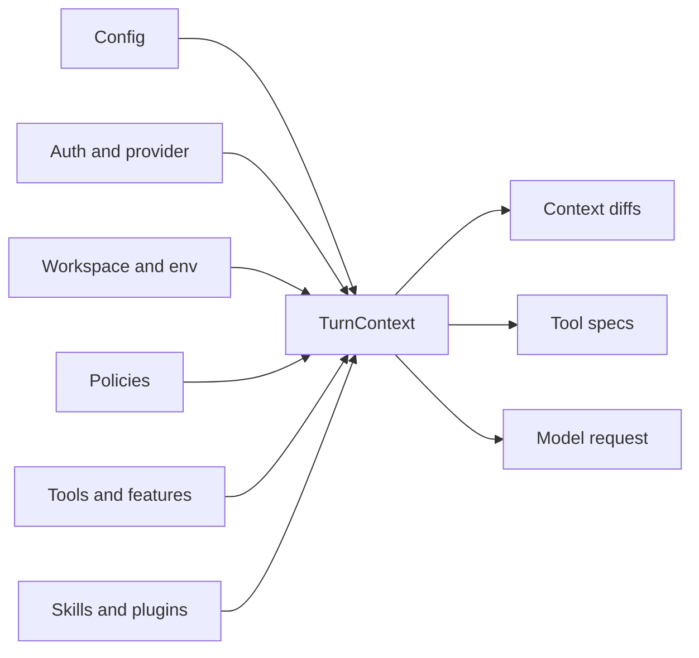

# 第 2 章：TurnContext：包住一次 Turn 的信封

第 1 章说明了上下文是运行时边界。第一个具体对象就是 turn envelope。一次 turn 不只是“下一条用户消息”，而是在某个模型、provider、cwd、permission profile、network policy、tools config、feature set、realtime 状态、collaboration mode、hook 状态、skill load 结果和 telemetry context 下执行的一次 agent 工作。

Codex 把这个 envelope 命名为 `TurnContext`。这个名字很准确：它不是完整 thread，也不只是模型要看的文本，而是一次 turn 所需的已解析运行时状态。如果这个对象错了，prompt 可能语法上有效但语义上非法：策略禁止的工具出现了，模型切换后保留了错误 reasoning 设置，或者 sandbox 使用了错误 cwd。

<div class="source-equivalence">
本章对应
<a href="https://github.com/openai/codex/blob/569ff6a1c400bd514ff79f5f1050a684dc3afde3/codex-rs/core/src/session/turn_context.rs#L53">TurnContext struct</a>,
<a href="https://github.com/openai/codex/blob/569ff6a1c400bd514ff79f5f1050a684dc3afde3/codex-rs/core/src/session/turn_context.rs#L140">model context window 计算</a>,
<a href="https://github.com/openai/codex/blob/569ff6a1c400bd514ff79f5f1050a684dc3afde3/codex-rs/core/src/session/turn_context.rs#L157">model switching</a>，以及
<a href="https://github.com/openai/codex/blob/569ff6a1c400bd514ff79f5f1050a684dc3afde3/codex-rs/core/src/session/turn.rs#L139">turn loop</a>。
</div>

## Envelope 里有什么

`TurnContext` 很密，因为 turn 边界本身很密。它携带模型身份、provider handle、reasoning 配置、session source、thread source、environment selection、cwd、当前日期、时区、app-server 客户端元信息、developer/user instructions、compact prompt、协作模式、personality、approval policy、permission profile、network proxy、sandbox level、shell environment policy、tools config、feature gates、dynamic tools、skill 状态、timing 状态和 readiness gates。

这个列表不是参考手册噪音，而是在表达设计立场：上下文不只是“模型应该看什么文本”，而是“这个模型可以在什么运行时契约下行动”。



有些字段会变成文本，有些字段决定 tools，有些字段决定 sandbox，有些字段只影响 telemetry。放在同一个 envelope 里，可以避免“模型看到一种规则，执行器执行另一种规则”。

## Effective Context Window

Codex 不盲目使用模型原始 context size。`TurnContext` 会根据模型 resolved window 和 effective percentage 得到可用窗口。这个数字会影响 pre-sampling compaction、mid-turn compaction、skill metadata budget、memory write truncation、token usage 展示和审计。

```text
// 伪代码：说明 effective window。
window = model.resolvedWindow()
effectiveWindow = window * model.effectivePercent / 100
if currentUsage >= model.autoCompactLimit(effectiveWindow):
    compactBeforeNextSampling()
```

这个决策聪明之处在于让预算贴近模型身份。模型改变时 envelope 改变，其它上下文管理逻辑不需要知道每个 provider 的细节。

## Model Switching 是 Context Switching

Codex 把模型切换看作上下文事件，而不只是配置赋值。切换模型时，turn envelope 会重新计算 model info、支持的 reasoning levels、默认 reasoning 行为、tools 能力、image generation 能力、web search 能力和 collaboration-mode 指导。后续 settings update 会把 model-switch instructions 放在 developer sections 最前面，让模型先看到与自己相关的指导。

长线程中这很关键。旧历史可能来自更大的窗口或不同模型行为。Codex 可以先用旧模型上下文做 pre-sampling compaction，再切到新模型继续。

## 运行时契约，而不是参数袋

| Consumer | 从 envelope 需要什么 |
| --- | --- |
| Context updater | previous-vs-current settings diff、environment、permissions、realtime、model。 |
| Tool builder | model capabilities、feature gates、permissions、dynamic tools、app enablement。 |
| Sandbox executor | cwd、permission profile、filesystem/network policy。 |
| Compactor | compact prompt、context window、model info、provider、hooks。 |
| Telemetry/trace | model、provider、turn id、token usage、compaction reason。 |

`TurnContext` 的价值不只是字段访问，而是让多个模块对同一个 turn 达成一致。

## 应用模式

1. **Turn Envelope** -> 汇总定义一次模型行动的全部事实，迁移时把同一个 envelope 传给 prompt、tools、policy 和 telemetry，注意隐藏全局状态与 envelope 漂移。
2. **Effective Limits** -> 从运行时模型元数据计算可用容量，迁移时向所有预算消费者暴露同一个窗口，注意不同子系统比较不同 limit。
3. **Model Switch as Context Event** -> 把模型切换当作模型可见状态变化，迁移时 diff model-specific guidance，注意旧 instructions 在切换后继续生效。
4. **Policy-Text Alignment** -> 从同一份 resolved state 推导模型可见策略和执行器策略，迁移时集中 permission projection，注意工具执行的契约不同于 prompt 描述。
5. **Envelope Consumers Table** -> 记录每个字段被哪个子系统消费，迁移时把它当 ownership map，注意新增字段没有明确 consumer。
