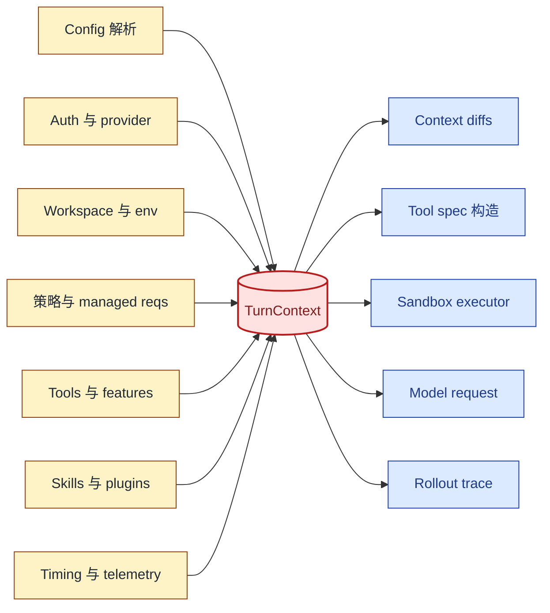
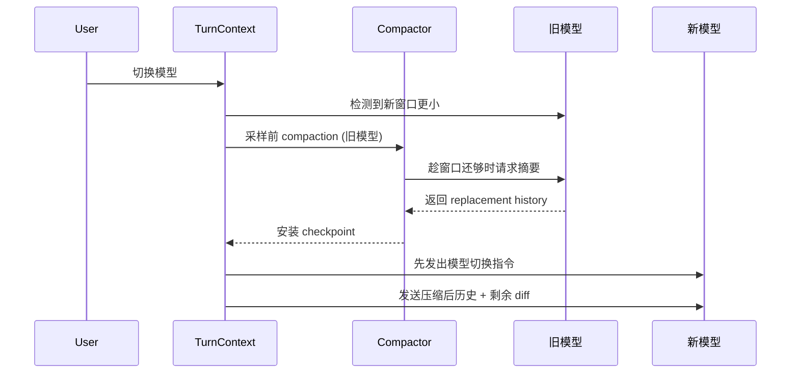

import ResolutionOrderTimeline from "../../../src/components/visual/ResolutionOrderTimeline.tsx";

# 第 2 章：TurnContext：包住一次 Turn 的信封

<ResolutionOrderTimeline lang="zh" client:visible />

第 1 章论证了上下文是一个运行时边界。这个边界后面第一个具体对象就是 turn envelope。一次 turn 不只是"下一条用户消息"，它是在特定模型、provider、cwd、permission profile、网络策略、tools 配置、feature 集合、realtime 状态、协作模式、hook 状态、skill 加载结果和 telemetry 上下文下的一次采样尝试。

Codex 把这个信封叫做 `TurnContext`。这个名字很精确：它不是整个 thread，也不是只发给模型的文本。它是一次 agent 工作所需的解析后运行时状态。如果它出错，prompt 在语法上可能合法，但语义违法：策略禁止的工具出现了、模型切换后还保留旧的 reasoning 设置、或者 sandbox 用了错误的工作目录。

读完本章，你应该理解 Codex 为什么先把 turn 事实集中到一个信封，再去记录 prompt 上下文。

<div class="source-equivalence"> 本章对应 <a href="https://github.com/openai/codex/blob/569ff6a1c400bd514ff79f5f1050a684dc3afde3/codex-rs/core/src/session/turn_context.rs#L53">TurnContext struct</a>、 <a href="https://github.com/openai/codex/blob/569ff6a1c400bd514ff79f5f1050a684dc3afde3/codex-rs/core/src/session/turn_context.rs#L140">模型上下文窗口计算</a>、 <a href="https://github.com/openai/codex/blob/569ff6a1c400bd514ff79f5f1050a684dc3afde3/codex-rs/core/src/session/turn_context.rs#L157">模型切换</a>，以及 <a href="https://github.com/openai/codex/blob/569ff6a1c400bd514ff79f5f1050a684dc3afde3/codex-rs/core/src/session/turn.rs#L139">turn loop</a>。 </div>

## 信封里有什么

`TurnContext` 字段密集，因为 turn 边界本身就密集。它携带模型身份、provider 句柄、reasoning 配置、session 来源、thread 来源、环境选择、cwd、当前日期、时区、app-server 客户端元信息、developer 与 user instructions、compact prompt、协作模式、人格、approval policy、permission profile、网络代理、sandbox 等级、shell 环境策略、tools 配置、feature gates、动态 tools、skill 状态、计时状态以及 readiness gates。

这一长串不是参考噪声，而是表达了一种设计立场：上下文不是"模型应该看到什么文字？"，而是"这次模型获准在哪种运行时契约下行动？"

按语义这些字段可以分成七组。把它们画成一个 struct 是观察信封密度最直观的方式：

```text
+----------------------------- TurnContext envelope -----------------------------+
|                                                                                |
|  identity        | model, provider, reasoning, session_source, thread_source   |
|  workspace       | cwd, current_date, timezone, env_overlay, app_metadata      |
|  instructions    | base_instructions, developer_instructions, compact_prompt   |
|  policy          | approval_policy, permission_profile, sandbox_level,         |
|                  | network_proxy, shell_env_policy                             |
|  capabilities    | tools, dynamic_tools, feature_gates, skill_state            |
|  modes           | collaboration_mode, personality, realtime_flag              |
|  telemetry       | turn_id, timing_state, readiness_gates                       |
|                                                                                |
+--------------------------------------------------------------------------------+
```

字段分组不是随意的，每一组喂给一类不同的消费者：identity 决定模型行为，workspace 定义文件与 shell 的世界，instructions 变成消息文字，policy 控制哪些能力允许，capabilities 决定模型看到哪些 tools，modes 改变交互契约，telemetry 喂给 trace 和 rollout。



信封刻意比 prompt 范围更宽：有些字段会变成文字、有些字段决定 tools、有些字段决定 sandbox 行为、有些字段只影响 telemetry。把它们放在一起避免了 agent 中常见的 bug：模型看到一套指令，executor 却执行另一套。

## 解析顺序很重要

构造信封不是一次性读取。Codex 按特定顺序解析字段，让后面的部分可以安全引用前面。下面的伪代码用通用名字，但和源码逐层赋值的方式一致。

```text
// 伪代码 -- 一次 turn 的解析顺序。
identity     = chooseModelAndProvider(config, overrides)
workspace    = resolveWorkspace(config, identity)
instructions = composeInstructions(identity, workspace, savedRules)
policy       = resolvePolicy(config, managedRequirements, identity)
capabilities = buildToolset(identity, policy, plugins, dynamicTools)
modes        = decideModes(realtime, collaboration, personality)
telemetry    = startTrace(identity, modes, turnId)

envelope = TurnContext {
  identity, workspace, instructions, policy,
  capabilities, modes, telemetry,
}
```

这个顺序不是装饰：tools 必须在策略已知后才能构造（被禁止的 tools 必须省略），modes 必须在 identity 解析后才能决定（模型切换可能强制改变模式），telemetry 必须在它要标注的 identity 出现后才能启动。

## 有效上下文窗口

信封同时解析模型可用的窗口。Codex 不会盲目使用模型 raw context 大小，有效窗口可以是解析后的模型窗口的一个百分比。这点重要，因为上下文管理需要的是运行时阈值，而不是营销数字。

同一个有效窗口同时喂给多个决策：token 使用展示、采样前 compaction、turn 中 compaction、skill metadata 预算、memory write 截断、以及 source-equivalent 审计。窗口缩小不只是 prompt 变小，它还会改变系统什么时候忘记、可选材料能进多少。

```text
// 伪代码 -- 简化以便阅读。
window           = model.resolvedWindow()
effectiveWindow  = window * model.effectivePercent / 100
skillBudget      = effectiveWindow * skillsPercent
autoCompactLimit = effectiveWindow * autoCompactPercent
if currentUsage >= autoCompactLimit:
    compactBeforeNextSampling()
```

一个有效窗口派生出三个子预算。注意依赖方向：`effectiveWindow` 是父，`skillBudget` 和 `autoCompactLimit` 是子。如果未来用一个固定 token 数代替百分比，每个子预算依然能正确派生。

## 模型切换就是上下文切换

Codex 把模型切换当作上下文事件，而不是一次配置赋值。一次 turn 切换模型时，turn envelope 重新计算模型信息、支持的 reasoning 等级、默认 reasoning 行为、tools 能力、图像生成能力、web search 能力、协作模式指引。之后 settings update 逻辑会先注入 model-switch 指令，让模型在收到其他 diff 之前先看到模型相关的指引。

这点在长线程中很重要。之前的历史可能在更大的窗口或不同模型行为下产生。Codex 有一条采样前路径，可以在切换之前用旧模型先做一次 compaction，再以更小窗口继续。这是一个微妙但关键的选择：在旧模型还能读懂旧 context 时压缩，再让新模型继续。



这条序列说明"改字段然后继续"是不完整的。朴素切换会丢掉旧模型在历史里携带的指引；Codex 通过在新模型接管*之前*而不是之后做 compaction，保住连续性。

## 它是运行时契约，不是参数袋

诱人的实现会把多个参数沿 turn loop 传递：模型在这里、cwd 在那里、权限在 tool router、features 在 config object、telemetry 在别处。Codex 用信封是因为上下文必须在多个消费者之间保持一致：

| 消费者 | 它需要信封里什么 |
| --- | --- |
| Context updater | 上一次 vs 当前的设置 diff、环境、权限、realtime、模型。 |
| Tool builder | 模型能力、feature gates、权限、动态 tools、app 启用情况。 |
| Sandbox executor | cwd、permission profile、文件系统与网络策略。 |
| Compactor | compact prompt、上下文窗口、模型信息、provider、hooks。 |
| Telemetry 与 trace | 模型、provider、turn id、token usage、compaction 原因。 |

信封是一个协调结构。它的价值不只是字段访问，而是让不同模块对同一个 turn 达成一致。

一个有用的嗅觉测试：如果某个消费者必须从信封外面读状态来做塑造 turn 的决定，那个状态本就属于信封。信封随责任增长，而不是被临时全局变量绕过。

## 应用模式

1. **Turn Envelope** -> 收集定义一次模型动作的所有事实，迁移时把单个不可变信封传给 prompt、tools、策略和 telemetry，注意脱离信封漂移的隐藏全局变量。
2. **Effective Limits** -> 从运行时模型元信息计算可用容量，迁移时用一个有效窗口喂给所有预算消费者，注意子系统之间用了不同上限。
3. **Model Switch as Context Event** -> 把模型变更当作 prompt 可见状态的变更，迁移时 diff 模型相关指引，注意旧指令在切换后残留。
4. **Policy-Text Alignment** -> 让模型可见策略和 executor 策略来自同一份解析状态，迁移时集中权限 projection，注意 tool 强制与 prompt 描述不同的契约。
5. **Envelope Consumers Table** -> 记录每个子系统使用的字段，迁移时把它当作 ownership map，注意添加字段时缺少明确消费者。
