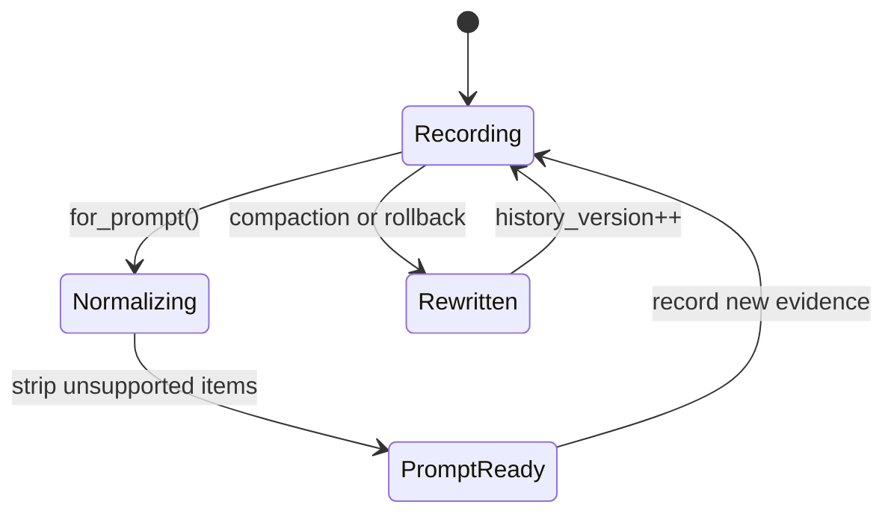
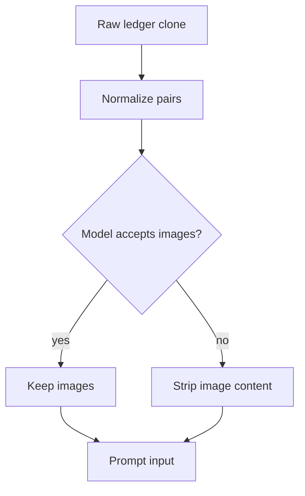

# 第 3 章：ContextManager：把历史变成可提示状态

第 2 章讲的是 turn envelope。接下来的问题是持久侧：线程里积累的模型可见 items 怎么处理？Codex 没有把 history 当作不透明 transcript，而是用 `ContextManager` 维护一个按时间从旧到新的 response item ledger，并附带 token 信息、history version 和 reference context baseline。

这个 ledger 的职责很难：它只记录属于 API history 的 items，对大输出应用 truncation policy，保护 function-call/output 配对关系，采样前剥离模型不支持的 modality，估算 token，并在 compaction 或 rollback 时整体替换。

<div class="source-equivalence">
本章基于
<a href="https://github.com/openai/codex/blob/569ff6a1c400bd514ff79f5f1050a684dc3afde3/codex-rs/core/src/context_manager/history.rs#L32">ContextManager 字段</a>,
<a href="https://github.com/openai/codex/blob/569ff6a1c400bd514ff79f5f1050a684dc3afde3/codex-rs/core/src/context_manager/history.rs#L98">record_items</a>,
<a href="https://github.com/openai/codex/blob/569ff6a1c400bd514ff79f5f1050a684dc3afde3/codex-rs/core/src/context_manager/history.rs#L115">for_prompt</a>,
<a href="https://github.com/openai/codex/blob/569ff6a1c400bd514ff79f5f1050a684dc3afde3/codex-rs/core/src/context_manager/history.rs#L160">paired removal</a>，以及
<a href="https://github.com/openai/codex/blob/569ff6a1c400bd514ff79f5f1050a684dc3afde3/codex-rs/core/src/context_manager/history.rs#L221">rollback-aware turn dropping</a>。
</div>

## Ledger 形状

| 字段 | 作用 |
| --- | --- |
| `items` | oldest-first response items，是模型可见历史候选。 |
| `history_version` | 历史被重写时递增。 |
| `token_info` | 最新 token usage 或估算。 |
| `reference_context_item` | settings diff 使用的 turn context baseline。 |

最容易被低估的是 `reference_context_item`。History 不只是过去对话，也是在决定下一个 turn 应该注入哪些 runtime facts 时使用的 baseline。Compaction 或 rollback 让 baseline 失效时，Codex 会清掉它并回退到 full reinjection。



## Recording 是过滤后的记录

`record_items` 只记录 API-message items。rollout 中可能有事件、UI facts、token counts 和 context checkpoints，不是所有东西都应该进入下一次模型请求。进入 ledger 前，item 还会经过 active truncation policy，避免一个工具输出吞掉整个窗口。

```text
// 伪代码：说明 filtered recording。
for item in incomingItems:
    if not modelHistoryItem(item):
        continue
    bounded = applyOutputPolicy(item, activeTruncation)
    ledger.append(bounded)
```

这记录的是被策略塑形后的证据，而不是原始副作用。原始事实可以仍在 rollout 或 UI 中，但模型可见 ledger 保持有界。

## Normalization 保护不变量

Function call 和 function output 是配对的。删一个不删另一个，会让 prompt 形状被模型 API 拒绝或误解。因此 history manager 删除 oldest/newest item 时会让 normalize helper 移除对应 counterpart。

采样前也类似。`for_prompt` 克隆 manager，归一化，并按模型 input modalities 剥离不适合的内容。模型不支持图片时，图片会从 message 和 tool output 中移除。持久 ledger 可以保留更丰富的证据，prompt projection 只暴露当前模型能接受的形状。



## Token 估算是有意粗糙的

ContextManager 用 base instructions 加 item 估算做 token 估计，并且源码明确把它看成粗略下界，而不是 tokenizer 精确计数。这个选择务实：跨 provider 和 modality 做精确 tokenizer 会很脆弱。Codex 需要的是足以触发 compaction、展示 UI 和预算决策的信号。

## Rollback 与 Baseline

Rollback 证明 ledger 不是普通 vector。丢掉最近 N 个 user turns 时，Codex 要保留 first user message 前的材料，处理 no-op，尊重 assistant inter-agent 边界，并在 surviving history 不再包含建立 baseline 的 initial context bundle 时清掉 `reference_context_item`。

否则未来 turn 会对一个已经不存在的 baseline 做 diff，漏掉重要 context。

## 应用模式

1. **Prompt Ledger** -> 用结构化 items 存储模型可见历史，迁移时在插入时过滤非 prompt 事件，注意 UI 事件泄漏进模型历史。
2. **Normalize on Projection** -> 构造 prompt view 时修复 provider-facing 不变量，迁移时先 clone 再 normalize，注意 normalization 破坏持久证据。
3. **Paired Deletion** -> 把 tool call 和 output 作为一组删除，迁移到任何 request/response 协议都适用，注意 truncation 留下孤儿协议帧。
4. **Baseline Clearing** -> rewrite 删除 baseline 来源时让 diff baseline 失效，迁移时保存显式 baseline metadata，注意历史重写后的 stale context diff。
5. **Coarse Budget Signal** -> 用便宜估算做实时决策，用精确计数做事后事实，迁移时设置保守阈值，注意把估算当作账单级真相。
