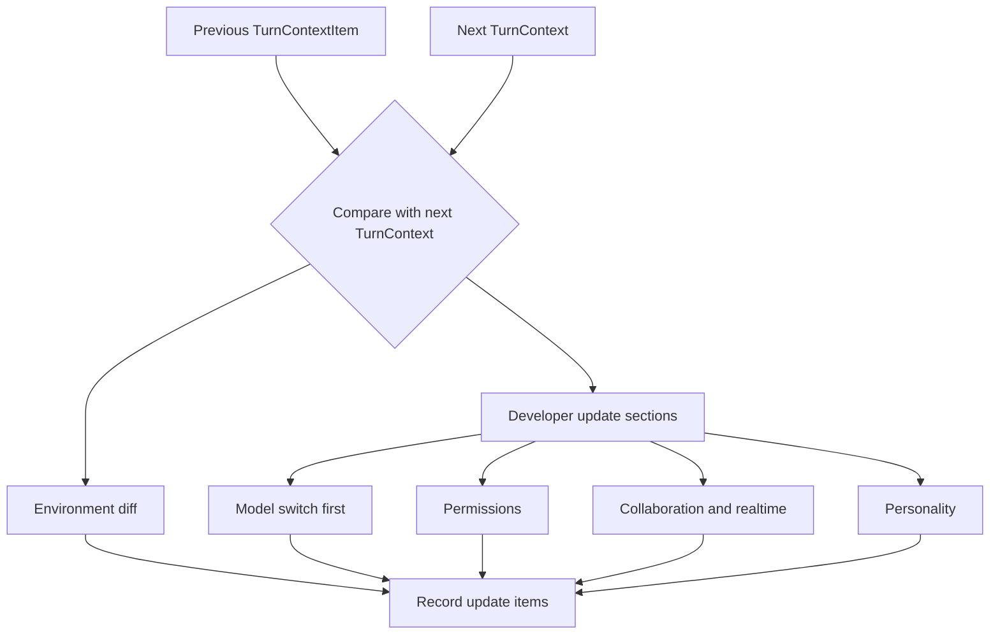

# 第 4 章：类型化片段与设置 Diff

第 3 章解释了 Codex 如何维护 prompt-ready history。下一步是运行时事实如何进入 history。天真的系统会每个 turn 重复一大段 preamble：当前目录、权限、模式、realtime 状态、模型指导、skills 和用户说明。Codex 用 typed context fragments 和 settings diffs 替代这种重复。稳定上下文注入一次；后续 turn 在有 reference baseline 时只注入变化。

这不只是省 token。它是语义卫生。模型应该看到“权限变了”是因为这个事实现在重要，而不是因为每个 turn 都贴一堵样板墙。

<div class="source-equivalence">
本章对应
<a href="https://github.com/openai/codex/blob/569ff6a1c400bd514ff79f5f1050a684dc3afde3/codex-rs/core/src/context/fragment.rs#L31">ContextualUserFragment</a>,
<a href="https://github.com/openai/codex/blob/569ff6a1c400bd514ff79f5f1050a684dc3afde3/codex-rs/core/src/context/mod.rs#L1">context fragment module list</a>,
<a href="https://github.com/openai/codex/blob/569ff6a1c400bd514ff79f5f1050a684dc3afde3/codex-rs/core/src/context_manager/updates.rs#L21">environment diffs</a>，以及
<a href="https://github.com/openai/codex/blob/569ff6a1c400bd514ff79f5f1050a684dc3afde3/codex-rs/core/src/context_manager/updates.rs#L204">settings update assembly</a>。
</div>

## Fragment 是类型化渲染契约

Fragment trait 让每个注入 payload 负责三件事：选择 message role、渲染 body、可选地提供 start/end markers 以便后续识别。它比“返回字符串”更强，因为它构造了模型可见运行时事实的 typed registry。

```text
// 伪代码：说明 typed fragment rendering。
fragment.role = "user" or "developer"
fragment.markers = optionalRecognitionTags()
fragment.body = renderRuntimeFact()
message = makeResponseItem(fragment.role, fragment.markers + fragment.body)
```

Markers 很关键。它让过滤和 replay 逻辑可以识别注入的上下文，而不需要重新构造每个具体 payload。没有 marker 的 fragment 也能渲染文本，但它放弃了识别能力。

## Fragment Catalog

Context 模块导出环境、权限、协作模式、模型切换、realtime start/end、personality、skills、plugins、apps、hooks、用户说明、保存的网络规则、已批准命令前缀、subagent notification、turn aborted 等 fragments。

| Fragment family | 为什么属于上下文 |
| --- | --- |
| Environment | 模型需要知道 cwd、shell、日期、时区和 workspace 事实。 |
| Permissions | 模型需要理解哪些动作需要审批或被禁止。 |
| Realtime | realtime 活跃时交互契约不同。 |
| Skills/plugins | 可选能力需要模型可发现的指导。 |
| Hooks | 外部策略可能添加 context 或强制 continuation。 |
| User instructions | 持久用户偏好需要受控注入路径。 |

关键不是它们都变成文本，而是它们都通过同一套渲染纪律变成文本。

## Settings Diffs

`build_settings_update_items` 比较 previous context item 和 next turn context。它可以为环境变化发 contextual user message，也可以为模型指令、权限、协作模式、realtime 和 personality 组装 developer message。模型切换指令排在最前面，因为模型特定 guidance 应该先框住其它 diff。



如果 baseline 被 compaction 或 rollback 清掉，Codex 可以退回 full reinjection，而不是对缺失历史做聪明 diff。

## Initial Context 与 Update Context

Initial context 建立 baseline；update context 描述相对 baseline 的变化。混淆二者会出 bug：把 update 当完整状态会在 resume 后漏材料；把完整状态当 update 会浪费 token 并淹没信号。

源码里还有一个坦诚的 TODO：settings update 还没有覆盖 initial context 发出的每一个模型可见 item。这说明设计方向是 deterministic replay，但实现仍然在某些平面选择 full reinjection 更安全。这个取舍是对的，因为上下文系统中，漏注入比重复注入更危险。

## 应用模式

1. **Typed Fragment Renderer** -> 通过 typed objects 渲染上下文，迁移时为每个 fragment 设置 role 和 recognition markers，注意不可识别的散装字符串。
2. **Settings Diff** -> 注入更新前比较 previous 与 next runtime state，迁移时保存 baseline snapshot，注意对缺失历史计算 diff。
3. **Priority Sections** -> 按语义依赖排序上下文更新，迁移时把 model-specific guidance 放在策略或模式细节前面，注意指令顺序改变含义。
4. **Fallback Reinjection** -> baseline 不确定时优先 full context，迁移时在破坏性 rewrite 后清 baseline，注意省 token 逻辑漏掉必要状态。
5. **Fragment Catalog Review** -> 维护可见的 context family 清单，迁移时把它当架构 inventory，注意新功能通过一次性 prompt 代码进入上下文。
