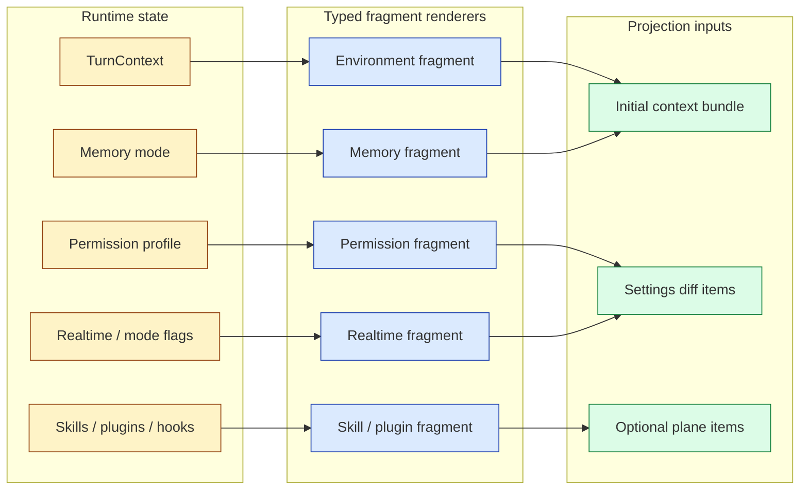
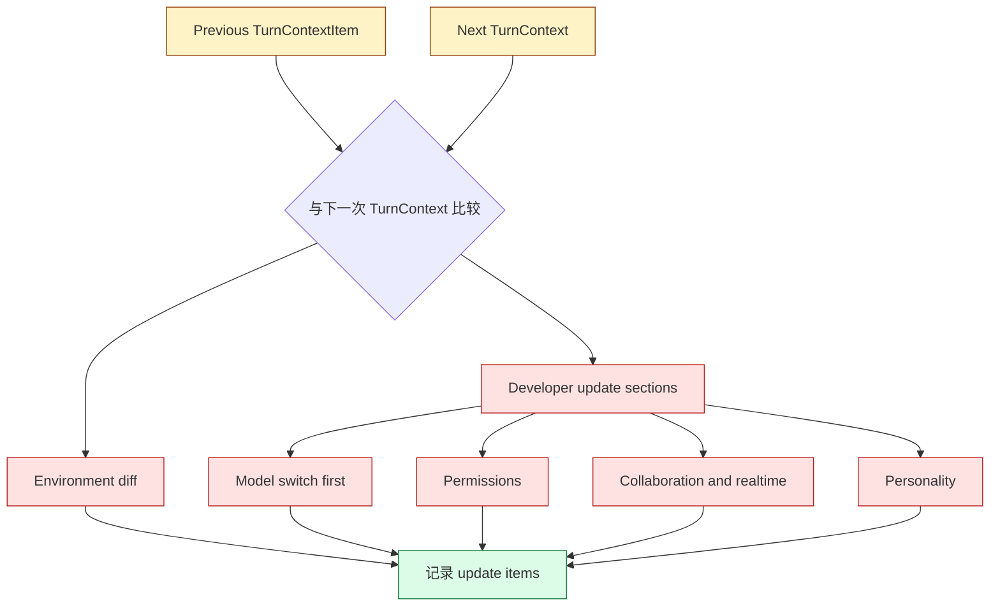

# 第 4 章：类型化片段与设置 Diff

第 3 章展示了 Codex 如何保持 prompt-ready 历史。下一个问题是运行时事实如何进入这份历史。朴素系统每个 turn 都重复一段巨大的开场白：当前目录、权限、模式、realtime 状态、模型指引、skills 和用户指令。Codex 改用 typed context fragments 和 settings diffs：稳定上下文只注入一次；后续 turn 仅在存在 reference baseline 时注入变化。

这不仅仅是 token 优化，更是语义卫生。模型应该看到"权限改变了"，因为这件事现在很重要，而不是因为 boilerplate 又被粘了一次。

读完本章，你应该把 context fragment 理解为运行时状态与模型可见消息之间的 typed 渲染层。

<div class="source-equivalence">
本章对应
<a href="https://github.com/openai/codex/blob/569ff6a1c400bd514ff79f5f1050a684dc3afde3/codex-rs/core/src/context/fragment.rs#L31">ContextualUserFragment</a>、
<a href="https://github.com/openai/codex/blob/569ff6a1c400bd514ff79f5f1050a684dc3afde3/codex-rs/core/src/context/mod.rs#L1">context fragment 模块清单</a>、
<a href="https://github.com/openai/codex/blob/569ff6a1c400bd514ff79f5f1050a684dc3afde3/codex-rs/core/src/context_manager/updates.rs#L21">环境 diff</a>，以及
<a href="https://github.com/openai/codex/blob/569ff6a1c400bd514ff79f5f1050a684dc3afde3/codex-rs/core/src/context_manager/updates.rs#L204">settings update 装配</a>。
</div>

## Fragment 是 typed 渲染契约

Fragment trait 给每个被注入的 payload 三个职责：选定 message role、渲染 body、可选地定义起止 marker，让后续代码能识别该 fragment。这比"返回一个字符串"更强，它建立了模型可见运行时事实的 typed registry。

```text
// 伪代码 -- 说明 typed fragment 渲染。
fragment.role    = "user" or "developer"
fragment.markers = optionalRecognitionTags()
fragment.body    = renderRuntimeFact()
message = makeResponseItem(
  fragment.role,
  fragment.markers + fragment.body,
)
```

Marker 尤其重要：它们让过滤与 replay 逻辑能识别注入的上下文，而不必重建每一份具体 payload。没有 marker 的 fragment 仍然能渲染文本，但放弃了被识别。这个权衡很干净：识别需要显式语法。

典型的 marker 看起来像把 body 包起来的 inline tag：

```text
<environment_context cwd="/repo" shell="bash">
  current directory: /repo
  permissions: read+write inside /repo, no network
  date: 2025-...
</environment_context>
```

模型一侧能直接读懂，runtime 一侧能机械识别。Codex 付出少量 token 代价，让 replay 代码保持简单。

## Fragment 栈在哪一层

Fragment 层是 prompt projection 处汇合的三种渲染纪律之一。下图展示它们各自的职责：



三条泳道避免了一个常见 bug：运行时状态被走多条不一致的代码路径渲染。一旦有了 fragment，任何想注入相同事实的子系统都会复用同一个 renderer。

## Fragment 目录

Context 模块导出针对 environment context、permissions、collaboration mode、model switch instructions、realtime start/end、personality、skills、plugins、apps、hooks、user instructions、saved network rules、approved command prefixes、subagent notifications、turn-aborted messages 的 fragments。

这份目录告诉你 Codex 把什么当作上下文，而不是当作对话：

| Fragment 家族 | 为什么属于上下文 |
| --- | --- |
| Environment | 模型需要知道 cwd、shell、date、timezone 和相关 workspace 事实。 |
| Permissions | 模型需要知道哪些动作要审批、哪些被禁止。 |
| Realtime | Realtime 期间模型需要不同的交互契约。 |
| Skills 与 plugins | 可选能力需要可发现的模型指引。 |
| Hooks | 外部策略可以添加模型可见上下文或强制继续。 |
| User instructions | 持久用户偏好需要受控的注入路径。 |

关键不是这些都会变成文本，而是它们都通过同一种渲染纪律变成文本。

## Settings Diffs

`build_settings_update_items` 把上一份 context item 与下一次 turn context 比较。它可以为环境变化发出一条 contextual user message，为模型 instructions、权限、协作模式、realtime 状态、人格发出 developer message。Model-switch instructions 排在最前，让模型相关指引为后面的 diff 立框架。



结果是精确的上下文 churn：不变化时 Codex 不重复整段，但在 compaction 或 rollback 后清掉 reference baseline，仍然可以完整重新注入。

Diff 顺序刻意不是字母序。从上往下读 developer update sections，每一节都默认前面已经生效：

```text
1. model switch       - 为本轮后续每一节定义框架
2. permissions        - 决定模型可尝试哪些 tools
3. collaboration/mode - 在该权限下改变交互契约
4. personality        - 调整语气，但不改变能力
```

颠倒这个顺序，模型就可能用错误权限读到模式指引，或在新模型不具备的 tools 上读到 personality 指引。

## Initial Context vs Update Context

Initial context 建立 baseline；update context 描述对该 baseline 的变更。把两者搞混会产生隐蔽的 bug：把 update 当作完整状态，会在 resume 后漏掉材料；把完整状态当作 update，会浪费 token 并埋掉信号。

Codex 通过存储 `TurnContextItem` baseline，以及让 compaction 决定 replacement history 是否包含 initial context，保住这种区别。具体放置策略放在第 6 章。

一张小表把这个区别说清：

| | Initial context | Update context |
| --- | --- | --- |
| 频率 | 每个"session 起点"或 baseline 被清空后一次。 | 已存在 baseline 时每个 turn 一次。 |
| 形状 | 环境、权限、模式、hooks、skills 的完整 bundle。 | 可能为空的 diff fragments。 |
| 触发 | 不带 baseline 的 compaction、清空 baseline 的 rollback、新 thread。 | 任何 envelope 与 baseline 不同的 turn。 |
| 混用的失败 | Resume 看到只有 update 的 prompt，缺事实。 | 浪费 token 并干扰模型。 |

代码里这两条路径也是分开的：构造 bundle 与构造 diff 不共享同一函数，但共享同一组 fragment renderer。

## 一个设计张力

Settings update 代码里有一段坦诚的限制：不是 initial context 发出的每一条模型可见 item 都已经有 diff 路径。这条注释在架构上有意义，它显示设计正在朝"所有 context 平面都能确定性回放"前进，但实现里仍有一些区域，"完整重新注入"比"聪明 diff"更安全。

这是正确的偏置。在上下文系统里，遗漏比冗余更糟。Codex 在能证明 baseline 时优化为 diff，否则回退到完整注入。

## 应用模式

1. **Typed Fragment Renderer** -> 通过 typed 对象渲染上下文，迁移时给每个 fragment 一个 role 和识别 marker，注意无结构字符串后续无法被识别。
2. **Settings Diff** -> 注入更新前比较上一次与下一次运行时状态，迁移时存 baseline snapshot，注意 diff 算在缺失历史上的情况。
3. **Priority Sections** -> 按语义依赖排序更新，迁移时把模型相关指引放在策略与模式之前，注意指令顺序改变了语义。
4. **Fallback Reinjection** -> baseline 不确定时优先完整上下文，迁移时在破坏性重写后清空 baseline，注意省 token 的逻辑漏掉必需状态。
5. **Fragment Catalog Review** -> 维护一份可见的上下文家族清单，迁移时把它当作架构清单，注意新功能上下文经一次性 prompt 代码进入。
