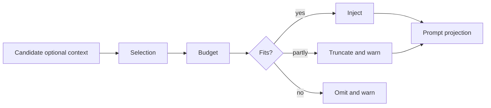

# 第 5 章：为可选上下文做预算

第 4 章解释了必需运行时事实如何成为 typed fragments 和 diffs。本章讲可选上下文：skills、plugins、apps、memory summaries、tool outputs、images 和 hook additions。可选不代表不重要，而是系统应该能够缩短、选择、丢弃或延后它们，同时不破坏核心 turn contract。

Codex 最强的地方，是把可选材料当作 budgeted plane。一个 skill 描述可能帮助模型，但花在 skills 上的每个 token 都不再属于用户代码、历史工具输出或当前任务。问题不是“能不能加”，而是“用什么预算和 ownership 加才安全”。

<div class="source-equivalence">
本章基于
<a href="https://github.com/openai/codex/blob/569ff6a1c400bd514ff79f5f1050a684dc3afde3/codex-rs/core/src/session/turn.rs#L170">turn-time skill/plugin resolution</a>,
<a href="https://github.com/openai/codex/blob/569ff6a1c400bd514ff79f5f1050a684dc3afde3/codex-rs/core-skills/src/render.rs#L143">skill metadata budget</a>,
<a href="https://github.com/openai/codex/blob/569ff6a1c400bd514ff79f5f1050a684dc3afde3/codex-rs/core/src/session/turn.rs#L305">hook-provided context</a>,
<a href="https://github.com/openai/codex/blob/569ff6a1c400bd514ff79f5f1050a684dc3afde3/codex-rs/memories/read/src/prompts.rs#L24">memory read injection</a>，以及
<a href="https://github.com/openai/codex/blob/569ff6a1c400bd514ff79f5f1050a684dc3afde3/codex-rs/memories/write/src/prompts.rs#L98">memory write truncation</a>。
</div>

## Optional Planes

| 平面 | 选择机制 | 预算行为 |
| --- | --- | --- |
| Skills | 显式 mention 和隐式可用性。 | metadata budget 绑定 context window，有截断和省略 warning。 |
| Plugins/apps | enabled plugin config、app access 和显式 mention。 | 按 turn 注入，并通过 capability summaries 路由。 |
| Memory read | 已存在的 memory summary。 | summary 在成为 developer instructions 前截断。 |
| Memory write | 传入 memory generation 的 rollout 内容。 | 大 rollout 按 effective input window 百分比截断。 |
| Tool outputs | 工具运行观察。 | output truncation policy 决定进入 history 的形状。 |
| Images | 用户或工具提供的图片。 | 模型不支持图片时从 prompt projection 中剥离。 |

共同模式是：先选择，再预算，再注入。



Warning 是设计的一部分。Codex 缩短 skill 描述或省略某些 skill metadata 时，运行时可以解释模型看到的是 reduced capability list。静默省略更便宜，但更难 debug。

## Skills：带预算的能力发现

Skill renderer 在没有 context window 时使用默认字符预算；有窗口时使用 effective window 的一小部分。它先尝试 absolute path skill lines；如果太贵，会尝试 alias，因为短路径能保留更多描述语义。必要时先截断 descriptions，再省略整个 skill。

这个顺序体现了偏好：先保广度，再保深度。Codex 宁愿让模型看到所有 skill 的短描述，也不愿过早隐藏能力。

```text
// 伪代码：说明 skill budgeting。
budget = contextWindow ? percent(contextWindow) : defaultChars
rendered = renderWithFullPaths(skills, budget)
if rendered.omitsOrTruncates:
    rendered = betterOf(rendered, renderWithAliases(skills, budget))
emitWarnings(rendered.report)
```

## Hooks 和 Memory 是 Side Channels

Hooks 可以在 prompt submission 或 stop-hook continuation 时添加 context。Memory 可以通过 developer instructions 添加用户级摘要。这些都不是用户当前消息，也不是普通工具观察，因此必须显式进入同一套 context pipeline，而不是暗中修改 base prompt。

## Tool Outputs 与 Images

工具输出可能对当前任务必要，但原始形态不一定适合模型。Codex 在记录 items 时应用 truncation policy；如果模型拒绝图片请求，还可以替换或清理 invalid image content 并重试。因为输出保留协议身份，Codex 才能定位和处理问题 turn。

## 应用模式

1. **Optional Context Plane** -> 把 helpful context 和 required context 分开，迁移时为每个平面设置 selection 与 budget rule，注意可选材料挤掉核心任务证据。
2. **Breadth Before Depth** -> 优先保留能力覆盖面，再保留长描述，迁移时先缩短 metadata 再省略 entries，注意过早省略导致能力不可见。
3. **Budget Diagnostics** -> 上下文被缩短或省略时发 warning，迁移时输出用户可见或 telemetry 可见报告，注意静默裁剪让行为变得神秘。
4. **Side-Channel Routing** -> 让 hooks 和 memory 经过同一个 context ledger，迁移时把附加内容记录为显式 items，注意 runtime 外部偷偷改 prompt。
5. **Modality Projection** -> 持久侧保留丰富证据，prompt 侧只投影模型支持内容，迁移时在 prompt time 剥离 unsupported modalities，注意 provider 假设泄漏进 stored history。
