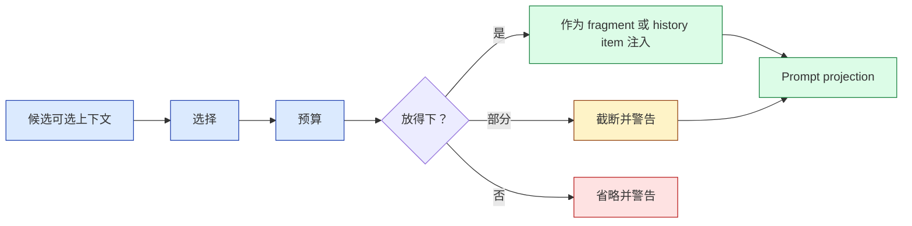
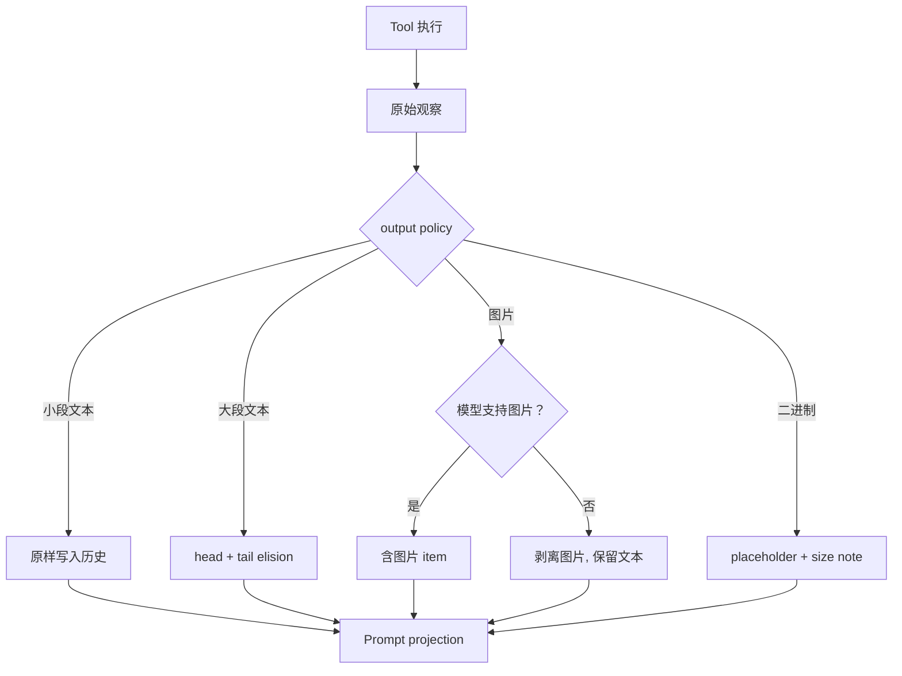

import BudgetSimulator from "../../../src/components/visual/BudgetSimulator.tsx";

# 第 5 章：为可选上下文做预算

<BudgetSimulator lang="zh" client:visible />

第 4 章解释了必备运行时事实如何变成 typed fragments 与 diffs。本章转向可选上下文：skills、plugins、apps、memory 摘要、tool outputs、images，以及 hook 添加的内容。可选不代表不重要，它的意思是系统能在不破坏核心 turn 契约的前提下，丢掉、缩短、选择或延后这些内容。

Codex 的上下文管理在把可选材料当作有预算的平面时最强。Skill 描述确实能帮模型，但花在 skill 上的每一个 token 都不会用来描述用户代码、之前的 tool output 或当前任务。设计问题不是"我们能不能加进去？"，而是"什么样的预算与所有权能让加入是安全的？"

读完本章，你应该能在多个子系统中识别出"可选上下文"模式。

<div class="source-equivalence">
本章对应
<a href="https://github.com/openai/codex/blob/569ff6a1c400bd514ff79f5f1050a684dc3afde3/codex-rs/core/src/session/turn.rs#L170">turn 中的 skill/plugin 解析</a>、
<a href="https://github.com/openai/codex/blob/569ff6a1c400bd514ff79f5f1050a684dc3afde3/codex-rs/core-skills/src/render.rs#L143">skill metadata 预算计算</a>、
<a href="https://github.com/openai/codex/blob/569ff6a1c400bd514ff79f5f1050a684dc3afde3/codex-rs/core/src/session/turn.rs#L305">hook 提供的上下文</a>、
<a href="https://github.com/openai/codex/blob/569ff6a1c400bd514ff79f5f1050a684dc3afde3/codex-rs/memories/read/src/prompts.rs#L24">memory read 注入</a>，以及
<a href="https://github.com/openai/codex/blob/569ff6a1c400bd514ff79f5f1050a684dc3afde3/codex-rs/memories/write/src/prompts.rs#L98">memory write 截断</a>。
</div>

## 可选平面

Codex 有几个可选上下文平面：

| 平面 | 选择机制 | 预算行为 |
| --- | --- | --- |
| Skills | 显式 mention 加隐式可用。 | metadata 预算与上下文窗口绑定，附 truncation 与省略警告。 |
| Plugins 与 apps | 启用的 plugin 配置、app 访问、显式 mention。 | mention 或启用时按 turn 注入，走 capability summaries。 |
| Memory read 路径 | 已有 memory summary 文件。 | 摘要在变成 developer instructions 前截断。 |
| Memory write 路径 | 传给 memory 生成的 rollout 内容。 | 大型 rollout payload 截断到有效输入窗口的一定百分比。 |
| Tool outputs | 工具运行时观察。 | output truncation policy 决定哪些进入历史。 |
| Images | 用户或工具提供的图片。 | 当模型不支持时，从 prompt projection 中剥离。 |

共同模式是"select, budget, then inject"。可选上下文从来不假定整个窗口都能用。



警告是设计的一部分。如果 Codex 缩短了 skill 描述或省略了某些 skill metadata，用户可见 runtime 可以解释模型看到了一份缩水的能力清单。无声省略会更便宜，但更难调试。

## 窗口被切成几块

有效上下文窗口在多个消费者之间共享。一份大致的分配示意图能让关系直观可见。数字仅作示意，会随模型与配置变化：

```text
+------------------- Effective context window -------------------+
|                                                                |
|  base instructions          [#####]                            |
|  initial context bundle     [######]                           |
|  per-turn diffs             [###]                              |
|  history (recent turns)     [####################]             |
|  optional - skills          [###]   <- budgeted                |
|  optional - plugins/apps    [##]    <- budgeted                |
|  optional - memory summary  [##]    <- budgeted, truncated     |
|  optional - tool outputs    [#####] <- truncation policy       |
|  reserved for response                          [#######]      |
|                                                                |
+----------------------------------------------------------------+
```

右端那段保留区域才让"可选"真正成为可选。如果模型没有空间去回答，再聪明的 skill 描述都白费。预算尊重这种不对称：答案永远赢。

## Skills：受预算的发现

未知上下文窗口时，skill renderer 用一个固定字符预算；已知窗口时，它取有效上下文窗口的一小部分。它先尝试用绝对路径渲染 skill 行；如果太贵，可以改用别名路径，因为更短的路径能保留更多语义描述。如果还不够，再缩短描述，最后才省略整条 skill。

这个顺序有立场：广度优先于深度。Codex 宁可让每个 skill 都看得见但描述短一些，也不愿过早隐藏能力。只有描述都用尽时才省略 skill。

```text
// 伪代码 -- 说明可选 skill 的预算策略。
budget = contextWindow ? percent(contextWindow) : defaultChars
rendered = renderWithFullPaths(skills, budget)
if rendered.omitsOrTruncates:
    rendered = betterOf(
      rendered,
      renderWithAliases(skills, budget),
    )
emitWarnings(rendered.report)
```

可迁移的不是确切百分比，而是可选能力发现有 budget owner，并发出诊断信息。

广度优先策略的小例子：

```text
预算紧张, 朴素深度优先:                  预算紧张, 广度优先:

  [skill A: 完整描述]                     [skill A: 短描述]
  [skill B: 完整描述]                     [skill B: 短描述]
  ... (D, E, F 被省略) ...                [skill C: 短描述]
                                          [skill D: 短描述]
                                          [skill E: 短描述]
                                          [skill F: 短描述]

朴素方式隐藏了模型本可以提到的能力。
广度方式保留了完整目录, 代价是细节。
```

## Hooks 与 Memory 是旁路

Hooks 可以在 prompt 提交或 stop-hook 续跑时添加上下文。Memory 可以通过 developer instructions 注入用户级摘要。它们是旁路，因为它们不是用户当前消息，也不是普通工具观察。Codex 把这些显式化：hook 的产出会作为额外 context 被记录；memory 摘要会经过 template 渲染与截断。

旁路的危险是权威混淆：hook 加入的备注可能是关键策略上下文；memory 摘要可能是有用的个性化。两者都必须走同一条受治理的上下文管道，而不是悄悄改 base prompt。

四类旁路与它们的边界：

| 旁路 | 进入位置 | 边界 |
| --- | --- | --- |
| Hook pre-prompt | 每个 turn 采样前。 | hook 返回 shape；hook 可以拒绝。 |
| Hook stop 续跑 | stop 事件之后。 | hook 可以拒绝继续。 |
| Memory read | 每 turn 一次，作为 developer instructions。 | template 渲染时截断。 |
| Memory write | 异步，生成新的 memory 文件。 | rollout payload 截断到输入窗口百分比。 |

重点不是"旁路不好"，而是它们必须被列举并加边界。Codex 把每条额外注入路径都当作一等公民平面，遵循同一套 select / budget / inject 纪律。

## Tool Outputs 与 Images

Tool output 是另一种意义上的可选：观察对当前任务可能必要，但 raw 形式不一定适合模型。Codex 在写入 items 时执行 truncation policy，并能在模型拒绝图片时清洗或替换非法图片。历史账本仍然足够结构化，可以删除或替换出问题的 turn output 并重试。

这比把 tool output 当作 raw transcript 文本要好。Tool output 有协议身份，Codex 才能推理它。



这张图刻意密集。看起来最简单的箭头"tool output --> history"在内部其实是四个不同分支。把它们命名出来，已经完成了一半设计。

## 应用模式

1. **Optional Context Plane** -> 把"有用上下文"与"必备上下文"分开，迁移时为每个平面定义选择与预算规则，注意可选材料挤掉核心任务证据。
2. **Breadth Before Depth** -> 优先保留能力覆盖再保留长描述，迁移时先缩短 metadata，再省略条目，注意过早省略导致能力被隐藏。
3. **Budget Diagnostics** -> 在缩短或省略时发出警告，迁移时输出用户可见或 telemetry 可见报告，注意无声预算削减让行为变得神秘。
4. **Side-Channel Routing** -> 让 hooks 与 memory 走同一份上下文账本，迁移时把它们的添加记录为显式 items，注意 prompt 在 runtime 之外被改。
5. **Modality Projection** -> 持久存储丰富证据，但只投影模型支持的部分，迁移时在 prompt 时剥离不支持模态，注意 provider 假设泄漏到存储历史。
