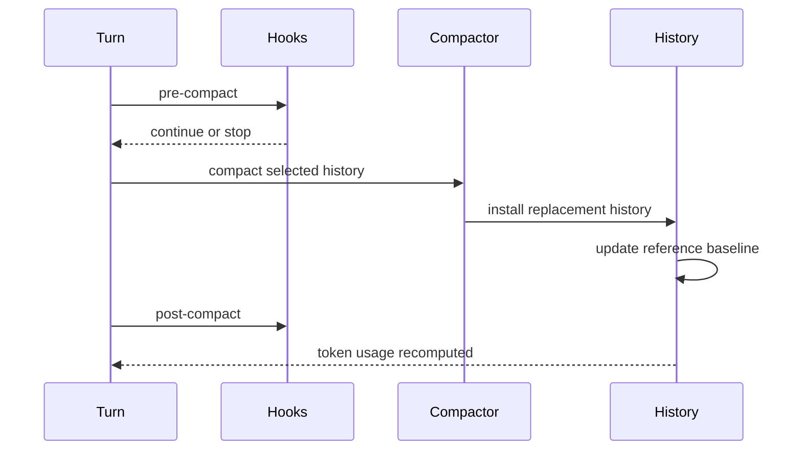
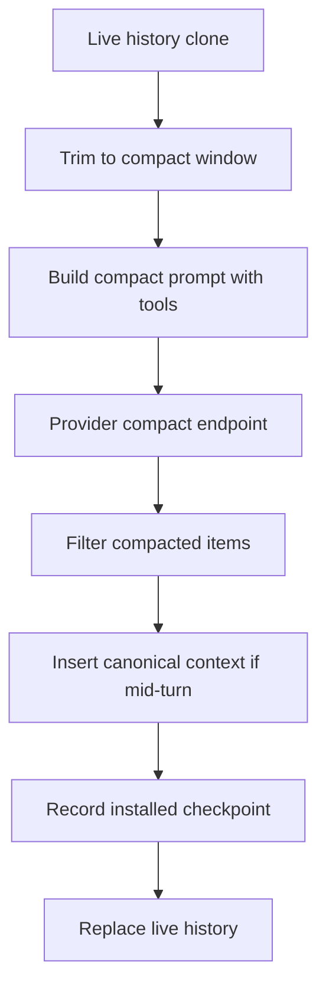

# 第 6 章：把压缩作为 Checkpoint 协议

第 5 章讲了可选上下文预算。预算只能推迟问题，不能消灭问题。长线程最终会超过有用 context window。Codex 的答案是 compaction，但关键设计不是“摘要一下旧消息”，而是把 compaction 做成 checkpoint protocol：安装 replacement history、更新 reference context baseline、发事件、跑 hooks、必要时重置 provider session state，并重新计算 token usage。

这就是 Codex 把遗忘做成受治理操作的地方。

<div class="source-equivalence">
本章对应
<a href="https://github.com/openai/codex/blob/569ff6a1c400bd514ff79f5f1050a684dc3afde3/codex-rs/core/src/compact.rs#L50">InitialContextInjection</a>,
<a href="https://github.com/openai/codex/blob/569ff6a1c400bd514ff79f5f1050a684dc3afde3/codex-rs/core/src/compact.rs#L121">local compaction flow</a>,
<a href="https://github.com/openai/codex/blob/569ff6a1c400bd514ff79f5f1050a684dc3afde3/codex-rs/core/src/compact.rs#L260">replacement-history construction</a>,
<a href="https://github.com/openai/codex/blob/569ff6a1c400bd514ff79f5f1050a684dc3afde3/codex-rs/core/src/compact_remote.rs#L84">remote compaction flow</a>，以及
<a href="https://github.com/openai/codex/blob/569ff6a1c400bd514ff79f5f1050a684dc3afde3/codex-rs/core/src/session/turn.rs#L721">pre-sampling compaction</a>。
</div>

## 两种时机，一个边界

| 时机 | Initial context 放置 | 原因 |
| --- | --- | --- |
| Manual/pre-turn | 不放进 replacement history；清 reference baseline。 | 下一个 regular turn 可以 full reinject canonical context。 |
| Mid-turn | 放在最后一个真实 user message 或 summary 前。 | 模型期待 compaction item 保持最后，同时 continuation 仍有当前 context。 |

这个区别是协议核心。Compaction 不只是更小的 history，而是按模型兼容顺序放置的更小 history。



Hooks 包住 compaction，因为 compaction 是 thread 语义状态的副作用。

## Local Compaction

Local compaction 把合成的 compaction request 追加到 history clone，然后让模型生成 summary。如果压缩过程中仍然超 window，它会删除最旧 history item 并重试，以尽量保留近期消息和 prefix cache。完成后，它取最新 assistant summary，收集用户消息，构造新 compacted history，必要时插入 initial context，安装带 replacement history 的 `CompactedItem`，重置 websocket session state，并重新计算 token usage。

```text
// 伪代码：说明 local checkpoint installation。
history = cloneLiveHistory()
history.record(compactionRequest)
summary = askModelForSummary(history.forPrompt(model))
replacement = buildHistory(recentUserMessages(history), summary)
if midTurn:
    replacement.insertBeforeLastUser(currentInitialContext)
installReplacementHistory(replacement, referenceContextForPlacement)
```

关键是 replacement history。后续 resume 不需要只靠 free-form summary 猜 compaction 意味着什么。

## Remote Compaction

Remote compaction 使用 provider compact endpoint。Codex 会先把 function-call history 修剪到 compact endpoint 能接受的窗口，构造包含当前 tools 的 prompt，调用 endpoint，过滤返回的 compacted history，必要时插入 initial context，在 rollout trace 里记录 installed checkpoint，替换 live history，并重新计算 token usage。

Provider 可以生产 compacted history，但 Codex 仍拥有过滤和安装边界。



## 为什么只有 Summary 不够

Summary 是 prose；replacement history 是 protocol state。后者可以保留 user-message boundaries、compaction item placement 和 current context insertion。它给 rollout reconstruction 一个具体 base。Summary 仍然有价值，但 checkpoint 才是真抽象。

## 应用模式

1. **Compaction Checkpoint** -> 把 compacted output 安装为 replacement history，迁移时保存 post-compaction prompt base，注意 summary-only 设计无法重建状态。
2. **Placement Mode** -> 明确 pre-turn 与 mid-turn 的 context placement，迁移时命名 placement strategies，注意一刀切插入 summary。
3. **Hooked Forgetting** -> 在语义历史重写前后运行 policy hooks，迁移时把 compaction 当作 state-changing operation，注意后台静默遗忘。
4. **Provider-Owned Work, Runtime-Owned Install** -> 让 provider 生成 compacted history，但保留本地过滤和安装，迁移到外部 summarizer 时同样适用，注意把远端输出当成天然安全。
5. **Token Recompute** -> replacement 后重新计算 usage，迁移时让旧计数失效，注意 UI 或阈值继续基于 pre-compaction totals。
