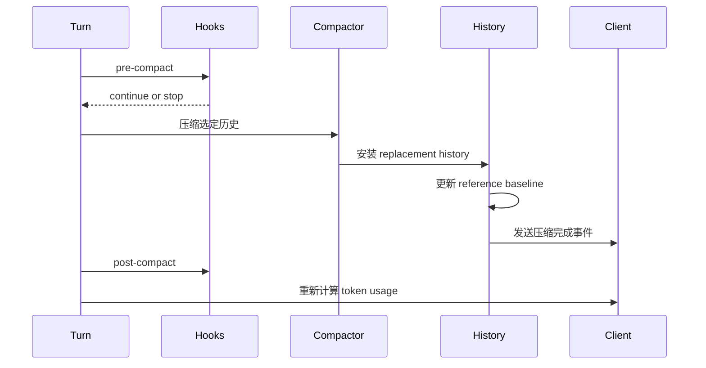
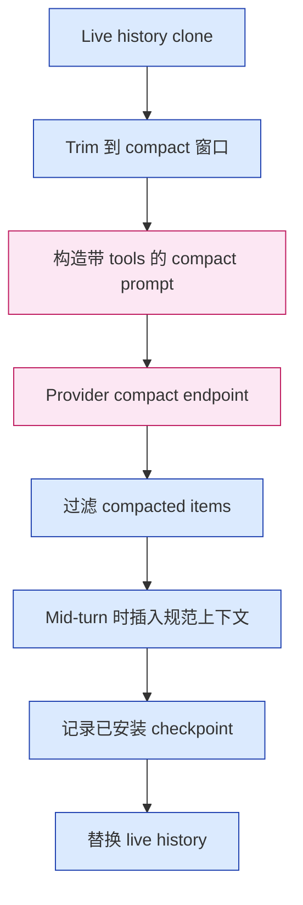

# 第 6 章：把压缩作为 Checkpoint 协议

第 5 章讨论了可选上下文预算。预算只能延后不可避免；它不能消灭。长线程最终一定会超过有效上下文窗口。Codex 的答案是 compaction，但关键设计是 compaction 是一个 checkpoint 协议。它不只是请模型摘要旧文本，而是安装 replacement history、更新 reference context baseline、发送事件、运行 hooks、必要时重置 provider session 状态、重新计算 token 使用量。

这是 Codex 把"遗忘"明确当作受治理操作的最清楚位置。

读完本章，你应该把本地和远程 compaction 理解为同一语义边界的两种实现：把 live history 替换成更小但仍能支撑后续 turn 的历史。

<div class="source-equivalence">
本章对应
<a href="https://github.com/openai/codex/blob/569ff6a1c400bd514ff79f5f1050a684dc3afde3/codex-rs/core/src/compact.rs#L50">InitialContextInjection</a>、
<a href="https://github.com/openai/codex/blob/569ff6a1c400bd514ff79f5f1050a684dc3afde3/codex-rs/core/src/compact.rs#L121">本地 compaction 流程</a>、
<a href="https://github.com/openai/codex/blob/569ff6a1c400bd514ff79f5f1050a684dc3afde3/codex-rs/core/src/compact.rs#L260">replacement-history 构造</a>、
<a href="https://github.com/openai/codex/blob/569ff6a1c400bd514ff79f5f1050a684dc3afde3/codex-rs/core/src/compact_remote.rs#L84">远程 compaction 流程</a>，以及
<a href="https://github.com/openai/codex/blob/569ff6a1c400bd514ff79f5f1050a684dc3afde3/codex-rs/core/src/session/turn.rs#L721">采样前 compaction</a>。
</div>

## 两个触发, 一条边界

Compaction 可以手动触发、采样前触发，或在 turn 中采样请求达到 auto-compact 上限且模型仍需续跑时触发。时机改变上下文放置：

| 时机 | Initial context 放置 | 原因 |
| --- | --- | --- |
| 手动或 turn 前 | 不注入 replacement history；清空 reference baseline。 | 下一次普通 turn 可以完整重新注入规范上下文。 |
| Turn 中 | 在最后一条真实用户消息或摘要之前注入。 | 模型期望 compaction item 仍在末尾，而续跑仍有当前上下文。 |

这种区分是协议的核心。Compaction 不只是"更短的历史"，而是按模型可接受的顺序放置的更短历史。



Hooks 包住 compaction，因为 compaction 是 thread 语义状态上的副作用。外部策略可能需要阻断或观察它。

## 压缩前 vs 压缩后

理解 compaction 最直观的方式是看历史的前后对比。方括号按时序分组 items，{} 标注 item 类型：

```text
压缩前 (turn 中, 接近 auto-compact 上限):

  [ initial_ctx
  | user1 | asst1 | tool_call1 | tool_out1 | asst1b
  | user2 | asst2 | tool_call2 | tool_out2 | asst2b
  | user3 | asst3 | ... 大量 items ...
  | userN ]                                <-- 触发 turn 的用户
                                           ^^^^^^ 窗口接近满

Turn 中压缩后:

  [ summary_message                        <-- replacement history 开始
  | user(recent_summarized)
  | initial_ctx                            <-- 重新插入到最后一条用户前
  | userN ]                                <-- 保留最后真实用户

Turn 前压缩后:

  [ summary_message                        <-- replacement history 开始
  | user(recent_summarized) ]              <-- baseline 已清空
```

注意 turn 中变体重新注入 `initial_ctx`，因为后续续跑仍需要运行时事实。Turn 前变体清空 baseline，让*下一次*普通 turn 从头重建 bundle。

## 本地 Compaction

本地 compaction 把合成的 compaction 请求附加到一份历史克隆，再让模型完成采样。如果 compaction 期间窗口被超出，会丢弃最旧的 item 并重试，尽量保留近期消息和 prefix cache。完成后，提取最近的 assistant 摘要、收集用户消息、构造新的 compacted history、可选地插入 initial context、安装带 replacement history 的 `CompactedItem`、重置 websocket session 状态、再重新计算 token 使用量。

```text
// 伪代码 -- 说明本地 checkpoint 安装。
history = cloneLiveHistory()
history.record(compactionRequest)
while not history.fitsModelWindow():
    history.dropOldest()
summary = askModelForSummary(history.forPrompt(model))
replacement = buildHistory(
  recentUserMessages(history),
  summary,
)
if midTurn:
    replacement.insertBeforeLastUser(currentInitialContext)
installReplacementHistory(
  replacement,
  referenceContextForPlacement,
)
```

关键在 replacement history。后续 resume 不必再从自由文本摘要去推断 compaction 的含义；它可以直接从已安装的 replacement 开始。

drop-oldest 重试循环虽小，但值得注意：它从*旧*端裁剪，使 prefix cache 命中尽可能高。朴素实现会按比例缩小整个窗口，同时损失热缓存前缀和最新消息。

## 远程 Compaction

远程 compaction 在 provider 提供 compact endpoint 时使用：把 function-call 历史裁到 compact endpoint 能容纳，构造带当前 tools 的 prompt，调用 compact endpoint，过滤返回的 compacted history，可选插入 initial context，把已安装 checkpoint 写入 rollout trace，替换 live history，再重新计算 token 使用量。

远程 compaction 不只是优化，它让 provider 在保留 Codex 拥有的语义安装边界的同时，承担一等的对话历史压缩。endpoint 可以产出 compacted history，但 Codex 决定哪些 items 存活、规范上下文放在哪。



粉色节点属于 provider，蓝色节点属于 Codex。它们之间的线就是契约：provider 生产，runtime 安装。

## 本地 vs 远程

| 方面 | 本地 compaction | 远程 compaction |
| --- | --- | --- |
| 压缩工作 | Codex 让 live 模型产出摘要。 | Provider compact endpoint 产出 compacted items。 |
| 窗口保护 | drop-oldest 重试循环。 | 请求前先 trim 到 compact 窗口。 |
| 过滤 | Codex 提取摘要并构造 replacement。 | Codex 过滤返回的 compacted items。 |
| Trace 记录 | replacement history 安装事件。 | rollout trace 中的 installed-checkpoint payload。 |
| 确定性 | 取决于 live 模型行为。 | 取决于 provider compact 契约。 |
| 兼容性 | 适用于任意模型。 | 需要 provider 支持 compact endpoint。 |

两种策略下游发出的事件是同类的：一个 resume 代码可以识别的已安装 checkpoint。差别局限在"谁生产 compacted 材料"。

## 为什么单纯摘要不够

摘要是文字，replacement history 是协议状态，差距巨大。Replacement history 能保留用户消息边界、compaction item 放置、当前上下文插入。它给 rollout reconstruction 一个具体起点。单纯文字摘要会强迫 resume 代码每次都重新解释旧事件。

一个"只摘要"的失败例子说明陷阱：

```text
只有摘要时:

  [ "之前用户修复了 bug X 并请求功能 Y；
     助手提供了 patch P 并运行命令 Q。" ]

Resume 必须推断:
  - tool call 是否被接受？
  - 命令 Q 是否成功？
  - 当前 cwd, 权限, 模型是什么？
  - patch P 是否合并了？

带 replacement history 时:

  [ summary_message
  | tool_call_record(command="Q", exit=0)
  | patch_record(file="...", status="applied")
  | initial_ctx
  | userN ]

Resume 直接读取协议 item, 不再推断。
```

Codex 仍然带摘要文本，但 checkpoint 才是真正的抽象。

## 应用模式

1. **Compaction Checkpoint** -> 把压缩输出作为 replacement history 安装，迁移时存压缩后 prompt 起点，注意只摘要的设计无法重建状态。
2. **Placement Mode** -> 让 turn 前与 turn 中 compaction 的上下文放置显式化，迁移时给放置策略命名，注意"一刀切"摘要插入。
3. **Hooked Forgetting** -> 在语义历史重写两侧运行策略 hook，迁移时把 compaction 当作状态变更，注意后台无声遗忘。
4. **Provider-Owned Work, Runtime-Owned Install** -> 让 provider 生产 compacted 历史，但过滤与安装留在本地，迁移到外部摘要器，注意把远端输出当作"已经安全"。
5. **Token Recompute** -> 替换后重新计算 usage，迁移时让旧计数失效，注意 UI 或 compaction 阈值仍以压缩前总数为基础。
