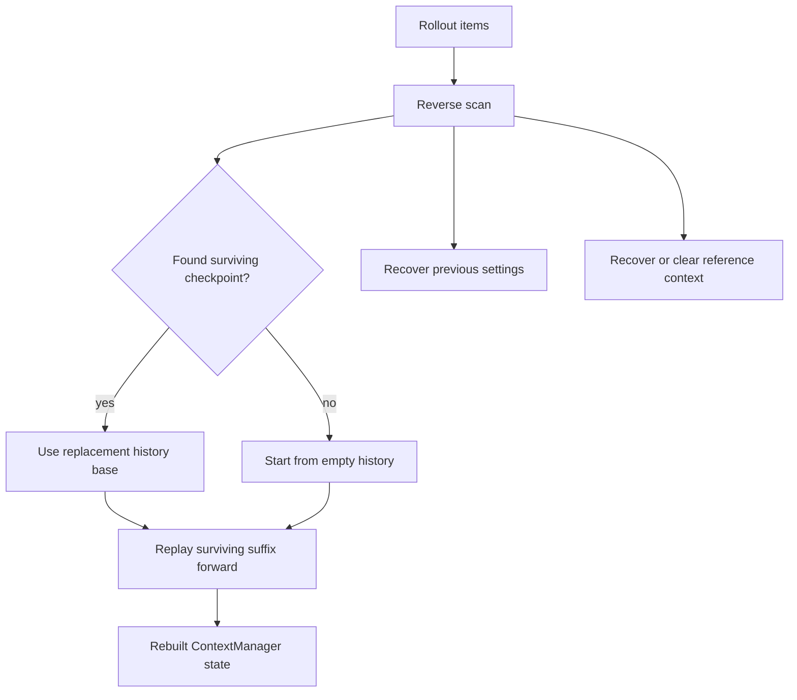

# 第 7 章：Resume、Rollback、Fork 与 Replay

第 6 章说明了 compaction 是 checkpoint 协议。这个协议只有在系统能重建有效上下文时才有价值。Codex 必须 resume 旧线程、rollback 最近 user turns、为 child agents fork 工作，并为客户端 replay 足够历史。runtime 不能在进程退出或分叉后相信内存 vector；它必须从 rollout 证据重建。

Reconstruction 代码体现了 Codex 的上下文纪律。它从新到旧扫描 rollout items，找到最新 surviving replacement-history checkpoint 和 resume metadata，然后把 surviving suffix 正向 replay。Rollback markers 在扫描时被应用，所以 rebuilt history 代表有效状态，而不是 raw event order。

<div class="source-equivalence">
本章对应
<a href="https://github.com/openai/codex/blob/569ff6a1c400bd514ff79f5f1050a684dc3afde3/codex-rs/core/src/session/rollout_reconstruction.rs#L4">RolloutReconstruction</a>,
<a href="https://github.com/openai/codex/blob/569ff6a1c400bd514ff79f5f1050a684dc3afde3/codex-rs/core/src/session/rollout_reconstruction.rs#L86">reverse reconstruction</a>,
<a href="https://github.com/openai/codex/blob/569ff6a1c400bd514ff79f5f1050a684dc3afde3/codex-rs/core/src/session/rollout_reconstruction.rs#L250">legacy compaction handling</a>,
<a href="https://github.com/openai/codex/blob/569ff6a1c400bd514ff79f5f1050a684dc3afde3/codex-rs/core/src/thread_rollout_truncation.rs#L26">user-turn rollout positions</a>，以及
<a href="https://github.com/openai/codex/blob/569ff6a1c400bd514ff79f5f1050a684dc3afde3/codex-rs/core/src/thread_rollout_truncation.rs#L57">fork-turn positions</a>。
</div>

## Reconstruction 的三个输出

| 输出 | 为什么重要 |
| --- | --- |
| Rebuilt history | 后续 turn 使用的模型可见 ledger。 |
| Previous turn settings | resume 后决定 model/realtime diff 的 metadata。 |
| Reference context item | settings diff baseline，或显式 cleared 状态。 |

后两项很容易漏掉。Resume 不只是“加载 messages”，还要恢复第 4 章 diff 系统需要的 context baseline。如果 compaction 清掉 baseline，resume 也必须保留这个清除动作。



## Rollback 改变过去的意义

Rollback marker 不删除 raw rollout records。它改变哪些 user-turn segments 算作 effective history。逆向扫描时，“丢掉最新 N 个 user turns”被解释成“跳过接下来 N 个 finalized user-turn segments”。这样 Codex 保留审计证据，同时重建用户要求的状态。

Rollout truncation helpers 也遵循同一思想：user-message positions 会在应用 rollback markers 时更新；fork-turn positions 同时考虑真实用户消息和会触发 turn 的 assistant inter-agent envelope。

## Fork Boundary 不只是人类消息

多 agent 工作让上下文边界更复杂。child agent 可能从 assistant inter-agent envelope 开始，而不是普通 user message。Codex 的 fork turn 逻辑会把触发 turn 的 assistant envelope 当作 boundary，以保留 delegated work 的语义单元。

```text
// 伪代码：说明 effective fork truncation。
for item in rollout:
    if item.isRollbackMarker():
        removeRolledBackInstructionTurns()
    if item.isRealUserMessage() or item.isTriggeringAgentEnvelope():
        rememberForkBoundary(item.position)
return suffixStartingAtNthBoundaryFromEnd()
```

如果你的 runtime 有多种启动工作的方式，truncation 就必须理解所有方式。

## Legacy Compaction

源码仍然兼容没有 replacement history 的旧 compaction 记录。它会从用户消息和 compaction message 重建 compacted history，清掉 reference baseline，并接受不那么理想的 prompt 形状。这个兼容路径说明了新 checkpoint 协议存在的原因：只有 summary 不够。

## 应用模式

1. **Replay From Evidence** -> 从 append-only rollout facts 重建上下文，迁移时把 live memory 当 cache，注意 resume 路径相信 stale in-memory state。
2. **Reverse Checkpoint Search** -> 逆向扫描找最新 surviving base，迁移到 event-sourced 系统时适用，注意有 checkpoint 还全量 replay 整个 log。
3. **Rollback Marker** -> 把 rollback 记录为事件，迁移时在 reconstruction 阶段应用 marker，注意破坏性编辑 log 擦掉审计性。
4. **Semantic Boundaries** -> 显式定义 user、agent 和 fork turn boundaries，迁移到每种工作来源，注意 truncation 只理解人类消息。
5. **Legacy Bridge** -> 保持兼容路径但清掉不安全 baseline，迁移时正确性优先于完美 prompt 形状，注意把旧记录当新 checkpoint。
