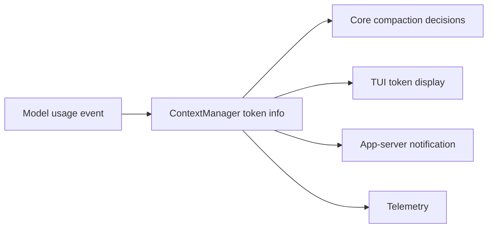

# 第 8 章：面向客户端的上下文

第 7 章说明 runtime 能从 rollout 证据重建有效上下文。最后一层是暴露。用户和客户端需要看到上下文状态：token usage、compaction warning、realtime mode、thread history，以及 attach 到旧线程时 replay 的 usage。Codex 通过 TUI、app-server notifications、realtime context、rollout trace 和 telemetry 暴露这些事实。规则仍然一样：客户端渲染上下文，runtime 拥有上下文。

这个分离可以避免 UI 变成另一个 context manager。TUI 可以显示剩余上下文，app-server 可以 replay token usage，trace 可以解释 compaction，但 live history ledger 和 turn envelope 仍然在 core。

<div class="source-equivalence">
本章对应
<a href="https://github.com/openai/codex/blob/569ff6a1c400bd514ff79f5f1050a684dc3afde3/codex-rs/tui/src/token_usage.rs#L1">TUI token usage formatting</a>,
<a href="https://github.com/openai/codex/blob/569ff6a1c400bd514ff79f5f1050a684dc3afde3/codex-rs/app-server/src/request_processors/token_usage_replay.rs#L1">app-server token usage replay</a>,
<a href="https://github.com/openai/codex/blob/569ff6a1c400bd514ff79f5f1050a684dc3afde3/codex-rs/core/src/compact_remote.rs#L239">remote compaction trace installation</a>,
<a href="https://github.com/openai/codex/blob/569ff6a1c400bd514ff79f5f1050a684dc3afde3/codex-rs/core/src/context_manager/updates.rs#L89">realtime context updates</a>，以及
<a href="https://github.com/openai/codex/blob/569ff6a1c400bd514ff79f5f1050a684dc3afde3/codex-rs/core/src/session/turn.rs#L474">post-sampling token checks</a>。
</div>

## Token Usage 是 Context Surface

TUI token usage 模型区分 input、cached input、output、reasoning output 和 total tokens，并根据 baseline-adjusted context window 计算剩余百分比。这个 baseline 是展示选择，不是 runtime 唯一预算规则。core runtime 仍然使用 model info 和 token usage 触发 compaction。



同一个 runtime fact 进入多个 surface，这能让 UI 保持诚实。

## App-Server Replay

客户端 attach 到已有线程时，app-server 可以只给这个 connection 发送 restored token usage update。源码明确把这看成 lifecycle replay，而不是新的 model event。这样不会重复持久化 usage records，也不会让其它订阅者收到历史 usage update。

归属也很谨慎：如果最新 token count 的 turn id 仍然存在于 rebuilt thread，就使用它；如果 reconstruction 后 turn ids 变化，就回退到 token count 持久化时 active turn 的位置。

```text
// 伪代码：说明 replay attribution。
owner = findTurnActiveWhenLatestTokenCountWasPersisted(rollout)
if rebuiltThread.hasTurn(owner.id):
    notify(connection, owner.id, usage)
else:
    notify(connection, rebuiltThread.turnAt(owner.position), usage)
```

## Realtime 是 Context，不只是 Transport

Realtime state 出现在 settings update logic 中。进入或退出 realtime 会产生模型可见指导，因为 realtime 改变的是交互契约，而不只是字节传输方式。这再次说明第 2 章的 envelope 设计：client metadata 和 realtime flags 属于 turn context，因为它们改变 runtime contract。

## Trace 保留 Compaction 证据

Remote compaction 会记录 installed checkpoint payload，其中包含 input history 和 replacement history。这个 trace boundary 不同于后续 inference request。这样的区分让 reducer 和调试工具能准确表示：provider compact 了一份 history，Codex 安装了另一份 live history，后续 sampling 使用更新后的 prompt projection。

## 应用模式

1. **Runtime-Owned Display** -> 让客户端渲染 context facts 但不拥有它们，迁移时从 runtime events 派生 UI state，注意 UI-only context 模型从未看见。
2. **Connection-Scoped Replay** -> 只向 attach 的观察者 replay 历史 context facts，迁移到 resumed clients 时适用，注意 replay events 看起来像新 live events。
3. **Attribution Fallback** -> 先按 id、再按 position 归属 restored usage，迁移到 rebuilt timelines，注意 regenerated ids 破坏 UI state。
4. **Mode as Context** -> 交互模式改变行为时把它当模型可见上下文，迁移时 diff mode state，注意 transport flags 对 prompt 隐形。
5. **Semantic Trace Boundary** -> 把 context rewrite trace 成 install event，迁移时分离 compaction input 和后续 sampling input，注意 observability 把不同阶段压成一个 blob。
