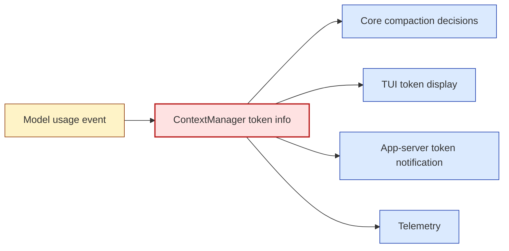
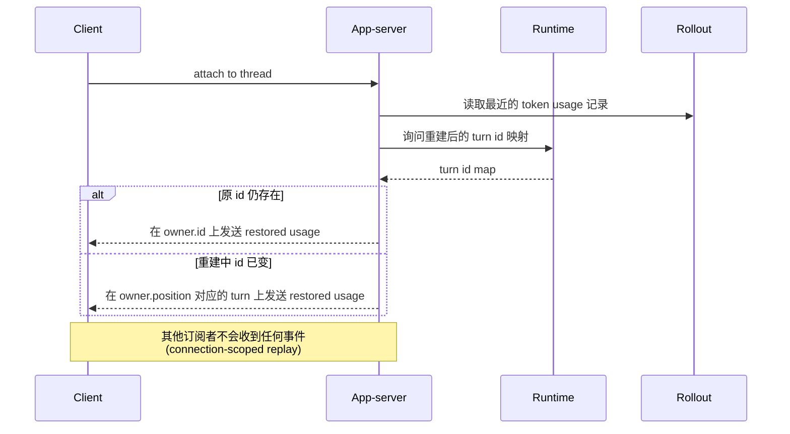

import ClientFanoutMap from "../../../src/components/visual/ClientFanoutMap.tsx";

# 第 8 章：面向客户端的上下文

<ClientFanoutMap lang="zh" client:visible />

第 7 章展示了 runtime 可以从 rollout 证据重建有效上下文。最后一层是暴露：用户和客户端需要看到上下文状态：token usage、compaction 提示、realtime 模式、thread 历史，以及附加到已存在线程时的回放 usage。Codex 通过 TUI、app-server 通知、realtime context 模块、rollout trace 和 telemetry 暴露这些事实。核心规则始终是：客户端渲染上下文，runtime 拥有上下文。

这种分离让 UI 不会变成另一个 context manager：TUI 可以显示剩余上下文，app-server 可以回放 token usage，trace 可以解释 compaction，但 live 历史账本和 turn envelope 留在 core。

读完本章，你应该把客户端面理解为 runtime 拥有的上下文状态的投影。

<div class="source-equivalence"> 本章对应 <a href="https://github.com/openai/codex/blob/569ff6a1c400bd514ff79f5f1050a684dc3afde3/codex-rs/tui/src/token_usage.rs#L1">TUI token usage 格式化</a>、 <a href="https://github.com/openai/codex/blob/569ff6a1c400bd514ff79f5f1050a684dc3afde3/codex-rs/app-server/src/request_processors/token_usage_replay.rs#L1">app-server token usage 回放</a>、 <a href="https://github.com/openai/codex/blob/569ff6a1c400bd514ff79f5f1050a684dc3afde3/codex-rs/core/src/compact_remote.rs#L239">远程 compaction trace 安装</a>、 <a href="https://github.com/openai/codex/blob/569ff6a1c400bd514ff79f5f1050a684dc3afde3/codex-rs/core/src/context_manager/updates.rs#L89">realtime 上下文更新</a>，以及 <a href="https://github.com/openai/codex/blob/569ff6a1c400bd514ff79f5f1050a684dc3afde3/codex-rs/core/src/session/turn.rs#L474">采样后 token 检查</a>。 </div>

## 客户端面与它们的 owner

Codex 通过几个面暴露上下文。表很短但值得记住：

| 面 | 它显示什么 | Runtime owner | Owner 错位时的失败模式 |
| --- | --- | --- | --- |
| TUI token bar | input/cached/output token 与剩余比例。 | `ContextManager.token_info` + 显示 baseline。 | UI 自己造一个预算数字。 |
| App-server token 通知 | 已连接客户端的实时 token usage 事件。 | 采样后的 token usage 事件。 | 客户端从文本渲染推断状态。 |
| App-server 回放 | 重新连接时恢复的 token usage 更新。 | rollout 证据 + 重连作用域。 | 回放把事件复制给其他订阅者。 |
| Realtime fragment | Realtime 模式起止作为模型上下文。 | `TurnContext.modes` + 设置更新。 | 模式只在 transport 出现, prompt 里看不到。 |
| Rollout trace | 已安装 checkpoint, compaction 原因。 | compaction 安装事件。 | trace 把 compact-input 与后续 prompt 混在一起。 |

最右一列才是关键。每个面都有一种"runtime 不是真相来源"时的精确失败方式。

## Token Usage 是上下文面

TUI token usage 模型把 input、cached input、output、reasoning output 和 total token 分开，再相对于经过 baseline 调整的上下文窗口计算剩余百分比。这个 baseline 是显示选择，不是 runtime 的唯一预算规则。Core runtime 仍然用模型信息和 token usage 触发 compaction。



同一份源事实喂给多个面。这就是 UI 不撒谎的原因。模式是"从一个事实 fan-out"，而不是"让每个消费者算自己的数字"。如果 TUI bar 与 compaction 阈值不一致，那是 bug，不是显示偏好。

## App-Server 回放

客户端附加到已有 thread 时，app-server 可以向那条连接发送一次恢复后的 token usage 更新。代码把这当作生命周期回放，而不是新的模型事件。这避免了重复持久化的 usage 记录，也避免向其他订阅者发送旧更新带来的困扰。

Attribution 很谨慎：如果最近持久化的 token 计数有显式 turn id 且重建后的 thread 仍包含它，就用那个 id；如果重建中 turn id 变化，则回退到 token 计数出现时记录的活动 turn 位置。

```text
// 伪代码 -- 说明回放归属。
owner = findTurnActiveWhenLatestTokenCountWasPersisted(rollout)
if rebuiltThread.hasTurn(owner.id):
    notify(connection, owner.id, usage)
else:
    notify(connection, rebuiltThread.turnAt(owner.position), usage)
```

模式很微妙：客户端回放是"连接作用域"的，因为它向新观察者解释历史，而不是一次新的 runtime 事件。



图说明了为什么这次 replay 事件只发给附加的客户端：其他订阅者已经在事件实时发生时看过它，再发一次会被当成新模型动作，扰乱它们的状态。

## Realtime 是上下文, 不只是 transport

Realtime 状态出现在 settings update 逻辑中。Realtime 起止可以发出模型可见指引。这是正确的，因为 realtime 改变的是模型该如何交互，而不只是字节的传输方式。如果语音或 realtime 客户端改变了交互契约，模型必须看到关于这种模式的上下文。

这强化了第 2 章的信封理念：客户端元信息和 realtime 标志属于 turn context，因为它们改变 runtime 契约。

一张小对比表说明这层动作：

| 处理方式 | 结果 |
| --- | --- |
| Realtime 仅作 transport 标志。 | 模型继续输出长篇文字, 音频客户端却期待 turn 短答。 |
| Realtime 作为 context fragment。 | 模型收到显式指引: 短回合, 预期被打断, 留出沉默。 |

正确的处理跨过了一层边界：原本是客户端元信息，因为在模型层面会改变语义，被提升为 prompt 可见状态，而不只是停留在线路层。

## Trace 提供 Compaction 证据

远程 compaction 记录已安装 checkpoint payload，里面包含输入历史与 replacement history。这条 trace 边界与之后的推理请求不同。这种区分让 reducer 与 debugger 能精确表达发生了什么：provider 压缩了一份历史，Codex 安装了另一份 live 历史，未来采样使用更新后的 prompt projection。

好的可观测性不只是数 token，它还保留语义边界。

```text
一次 compaction 周围的 trace 流:

  ... usage(turn N-1)
    -> compaction_pre_hook(turn N)
    -> compact_input(payload = old history clone)        [phase 1]
    -> compact_output(payload = compacted items)         [phase 1]
    -> compaction_install(payload = replacement history) [phase 2]
    -> usage(post-compact recompute)                     [phase 2]
    -> compaction_post_hook(turn N)
    -> sample_request(payload = new prompt projection)   [phase 3]
  ... usage(turn N) ...
```

三阶段同处一条 trace：compact、install、sample。朴素 trace 会把它们折成一个"compaction 事件"，让单独审计每个阶段变得不可能。

## 应用模式

1. **Runtime-Owned Display** -> 客户端渲染上下文事实但不拥有它，迁移时让 UI 状态从 runtime 事件派生，注意只在 UI 存在的上下文模型从未看到。
2. **Connection-Scoped Replay** -> 历史上下文事实只回放给正在附加的观察者，迁移到 resume 客户端，注意 replay 事件被当成新事件。
3. **Attribution Fallback** -> 恢复 usage 时优先按 id, 其次按位置归属，迁移到重建时间线，注意重新生成的 id 破坏 UI 状态。
4. **Mode as Context** -> 改变行为的交互模式视为模型可见上下文，迁移时 diff 模式状态，注意 transport 标志对 prompt 隐藏。
5. **Semantic Trace Boundary** -> 把上下文重写当作 install 事件 trace，迁移时区分 compaction input 与后续 sampling input，注意 observability 把多阶段折成一团。
