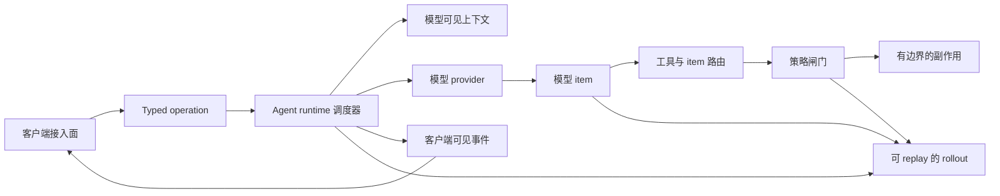
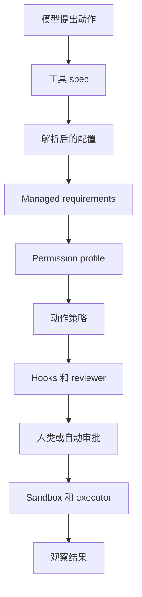

# 第 1 章：架构赌注：作为有边界操作系统的 Agent

序言提出了本书的核心判断：Codex 值得研究，不是因为它只是把聊天界面接到模型上，而是因为它把语言模型产品做成了一个系统。这个系统接收意图、保存状态、调用工具、执行策略，并把过程证据报告给不同客户端。本章要命名这背后的架构赌注：Codex 把 Agent 当成一个有边界的操作系统来设计。它不是管理整台机器的通用操作系统，而是一个调度工作、仲裁权限、记录事实、并向多个客户端暴露稳定契约的运行时。

“有边界”是关键词。通用操作系统必须承载任意进程、设备、用户、文件系统和网络。Codex 把世界缩小到一个明确领域：AI 辅助的软件工程对话。它仍然需要类似操作系统的职责，但每项职责都被产品词汇约束住。

| 类操作系统职责 | Codex 中的职责 |
| --- | --- |
| 进程调度 | 管理 turn、工具调用、取消、后台任务。 |
| 系统调用 | 接收 typed operation，而不是任意私有方法调用。 |
| 设备驱动 | 路由模型请求、shell 命令、文件编辑、MCP 工具和 hooks。 |
| 权限控制 | 编译审批策略、沙箱策略、permission profile 和 managed requirements。 |
| 日志 | 追加 rollout 记录，并发出客户端可观察事件。 |
| 用户会话 | 创建、恢复、fork 和重建 thread。 |

这个视角比“聊天包装器”更准确。包装器主要转发消息；有边界的操作系统则定义什么可以进入、什么可以发生、什么必须记录、谁可以观察。


<div class="source-equivalence">

## 源码地图

| 概念 | 源码锚点 |
| --- | --- |
| 运行时词汇 | [`codex-rs/protocol/src/protocol.rs`](https://github.com/openai/codex/blob/569ff6a1c400bd514ff79f5f1050a684dc3afde3/codex-rs/protocol/src/protocol.rs#L125) |
| 操作枚举 | [`codex-rs/protocol/src/protocol.rs`](https://github.com/openai/codex/blob/569ff6a1c400bd514ff79f5f1050a684dc3afde3/codex-rs/protocol/src/protocol.rs#L403) |
| 事件流 | [`codex-rs/protocol/src/protocol.rs`](https://github.com/openai/codex/blob/569ff6a1c400bd514ff79f5f1050a684dc3afde3/codex-rs/protocol/src/protocol.rs#L1249) |
| 会话门面 | [`codex-rs/core/src/session/mod.rs`](https://github.com/openai/codex/blob/569ff6a1c400bd514ff79f5f1050a684dc3afde3/codex-rs/core/src/session/mod.rs#L366) |

</div>

## 架构赌注

这个系统的核心命题可以写成一句契约：

> Codex 是一个 event-sourced agent runtime；危险能力只能通过 typed
> contracts、policy gates 和 replayable boundaries 暴露。

这句话里的每个词都承担架构含义。

Event-sourced 意味着系统把结构化事实当成持久记录。用户消息、turn 开始、模型 item、工具调用、patch 审批、shell 结果、turn 完成，都不只是屏幕文本。它们是可以 replay、reduce、映射成 app-server item、并用于恢复 thread 的事实。

Agent runtime 意味着模型不是架构本身。模型是调度器里的强大部件。运行时决定何时构造上下文、何时调用 provider、何时派发工具、何时请求审批、何时取消、何时结束。

Typed contracts 意味着客户端和子系统交换的是有名字的结构，而不是私有实现对象。命令行、终端 UI、headless exec、app-server、SDK 和测试都依赖这个纪律。

Policy-gated side effects 意味着模型意图不等于执行权限。工具调用可以请求运行命令或修改文件，但运行时仍然要评估配置、requirements、hooks、沙箱、审批和执行位置。

Replayable boundaries 意味着系统要保存足够的结构化证据来解释或重建工作。Codex 可以是交互式的，但它不是一次性脚本。



图里刻意没有从模型直接指向文件系统或 shell 的箭头。最重要的架构信息之一，恰恰是那条不存在的路径。

## 核心词汇

Part I 的任务是建立后续章节共同使用的语言。下面这些词不是装饰性的名称，而是系统的承重名词。

| 术语 | 含义 |
| --- | --- |
| Thread | 持久的对话和工作上下文。Thread 有身份、配置、历史和可恢复状态。 |
| Turn | Thread 内一次由用户驱动的工作单元。一个 turn 可以流式输出、调用工具、请求审批，并最终完成、失败或被中断。 |
| Item | 对话或工作的结构化片段：用户输入、assistant 输出、reasoning summary、工具调用、命令输出、patch 更新或状态事实。 |
| Operation | 提交给 runtime 的 typed request，例如开始 turn、中断工作、批准动作、刷新工具状态。 |
| Event | Runtime 发出的 typed fact，供客户端、持久化和 projection 使用。Event 描述已经发生的事，而不是 UI 指令。 |
| Tool | 通过 spec 暴露给模型、再通过 runtime handler 执行的能力。Spec 不等于执行权限。 |
| Rollout | 用于 replay 和重建 thread 历史的 append-only 记录。 |
| Permission profile | 解析后的策略包络，描述 Agent 能读、写、执行或访问什么。 |
| Client surface | 使用 runtime 的方式：终端 UI、`exec`、app-server、SDK、桌面集成或测试 harness。 |

Operation 和 event 的区别，是本书的第一条重要边界。Operation 是请求，event 是事实。请求可以被拒绝、延迟、转换或路由；事实应当足够持久，让后续代码不必询问最初的调用者就能理解它。

## 为什么从契约开始

很多系统可以从外到内讲：安装工具、运行命令、看屏幕、再读实现。这种方式适合上手，但容易遮蔽架构。Codex 有多个产品接入面，而没有哪个接入面单独等于整个系统。

终端 UI 是 runtime 的客户端。Headless `exec` 是 runtime 的客户端。App-server 是围绕 runtime 的客户端边界。SDK 是协议客户端。Cloud task、plugin、MCP、review 等流程也复用更深层的词汇。若本书从某个 UI 开始，读者很容易把产品体验误认为架构契约。

契约优先还能避免 Agent 系统里的常见错误：把模型响应当成事实来源。在 Codex 里，模型响应是 runtime 的输入之一。真正持久的事实，是被接受的 operation、发出的 event、工具决策和 rollout 记录。

## 把 Turn 看成系统调用

当用户提交工作时，操作系统类比会变得具体。一个 user turn 类似高级系统调用：它通过受控边界进入，并通过事件返回结果，而不是直接修改内部状态。

```text
// Pseudocode - illustrative pattern.
function handle_user_turn(thread, user_input, turn_overrides):
    operation = make_operation("start_turn", user_input, turn_overrides)
    enqueue(thread.submissions, operation)

    while thread.has_active_work():
        event = await_next_runtime_event(thread)
        persist_to_rollout(thread, event)
        publish_to_clients(thread, event)

        if event.requests_side_effect:
            decision = evaluate_policy(event.requested_effect)
            if decision.requires_human:
                publish_to_clients(thread, make_approval_request(decision))
                decision = await_approval_response(thread)
            if decision.allowed:
                execute_bounded_effect(event.requested_effect)
            else:
                record_denial(thread, decision)
```

这段是说明性伪代码，不是源码复刻。它强调的是形状：

1. 意图以 typed operation 进入。
2. Runtime 进展以 event 离开。
3. 持久化在工作推进时记录事实。
4. 副作用需要单独决策。
5. 客户端观察并偶尔回答请求，但不拥有 runtime。

这个形状会在后续章节反复出现。配置先解析，协议定义 operation 能携带什么，session loop 调度 turn，工具执行评估副作用，app-server 把 core event 映射成客户端通知，终端 UI 渲染这些通知。

## 三种历史

Codex 必须区分多种历史，因为它们回答的问题不同。

| 历史 | 回答的问题 |
| --- | --- |
| 模型可见上下文 | 模型在生成下一个 item 时应该看到什么？ |
| Rollout 记录 | 这个 thread 按 replay 顺序发生了什么？ |
| 可查询 projection | 客户端怎样快速 list、filter、resume 或 summarize？ |

初学者可能期待一份 transcript 解决所有问题。这很诱人，但很脆弱。模型需要选择后的上下文，而不是每个内部事件。Replay 需要结构化保真，而不是漂亮文本。客户端需要快速 projection，而不是每次列表都完整 replay。把这些历史拆开，是 Codex 更像 runtime 而不是 API 脚本的原因之一。

## 权限是分层的

模型可以提出动作，但 Codex 在任何危险动作发生前都会分层仲裁权限。这些层不会被折叠成一个布尔值。

配置表达用户和环境偏好。Managed requirements 可以限制这些偏好。Permission profile 描述最终能力包络。Policy 评估具体动作。Hooks 可以加入组织特定检查或上下文。人类审批用于那些不能静默决策的情况。Sandbox 和 execution backend 在真正执行工作的地方提供第二道防线。



这种分层会带来摩擦，但这是有用的摩擦。它让 workspace 可以使用严格规则，而不需要改模型提示。它让 headless 客户端可以拒绝交互式审批，而不需要重写工具执行。它也让兼容性桥接可以继续读取旧 rollout，同时让新的 permission profile 演进。

## 客户端接入面可替换

Codex 的架构假设产品接入面会变多。终端 UI 需要流式更新和审批弹窗。Headless 命令需要机器可读输出和确定性的退出行为。App-server 需要 JSON-RPC、请求串行化和重新加入语义。SDK 需要生成模型和稳定 schema。所有这些都受益于 runtime 统一拥有 thread、turn、item、operation 和 event。

这就是为什么本书从契约开始。如果终端 UI 就是架构，新的客户端只能复制它或绕过它。如果 runtime contract 才是架构，客户端可以各不相同，而不需要 fork Agent。

## Apply This：应用模式

1. **先命名运行时名词。** 设计 Agent 功能前，先定义会跨越子系统边界的持久名词。
2. **把意图和权限分开。** 允许模型请求副作用，但让另一层决定副作用是否可以发生。
3. **记录事实，而不是屏幕。** 持久化可 replay、可 projection 的结构化事件，而不是只保存渲染后的文本。
4. **让客户端位于契约下游。** UI、CLI、SDK 和服务接入面都应消费同一套 operation 和 event 词汇。
5. **把约束当成架构。** Policy、requirements 和 sandboxing 是 runtime 设计的一部分，不是工具执行完成后再补上的安全补丁。

## 小结

有边界操作系统这个模型解释了为什么 Codex 先围绕契约组织，再围绕界面组织。第 2 章会进入第一个具体边界：安装后的命令如何到达 Rust command router，同时又不让分发胶水变成产品架构。
