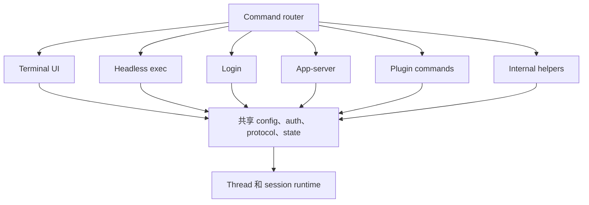

# 第 2 章：从分发包装器到 Rust Router

第 1 章把 Codex 描述成一个有边界的操作系统：runtime 接收 typed operation，发出 event，并在副作用前执行策略闸门。本章进入用户触碰到的第一条边界：安装后的命令。这里的设计刻意保持不对称。JavaScript 负责分发机制，Rust 负责产品路由和 runtime 集成。

这条分界很容易被低估。许多命令行产品从一个脚本开始，然后脚本逐渐长出业务行为。Codex 避免了这种形状。面向 npm 的入口选择正确的 native artifact，调整进程环境，转发信号，然后退出架构中心。Rust binary 解析命令，解析共享启动状态，并分发到不同产品接入面。

结果不只是一个更快的可执行文件，而是一条架构边界：分发层可以知道 binary 怎样被找到，但不应该知道 Agent 怎样工作。


<div class="source-equivalence">

## 源码地图

| 概念 | 源码锚点 |
| --- | --- |
| npm 启动包装器 | [`codex-cli/bin/codex.js`](https://github.com/openai/codex/blob/569ff6a1c400bd514ff79f5f1050a684dc3afde3/codex-cli/bin/codex.js#L1) |
| Rust 命令路由 | [`codex-rs/cli/src/main.rs`](https://github.com/openai/codex/blob/569ff6a1c400bd514ff79f5f1050a684dc3afde3/codex-rs/cli/src/main.rs#L106) |
| App 命令边界 | [`codex-rs/cli/src/app_cmd.rs`](https://github.com/openai/codex/blob/569ff6a1c400bd514ff79f5f1050a684dc3afde3/codex-rs/cli/src/app_cmd.rs#L5) |
| App-server daemon 命令 | [`codex-rs/cli/src/main.rs`](https://github.com/openai/codex/blob/569ff6a1c400bd514ff79f5f1050a684dc3afde3/codex-rs/cli/src/main.rs#L417) |

</div>

## 启动链路

启动路径可以分成四个概念阶段：


分发包装器存在，是因为用户会通过需要平台特定 artifact 的包渠道安装 Codex。它检测主机平台，找到匹配的 native package 或 vendored binary，在需要时加入 helper 路径，标记 install context，启动 native executable，并镜像进程退出状态。这些任务都不需要理解 thread、turn、approval、model 或 tool。

随后 Rust binary 处理真正属于产品的工作。它可以启动终端 UI、运行 headless execution、管理登录、暴露 MCP 命令、运行 app-server、检查 feature flags、应用 Agent 产出的 diff、恢复或 fork thread、启动 sandbox helper，或调用隐藏的内部工具。Router 很宽，但这种宽度是显式的。

| 层 | 拥有 | 不应拥有 |
| --- | --- | --- |
| 包装器 | 平台选择、binary 定位、信号转发、安装标记。 | Runtime 行为、配置语义、认证流程、工具执行。 |
| 调用名分发 | Helper alias 和单 binary 复用。 | 产品策略或用户可见决策。 |
| Rust command router | 根 flags、subcommands、隐藏内部命令、dispatch。 | 属于共享 crates 的长期 session 行为。 |
| 产品接入面 | TUI、exec、app-server、login、review、cloud、plugin、MCP。 | Config、auth 或 runtime loop 的重复实现。 |
| 共享 runtime crates | Config、auth、protocol、session、tools、state、sandboxing。 | 分发渠道假设。 |

## 作为交付胶水的 JavaScript

包装器的工作很机械，但很关键。它把“用户运行了安装后的命令”转换为“正确的 native executable 正在带着正确环境运行”。这包括平台选择、optional dependency 查找、vendored artifact fallback、额外 helper path、包管理器标记和信号处理。

从架构上看，包装器是 bootloader。Bootloader 小，不代表它不重要；它重要，正因为它受约束。如果包装器开始解释 feature flag、读取项目配置或决定审批行为，产品就会拥有第二套控制平面。Rust runtime 将不再是命令行为定义的唯一位置。

```text
// Pseudocode - illustrative pattern.
function wrapper_main(argv, environment):
    target = detect_platform_target(environment)
    binary = locate_native_binary(target)
    helper_paths = discover_packaged_helper_paths(target)
    child_environment = environment.with_path_prefix(helper_paths)
    child_environment.set("install_origin", detected_package_manager())
    result = spawn_and_forward_signals(binary, argv, child_environment)
    exit_like_child(result)
```

这段伪代码表达的是边界。包装器不会解析“启动 thread”或“批准 patch”。它转发参数，并保持进程行为。

## 用调用名做路由

Native binary 启动后，Codex 还会根据可执行文件的调用方式进行第二层 dispatch。在类 Unix 系统里，一个 binary 可以在通过不同名字或受控参数调用时表现为多个 helper 工具。Codex 用这个模式支持 sandbox 启动、patch application、filesystem helper execution、shell escalation 等路径。

这是一个务实的交付决策。发布许多 executable 会增加打包复杂度、版本偏移和路径发现问题。用一个 binary 加受控 helper alias，可以让 release artifact 更简单，同时仍然给内部子系统稳定的 executable 名称。

这个模式也有代价：启动时必须在普通命令解析前检查 invocation metadata。这个检查必须保持窄而确定。如果它长成产品级命令处理，就会和 command router 竞争。只要控制得当，它能让 runtime 把稳定 helper path 传给后续子系统，而不是把安装布局写死。

## Rust Router

Command router 是产品第一次清晰显形的地方。它的根命令接收全局配置覆盖、feature toggles、remote options 和默认 interactive prompt。Subcommands 表示被支持的产品接入面。

| 接入面 | 架构角色 |
| --- | --- |
| Interactive UI | 基于共享 runtime 的 inline terminal client。 |
| Headless execution | 面向 prompt、review 和机器输出的非交互客户端。 |
| Login / logout | 凭据生命周期和状态检查。 |
| MCP commands | 工具协议集成的配置和 server 入口。 |
| App-server | 面向丰富客户端和 SDK 的 JSON-RPC 边界。 |
| Plugin / marketplace commands | 扩展打包和发现流程。 |
| Sandbox / exec-server helpers | 执行位置和隔离能力。 |
| Resume / fork | 基于持久状态的 thread 生命周期操作。 |
| Debug / feature commands | 面向 generated catalogs、trace 和 flags 的检查接入面。 |

Router 不会让所有流程都变简单；它让这些流程变显式。读者只要看 command tree，就能在阅读 session loop 之前知道产品有哪些接入面。

## 隐藏命令仍然是契约

有些命令不会出现在普通 help 输出里，因为它们服务内部或实验流程。隐藏不等于随意。隐藏命令仍然有解析后的参数、测试和启动模型里的位置。这比把同样行为藏在临时环境变量或非结构化 shell 片段里更安全。

这对 helper process 尤其重要。Sandbox、app-server proxy、schema generation、trace reduction、内部 relay 常常需要命令行入口。把它们作为 first-class parsed commands，可以让 release system、测试和其他 crates 以稳定方式调用它们。

## 薄产品接入面

Router 的核心设计纪律，是让产品接入面成为共享 runtime crates 上的薄层。Interactive mode 不应该拥有独立 config resolver。Headless execution 不应该拥有独立 auth 模型。App-server 不应该发明第二套 thread store。Review 不应该变成不相关的 Agent loop。

这个纪律让后续章节可以把 Codex 解释成一个系统。每个接入面都有特殊行为，但共同部分位于共享契约之后：



这个 foundation 不是便利库，而是系统防止产品接入面漂移的架构手段。

## Install Context 是元数据

Codex 还会保留 install context。一个 binary 可能来自 npm、Bun、Homebrew、standalone archive、desktop app 或未知来源。不同来源可能需要不同的更新提示、bundled helper 发现或诊断信息。关键在于，install context 是元数据，而不是行为权限。它应该解释进程从哪里来、打包资源在哪里；它不应该决定模型能否编辑文件。

这种分离避免交付关注点泄漏到策略层。Managed account requirement 应该约束 runtime 设置，而不关心 binary 怎样安装。Sandbox helper 应该能被发现，而不关心哪个产品接入面在运行。启动阶段把安装事实传下去，是为了让后续层不用重新探测世界。

## Router 为什么影响后续章节

后续章节都依赖这条启动分界。配置和认证可以讲一次，因为所有主要命令路径都会到达同一个 foundation。协议可以作为产品边界来讲，因为 app-server、TUI 和 exec 都是共享 runtime 概念之上的接入面。工具执行可以作为 runtime capability 来讲，因为包装器不会绕过它。

因此 router 有两种职责：分发命令，并保护系统形状。

## Apply This：应用模式

1. **让分发胶水保持低行为含量。** Wrapper 可以寻找并启动产品 binary，但产品语义应留在主实现里。
2. **用一个 router 表达产品意图。** 一个宽而显式的命令树，比散落在启动路径里的隐藏行为更容易推理。
3. **让 helper 入口显式化。** 内部工具也应有 typed arguments 和确定性 dispatch。
4. **把安装事实作为事实传递。** Package origin 和 helper path 是元数据，不是第二套 policy system。
5. **把共享行为下沉到接入面之下。** TUI、headless execution、app-server 和 plugins 应复用同一套 config、auth、protocol 和 runtime foundation。

## 小结

命令到达 Rust 时，分发关注点已经被压缩成元数据和 helper path。第 3 章会继续讨论 router 在任何接入面安全开始工作前必须解析的内容：配置、认证、feature state 和 managed requirements。
