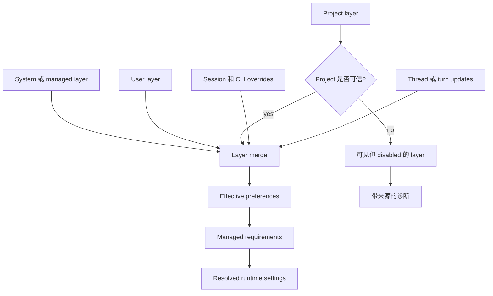
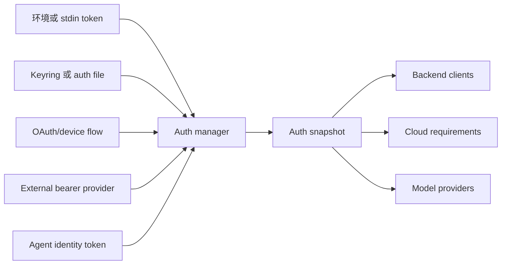

import ConstraintEnvelopeBuilder from "../../../src/components/visual/ConstraintEnvelopeBuilder.tsx";

# 第 3 章：配置、认证与 Managed Requirements

<ConstraintEnvelopeBuilder lang="zh" client:visible />

第 2 章沿着启动路径，从分发包装器走到了 Rust command router。当 router 知道要启动哪个产品接入面之后，Agent 仍然不能立刻开始工作。它必须先解析运行包络：effective configuration、authenticated identity、feature state，以及 managed requirements。

本章讨论的正是这个包络。Codex 不允许每个子系统各自读取喜欢的配置文件或环境变量。系统会构造一份解析后的、带来源信息的视图，并把受约束的 runtime settings 交给后续层。这个不变量非常关键：session loop、model provider、tools、app-server、hooks 和 sandboxing 代码应该消费同一个答案：“这里允许什么？”

## 配置是一组 Layer，不是一个文件

Codex 配置是分层的。有些 layer 来自 system 或 managed settings；有些来自用户 home config；有些来自 project；还有些来自命令行覆盖、session state 或 thread-level choices。重点不只是优先级，还包括 provenance，也就是来源。



图中的 disabled layer 很重要。Project-local configuration 可以被发现，即使 trust 阻止它影响 runtime 行为。这比假装该 layer 不存在更好。客户端可以解释为什么某个值被忽略，用户也可以决定是否信任该项目。

Layering 还让诊断成为可能。如果某个设置失败，Codex 可以区分“未知字段”“被更高优先级 layer 覆盖”“因为项目未受信任而 disabled”“被 requirements 拒绝”。这些是不同问题，对应不同解决方式。

## Preference 与 Requirement 不同

常见配置错误，是把所有设置都当成 preference。Codex 没有这样做。Preference 表示用户或接入面想要什么；requirement 表示环境允许什么。Requirements 是 restrictive overlays。

例如，用户 preference 可能请求一个宽松的 sandbox mode。Managed requirement 可能只允许更严格的 permission profile。正确结果不是把二者作为同级配置合并，而是让 requirement 约束 preference，并在 preference 无法合法化时产生带来源的失败。

| 概念 | 角色 |
| --- | --- |
| Config layer | 表达期望的默认值或覆盖。 |
| Feature flag | 控制 staged behavior、aliases、warnings 和 dependencies。 |
| Requirement | 限制合法 resolved values 的集合。 |
| Constrained value | 同时携带允许值和约束来源。 |
| Resolution error | 解释哪个来源让请求值非法。 |

这也是 Codex 开始表现得像 enterprise-ready local runtime 的地方。Managed account 或 host policy 可以约束 network behavior、filesystem access、approval style、hooks、plugins、MCP servers、web search、residency 和 permission profiles，而不需要修改每个产品接入面。

## Trust-Gated Project Configuration

Project configuration 很有用，因为不同仓库需要不同默认值。它也危险，因为仓库可能来自别人。一个本地 Agent 如果盲目遵守 project config，就等于允许 workspace 配置一个即将检查和修改该 workspace 的工具。

因此 Codex 对 project config 做 trust gate。Loader 可以发现 project layer，保存它的来源，并展示它存在；但不安全的 project-local values 需要 trust，才能变成 effective。这里不是一个特殊 case，而是一种设计模式。系统不需要知道哪个 UI 会展示 trust state；它只需要保留足够信息，让任何客户端都能解释结果。

```text
// Pseudocode - illustrative pattern.
function load_effective_settings(inputs):
    layers = []
    layers.add(load_system_layer())
    layers.add(load_user_layer())

    project_layer = discover_project_layer(inputs.cwd)
    if project_layer.exists and project_is_trusted(project_layer):
        layers.add(project_layer)
    else:
        layers.add_disabled(project_layer, reason = "project_not_trusted")

    layers.add(make_cli_override_layer(inputs.flags))
    preferences = merge_by_precedence(layers.enabled_only())

    requirements = load_requirements(inputs.auth, inputs.host)
    return constrain(preferences, requirements)
```

伪代码省略了实现细节，但保留了关键顺序：普通 preferences 先合并，requirements 后约束。

## Feature Flags 是生命周期管理

Codex 中的 feature flags 不是散落各处的字符串判断。它们有名称、默认值、阶段、aliases、warnings、dependencies，有时还有结构化配置。集中管理让产品可以演进，而不必让每个子系统都变成兼容性表。

一个 feature 可能是 experimental、staged、renamed、deprecated，或只能由 requirements 设置。用户可见命令可能需要对 alias 发出 warning。App-server schema generation 可能需要过滤 experimental fields。Runtime 代码需要检查 normalized feature state，而不是原始字符串。

这也是有边界操作系统思路的一个例子。普通程序可以在任何地方检查环境变量；一个拥有多个客户端和 generated contracts 的 runtime，需要统一的 feature vocabulary。

## 认证是一份 Snapshot

配置说明进程想做什么。认证说明是谁在做，以及哪些 backend capability 可以使用。Codex 支持多种 auth shape：API-key auth、ChatGPT OAuth、外部提供的 bearer token，以及任务型集成使用的 agent identity flows。

架构用 auth manager 隐藏这些存储和刷新差异。目标不只是方便，而是防止一个子系统使用旧凭据，同时另一个子系统已经刷新或使其失效。长时间运行的进程需要一种稳定方式来询问：“当前 auth state 是什么？遇到 unauthorized response 时能否恢复？”



Snapshot 可以代表不同 auth mode，但后续层不应该关心 token 存在哪里，也不应该关心 refresh command 怎样执行。它们关心的是能否构造 authenticated client、account metadata 是否可用、是否必须获取 policy requirements。

## Managed Requirements 与 Fail-Closed

Managed requirements 把 account 或 host policy 转成 local constraints。它们可能来自本地 managed configuration、平台管理系统，或 cloud-backed account policy。对于符合条件的 managed accounts，requirements 加载失败可能是 fail-closed 条件。这个选择有意带来不便。如果账号要求中心化策略，本地 runtime 静默跳过策略继续运行，恰好会在最需要策略时削弱可信度。

Requirements layer 也保留来源信息。由 cloud policy 约束的值，应该和由本地 requirements file 约束的值有不同报告方式。Source-aware errors 让系统能向用户、管理员和客户端接入面解释自己。

## Resolved Runtime Envelope

当某个 command surface 真正开始工作时，它应拿到一份 resolved runtime envelope：

| Envelope 字段 | 为什么必须提前解析 |
| --- | --- |
| Working directory 和 roots | Tool execution 与 project trust 依赖它们。 |
| Model 和 provider settings | Turn construction 与 auth 可能依赖 provider choice。 |
| Approval behavior | Tool routing 需要知道交互是否可能。 |
| Permission profile 与 sandbox | Side-effect policy 依赖一致的能力模型。 |
| Feature state | Protocol、UI、runtime 和 schema filtering 必须一致。 |
| Auth state | Backend calls、cloud requirements 和 model calls 需要一致身份。 |
| Managed requirements | 后续子系统不应该重新解释 policy。 |

这个 envelope 不代表永远静态。Thread 或 turn 可以更新部分设置。但更新仍然遵守同一思想：保留来源、验证约束，并让后续执行消费 resolved values。

## 应用到实践

1. **让值携带来源。** 没有 source metadata 的配置，无法解释 runtime 为什么这样运行。
2. **区分 preference 和 constraint。** 先合并期望设置，再把 requirements 作为 restrictive policy 应用。
3. **对不可信本地配置设 gate。** 可以发现 project config，但不要自动允许 project 控制 Agent。
4. **用一个 manager 归一化 auth。** Storage、refresh、OAuth 和外部 token command 应产出一致的进程级 auth snapshot。
5. **在非法 envelope 上早失败。** 不要让 tools、models 或 clients 在副作用已经开始后才发现 policy 冲突。

## 小结

第 2 章中的 router 现在可以用一份 resolved operating envelope 启动接入面。第 4 章会转向让这些接入面和 runtime 共享同一种持久语言的边界：operations、events、model items、app-server messages 和 generated protocol schemas。

<div class="source-equivalence">

## 源码地图

| 概念 | 源码锚点 |
| --- | --- |
| 解析后的权限 | [`codex-rs/core/src/config/mod.rs`](https://github.com/openai/codex/blob/569ff6a1c400bd514ff79f5f1050a684dc3afde3/codex-rs/core/src/config/mod.rs#L236) |
| 权限编译 | [`codex-rs/core/src/config/permissions.rs`](https://github.com/openai/codex/blob/569ff6a1c400bd514ff79f5f1050a684dc3afde3/codex-rs/core/src/config/permissions.rs#L300) |
| 托管 feature gate | [`codex-rs/core/src/config/managed_features.rs`](https://github.com/openai/codex/blob/569ff6a1c400bd514ff79f5f1050a684dc3afde3/codex-rs/core/src/config/managed_features.rs#L25) |
| 公开权限 profile | [`codex-rs/app-server-protocol/src/protocol/v2/permissions.rs`](https://github.com/openai/codex/blob/569ff6a1c400bd514ff79f5f1050a684dc3afde3/codex-rs/app-server-protocol/src/protocol/v2/permissions.rs#L375) |

</div>
