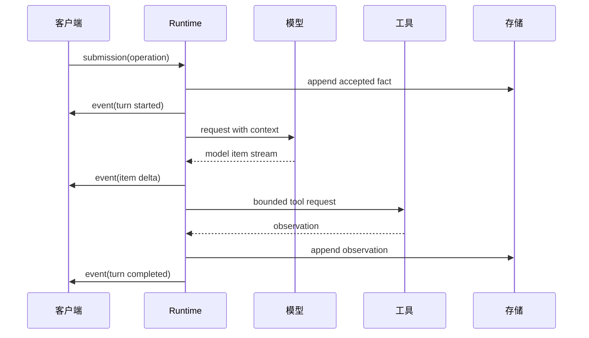
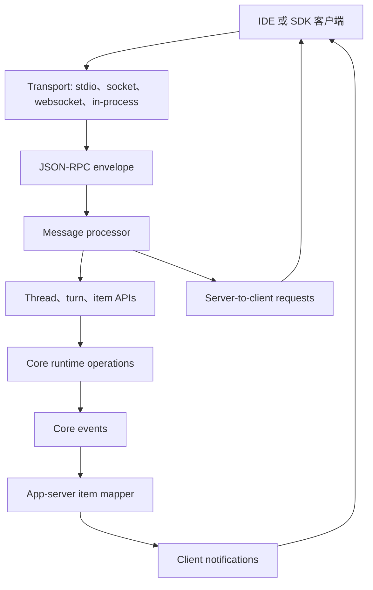
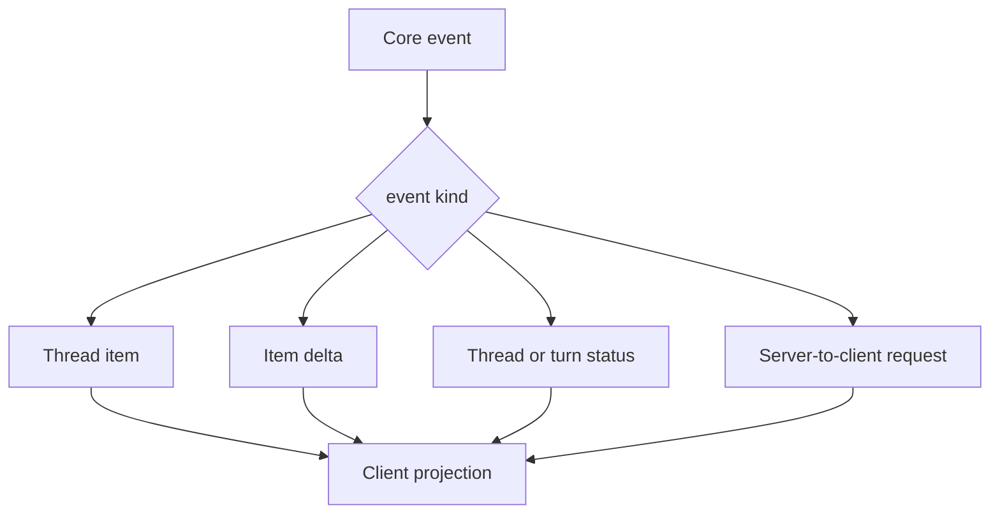
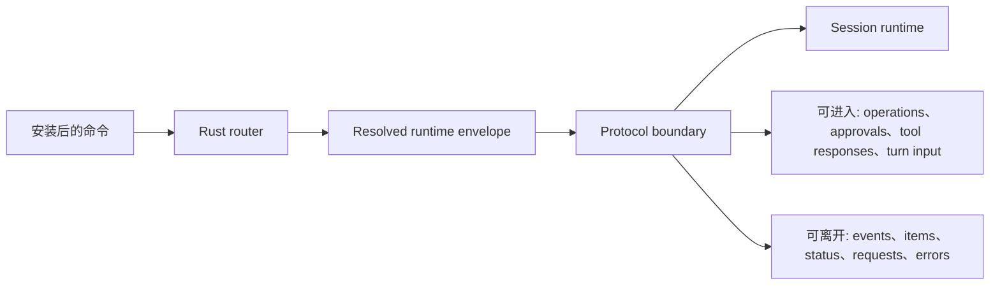

import SubmissionFlowExplorer from "../../../src/components/visual/SubmissionFlowExplorer.tsx";

# 第 4 章：协议边界

<SubmissionFlowExplorer lang="zh" client:visible />

第 3 章说明，Codex 只有在配置、认证、feature state 和 managed requirements 被解析成受约束的 runtime envelope 之后，才会开始工作。本章解释承载工作的语言。协议边界是这样一个位置：产品意图不再是私有方法调用，而变成持久消息，包括 submissions、events、model items、app-server JSON-RPC requests、server-to-client requests 和 generated schemas。

协议是产品边界，不是序列化附属品。它告诉客户端可以请求什么，告诉 runtime 必须报告什么，也告诉未来版本已经继承了哪些兼容性义务。

## Core Runtime Protocol

Core runtime protocol 的外层形状很简单：

| 方向 | 概念 | 含义 |
| --- | --- | --- |
| 进入 runtime | Submission | 由客户端或 host 发送的排队工作单元。 |
| 进入 runtime | Operation | Submission 内部的 typed action：开始 turn、中断、批准、响应工具请求、刷新状态等。 |
| 离开 runtime | Event | Runtime 发出的有序事实。 |
| 离开 runtime | Event message | 事实的 typed payload：setup、progress、item delta、approval request、tool result、completion、error。 |

这个拆分让 runtime 像 evented kernel 一样工作。客户端不直接调用私有 session 方法。它们提交 operation，并观察 event。Runtime 可以根据 active state 对 operation 排队、拒绝、转换或串行化。



序列图经过简化，但契约准确：只有 runtime 会把提交的意图转换为持久进展。

## Item 不只是 Message

简单聊天应用里，“message”往往足以承载大部分系统。Codex 需要更丰富的 item vocabulary。一个 thread 可能包含用户文本、图片、模型输出、reasoning summary、命令调用、命令输出、文件变化、审批记录、工具观察、plan update、hook activity、realtime transcript 和 collaboration event。

把这些都叫 message，会掩盖关键差异：不同 item 在 streaming、persistence、display、replay 和 compatibility 上有不同规则。Command output delta 不应该被当作 assistant paragraph。Patch update 不应该被当作模型可见 instruction。Approval request 在被 resolve 前也不是最终历史。

因此 item model 是架构词汇。它让 runtime、app-server、终端 UI、SDK 和 rollout reducers 能对正在处理的事实类型达成一致。

## App-Server JSON-RPC

App-server 引入第二条协议边界。它不是 core runtime protocol 的替代品，而是围绕 threads、turns、items、approvals、filesystem APIs、process APIs、MCP、plugins、account state 和 remote-control flows 的客户端侧分布式系统层。

它的 wire shape 类似 JSON-RPC：request 期待 response，notification 不期待 response，error 携带结构化失败信息，server-to-client request 允许 runtime 侧要求已连接客户端作出决定，例如 approval 或 input。Codex 刻意保持 envelope 轻量，但 request、response、notification 的区别仍然是核心。



App-server boundary 加入了本地终端 UI 往往可以隐藏的关注点：connection initialization、experimental capability negotiation、request serialization、backpressure、replay on rejoin、thread listeners、pending approvals 和 derived status。这些都是协议问题，因为客户端可能是拥有独立生命周期的另一个进程。

从 core events 到 app-server items 的映射，是这里最重要的翻译层：



客户端不应该通过解析 terminal text 来重建这个 projection。Server 统一完成映射，暴露稳定的 item 和 notification shape，并保留足够的 request id 与 pending-request state，把 decision 重新连接回它解锁的 turn。

## 从 App Request 到 Core Operation

App-server model 使用 thread、turn、item、environment selection 等用户可见概念。Core runtime 使用 submission 和 operation。因此，一个 start turn 请求必须先验证，再翻译。

```text
// Pseudocode - illustrative pattern.
function handle_turn_start(request, connection):
    require_initialized(connection)
    require_experimental_fields_enabled(request, connection.capabilities)

    thread = find_loaded_thread(request.thread_id)
    overrides = resolve_turn_overrides(request)
    operation = build_runtime_operation(
        kind = "user_turn",
        input = request.input_items,
        settings = overrides
    )

    turn = register_in_progress_turn(thread)
    submit_to_core(thread, operation)
    return response_with_turn(turn)

function map_core_event(event):
    item_update = reconstruct_thread_item(event)
    if item_update.exists:
        notify_client("item_updated", item_update)
    if event.requests_client_decision:
        send_server_request(event.decision_request)
```

这仍然是伪代码。关键思想是带验证的翻译。App-server 不是把任意 JSON 盲目转发给 core 的隧道。它拥有客户端契约，并把该契约映射到 runtime operations。

## Generated Schemas 作为治理

Generated schemas 让协议可以在 Rust 之外被审计。JSON Schema 和面向 TypeScript 的 artifact，让客户端、测试和 release checks 能发现 drift。它们也迫使 source types 携带足够元数据，从而区分 stable surface 和 experimental surface。

Schema generation 是一种架构治理。没有它，一个字段可能被加到 Rust type 上，然后意外成为客户端义务。有了它，协议演进必须经过 exported contracts、compatibility filters 和能注意到变化的测试。

这尤其重要，因为 Codex 不止一种客户端生成目标。Rust app-server client、Python SDK、generated TypeScript bindings 和 test clients 都需要共享 wire model，即使它们暴露的 ergonomics 并不相同。

## Compatibility 是代码路径

Codex 中的协议兼容性是显式的。某些值接受 legacy aliases。旧请求形式和新的 turn-context operation 共存。App-server v1 和 v2 概念有重叠。Experimental fields 由 connection capability gate，并从 stable schema output 过滤。Deprecated fields 即使被忽略，也可能继续被接受，以便旧客户端还能工作。

这不是偶然的杂乱，而是协议边界的成本。字段一旦跨越边界，删除它就不再等同于重构私有 helper。它可能破坏 terminal、SDK、daemon、extension 或已持久化 rollout。

有边界操作系统的类比在这里也有帮助。操作系统为了旧应用保留系统调用兼容性。想支持多个客户端的 Agent runtime，也会继承一个较小版本的同样义务。

## 什么能进入，什么能离开

到 Part I 结束，架构已经建立了四道 gate：



Runtime 强大，恰恰因为边界狭窄。客户端可以启动或 steering 工作、中断工作、回答 approval request、提供 dynamic tool output、刷新外部状态，或请求 thread 生命周期动作。客户端可以观察 setup、streaming、tool activity、approval prompts、errors、completion 和 reconstructed items。它不能伸进 session 里直接修改私有状态。

## 应用到实践

1. **让协议名词持久化。** 如果客户端依赖某个概念，就在协议里命名它，而不是泄漏私有实现状态。
2. **区分 envelope 和 domain payload。** Request IDs、responses、errors、notifications 和 tracing 应位于 Agent-specific payload 之外。
3. **在边界处翻译。** 面向 app 的请求应被验证并映射成 runtime operation，而不是作为任意 JSON 转发。
4. **给 experimental surface 加 gate。** Experimental fields 需要 runtime checks 和 generated-contract filtering，而不只是文档标签。
5. **把 compatibility 当成行为。** Aliases、deprecated fields 和 v1/v2 bridges 应是被测试的代码路径，而不是历史注释。

## 小结

Part I 建立了契约：分发层到达 Rust router，router 解析受约束的 runtime envelope，protocol messages 定义什么可以进入或离开 Agent。Part II 可以在这个基础上打开 runtime 本身，从 threads、sessions 和 durable state 开始。

<div class="source-equivalence">

## 源码地图

| 概念 | 源码锚点 |
| --- | --- |
| Core submission 与 event | [`codex-rs/protocol/src/protocol.rs`](https://github.com/openai/codex/blob/569ff6a1c400bd514ff79f5f1050a684dc3afde3/codex-rs/protocol/src/protocol.rs#L125) |
| App-server JSON-RPC envelope | [`codex-rs/app-server-protocol/src/jsonrpc_lite.rs`](https://github.com/openai/codex/blob/569ff6a1c400bd514ff79f5f1050a684dc3afde3/codex-rs/app-server-protocol/src/jsonrpc_lite.rs#L37) |
| V2 协议族 | [`codex-rs/app-server-protocol/src/protocol/v2/mod.rs`](https://github.com/openai/codex/blob/569ff6a1c400bd514ff79f5f1050a684dc3afde3/codex-rs/app-server-protocol/src/protocol/v2/mod.rs#L1) |
| Event 到 item 映射 | [`codex-rs/app-server-protocol/src/protocol/event_mapping.rs`](https://github.com/openai/codex/blob/569ff6a1c400bd514ff79f5f1050a684dc3afde3/codex-rs/app-server-protocol/src/protocol/event_mapping.rs#L30) |
| Schema 导出 | [`codex-rs/app-server-protocol/src/export.rs`](https://github.com/openai/codex/blob/569ff6a1c400bd514ff79f5f1050a684dc3afde3/codex-rs/app-server-protocol/src/export.rs#L1) |

</div>
