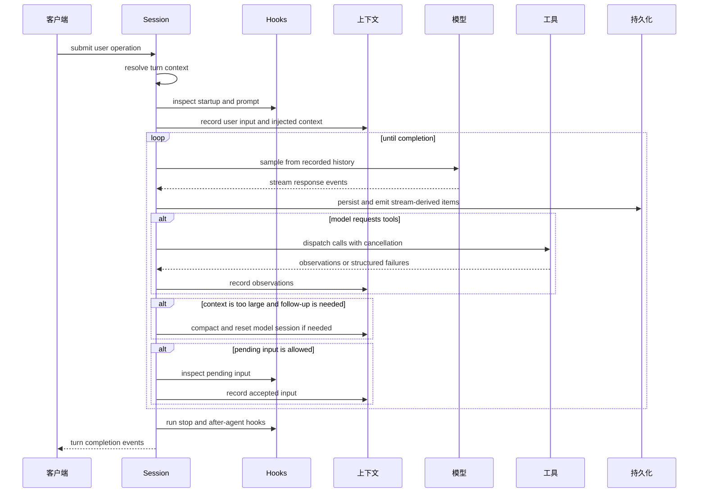
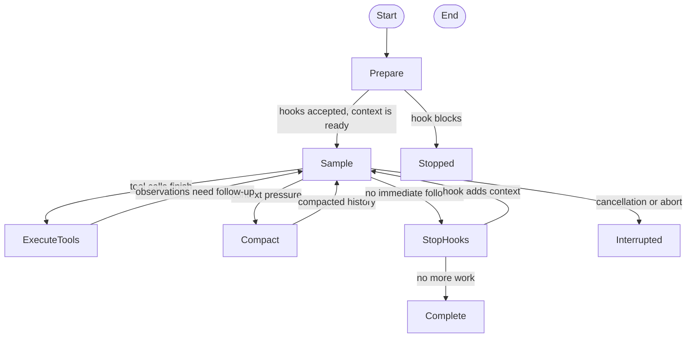

# 第 6 章：Turn Loop：Agent 真正发生的地方

第 5 章区分了 durable thread 和 live session，也说明了客户端 operation
如何进入 runtime。本章跟随其中一个 operation 进入 turn loop：这里把
调度、上下文、流式输出、工具、hooks、compaction 和 cancellation 组合成
真正的 Agent 行为。

<div class="chapter-lede">
  <p><strong>问题：</strong>一次用户 turn 不能实现成一次模型请求，因为模型可能请求工具，hook 可能添加工作，用户可能中断，上下文也可能需要修复。</p>
  <p><strong>主张：</strong>turn 是一个受控状态机；它的产物既是用户可见回答，也是可持久化的 runtime facts。</p>
  <p><strong>心智模型：</strong>loop 在两个问题之间切换：模型可以看见什么，runtime 可以执行什么。</p>
</div>

## 一次 Turn 的形状

当 submission loop 判断用户输入应该成为被调度的工作时，一次 turn 就开始了。
session 解析 `TurnContext`，安装 active turn，并在 cancellation token 之下
运行循环。从这一刻开始，关键子系统都会参与：hooks 检查输入，skills 和
plugins 注入上下文，model client 流式返回事件，tool router 分发副作用，
persistence 记录 items，telemetry 观察进展。



这张图有意画成循环。Codex 之所以像 Agent，是因为模型输出可以通过工具、
观察结果、compaction 和 pending user input 改变下一次模型输入。

## Sampling 前的准备

第一次模型请求之前，loop 已经做了大量工作。它先确认确实有输入或 pending
work，然后准备 model client session，必要时复用预热好的 transport state。
如果已有上下文已经接近 token 上限，它会先评估 pre-sampling compaction。
随后，turn context update 会被记录下来，让后续 replay 知道这次 turn
处于什么设置之下。

接着，runtime 解析 turn-scoped extension context。显式提到的 skill 可能变成
注入指令；plugin 和 app mention 可能要求读取工具或 connector inventory；
dependency prompt 可能让客户端补齐缺失环境变量或能力；user-prompt hook
则可以在模型看到输入之前接受、增强或阻止本次 turn。

| 准备事项 | 为什么必须在 sampling 前完成 |
| --- | --- |
| Turn context | 模型请求必须反映已解析 runtime 设置，而不是陈旧默认值。 |
| Initial compaction | loop 不应该发起一个注定放不进上下文窗口的请求。 |
| Context injection | skills、plugins 和 additional context 必须可持久化、可见。 |
| Hook inspection | 策略和扩展点需要在采样前阻止或修改工作。 |
| Accepted prompt recording | hook 接受之后，prompt 和上下文才进入 replay。 |

所以 turn loop 不是“把最新文本丢给模型”。它从已记录的 runtime state 构造
一个可复现的模型请求。

## Loop 的状态机

Turn loop 最好理解成状态机，而不是一个长函数。



这张图比完整伪代码更准确，因为核心不在某一段实现，而在继续条件。只有存在
明确原因时 loop 才继续：工具 follow-up、accepted pending input、compaction，
或者 stop hook 添加了新的模型可见工作。没有原因，turn 就应当落定。

准备阶段的概念路径很短，但顺序严格：

```text
// Pseudocode - preparation gate.
session = prepare_model_transport()
maybe_compact_before_first_sample(session)
context = resolve_turn_context_candidates()
reject_if_prompt_hooks_block(input, context)
record_accepted_inputs_and_context(input, context)
```

这个顺序很重要。prompt-submit hook 可以在用户 prompt 成为已接受 runtime
history 之前停止 turn。发生这种情况时，持久记录应该解释 hook 决定，而不是
假装被拦截的 prompt 已经进入模型可见对话。

采样阶段是唯一直接接触 provider 的地方，但它马上把 provider event 转回
runtime fact：

```text
// Pseudocode - sampling continuation.
events = sample_model(recorded_history(context), tool_specs(context))
persist_stream_items(events.items)
observations = dispatch_completed_tool_calls(events.tool_calls)
record_observations(observations)
```

停止不是被动返回，而是另一道可能继续添加工作的关卡：

```text
// Pseudocode - stop hook continuation.
decision = run_stop_hooks(last_assistant_message)
if decision.added_context:
    record_hook_context(decision.added_context)
    continue_sampling()
complete_turn()
```

## Streaming 是 Runtime Input

流式输出常被说成 UI 特性，但在 Codex 里它也是 runtime input。stream 会携带
assistant text、reasoning summary、response item、tool-call delta、completion
signal、rate-limit 信息和 transport error。turn loop 不能等一个最终字符串
回来之后再判断发生了什么。

随着 stream event 到达，Codex 会把它们映射成 runtime event 和模型可见 item。
需要时启动客户端可见的 message item，累计工具参数，分发已经完成的工具调用，
记录完成的 response item，更新 usage accounting，并在 stream 路径变化时发出
warning 或 error。

这里也是 persistence 与 telemetry 汇合的位置。一次 streamed response 可能同时
产生用户可见输出、durable rollout item、tool runtime record、analytics fact、
OTEL span/metric，以及 trace payload reference。只有 turn loop 同时握有这些
上下文，才能把它们关联起来。

## 工具是 Follow-Up，不是岔路

当模型请求工具时，turn 并没有离开 loop。它通过 router 分发工具，把结果记录成
observation，并在模型需要这个 observation 时再次采样。

这个区别很重要。工具执行不是外部 callback 之后再回到一段被遗忘的对话。它仍然
属于同一个被调度的 turn，受同一棵 cancellation tree、approval policy、
turn context、diff tracker、telemetry context 和 rollout recorder 管理。

| 工具结果 | Loop 后果 |
| --- | --- |
| 成功 observation | 记录输出，通常继续 sampling。 |
| 可恢复工具失败 | 记录结构化失败，让模型可以反应。 |
| 审批被拒 | 记录拒绝事实，必要时转成模型可见结果。 |
| Cancellation | 根据发生位置返回 aborted observation 或停止 turn。 |
| Fatal runtime error | 发出 error，并安全地落定 active task。 |

第 9 章会深入工具分发。本章只需要抓住一件事：工具调用只是多个 continuation
原因之一。

## Pending Input 与 Interruption

用户和客户端可以在模型工作期间继续发送输入。Codex 不会把这些输入无脑追加到
prompt。pending input 会先进入队列，经过 hook inspection，然后被接受进当前
continuation、重新排到后续边界，或者被阻止并附加额外上下文。

interruption 也遵循同样的纪律。active turn 持有 cancellation state，长时间运行
的工作观察 child cancellation token。model stream、tool call、dynamic client
tool、approval request 和 terminal operation 都必须收束到一致的结束状态。
有用的 interrupt 不只是“丢掉 future”，还要留下后续 turn 能理解的 durable record。

## Compaction 是控制流的一部分

context compaction 不是后台摘要功能，而是 turn 内部的控制流决策。如果线程在
sampling 前就太大，Codex 可以先 compact；如果 follow-up 还必须继续，但当前上下文
已经达到模型限制，它也可以在 mid-turn compact。

compaction 可能替换模型可见 history、重置 transport state、改变 baseline context
的 reinjection 规则，并写入 resume 和 rollback 需要的 durable records。loop 只在
continuation 仍然重要时 compact。如果模型已经完成，就没有必要仅因为 usage 高而
改写历史。

## 停止也可能添加工作

停止本身也是生命周期阶段。模型看起来完成后，stop hooks 会运行。它们可以允许完成、
停止 turn、失败，或者提供额外上下文并要求再交给模型一次。after-agent hooks
接近 completion 时运行，可以报告 cleanup 或 policy failure。

goal-driven continuation 也是同一种思想。一次 turn completion 之后，如果 runtime
发现目标状态还没有满足，可以继续调度工作。所以 Agent 不是围绕“assistant text”
循环，而是围绕“明确的继续理由”进行调度。

<div class="apply-this">

## 应用到实践

1. 把 turn 建模为有明确 continuation reason 的状态机，而不是一次 request 和一次 response。
2. 从 recorded context 推导 prompt，让 streaming、tools 和 replay 共享同一个事实来源。
3. 在 hooks、extension context 和 pending input 影响模型历史之前先检查它们。
4. 把 tool result、compaction 和 stop-hook context 当成普通 loop input，而不是特殊出口。
5. 让 turn owner 管理 cancellation，使 streams、tools、approvals 和后台工作能一致收束。

</div>

## 小结

第 6 章展示了 Agent 活动真正发生的位置：turn 不断把 recorded context 转成模型请求，
把模型事件转成 runtime work，再把 runtime observation 写回 context。第 7 章会向下一层，
解释模型侧的 provider、transport、stream event normalization、model metadata、
realtime path 和 backend task API。

<div class="source-equivalence">

## 源码地图

| 概念 | 源码锚点 |
| --- | --- |
| Turn loop implementation | [`codex-rs/core/src/session/turn.rs`](https://github.com/openai/codex/blob/569ff6a1c400bd514ff79f5f1050a684dc3afde3/codex-rs/core/src/session/turn.rs#L139) |
| Prompt hook ordering | [`codex-rs/core/src/session/turn.rs`](https://github.com/openai/codex/blob/569ff6a1c400bd514ff79f5f1050a684dc3afde3/codex-rs/core/src/session/turn.rs#L313) |
| Accepted prompt recording | [`codex-rs/core/src/session/turn.rs`](https://github.com/openai/codex/blob/569ff6a1c400bd514ff79f5f1050a684dc3afde3/codex-rs/core/src/session/turn.rs#L328) |
| Model client session | [`codex-rs/core/src/client.rs`](https://github.com/openai/codex/blob/569ff6a1c400bd514ff79f5f1050a684dc3afde3/codex-rs/core/src/client.rs#L232) |
| Context manager | [`codex-rs/core/src/context_manager/history.rs`](https://github.com/openai/codex/blob/569ff6a1c400bd514ff79f5f1050a684dc3afde3/codex-rs/core/src/context_manager/history.rs#L34) |

</div>
