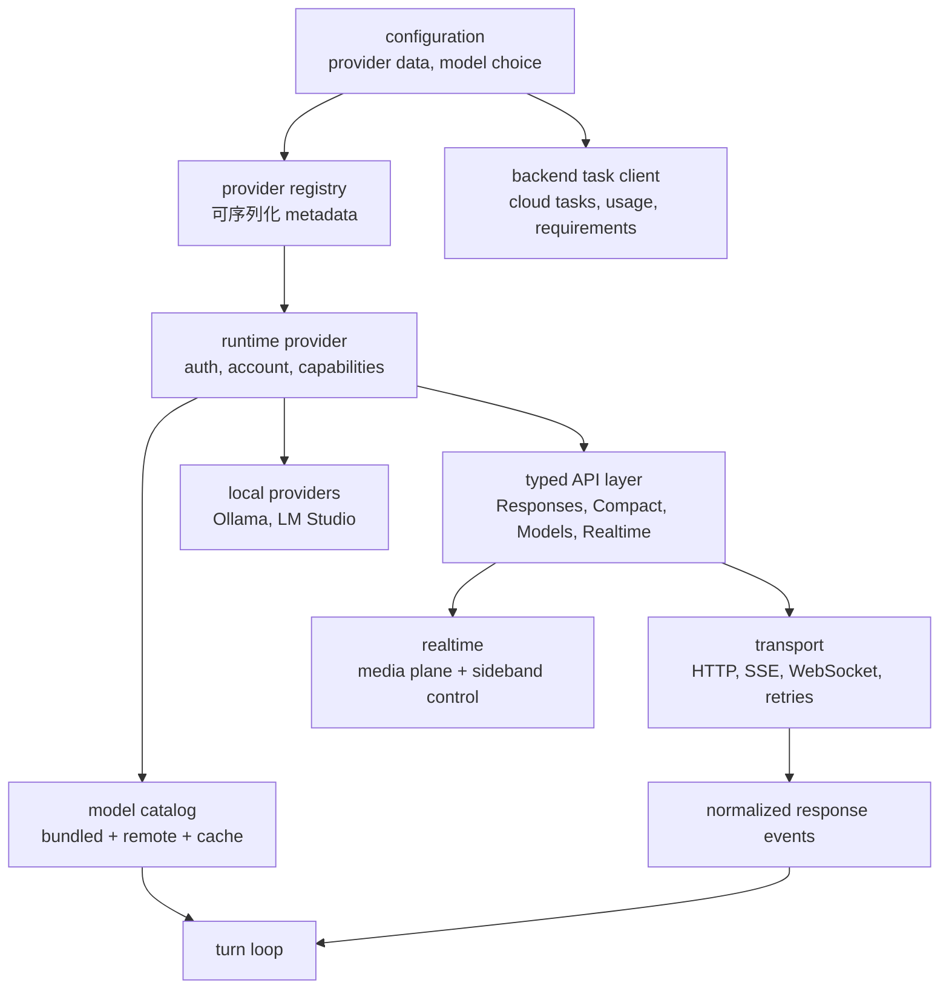
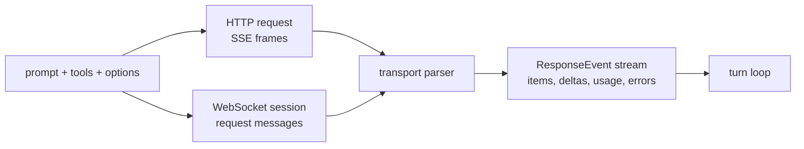
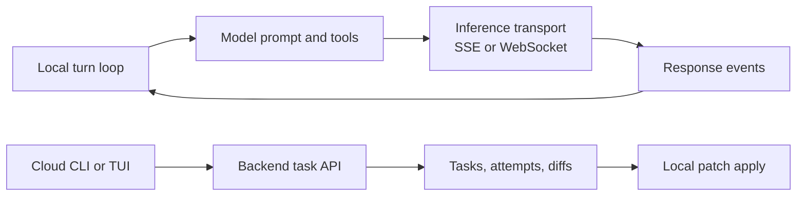

import StreamingProviderLanes from "../../../src/components/visual/StreamingProviderLanes.tsx";

# 第 7 章：模型 Provider、流式传输与 Backend Task

<StreamingProviderLanes lang="zh" client:visible />

第 6 章跟随一次 turn 走到模型 sampling 边界。本章打开这个边界，解释
Codex 如何分离 provider configuration、runtime provider behavior、typed API、
streaming transport、model catalog、realtime session 和 backend task workflow。

<div class="chapter-lede">
  <p><strong>问题：</strong>turn loop 想要的是同一种 response event stream，但不同 provider 在 URL、auth、catalog、transport、capability 和 backend task API 上都不同。</p>
  <p><strong>主张：</strong>Codex 把 inference 做成分层 client system，并让 transport 差异在事件回到 turn loop 之前收敛。</p>
  <p><strong>心智模型：</strong>provider 决定如何通信；runtime 决定 streamed events 代表什么。</p>
</div>

## 五层结构

provider 路径最好按五层理解，再加若干专门 integration。



transport layer 负责 HTTP 细节：request body、headers、compression、
retry policy、idle timeout、自定义证书、stream framing 和 telemetry hook。
typed API layer 负责 endpoint shape：Responses、compaction、model listing、
file upload、memory summarization、realtime setup 和 WebSocket session。
provider runtime 负责 account state、auth resolution、capabilities、
model-manager selection，以及 provider-specific behavior。model catalog
负责有哪些模型可用，以及哪些默认值适合当前环境。

turn loop 不应该知道如何签 AWS request、解析 SSE bytes，或者合并 remote model
overlay。它应该拿到 typed response event stream 和足够的 metadata，然后做 runtime
决策。

## Provider Data 不是 Provider Behavior

Codex 把 provider definition 存成数据：display name、base URL、wire API、auth
fields、可选 headers、query parameters、retry settings、stream settings、
WebSocket support 和 provider-specific auth metadata。这些数据可以序列化，
也可以来自 built-in 或用户配置。

runtime provider behavior 是另一层。它解析当前 auth value，暴露 account state，
声明 capability，选择 model manager，构造 API provider，并适配 body-signing
这类特殊 provider。

这种拆分是治理选择。配置文件可以描述 provider，但不应该成为可执行策略。runtime
provider 在 request time 把数据转换成受控行为。

## 多种 Transport，统一事件词汇

Responses 路径可以走 HTTP streaming，也可以走 Responses WebSocket。两者机制不同，
但在回到 turn loop 之前会收敛成同一种 runtime event vocabulary。



WebSocket 路径可以复用 session state，减少每轮 setup 成本。HTTP 路径仍然必要：
有些 provider 不支持 WebSocket；连接失败后可能需要 fallback；某些 auth mode
也无法给 WebSocket upgrade 做等价签名。runtime 可以对临时 stream failure 做 retry，
在合适时刷新 auth，并从 WebSocket fallback 到 HTTP-style streaming，而不改变 turn loop。

```text
// Pseudocode - illustrative pattern.
function sample_with_provider(prompt, context):
    provider = resolve_runtime_provider(context.provider_id)
    api = provider.make_typed_api_client()
    transport = choose_transport(provider.capabilities, context.session_state)

    repeat until retry_budget_exhausted:
        request = build_responses_request(prompt, context.model_options)
        signed_request = provider.auth.attach_credentials(request)
        stream = transport.open(signed_request)

        for event in normalize_stream(stream):
            yield event

        if stream.completed:
            return

        if transport.can_fallback_after_failure:
            transport = fallback_transport()
            continue

        backoff_and_retry()

    raise stream_failure
```

这段伪代码强调边界：provider 和 transport 的差异在 turn loop 收到 event 之前
已经被处理掉。

## Streaming Event 携带 Runtime 决策信息

normalized stream event 不只是文本。它可以包含 item creation、message delta、
reasoning summary、function-call argument delta、tool-call completion、usage
snapshot、rate-limit metadata、error classification 和 response completion。
turn loop 根据这些 event 决定是否渲染进度、分发工具、更新 rate limit、记录模型可见
item、compact history 或 retry。

因此 model client 更像 typed event adapter。它不拥有 agent policy，而是给 turn loop
提供结构化事实，让 policy 决策留在 runtime 其他位置。

## Model Metadata 是 Runtime Infrastructure

model metadata 不只是 picker list。它会影响 context limit、auto-compaction threshold、
reasoning controls、支持的输入模态、默认选择、collaboration mode、visibility 和
provider compatibility。

Codex 把 model metadata 当作 cache plus overlay。bundled catalog 给 runtime 一个
baseline；符合条件的 provider 可以刷新 remote model list，并把 overlay 合并进 cache。
model manager 可以在线、离线，或者只在 cache 缺失时联网，并按当前 auth mode 和
visibility rules 过滤 model presets。

```text
// Pseudocode - illustrative pattern.
function resolve_model_info(model_name, refresh_strategy):
    bundled = load_bundled_catalog()
    cached = read_model_cache_if_fresh()

    if refresh_strategy.allows_network and cache_is_stale(cached):
        remote, etag = provider_endpoint.list_models()
        cache.write(remote, etag)
    else:
        remote = cached.models

    catalog = merge_catalogs(bundled, remote)
    visible = filter_by_auth_and_visibility(catalog)
    return choose_model_info(visible, model_name)
```

turn loop 消费的是结果事实。这个事实来自 bundled data、cache，还是 fresh remote
overlay，不应该泄露到 turn loop 里。

## Body-Aware Auth 应该留在 Request Boundary

有些 provider 只需要简单 bearer-token header；有些需要 command-backed token、
provider-specific account state，或者 body-aware request signing。Amazon Bedrock
风格的 signing 是典型例子：auth layer 必须看到准备好的 request body 和 canonicalized
headers，才能附加有效凭据。

这个要求解释了为什么 Codex 把 auth 放在 typed API request boundary 附近。如果 signing
逻辑泄露到 turn loop，每条 sampling path 都会继承 provider-specific rules。更好的做法是
让 provider 的 auth implementation 修改准备好的 request，transport 只发送结果。

它也解释了一个 transport 约束：body-aware signing 可能让 WebSocket 不可用，直到 upgrade
路径拥有等价签名语义。provider 可以声明这个限制，而不用改变 agent loop。

## Local Providers 与 Realtime Paths

Ollama、LM Studio 这类 local provider 仍然适合同一个 provider model，但运营关注点不同：
它们可能需要本地可用性检查、model pull progress、兼容性检查或 static catalog。runtime
仍然应该把它们看作能产出 typed response events 的 providers。

realtime 相关但不等同于普通 inference。它有 media plane，用于 audio 或 WebRTC setup；
也有 sideband/control path，用于 session configuration、text handoff、response creation
和 lifecycle event。Codex 把 realtime state 放在 session 旁边，并把 realtime events
映射回 thread event stream，但它不应该与标准 turn sampling path 混为一谈。

## Backend Task 不是 Inference

backend client 处理 task、usage、requirements、rate-limit 和 cloud workflow API。它可以
列出任务、获取任务详情、创建 task attempt、读取 backend-managed requirements，并获取 diff
或 sibling turns。这些 API 可能与 model provider 共享 auth 和 base URL 关注点，但它们不是
Responses stream。



把 backend task 分开，可以避免一个常见架构错误：把 cloud workflow state 当成另一种
model transport。cloud task 有 lifecycle、environment、attempt、diff 和 apply semantics。
model stream 有 response events。它们可能在产品流程里相遇，但不应该共享同一个 runtime 抽象。

<div class="apply-this">

## 应用到实践

1. 把 transport mechanics 放在 typed event vocabulary 之下，让 agent loop 消费同一种 stream shape。
2. provider definition 用数据表示，但把 account state、auth 和 capabilities 放进 runtime provider object。
3. 把 model metadata 当作 cache-plus-overlay infrastructure，而不是静态 picker 常量。
4. 把 body-aware signing 等特殊 auth 限定在 prepared-request boundary。
5. 即使 backend task API 与 inference 共享 credential 或 host，也要把它们与 inference transport 分开。

</div>

## 小结

第 7 章说明了 turn loop 如何接收模型事件，而不继承每个 provider 的细节。第 8 章转向
执行之后的证据：rollout persistence、diagnostic trace bundle、reducer、analytics、
OTEL、response debug context，以及 Codex “先观察，后解释”的设计原则。

<div class="source-equivalence">

## 源码地图

| 概念 | 源码锚点 |
| --- | --- |
| Model client | [`codex-rs/core/src/client.rs`](https://github.com/openai/codex/blob/569ff6a1c400bd514ff79f5f1050a684dc3afde3/codex-rs/core/src/client.rs#L215) |
| Provider prompt shape | [`codex-rs/core/src/client_common.rs`](https://github.com/openai/codex/blob/569ff6a1c400bd514ff79f5f1050a684dc3afde3/codex-rs/core/src/client_common.rs#L28) |
| Model client session | [`codex-rs/core/src/client.rs`](https://github.com/openai/codex/blob/569ff6a1c400bd514ff79f5f1050a684dc3afde3/codex-rs/core/src/client.rs#L232) |
| WebSocket behavior tests | [`codex-rs/core/tests/suite/agent_websocket.rs`](https://github.com/openai/codex/blob/569ff6a1c400bd514ff79f5f1050a684dc3afde3/codex-rs/core/tests/suite/agent_websocket.rs#L1) |
| Backend task API contrast | [`codex-rs/cloud-tasks-client/src/api.rs`](https://github.com/openai/codex/blob/569ff6a1c400bd514ff79f5f1050a684dc3afde3/codex-rs/cloud-tasks-client/src/api.rs#L9) |

</div>
