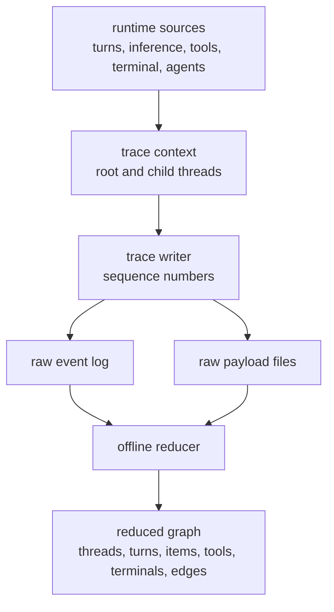
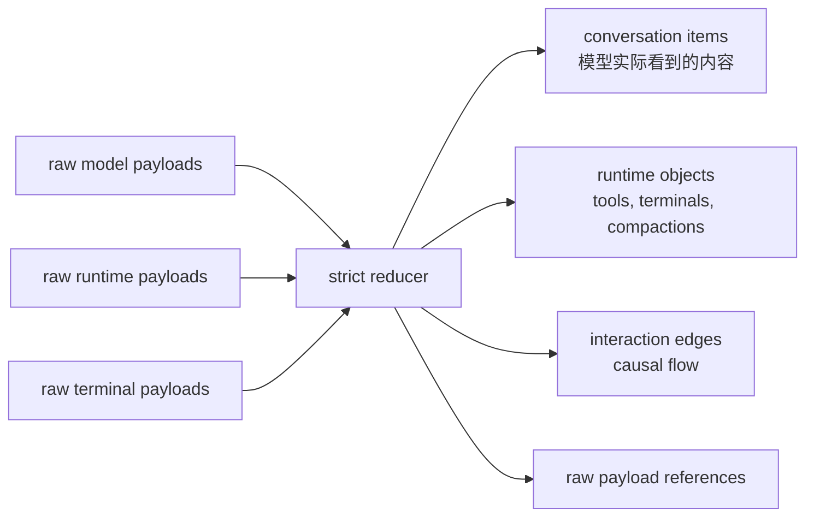

import RolloutTraceLab from "../../../src/components/visual/RolloutTraceLab.tsx";

# 第 8 章：Observability 与 Rollout Trace

<RolloutTraceLab lang="zh" client:visible />

第 7 章说明了 provider 和 transport 的差异如何收敛成统一的模型事件流。
本章继续追踪这些事件进入 runtime 之后的命运：哪些事实会为 replay 持久化，
哪些会被 reduce 成 product analytics，哪些成为 operational telemetry，
哪些作为 raw diagnostic evidence 进入 rollout trace。

<div class="chapter-lede">
  <p><strong>问题：</strong>仅凭最终 assistant message，无法调试一个 Agent runtime。</p>
  <p><strong>主张：</strong>Codex 先观察 runtime facts，再为不同受众派生 replay、analytics、traces、logs 和 graph views。</p>
  <p><strong>心智模型：</strong>transcript 只是一次运行的一个 projection，不是运行本身。</p>
</div>

## 多个 Observation Plane

Codex 有多个 observability plane，因为每个 plane 回答的问题不同。

| Plane | 主要问题 | 典型消费者 |
| --- | --- | --- |
| Rollout persistence | 这个 thread 能否 resume、fork 或 replay？ | runtime 与客户端 history reconstruction |
| Rollout trace | 哪些 raw evidence 能解释这次运行？ | 本地 debugging 与 offline graph viewer |
| Product analytics | 发生了哪些产品事件？ | 产品指标与聚合分析 |
| OTEL traces/metrics | runtime operation 表现如何？ | 运行维护与工程诊断 |
| Response debug context | 哪个 upstream request 失败了？ | 支持与 failure triage |
| Local state logs | 进程本地输出了哪些 logs？ | 本地 inspection 与 feedback bundle |

这些 plane 会有意重叠。一次工具调用可能同时是 rollout item、client event、
analytics fact、OTEL span、trace payload 和 local log line。只要每个 plane 的
retention、privacy、query 和 interpretation model 不同，这种重叠就不是坏事。

## Rollout Persistence 是 Replay Spine

rollout file 是第 5 章讲过的 durable record。它按顺序写入 items，用来重建 thread
history、session metadata、turn context、compaction boundary、rollback behavior
和选定的 event surface。它为 replay 和兼容性优化，而不是为任意 debugging 优化。

```text
// Pseudocode - illustrative pattern.
function handle_runtime_event(event):
    if event.should_be_persisted_for_replay:
        rollout.append(event.as_rollout_item)

    if event.should_update_thread_projection:
        state_database.apply(event.as_metadata_delta)

    if event.should_notify_client:
        event_stream.emit(event.as_client_event)
```

replay spine 必须保守。它要保存未来 Codex 版本理解一个 thread 所需的事实，但不应该变成
无边界的内部字节 dump。需要更深证据时，Codex 使用 rollout trace。

## Rollout Trace 捕获 Raw Evidence

rollout trace 是 opt-in diagnostic path。启用后，runtime 会记录 ordered raw events，
并把较大的 raw payload 分开保存。hot path 不会在 session 运行时构造最终 explanation
graph；它只捕获事实，把解释工作交给 offline reducer。



raw trace data 可能包含 prompts、model responses、tool inputs/outputs、terminal
output、runtime payloads 和 paths。因此它属于本地诊断，而不是普通 telemetry。这个设计的
价值在于：当 reduced graph 不足以解释 failure 时，raw payload 仍然可用。

## Raw Events 与 Reduced Graph

reduced trace graph 不是 transcript。它包含 semantic objects：agent threads、Codex turns、
model-visible conversation items、inference calls、tool calls、code cells、terminal
operations、compactions 和 interaction edges。每个 object 都可以保留指向 raw payload 的引用。



这个区分能避免常见 debugging 错误：runtime output 不自动等于 model-visible output。
terminal operation 可能在本地 process log 里产出大量字节，而模型只看到了一个总结后的
tool result。nested runtime call 可能属于 code-mode execution object，而模型可见 transcript
只包含外围 tool boundary。trace graph 同时保留两种视图，但不把它们混在一起。

## Reducer 故意严格

reducer 按顺序 replay raw events，并构建 semantic state。它在一致性重要的地方保持严格：
被引用的 payload 必须存在；sequence order 必须被遵守；tool start 和 completion 必须匹配；
terminal operation 必须挂到已知 runtime object；turn 必须属于已知 thread；pending edges
最终必须找到 source 或 target。

```text
// Pseudocode - illustrative pattern.
function reduce_trace_bundle(bundle):
    state = empty_graph()
    pending = empty_pending_queue()

    for raw_event in bundle.events_ordered_by_sequence:
        assert_payloads_exist(raw_event.payload_refs)

        if raw_event.references_unknown_object:
            pending.queue(raw_event)
            continue

        object = interpret_raw_event(raw_event)
        state.apply(object)
        pending.flush_items_now_unblocked_by(state)

    if pending.has_unresolved_items:
        raise strict_replay_error(pending.summary)

    write_reduced_state(state)
```

strict replay error 是有价值的。它说明 capture stream 内部不一致，或者 reducer 还不理解某种
新 event shape。静默丢弃这些事实会让 graph 更容易生成，但更不可信。

## Analytics Reduce 产品事实

product analytics 的目标不同。它把 client requests、responses、notifications、custom runtime
facts、app/plugin invocations、compaction events、Guardian review outcomes、token usage
和 turn completion state reduce 成可追踪的产品事件。

analytics 不应该成为 replay truth。它可以丢弃缺失必要上下文的事件，可以聚合值，可以 hash
identifier，也可以专注产品问题。它回答的是“很多 session 中发生了什么”，而不是“如何重建
这个 exact thread”。

## OTEL 观测 Runtime Operations

OTEL traces、logs、metrics 和 trace-context propagation 服务于 operational debugging。它们
可以测量 request latency、stream polling behavior、WebSocket events、retry behavior、
session-scoped events、counters、histograms 和 exported spans。trace context 可以跨边界传播，
让一个 submission、model call 和 downstream runtime operation 保持关联。

这个 plane 关注性能与可靠性。它不应该被当成 durable transcript，也不应该要求 product
analytics model 去解释低层 runtime 行为。

## Response Debug Context 与 Local Logs

response debug context 从 upstream API failure 中抽取身份信息，比如 request identifier 和
status details。它刻意保持小而面向支持：帮助把用户可见 failure 关联到 upstream request，
但不暴露完整 runtime trace。

local state logs 则把 process logs 通过有界队列和批量插入写进 database-backed sink。它们
服务本地 inspection 和 feedback flow。和 OTEL 一样，logs 是 operational evidence，不是
replay spine。

## 先观察，后解释

可迁移的架构原则是 capture 与 meaning 的分离。hot-path code 记录带稳定 identifier 的 durable
或 raw facts；reducers 和 projections 再按某个受众解释这些 facts。新的 UI 需要 graph，就从
trace evidence reduce；thread list 需要标题，就读或修复 metadata projection；产品指标需要
turn completion status，就 reduce analytics facts。不要让一个 transcript 承担所有职责。

<div class="apply-this">

## 应用到实践

1. 先捕获 raw 或 replayable facts，再派生 summary、graph 或 aggregate metrics。
2. 把 replay persistence 与 diagnostic tracing 分开，避免 durable thread 变成无边界 debug dump。
3. 在 evidence 必须自洽的地方让 reducer 保持严格，用失败暴露缺失的 event semantics。
4. 按受众拆分 observability：replay、本地 debugging、product analytics、operations、support 和 logs。
5. 在 reduced objects 背后保留 raw payload references，让解释可以回到原始证据。

</div>

## 小结

Part II 至此建立了 runtime core：durable threads、live sessions、turn loop、provider streams、
backend boundaries 和 observation planes。下一部分会从调度与证据转向副作用：Codex 如何暴露
tools、执行 shell commands、应用 patches、请求 approval，并把风险限制在明确边界内。

<div class="source-equivalence">

## 源码地图

| 概念 | 源码锚点 |
| --- | --- |
| Trace session model | [`codex-rs/rollout-trace/src/model/session.rs`](https://github.com/openai/codex/blob/569ff6a1c400bd514ff79f5f1050a684dc3afde3/codex-rs/rollout-trace/src/model/session.rs#L33) |
| Codex turn trace model | [`codex-rs/rollout-trace/src/model/session.rs`](https://github.com/openai/codex/blob/569ff6a1c400bd514ff79f5f1050a684dc3afde3/codex-rs/rollout-trace/src/model/session.rs#L104) |
| Runtime trace payloads | [`codex-rs/rollout-trace/src/protocol_event.rs`](https://github.com/openai/codex/blob/569ff6a1c400bd514ff79f5f1050a684dc3afde3/codex-rs/rollout-trace/src/protocol_event.rs#L32) |
| Core event mapping | [`codex-rs/core/src/event_mapping.rs`](https://github.com/openai/codex/blob/569ff6a1c400bd514ff79f5f1050a684dc3afde3/codex-rs/core/src/event_mapping.rs#L1) |

</div>
