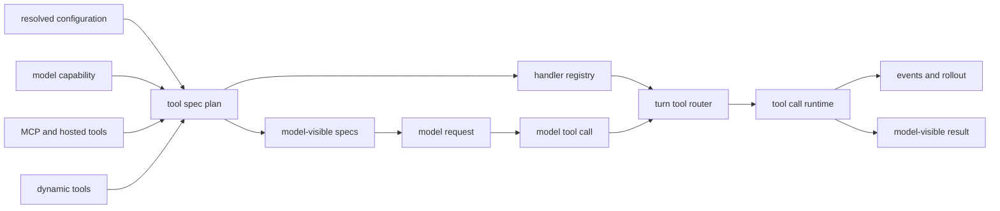

import ToolDispatchMap from "../../../src/components/visual/ToolDispatchMap.tsx";

# 第 9 章：工具规格、路由与分发

<ToolDispatchMap lang="zh" client:visible />

第 8 章说明了 Codex 为什么先记录运行时事实，再解释这些事实。本章从观察进入行动：当模型请求一个工具时，Codex 必须判断这个请求是否对应真实能力，由哪个运行时负责，是否允许并行，最终又该把什么结果返回给模型和可重放的事件流。

理解工具系统，最稳的方式是把它看成能力系统。工具规格描述模型可以怎样调用；handler 才是能够执行工作的运行时权威；router 在一个具体 turn 中把二者连接起来。这三个概念不能混在一起。模型可见 schema 和执行权限如果变成同一个对象，每新增一个工具，就会同时制造安全例外、UI 例外和重放例外。

## 两个平面

Codex 把工具元数据和执行行为放在不同平面。

| 平面 | 要回答的问题 | 典型数据 |
| --- | --- | --- |
| 规格 | 模型能看见什么？ | function schema、namespace tool、freeform patch tool、hosted tool |
| 注册 | 哪个运行时能处理调用？ | shell handler、patch handler、MCP handler、dynamic-tool handler |
| 路由 | 当前调用属于哪个 handler？ | tool name、namespace、call id、payload kind |
| 分发 | 工作如何被监督？ | cancellation、hooks、approval、sandboxing、event emission |
| 输出塑形 | 什么会回到 turn？ | function output、custom tool output、failed-call response、events |

这个分离体现在生命周期中。Session 会根据配置、feature flag、模型能力、MCP 启动状态、discoverable tools、dynamic tools 和 hosted tool 可用性构造工具 registry。Registry 产出两类结果：供内部查找的 configured specs，以及发给模型请求的 model-visible specs。



这张图就是本章主线：模型拿到的是规格，不是 handler；运行时保留的是 handler，不只是 schema；router 是一个 turn 内部连接二者的桥。

## 规格不是执行授权

`ToolSpec` 是模型语法合同。它可以描述普通 function tool、namespace tool、hosted search 或 image generation、local shell-like tool，以及 `apply_patch` 这种 freeform tool。它还可以携带兼容性信息，让不同模型表面理解同一项能力。

但规格并不等于允许执行。规格说的是“模型可以生成这种调用形状”；handler 说的是“这个运行时知道如何执行这种调用”；policy 说的是“这次执行被允许、被拒绝，还是必须询问”。这三句话不是同一个判断。

这种区别在运行时发现的工具上最重要：

| 工具族 | 为什么不能硬编码 |
| --- | --- |
| MCP tools | 它们来自配置或 hosted server，需要名称清洗、来源记录和审批元数据。 |
| Dynamic tools | 它们由客户端提供，可能直接暴露，也可能延迟到模型搜索后再加载。 |
| Unavailable tools | 模型可能引用之前存在的工具；运行时应返回有用的 unsupported 结果。 |
| Hosted tools | Provider 可能执行其中一部分，但 Codex 仍负责 session 里的暴露和事件合同。 |
| Code-mode tools | 可见工具面可以被嵌套或增强，而不改变底层 handler 边界。 |

所以 Codex 构造的是 plan，而不是固定列表。Plan 可以直接暴露某个工具，也可以把它放到 tool search 后面；可以合并 namespace tools，可以为某个模式增强描述，也可以注册 handler 但不把这个 handler 的 spec 作为主要模型表面。

## 路由一次工具调用

模型返回的是 response items。其中有些是消息，有些是工具调用。工具调用在分发前要先被解析成规范化的运行时形态：工具名、call id 和 payload。Payload kind 很重要，因为普通 function call、MCP call、freeform custom call 和 search-tool call 即使名字相似，也不能互换。

Router 主要做四件事：

1. 解析工具名，包括 namespace identity。
2. 在执行前拒绝不匹配的 payload kind。
3. 判断这个工具是否能和其他调用并行运行。
4. 为能展示参数流式进度的工具创建 argument diff consumer。

随后 runtime 用取消和输出塑形包住分发过程。用户中断 turn 时，工具结果不能凭空消失，而应变成模型可见的中断结果。Handler 发生可恢复失败时，模型收到失败的工具结果；发生 fatal 失败时，turn 可以以运行时错误停止。

```text
// Pseudocode - simplified for clarity.
  plan = build_tool_plan(configuration, model_capabilities, extensions)
  specs = plan.visible_specs_for_model()
  registry = plan.runtime_handlers()

  for each response_item from model:
      if response_item is not a tool call:
          continue

      call = normalize_tool_call(response_item)
      handler = registry.find(call.name)

      if handler is missing or payload_kind_mismatches(call, handler):
          return failed_tool_result(call)

      run_with_cancellation:
          emit_pre_tool_hooks_when_applicable(call)
          result = handler.handle(call)
          emit_post_tool_hooks_when_applicable(call, result)
          persist_events_and_output(call, result)
```

这段是伪代码，不对应源码实现。它强调的是顺序：规范化、校验、监督、执行、塑形输出、持久化。

## 并行也是能力

模型能产生 parallel tool calls，并不表示这些调用天然安全。有些工具是只读的，有些会修改 workspace，有些依赖单个进程会话，有些 MCP server 自己声明并发容忍度。因此 Codex 把并行能力当作工具配置的一部分。

普通工具可以在 configured spec 中说明是否支持并行。MCP 的并行能力可以按 server 判断，因为名字相似的工具可能来自不同 server，拥有不同并发合同。没有显式支持时，runtime 会串行分发。

这不仅是正确性问题，也是可归因性问题。两个 mutating call 如果没有清晰并发合同就交错执行，rollout 也许仍能记录事件，但用户未必能判断哪个调用造成了哪个改变。

## 输出服务两个读者

每个工具结果都有两个读者：

| 读者 | 需要什么 |
| --- | --- |
| 模型 | 简洁的 response item，用来决定下一步 |
| Runtime clients | 结构化事件、生命周期状态、进度更新和可重放事实 |

Shell command 可能把输出流式发给 UI，最后再给模型一个摘要。Patch 可能在参数流式形成时发进度，随后请求审批，再返回最终应用结果。MCP tool 可能先经历审批或 elicitation，才能产生 provider 的结果。流程不同，但 runtime 会把它们归一到同一个 dispatch contract。

这就是为什么工具执行不是按工具名写一个 switch。Switch 可以调用函数，但表达不了模型暴露、运行时权限、参数流式进度、approval hooks、cancellation、parallel contracts、telemetry 和 replay 这些边界。

## 应用到实践

1. **区分展示和授权。** Schema 告诉模型能怎么调用，handler 才证明什么能运行。
2. **构造 plan，而不是列表。** 在暴露工具前合并配置、模型能力、dynamic tools、hosted tools 和 MCP 状态。
3. **先规范化再分发。** 把 provider response items 转成统一内部调用形态，再进入 policy 或执行。
4. **把并行视为显式能力。** 默认串行，只有 handler 或 server 声明安全时才并行。
5. **为两个读者塑形输出。** 给模型简洁结果，同时为用户和 replay 发结构化事件。

第 10 章会进入最重要的 handler 家族：shell 与 filesystem 执行。它会展示 command parsing、exec policy、`exec-server` 和 environment selection 如何把工具调用变成受监督的进程。

<div class="source-equivalence">

## 源码地图

| 概念 | 源码锚点 |
| --- | --- |
| Tool spec planner | [`codex-rs/core/src/tools/spec_plan.rs`](https://github.com/openai/codex/blob/569ff6a1c400bd514ff79f5f1050a684dc3afde3/codex-rs/core/src/tools/spec_plan.rs#L69) |
| Tool router | [`codex-rs/core/src/tools/router.rs`](https://github.com/openai/codex/blob/569ff6a1c400bd514ff79f5f1050a684dc3afde3/codex-rs/core/src/tools/router.rs#L38) |
| Tool registry | [`codex-rs/core/src/tools/registry.rs`](https://github.com/openai/codex/blob/569ff6a1c400bd514ff79f5f1050a684dc3afde3/codex-rs/core/src/tools/registry.rs#L220) |
| Tool orchestrator | [`codex-rs/core/src/tools/orchestrator.rs`](https://github.com/openai/codex/blob/569ff6a1c400bd514ff79f5f1050a684dc3afde3/codex-rs/core/src/tools/orchestrator.rs#L50) |
| Parallel dispatch rules | [`codex-rs/core/src/tools/parallel.rs`](https://github.com/openai/codex/blob/569ff6a1c400bd514ff79f5f1050a684dc3afde3/codex-rs/core/src/tools/parallel.rs#L1) |

</div>
