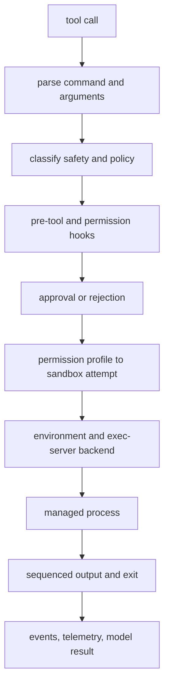

# 第 10 章：Shell、Exec Server 与文件系统工具

第 9 章把工具暴露和工具权限分开了。本章沿着最能体现这种分离的 handler 家族继续往下看：shell-like tools。对模型来说，shell 工具看起来只是“运行一个命令”；对运行时来说，它必须解析命令、分类风险、应用策略、运行 hooks、必要时请求审批、选择环境、执行 sandbox 规则、流式输出，并留下可重放记录。

关键设计点是：Codex 不把“运行命令”当成单个原语。它把命令执行看成一条 pipeline。最终进程可能在本机运行，可能在平台 sandbox 中运行，也可能通过 `exec-server` 抽象表示远端 executor 及其文件系统。


<div class="source-equivalence">

## 源码地图

| 概念 | 源码锚点 |
| --- | --- |
| Shell handler | [`codex-rs/core/src/tools/handlers/shell/shell_handler.rs`](https://github.com/openai/codex/blob/569ff6a1c400bd514ff79f5f1050a684dc3afde3/codex-rs/core/src/tools/handlers/shell/shell_handler.rs#L31) |
| Unified exec handler | [`codex-rs/core/src/tools/handlers/unified_exec/exec_command.rs`](https://github.com/openai/codex/blob/569ff6a1c400bd514ff79f5f1050a684dc3afde3/codex-rs/core/src/tools/handlers/unified_exec/exec_command.rs#L48) |
| Exec policy manager | [`codex-rs/core/src/exec_policy.rs`](https://github.com/openai/codex/blob/569ff6a1c400bd514ff79f5f1050a684dc3afde3/codex-rs/core/src/exec_policy.rs#L251) |
| Exec-server RPC client | [`codex-rs/exec-server/src/rpc.rs`](https://github.com/openai/codex/blob/569ff6a1c400bd514ff79f5f1050a684dc3afde3/codex-rs/exec-server/src/rpc.rs#L234) |
| Executor filesystem handler | [`codex-rs/exec-server/src/server/file_system_handler.rs`](https://github.com/openai/codex/blob/569ff6a1c400bd514ff79f5f1050a684dc3afde3/codex-rs/exec-server/src/server/file_system_handler.rs#L38) |

</div>

## Shell 工具只是入口

Codex 有多个 shell 相邻入口，因为不同客户端和模型表面需要的交互形状不同。

| 入口 | 架构角色 |
| --- | --- |
| `shell` | 经典 function-style command execution，携带 workdir、timeout、approval hints 和输出捕获 |
| `local_shell` | 面向旧表面或特殊表面的 host-local command shape |
| `shell_command` | shell-aware command surface，可选择 direct 或 shell-escalation 等 backend |
| `exec_command` | unified exec surface，可选择 environment，并保留 process identity 供后续读写 |
| `write_stdin` | 写入已存在 managed process stdin 的 continuation tool |

这些入口最终汇聚到同一项责任：把模型请求转成可治理的 execution request。汇聚非常重要，因为命令策略、沙箱和审批不应取决于某个客户端表面恰好暴露了哪种命令工具。



这就是 shell execution chain。任何单个节点都不足以让命令执行安全或可解释；安全性来自顺序，也来自每个决策都有结构化表达。

## 先解析，再做策略判断

Shell command text 不是可靠的 policy boundary。Runtime 会先尝试抽取 shell 和 script，把常见 shell 形式降解成 command tokens，并识别已知安全的只读模式。目标不是理解所有 shell 程序，而是构造足够结构，让策略判断不必假装原始字符串已经是决策。

解析后，Codex 会咨询 exec policy。当前 policy engine 使用 prefix rules、可选 host-executable metadata，以及 allow、prompt、forbid 等显式决策。旧的 policy engine 仍用于兼容，但架构要点一样：显式规则先于 fallback heuristics。

| 决策来源 | 提供什么 |
| --- | --- |
| Prefix rules | 对已知命令族给出稳定的组织策略 |
| Host executable metadata | 当命令使用绝对程序路径时，让 basename matching 更安全 |
| Known-safe heuristics | 为普通只读命令提供保守默认值 |
| Approval policy | 决定何时询问、重试或拒绝 |
| Runtime sandbox mode | 决定第一次 attempt 能触碰什么 |

Allow 并不总是表示“自由运行”。它可能表示“在当前 sandbox 下无需提示即可运行”。策略也可以显式表示 bypass sandbox，但那是更强的声明，必须被单独表达。

## `exec-server` 定义工作发生在哪里

`exec-server` 是让执行位置不泄漏到 tool handler 的边界。它提供小型 JSON-RPC 进程和文件系统服务：初始化连接、启动 managed process、按 sequence 读取输出、在支持时写 stdin、终止进程，并通过 executor filesystem interface 执行文件系统操作。

本地执行和远端执行共享这个形状。本地 executor 可以在用户机器上 spawn process；远端 executor 可以向服务注册，并通过 rendezvous channel 重新连接。Tool runtime 不应该因为进程位于不同执行环境，就重写 approval、sandbox 或 output 逻辑。

```text
// Pseudocode - simplified for clarity.
  request = parse_shell_tool_arguments(tool_call)
  command = normalize_shell_command(request.command)
  policy_result = evaluate_exec_policy(command, request.cwd)

  if policy_result is forbidden:
      return rejected_result(policy_result.reason)

  approval_requirement = derive_approval(policy_result, approval_policy)
  sandbox_attempt = choose_initial_sandbox(permission_profile, request)

  if approval_requirement needs a decision:
      decision = ask_hooks_guardian_or_user(request)
      stop_unless_approved(decision)

  environment = select_execution_environment(request.environment_id)
  process = environment.exec_server.start(command, sandbox_attempt)
  stream_output_until_exit(process)
  return shaped_exec_result(process.output, process.exit_status)
```

伪代码省略了很多平台细节，但保留了治理形状：parse、policy、approval、sandbox、environment、process、output。

## 文件系统访问经过 Executor

文件系统修改不只是 shell 的问题。Patch application、file reads、remote workspace operations 和 command execution 都需要一致方式访问拥有这些文件的 workspace。Codex 使用 executor filesystem traits，让调用方可以 read、write、create directory、remove path 或检查 metadata，而不假设文件一定在本机。

这个抽象带来两个好处。第一，remote execution 会把 patch 应用到远端 workspace，而不是误改客户端机器。第二，sandbox context 可以和文件系统操作一起传递。Filesystem API 因而能拒绝违反 effective permission profile 的操作，而不是让每个调用方都重新实现 path check。

## 输出是有序状态

终端输出不是一个 blob。长进程可能不断产生 chunks，接收 stdin，更新 terminal state，退出，并在稍后被客户端再次读取。Runtime 因此用 sequence cursor 跟踪输出。调用方可以请求某个 sequence 之后的 chunks，等待更多输出，或得知进程已经退出。

这对 replay 和 UI 正确性都重要。Terminal UI、headless exec client 和 app-server client 都能观察进度，而不必各自发明 terminal transcript 格式。模型仍收到简洁的 tool result，但客户端获得足够结构来渲染进度、截断、exit status 和 failure。

## Environment 是合同的一部分

Shell execution 还依赖 environment management：当前工作目录、选定 environment、显式环境变量、shell snapshot、proxy variables、timeout、TTY mode 和 process identity。Codex 把这些事实放在 turn context 或 selected environment 中，而不是在 handler 边界临时猜测。

架构含义很直接：`exec-server` 不只是 helper binary。它是运行时关于“工作发生在哪里”“哪个文件系统是权威”“进程输出如何排序”的抽象。

## 应用到实践（Apply This）

1. **先解析再决策。** 有结构化 command facts 时，不要直接对原始 shell 文本套 policy。
2. **显式规则先于启发式。** 组织策略应覆盖 fallback safety guesses。
3. **抽象执行位置。** 用同一套 process 和 filesystem contract 包住本地与远端执行。
4. **给输出排序。** 把 terminal output 当作有序状态，而不是最终字符串。
5. **显式携带环境事实。** cwd、env、timeout、TTY 和 selected executor 都应属于 request。

第 11 章会把一种修改路径从 shell stream 中拿出来，作为独立协议讨论：patch。这个分离让 Codex 能审查并应用文件编辑，而不是把编辑降级成不透明命令文本。
