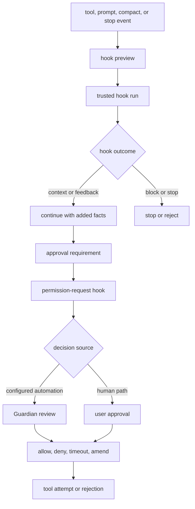

# 第 12 章：Hooks 与人工审批

第 11 章展示了文件系统 mutation 如何在应用前被解析和验证。本章研究 runtime 已经理解某个动作之后，仍然可以阻止、修正或解释它的关卡：hooks、approval policy、Guardian review 和 user approval。它们彼此相关，但不是同一层。

Hooks 是配置好的程序，用来观察或影响 runtime events。Approval 是允许或拒绝副作用的控制面决策。Guardian 是可以回答部分 approval requests 的自动 reviewer。用户界面是人工决策表面。Codex 把这些层分开，因此每一层失败时都能给出精确语义。


<div class="source-equivalence">

## 源码地图

| 概念 | 源码锚点 |
| --- | --- |
| Hook event vocabulary | [`codex-rs/hooks/src/types.rs`](https://github.com/openai/codex/blob/569ff6a1c400bd514ff79f5f1050a684dc3afde3/codex-rs/hooks/src/types.rs#L92) |
| Hook registry | [`codex-rs/hooks/src/registry.rs`](https://github.com/openai/codex/blob/569ff6a1c400bd514ff79f5f1050a684dc3afde3/codex-rs/hooks/src/registry.rs#L47) |
| Prompt hook runtime | [`codex-rs/core/src/hook_runtime.rs`](https://github.com/openai/codex/blob/569ff6a1c400bd514ff79f5f1050a684dc3afde3/codex-rs/core/src/hook_runtime.rs#L321) |
| Guardian review path | [`codex-rs/core/src/guardian/review.rs`](https://github.com/openai/codex/blob/569ff6a1c400bd514ff79f5f1050a684dc3afde3/codex-rs/core/src/guardian/review.rs#L103) |
| Tool orchestrator gates | [`codex-rs/core/src/tools/orchestrator.rs`](https://github.com/openai/codex/blob/569ff6a1c400bd514ff79f5f1050a684dc3afde3/codex-rs/core/src/tools/orchestrator.rs#L50) |

</div>

## Gate Stack



这个 stack 是有顺序的，不是装饰。Hooks 可以添加 context 或阻断特定事件。Permission-request hooks 可以在常规 review path 前回答 approval。Guardian 或用户可以决定剩余未解决的 approvals。只有这些 gate 产出 allowed decision 后，tool attempt 才会发生。

## Hook Discovery 与 Trust

Codex 可以从多种来源加载 hooks：system 或 managed configuration、user configuration、project configuration、session flags、plugins、cloud requirements，以及 legacy managed files。每个 hook 都有 event identity、matcher state、command text、timeout、source metadata、display order 和 trust status。

Trust 不由“文件存在”推导。Managed hooks 按策略可信。User 或 project hooks 只有在 normalized identity hash 和已保存 trusted hash 匹配时才可信。如果 hook 内容变了，它会成为 modified，而不是继续静默运行。Disabled hooks 仍能在 listing 中可见，但不会参与 runtime。

这个设计保护两类工作流。运营方可以集中管理用户不需要逐个批准的 hooks。用户也能添加自己的 hooks，但改变后的 hook 必须重新获得信任，才能进入运行时。

## Hook Events 与 Results

Hook event vocabulary 不只覆盖命令执行。它包括 session start、user prompt submit、pre-tool use、permission request、post-tool use、pre/post compact 和 stop。这些都是架构检查点：工具 mutation 前、工具报告输出后、上下文压缩前、turn 可能停止时，以及 prompt 进入 runtime 时。

Hook handlers 通过 stdin 接收 JSON，通过 stdout 返回结构化 JSON，在部分失败模式下通过 stderr 给模型反馈。Outcome 不只是 success 或 failure。Hook 可以提供 additional model context、warning、block、stop、feedback，也可以失败但允许 operation 继续，具体取决于 event contract。

```text
// Pseudocode - simplified for clarity.
  handlers = discover_hooks(config_layers, plugins, managed_sources)
  trusted_handlers = filter_enabled_and_trusted(handlers)

  preview = build_hook_run_summaries(trusted_handlers, event)
  emit_hook_started(preview)

  results = run_matching_hooks_with_json_io(trusted_handlers, event)
  emit_hook_completed(results)

  if any result blocks or stops:
      return rejected_or_stopped_result(results.feedback)

  add_context_for_model(results.context)
  continue_to_policy_or_tool_execution()
```

Preview/run 分离让客户端能在 hook 真正完成前展示 pending work。这对 terminal UI、app-server 和 headless context 都重要，因为 hook 可能很慢，也可能阻断动作。

## Approval 是另一道门

当 policy 认为某个工具需要决策，或 sandboxed attempt 失败且可能进行 unsandboxed retry 时，approval 开始。Approval payload 是 tool-specific 的：shell approval 包含 command 和 cwd，patch approval 包含 file changes，MCP approval 包含 server 和 tool metadata，permission request 包含请求的 additional filesystem 或 network access。

Runtime 可以按 key 缓存 session approvals。Shell-like command 通常只有一个 approval key。Patch 可能按每个 affected path 建 key，所以一次多文件 patch 如果被批准为 session scope，之后触碰其中子集的请求也可以安全跳过提示。

Approval decisions 比 yes/no 丰富。它们可以是 approve once、approve for session、deny、abort、timeout、approve exec-policy amendment，或 approve network-policy amendment。差异很重要，因为 amendment 会改变未来策略；一次性 approval 只授权当前动作。

## Guardian、Headless Mode 与 UI 中断

Guardian 是 approval-like requests 的自动 review path。当审批路由选择 automated review 时，runtime 会创建一个和 tool call id 分开的 review id，并等待决策。Denial、timeout 和 abort 是不同结果，这样用户可见消息才能说明发生了什么，而不是统一成“失败”。

Headless execution 不能依赖交互 modal。如果某个请求需要人工审批，但当前没有人工审批通道，安全行为是 reject，而不是永远等待。TUI 则可以用 modal decision surface 打断普通流程，并在决策到达后继续 turn。

MCP 和 dynamic tools 还增加了一层 approval 维度。它们的工具元数据可能来自 hosted、connector-backed 或 client supplied 来源。审批表面必须展示与信任相关的 provenance 和参数，但不能把原始内部名称当作用户可见的信任边界。

## 应用到实践（Apply This）

1. **区分 hooks 和 approvals。** Hooks 观察或影响事件；approval 授权副作用。
2. **显式信任配置代码。** 对 user/project hooks 做 hash，并把 modified hooks 当作未信任。
3. **预览长耗时关卡。** 在客户端看起来卡住前，发出 pending hook 或 approval state。
4. **精确建模审批结果。** 区分 deny、abort、timeout、one-time approval、session approval 和 policy amendment。
5. **没有审批通道时 fail closed。** Headless execution 应拒绝无法展示的 interactive approvals。

第 13 章会跟随一个已批准动作进入隔离层：permission profiles 如何变成 filesystem/network policy，再下降成 platform sandboxes、managed networking 和 execution metadata。
